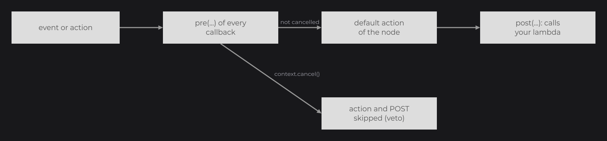

# Callbacks

Callbacks run your code when something happens to a node: a click, a key, a hover change, a lifecycle step, a signal change, a scroll or a drag. You register them with the `on...` methods of `Node` and of specific nodes, usually as lambdas, and each callback can act before (PRE) or after (POST) the node's own behavior.

## Registering a callback

```java
public class ShopUI extends UI {

	@Override
	public void init() {
		RectNode
		.create(100, 100, 300, 80)
		.color(Color.WHITE)
		.onHoverStart((node, mouseX, mouseY) -> System.out.println("Enter"))
		.onClick((node, mouseX, mouseY, clickType) -> System.out.println("Clicked with " + clickType))
		.attach(this);
	}

}
```

- Every `on...` method adds one callback and returns the node, so you can chain them. Calling the same method twice registers two callbacks: both run, in registration order.
- A callback stays registered for the life of the node, across detachments; there is no method to remove one. Guard its body with a condition (a field or a [signal](../state/signals.md)) when it must stop reacting.
- An exception thrown inside a callback is caught and reported on `System.err` with the callback interface and the cause (`[JOID] The post phase of NodeMousePressedCallback failed: java.lang.IllegalStateException: ...`), followed by its stack trace. The other callbacks and the event dispatch continue.

### Typing the node parameter

Every registration method is generic, for example `public final <T extends Node> T onClick(NodeMousePressedCallback<T> callback)`. In the middle of a chain, Java infers `T` as `Node` for a lambda: the lambda receives a `Node` and the rest of the chain is typed `Node`. Give a type witness to receive the concrete type:

```java
TextNode
.create(100, 100)
.text(Text.create("Waiting", this.info))
.<TextNode>onClick((text, mouseX, mouseY, clickType) -> System.out.println("[Shop] " + text.getText().getRawText()))
.attach(this);
```

`info` is a `TextInfo` (see [Text and TextInfo](../text/text-and-textinfo.md)). An assignment gives the target type to the last call of the chain: `final RectNode button = RectNode.create(0, 0, 100, 40).onClick((node, mouseX, mouseY, clickType) -> node.color(Color.WHITE));` passes a `RectNode` to the lambda. Without a witness, call the setters of the concrete class (`color`, `text`...) before the callbacks.

## Node callback reference

The interfaces live in sub-packages of `dev.joid.lib.ui.node.callback.impl`: `mouse`, `key`, `hover`, `state`, `signal`, `animation`, `scroll` and `draggable`. Coordinates are UI units (see [View and Scaling](../ui/view-and-scaling.md)). The last column is what runs between the PRE and the POST phase; for `onMousePressed`, `onMouseReleased`, `onMouseDragged`, `onMouseScroll` and `onKeyPressed` it always runs, for the others a PRE cancel skips it (see [PRE and POST phases](#pre-and-post-phases)).

| Method | Interface | Lambda arguments | Fires | Between PRE and POST |
|---|---|---|---|---|
| `onClick` | `NodeMousePressedCallback<T>` | `(node, mouseX, mouseY, clickType)` | A mouse button is pressed while the node is hovered (visible, enabled, UI on top) and no node handled the press before it. | Nothing. |
| `onMousePressed` | `NodeMousePressedCallback<T>` | `(node, mouseX, mouseY, clickType)` | Every mouse button press the UI receives, wherever the mouse is. | Dispatch to the children, `onClick`, the node's `mousePressed` hook. |
| `onMouseReleased` | `NodeMouseReleasedCallback<T>` | `(node, mouseX, mouseY, clickType)` | Every mouse button release, wherever the mouse is. | Dispatch to the children and the node's `mouseReleased` hook. |
| `onMouseDragged` | `NodeMouseDraggedCallback<T>` | `(node, mouseX, mouseY, clickType, deltaTime)` | Every mouse move while a button is held. | Dispatch to the children, the node's `mouseDragged` hook, the drag of the node. |
| `onMouseScroll` | `NodeMouseScrollCallback<T>` | `(node, mouseX, mouseY, value)` | Every mouse wheel event. | Dispatch to the children, scrolling of the hovered node, the node's `mouseScroll` hook. |
| `onKeyPressed` | `NodeKeyPressedCallback<T>` | `(node, c, key)` | Every key event the UI receives, wherever the mouse is. | Dispatch to the children and the node's `keyPressed` hook. |
| `onHoverStart` | `NodeHoverStartCallback<T>` | `(node, mouseX, mouseY)` | The frame the node becomes hovered. | Nothing. |
| `onHover` | `NodeHoverCallback<T>` | `(node, mouseX, mouseY)` | Every frame while the node is hovered. | Nothing. |
| `onHoverEnd` | `NodeHoverEndCallback<T>` | `(node, mouseX, mouseY)` | The frame the node stops being hovered (the mouse left, or the node got disabled). | Nothing. |
| `onInit` | `NodeInitCallback<T>` | `(node)` | The node is loaded into a UI: `UI.add` or `attach(ui)`, `append` to a node already in a UI, the UI reloading, a new attachment after a detach. | Sets the UI, loads the children, scrollbar and skeleton, initializes the effects, calls `init(ui)`, subscribes the node to its signals. |
| `onAppend` | `NodeAppendCallback<T>` | `(node, child)` | On the parent, once per child given to `append(...)` or `attach(parent)`. | Sets the parent of the child, loads it when the parent is in a UI, adds it to the children. |
| `onDetach` | `NodeDetachCallback<T>` | `(node)` | `remove(...)` or `clearChildren()` on the parent (also through `WatchProperty.CLEAR_CHILDREN`), an `append` that moves the node, the UI closing or rebuilding its nodes (`UI.reload()`). | Detaches the children, scrollbar and skeleton, unsubscribes from the signals, ends the drag and hover, runs the `detach` hook of the effects, then the node's `detach()` hook. |
| `onMount` | `NodeMountCallback<T>` | `(node)` | The first frame the node is drawn mounted (every `wait(...)` condition of the node and of its ancestors met), and again each time it becomes mounted after being unmounted. | Nothing. |
| `onUpdate` | `NodeUpdateCallback<T>` | `(node)` | Every update tick of the UI. | Updates the children, then calls the node's `update()` hook. |
| `onRender` | `NodeRenderCallback<T>` | `(node, mouseX, mouseY)` | Every frame the node is visible. | Draws the children with a negative z-index, the node itself (`onDraw`), the other children, the layers and the dragged copy (or the skeleton node while not mounted). |
| `onDraw` | `NodeDrawCallback<T>` | `(node, mouseX, mouseY)` | Every frame the node is visible. | Draws the node itself: `draw`, or `drawSkeleton` while not mounted, with its own shader effects. |
| `onWatch` | `NodeWatchCallback<T>` | `(node, signal, properties)` | A signal watched with `watch(...)` publishes. | Applies the `WatchProperty` values in order. |
| `onAnimate` | `NodeAnimationCallback<T>` | `(node, animator, value)` | A frame where an animator registered with `animate(TweenAnimator)` holds a new value. | Nothing. |
| `onScrollUpdate` | `NodeScrollUpdateCallback<T>` | `(node, value)` | `scrollOffsetX`/`scrollOffsetY` (also `scrollX`/`scrollY` and the mouse wheel) moves the scroll target; `value` is the requested offset. | Moves the scroll target, clamped to the content. |
| `onScrollEnding` | `NodeScrollEndingCallback<T>` | `(node, scrollX, scrollY)` | The scroll target reaches the end of the content. | Nothing. |
| `onScrollEnd` | `NodeScrollEndCallback<T>` | `(node, scrollX, scrollY)` | The animated scroll comes to rest at the end of the content. | Nothing. |
| `onDragStart` | `NodeDragCallback<T>` | `(node)` | A left press on a draggable node starts a drag. | Starts the drag; creates the copy for `DraggableType.COPY`. |
| `onDrag` | `NodeDragCallback<T>` | `(node)` | Every mouse drag event while the node is dragged. | Moves the drag target under the mouse. |
| `onDragEnd` | `NodeDragCallback<T>` | `(node)` | A mouse button release (or a mouse grab by the window) ends the drag. | Snaps the node or sends it back, then stops the drag. |
| `onSnap` | `NodeSnapCallback<T>` | `(node, snapNode)` | During the drag end, when a snap target is found. | Sets the drag target to the position of `snapNode`. |

Details per family: [Mouse and Keyboard](mouse-and-keyboard.md), [Hover and Tooltips](hover.md), [Drag and Drop](drag-drop.md), [Watching Signals](../state/watch.md), [Overflow and Scrolling](../nodes/layout/overflow-and-scroll.md), [Node Fundamentals](../nodes/node-fundamentals.md) for the lifecycle and `wait`, [TweenAnimator](../animation/tween-animator.md) for `animate`.

## PRE and POST phases



Every callback interface declares three methods:

| Method | Default | Role |
|---|---|---|
| `apply(node, args...)` | Abstract: the body of your lambda. | Your code. |
| `pre(node, context, args...)`, annotated `@NodeCallbackMethod(Type.PRE)` | Does nothing. | Runs before the default action. |
| `post(node, context, args...)`, annotated `@NodeCallbackMethod(Type.POST)` | `context.cancel(() -> this.apply(node, args...))` | Runs after the default action: calls `apply` only when the context is not cancelled, then cancels it. |

A dispatch on one node runs:

1. The `pre` method of every callback of that type, in registration order.
2. The default action (last column of the reference table). For every callback except `onMousePressed`, `onMouseReleased`, `onMouseDragged`, `onMouseScroll` and `onKeyPressed`, a cancelled context at this point skips the default action and step 3.
3. The `post` method of every callback, in registration order. When the context was not cancelled before this step, it is reset before each `post`, so every callback of the node runs; it ends cancelled when any `post` cancelled it.

A lambda implements `apply`, so it runs in the POST phase. To act in the PRE phase, implement the interface and override `pre`. This flex node refuses a sixth child:

```java
final NodeAppendCallback<FlexNode> limit = new NodeAppendCallback<FlexNode>() {

	@Override
	public void apply(final FlexNode node, final Node child) {
		System.out.println("Appended " + child.getClass().getSimpleName());
	}

	@Override
	public void pre(final FlexNode node, final InternalContext context, final Node child) {
		if (node.getChildren().size() >= 5) {
			context.cancel();
		}
	}

};

FlexNode.vertical(100, 100, 400).onAppend(limit).attach(this);
```

`@NodeCallbackMethod` (`dev.joid.lib.ui.node.callback`) marks the phases on the interface methods; JOID finds it there, so an override does not need to repeat it.

## InternalContext

`InternalContext` (`dev.joid.lib.utils.context`) carries the cancelled state of one dispatch. A mouse or key event uses one context for the whole UI, shared by the mouse and key callbacks (`onClick` included) of every node; every other callback of `Node` gets a new context for each dispatch.

| Method | Description |
|---|---|
| `static create()` | New context, not cancelled. |
| `static create(boolean cancelled)` | New context in the given state. |
| `isCancelled()` | `true` once the context is cancelled. |
| `cancel()` | Cancels the context. |
| `cancel(Runnable runnable)` | When not cancelled: runs `runnable`, then cancels, even when the lambda is a boolean assignment such as `() -> this.active = false`. When already cancelled: does nothing. |
| `cancelIf(Supplier<Boolean> supplier)` | When not cancelled: cancels if `supplier` returns `true`. The supplier is not called on a cancelled context. |
| `execute(Runnable runnable)` | Runs `runnable` only when not cancelled. |
| `reset()` | Clears the cancelled state. |

Every method except `isCancelled` returns the context.

## Consumed input events

A mouse or key event travels through every node of the UI with a single context. A node consumes the event by cancelling that context. The following consume an event:

- `onClick`: a click on a node consumes the press;
- built-in nodes that handle the event, such as a focused text field or a clicked checkbox;
- a node that scrolls its content with the wheel, while its content can move in the direction of the wheel;
- UI keybinds and the zoom shortcuts (see [Mouse and Keyboard](mouse-and-keyboard.md)).

Once the event is consumed, the input lambdas of the nodes reached afterwards do not run, `onClick` does not fire, built-in nodes ignore it, no drag starts, the UI keybinds do not run, and the UI bridge does not pass it to the UIs below.

`onMousePressed`, `onMouseReleased`, `onMouseDragged`, `onMouseScroll` and `onKeyPressed` are listeners: their lambda runs for every event of its kind that is not consumed yet, wherever the mouse is, and leaves the event to the other nodes, the UI keybinds and the UIs below. Hidden and disabled nodes receive no input event at all: neither their lambdas nor their built-in handling run, and the children of a hidden node are skipped too.

### Consuming an event from a listener

Override `post` and cancel the context to keep an event for your node. This field-like node takes Enter for itself, so the keybinds and the other nodes no longer see it:

```java
RectNode
.create(100, 100, 300, 80)
.onKeyPressed(new NodeKeyPressedCallback<RectNode>() {

	@Override
	public void apply(final RectNode node, final char c, final Key key) {}

	@Override
	public void post(final RectNode node, final InternalContext context, final char c, final Key key) {
		if (!context.isCancelled() && key == Key.ENTER) {
			System.out.println("Submitted");
			context.cancel();
		}
	}

})
.attach(this);
```

### Capturing an event in the PRE phase

The PRE phase of a node runs before its children see the event. Cancelling there consumes it before them. This panel swallows the presses made over it while `loading` is `true`, and stays transparent otherwise because its `post` does nothing:

```java
final BooleanSignal loading = BooleanSignal.of(true);

ContainerNode
.create(100, 100, 600, 400)
.onMousePressed(new NodeMousePressedCallback<ContainerNode>() {

	@Override
	public void apply(final ContainerNode node, final double mouseX, final double mouseY, final ClickType clickType) {}

	@Override
	public void pre(final ContainerNode node, final InternalContext context, final double mouseX, final double mouseY, final ClickType clickType) {
		if (loading.peek() && node.isHovered(mouseX, mouseY)) {
			context.cancel();
		}
	}

	@Override
	public void post(final ContainerNode node, final InternalContext context, final double mouseX, final double mouseY, final ClickType clickType) {}

})
.attach(this);
```

## Callback order

### Callbacks of one node

All callbacks of one type run in registration order: every `pre`, the default action, every `post`. `onClick` and `onMousePressed` of the same node both fire for a press on it, `onClick` first: when the node's own `onClick` consumed the press, its `onMousePressed` POST phase receives a fresh context.

### Input events across nodes

Inside a UI, an input event reaches the top-level nodes from front to back: highest z-index first, and among equal z-indexes the last added first. Inside each node, the order is:

1. The node's scrollbar, and its skeleton node while the node is not mounted.
2. The node's PRE callbacks.
3. The children with a z-index of 0 or more, front to back, each one recursively.
4. For a press: `onClick` when the node is hovered and the press is not consumed; the click then consumes it. For a wheel event: the scrolling of the node when it is hovered and the event is not consumed.
5. The node's own hook (`mousePressed`, `mouseReleased`, `mouseDragged`, `mouseScroll`, `keyPressed`).
6. The children with a negative z-index, front to back.
7. For a mouse drag: the move of the node's drag target when it is being dragged.
8. The node's POST callbacks.
9. For a press: the start of a drag when the press is a left click over the node and is not consumed.

A hidden node is skipped with its whole subtree. A disabled node still passes the event to its children (steps 1, 3, 6 and 7) but runs none of its own steps. A release ends the drag of the node between steps 1 and 2, even when the node is hidden. PRE callbacks therefore run from parent to child and POST callbacks from child to parent: the deepest, front-most node gets the first chance to consume the event in its POST phase. After the nodes, the UI's own hooks run; the full path from the window to the nodes is described in [Mouse and Keyboard](mouse-and-keyboard.md#event-dispatch-order).

### Nested lifecycle callbacks

`onInit`, `onDetach`, `onUpdate` and `onRender` wrap the same callbacks of the children: the PRE phase of a node runs before its children, the POST phase after them. For example, the `onInit` lambda of a child runs before the one of its parent, and both run after the `init(ui)` hook of their own node.

### Callbacks within a frame

While drawing a visible node, the callbacks run in this order:

1. `onHoverStart` or `onHoverEnd`, then `onHover`.
2. `onAnimate`, once per animator whose value changed.
3. `onScrollEnd`.
4. `onMount`.
5. `onRender` PRE, the children with a negative z-index, `onDraw` (PRE, `draw`, POST), the other children, `onRender` POST.

A node that is not visible (hidden, inside a hidden parent, or outside the area of a parent with an overflow) gets none of these callbacks.

## Callbacks of specific nodes

Some nodes add their own callbacks. They follow the same PRE/POST rules.

| Node | Method | Interface | Lambda arguments | Fires |
|---|---|---|---|---|
| [TextFieldNode, IntegerFieldNode](../nodes/input/text-field.md), [MultilineTextFieldNode](../nodes/input/multiline-text-field.md) | `onChange` | `NodeTextFieldChangeCallback<T, V>` | `(field, text, value, valid)` | Every change of the text, valid or not; `value` is the corrected value the commit will apply. |
| Text fields | `onFocus` | `NodeTextFieldFocusCallback<T>` | `(field)` | The field gains or loses the focus: read `field.isFocused()`. |
| Text fields | `onEnter` | `NodeTextFieldEnterCallback<T>` | `(field, text)` | Enter is pressed while focused (after the commit). |
| [SliderNode](../nodes/input/slider.md) | `onChange` | `NodeSliderChangeCallback<T, O>` | `(node, value)` | The selected value changes. |
| [CheckboxNode](../nodes/input/checkbox.md) | `onChange` | `NodeCheckboxChangeCallback<T>` | `(node, checked)` | The checked state changes: click, `checked(...)` or bound signal. |
| [ToggleNode](../nodes/input/toggle.md) | `onChange` | `NodeToggleChangeCallback<T, F, S>` | `(node, toggle)` | The side changes: click, `toggle(...)` or bound signal. |
| [SwitchNode](../nodes/input/switch.md) | `onChange` | `NodeSwitchChangeCallback<T>` | `(node, value)` | The state changes: `index(...)`, `state(...)` or bound signal. |
| [SelectorNode](../nodes/input/selector.md) | `onChange` | `NodeSelectorChangeCallback<T, V>` | `(node, value)` | The selected value changes: click, `value(...)`, `values(...)` or bound signal. |
| [ResourcePlayerNode](../nodes/visual/resource-player.md) | `onPlay`, `onPause`, `onStop`, `onEnd` | `NodeResourcePlayerPlayCallback<T>`, `NodeResourcePlayerPauseCallback<T>`, `NodeResourcePlayerStopCallback<T>`, `NodeResourcePlayerEndCallback<T>` | `(node)` | Playback starts, is paused, stops (`stop()` or end of the resource), reaches the end of the resource. |
| [ResourcePlayerNode](../nodes/visual/resource-player.md) | `onProgress` | `NodeResourcePlayerProgressCallback<T>` | `(node, progress, currentTime)` | The progress changes while playing. |
| [ReorderableFlexNode](../nodes/layout/reorderable-flex.md) | `onReorderStart`, `onReorder` | `NodeReorderStartCallback`, `NodeReorderCallback` | `(node, child)` | A child starts moving, moves. |
| [ReorderableFlexNode](../nodes/layout/reorderable-flex.md) | `onReorderEnd` | `NodeReorderEndCallback` | `(node, child, oldIndex, newIndex)` | The moved child is dropped. |

## Dispatching callbacks from a custom node

A custom node declares its own callback types and fires them with the public methods of `Node`. The full contract is in [Custom Nodes](../nodes/custom-nodes.md).

| Method | Description |
|---|---|
| `executeCallback(int type, InternalContext context, Object... args)` | Runs the PRE then the POST phase of every callback registered under `type`. |
| `executeCallback(int type, InternalContext context, Runnable runnable, Object... args)` | Runs the PRE phase, `runnable` (the default action) unless the context is cancelled, then the POST phase. With no callback registered, runs `runnable` only. |
| `executePreCallback(int type, InternalContext context, Object... args)` | Runs the PRE phase only. |
| `executePostCallback(int type, InternalContext context, Object... args)` | Runs the POST phase only. |
| `hasCallback(int type)` | `true` when at least one callback is registered under `type`. |
| `getCallbackList(int type)` | The registered callbacks, as `NodeCallbackObject` wrappers. |

The `type` ids come from `NodeCallbackRegistry.next(Class)` and callbacks are stored with the protected `registerCallback(int type, NodeCallback callback)`. `next` rejects, with an `IllegalArgumentException`, an interface that is not annotated `@FunctionalInterface`, or that lacks a `@NodeCallbackMethod(Type.PRE)` or `@NodeCallbackMethod(Type.POST)` method returning `void` whose first parameter is a `Node` and second an `InternalContext`. `NodeEmptyCallback<T>` (`dev.joid.lib.ui.node.callback.impl`) is a ready-made callback whose lambda takes only `(node)`.

## Pitfalls

- A lambda runs in the POST phase: to veto an action, override `pre` in an anonymous class and call `context.cancel()`.
- `context.cancel(() -> this.active = false)` runs the assignment then cancels; `cancelIf(() -> ...)` cancels only when the supplier returns `true`.

## See also

- [Mouse and Keyboard](mouse-and-keyboard.md)
- [Hover and Tooltips](hover.md)
- [Drag and Drop](drag-drop.md)
- [Watching Signals](../state/watch.md)
- [Custom Nodes](../nodes/custom-nodes.md)