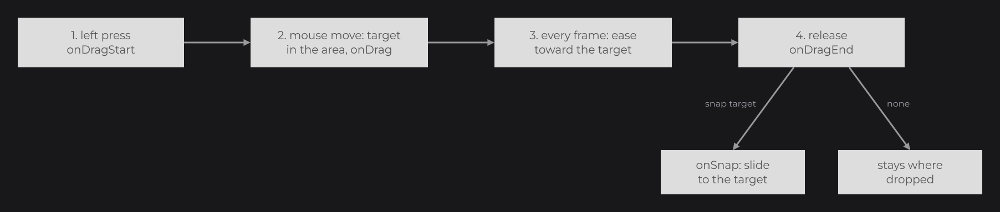

# Drag and Drop

[Input Controls](../essentials/controls.md) mentioned that any node can be dragged with `draggable(DraggableProperty.parent())`. This page covers dragging in full: any node becomes draggable with `draggable(DraggableProperty)`, and JOID then moves the node (or a copy of it) with the mouse, keeps it inside an area, snaps it onto target nodes on release and fires drag callbacks along the way. A drag starts from a press, so it follows the event rules of [Callbacks](callbacks.md).

## Making a node draggable

```java
public class BoardUI extends UI {

	@Override
	public void init() {
		RectNode
		.create(200, 200, 800, 600)
		.color(Color.decode("#DDDDDD"))
		.body(board -> {
			RectNode.create(50, 50, 100, 100).color(Color.decode("#999999")).draggable(DraggableProperty.parent()).attach(board);
		})
		.attach(this);
	}

}
```

.")

The square follows the mouse while you hold the left button on it, without leaving the board. `DraggableProperty` is in `dev.joid.lib.ui.node.property.draggable`.

## How a drag works



1. **Start**: a left press over the node (hovered: visible, enabled, UI on top) starts the drag, unless the property is disabled for the node or the press was consumed (see below). `onDragStart` fires. The node remembers where the mouse grabbed it and where it started. Starting the drag consumes the press.
2. **Move**: each mouse drag event sets the drag target to the mouse position minus the grab offset, kept inside the area. `onDrag` fires.
3. **Follow**: on every frame, the node eases its absolute position toward the target, covering a sixth of the remaining distance per 1/60 s (frame-rate independent) and landing on it once closer than `0.5` unit.
4. **End**: a mouse button release ends the drag, and so does the window grabbing the mouse (`IWindowBridge.isMouseGrabbed()`). `onDragEnd` fires: with snap targets, the node heads to a target or back to its start; without, it stays where it was dropped.

> NOTE: The drag starts only when the press is still unconsumed after the node's own handlers. A child that consumes the press (a button with `onClick`, a text field...) or an `onClick` on the node itself prevents the drag. Starting a drag consumes the press: when draggable nodes overlap, only the front one starts (children before their parent, highest z-index first), and the nodes behind, the UI hook and the UIs below receive a cancelled context. A non-draggable node in front does not prevent the drag of the node behind it.

## Areas with DraggableProperty factories

The area keeps the dragged node inside a rectangle. Positions are units of the 1920×1080 virtual canvas, fitted to the window without stretching; wider or taller windows show extra canvas around it, which is why `ui()` and `screen()` differ (see [The Virtual Canvas](../concepts/canvas.md)).


| Factory | Area | Bounds |
|---|---|---|
| `DraggableProperty.free()` | `FREE` | None. |
| `DraggableProperty.parent()` | `PARENT` | The parent of the dragged node. A node at the top of its UI has no parent: its drag refuses to start with `IllegalStateException` (`The node <Class> is dragged inside its parent but sits at the top of its UI, attach it to a node or pick another area such as DraggableProperty.ui()`). |
| `DraggableProperty.node(Node node)` | `NODE` | Another node. |
| `DraggableProperty.custom(double x, double y, double width, double height)` | `CUSTOM` | A rectangle in absolute canvas units. |
| `DraggableProperty.ui()` | `UI` | The virtual canvas, `(0, 0, 1920, 1080)`: the node never enters the extra area. |
| `DraggableProperty.screen()` | `SCREEN` | The whole visible area of the window in canvas units, extra area included when the window ratio differs from 16:9. |
| `DraggableProperty.disabled()` | `FREE` | None; dragging is disabled. |

Every factory starts with the type `MOVE`, the snap type `NEAREST`, no snap target and dragging enabled (except `disabled()`).

The area applies all the time: during the drag the target is kept inside it (the node, or the copy of a `COPY` drag, never leaves it), and a node that lies outside while idle slides back inside.

## DraggableProperty reference

| Method | Description |
|---|---|
| `enabled(Predicate<Node> enabled)` | Allows dragging only when the predicate returns `true` for the node. Evaluated at each press and each frame. |
| `type(DraggableType type)` | `MOVE` (default) or `COPY`. |
| `area(DraggableAreaType areaType)` | Changes the area type. |
| `area(DraggableAreaType areaType, Object area)` | Changes the area type and its object: a `Node` for `NODE`, a `double[] {x, y, width, height}` for `CUSTOM`; any other object for these two types throws an `IllegalArgumentException`. |
| `snap(Node... snapNodes)` | Adds snap targets. |
| `snap(DraggableSnapType snapType, Node... snapNodes)` | Sets the snap type and replaces the snap targets; without nodes, removes them all. |
| `copy()` | A new property with the same settings and its own list of snap targets. |
| `isEnabled(Node node)` | Result of the enabled predicate. |
| `hasSnapping()` | `true` when at least one snap target is set. |
| `getSnapping(Node node)` | The snap target chosen for the node at its current position, or `null`. |
| `getBounds(Node node)` | The area as `{x, y, width, height}` in absolute UI units; throws an `IllegalArgumentException` for `FREE`, and the `IllegalStateException` above for `PARENT` on a top-level node. |
| `lerp(double frameTime, double value, double target)` | The easing step that follows the target. |
| `getType()`, `getEnabled()`, `getAreaType()`, `getAreaObject()`, `getSnapType()`, `getSnapNodes()` | Current settings. |

The setters return the property, so you can chain them. A property holds no drag state: several nodes can share one.

## Moving or copying with DraggableType

| Type | Behavior |
|---|---|
| `MOVE` | The node itself moves. |
| `COPY` | A copy of the node (made with `copy()`, positioned absolutely, drawn after the node and its children) follows the mouse; the original stays in place. The copy is removed when the drag ends. |

With `COPY`, `getDraggedNode()` returns the copy during the drag, still at its drop position during the `onDragEnd` callbacks, and `null` afterwards: the copy is removed right after them, it never glides to the target. Snapping only reports the target through `onSnap`: create the result of the drop yourself.

```java
public class PaletteUI extends UI {

	@Override
	public void init() {
		final DraggableProperty drag = DraggableProperty.screen().type(DraggableType.COPY).snap(DraggableSnapType.OVERLAP);

		final RectNode slot = RectNode.create(800, 400, 120, 120).color(Color.decode("#DDDDDD")).attach(this);
		drag.snap(slot);

		RectNode
		.create(100, 400, 120, 120)
		.color(Color.decode("#999999"))
		.draggable(drag)
		.onSnap((node, snapNode) -> RectNode.create(10, 10, 100, 100).color(Color.decode("#999999")).attach(snapNode))
		.attach(this);
	}

}
```

.")

`DraggableType`, `DraggableAreaType` and `DraggableSnapType` are nested in `DraggableProperty`.

## Snapping

Snap targets are nodes the dragged node lands on when you release it.

| Snap type | Target chosen on release | Without a match |
|---|---|---|
| `NEAREST` (default) | The target whose center is the closest to the center of the dragged node, at any distance. | Not possible while a target exists. |
| `OVERLAP` | The first target, in the order you added them, whose bounds overlap the dragged node. | The node goes back to where the drag started. |

When a target is chosen, `onSnap` fires and the drag target becomes the target's absolute top-left corner: the node slides there. For `COPY`, the bounds of the copy are tested. Without any snap target, the node stays where it was dropped (inside its area).

## Drag callbacks

| Method | Lambda arguments | Fires | Between PRE and POST |
|---|---|---|---|
| `onDragStart` | `(node)` | The drag starts. | Starts the drag (records the grab offset and start position, creates the copy). The POST lambda sees `isDragging()` `true`. |
| `onDrag` | `(node)` | Each mouse drag event during the drag. | Moves the drag target under the mouse. |
| `onDragEnd` | `(node)` | The drag ends. | Snaps the node or sends it back, stops the drag, removes the copy. The POST lambda sees `isDragging()` `false`. |
| `onSnap` | `(node, snapNode)` | During the drag end, when a snap target is chosen. | Sets the drag target to the snap node. |

`onSnap` runs inside the default action of `onDragEnd`, so an `onSnap` lambda runs before the `onDragEnd` lambda. The board of the first example, with its callbacks:

```java
RectNode
.create(200, 200, 800, 600)
.color(Color.decode("#DDDDDD"))
.body(board -> {
	RectNode
	.create(50, 50, 100, 100)
	.color(Color.decode("#999999"))
	.draggable(DraggableProperty.parent())
	.onDragStart(node -> System.out.println("Start"))
	.onDrag(node -> System.out.println("Target " + node.getTargetDragX() + ", " + node.getTargetDragY()))
	.onDragEnd(node -> System.out.println("Dropped"))
	.attach(board);
})
.attach(this);
```

Cancelling the PRE phase vetoes the step: no drag for `onDragStart`, an unchanged target for `onDrag`, the dropped position kept for `onSnap`. Cancelling the PRE phase of `onDragEnd` refuses the drop: the drag still ends (`isDragging()` is `false`), a `MOVE` node goes back to where it started, the copy of a `COPY` drag is removed, and the `onDragEnd` lambdas do not run. See [Callbacks](callbacks.md#pre-and-post-phases).

The children of a [ReorderableFlexNode](../nodes/layout/reorderable-flex.md) also receive `onDragStart`, `onDrag` and `onDragEnd` while they are reordered.

## Drag state of a node

| Method | Description |
|---|---|
| `draggable(DraggableProperty draggable)` | Sets the property and stops any drag in progress (removing a copy). At rest, the target follows the node's real absolute position on every frame. |
| `getDraggable()` | The property, or `null`. |
| `isDragging()` | `true` between the drag start and the drag end. |
| `isDragged()` | `true` while the node moves toward its drag target (`false` again at the end of a `COPY` drag). |
| `getDraggedNode()` | The copy during a `COPY` drag, otherwise `null`. |
| `getDragX()`, `getDragY()` | Grab offset: mouse position minus the node's absolute position at the start. |
| `getStartDragX()`, `getStartDragY()` | Absolute position of the node when the last drag started (meaningful after a first drag). |
| `getTargetDragX()`, `getTargetDragY()` | Absolute position the node is heading to. |

## Driving a drag from code

| Method | Description |
|---|---|
| `startDragging(double mouseX, double mouseY)` | Starts a drag as a press at that mouse position would: fires `onDragStart`, creates the copy for `COPY`. Without a `DraggableProperty`, throws `IllegalStateException` (`The node <Class> has no DraggableProperty, call draggable(...) first`), like `dragging(true, ...)`. |
| `stopDragging()` | Ends the drag as a release would: fires `onDragEnd`, with `onSnap` inside it when a target is chosen. |
| `dragging(boolean dragging, double mouseX, double mouseY)` | Sets the drag state without callbacks, copy or snapping. `true` grabs the node at that mouse position; `false` stops the drag, and the node finishes its move to the current target. |
| `fireDragStart(Runnable runnable)`, `fireDrag(Runnable runnable)`, `fireDragEnd(Runnable runnable)` | Run `runnable` as the default action of the `onDragStart`, `onDrag` or `onDragEnd` callbacks (`null` runs only the callbacks). Used by nodes that manage the drag of their children. |

## Dragging inside a scrolling parent

Drag coordinates are absolute: a parent that is offset or scrolled changes nothing for you. Moving a `MOVE` child of a scrolling parent (`OverflowProperty.SCROLL`) also moves its unscrolled position, so the dropped child stays where you released it and scrolls with the content.

## Pitfalls

- An `onClick` on the draggable node (or a child that consumes the press) prevents the drag.
- `parent()` needs a parent node: attach the node to a container, or pick `ui()`.
- Detaching a node in the middle of a drag (`remove`, `clearChildren`, closing the UI) ends the drag with its `onDragEnd` callbacks: a `MOVE` node lands where the drag aimed, the copy of a `COPY` drag is dropped.
- A layout (`FlexNode`, `GridNode`) places its children again: drag the children of a [ReorderableFlexNode](../nodes/layout/reorderable-flex.md) instead.
- A `FREE` node dragged out of a parent with `HIDDEN` or `SCROLL` overflow is clipped by it and stops updating while outside.

## See also

- Next: [Signals](../state/signals.md)
- [Callbacks](callbacks.md): the PRE and POST phases, consumed presses.
- [Mouse and Keyboard](mouse-and-keyboard.md): hit testing and the path of a press.
- [ReorderableFlexNode](../nodes/layout/reorderable-flex.md): reordering a list by drag.
- [Node Fundamentals](../nodes/node-fundamentals.md): `copy()` and the lifecycle.