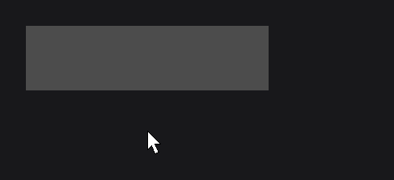
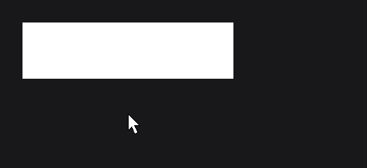
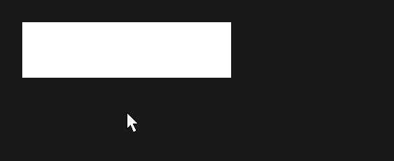
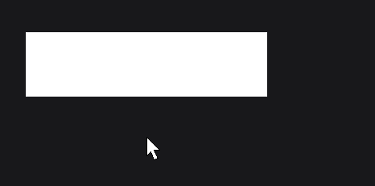
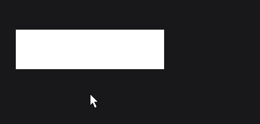

# Hover and Tooltips

[Input and Callbacks](../concepts/input.md) showed the hover callbacks and `hover(...)` tooltips, and [Animation](../essentials/animation.md) the hover animation and `hoverValue`. This page goes further: when exactly a node is hovered, the settings of the hover animation, tooltips that read signals, the look of text tooltips, custom tooltips drawn by you or made of nodes, and which node shows its tooltip.

## A hover effect and a tooltip

```java
RectNode
.create(100, 100, 300, 80)
.color(Color.DARKGRAY)
.hoveredColor(Color.GRAY)
.hoverDuration(300L)
.hoverEquation(TweenEquations.QUAD_OUT)
.hover(() -> "Opens the shop")
.attach(this);
```



The rectangle blends from `DARKGRAY` to its hovered color `GRAY` in 300 ms when the mouse enters, back when it leaves, and shows a one-line tooltip while hovered. Hovered colors of [RectNode](../nodes/visual/rect.md), [CircleNode](../nodes/visual/circle.md) and [ResourceNode](../nodes/visual/resource.md) follow the hover value.

## Hover state with isHovered

On every frame where the node is visible, it tests the mouse with `isHovered(mouseX, mouseY)`: the node must be in a UI that is on top, enabled, and be the target of the mouse (the front-most interactive node under it) or one of its parents (see [Mouse target and bubbling](mouse-and-keyboard.md#mouse-target-and-bubbling)). The result is stored and returned by `isHovered()`.

- A disabled node (`enabled(...)` returning `false`) is never hovered; disabling a hovered node ends its hover.
- A node with `interactive(false)` is never hovered either, and lets the mouse through to the nodes behind it (see [Letting the mouse through with interactive](mouse-and-keyboard.md#letting-the-mouse-through-with-interactive)).
- A node covered by another interactive node is not hovered where it is covered, unless that node is one of its children: a label added over a button as a sibling takes its hover, a label attached to the button keeps it hovered.
- A node that is not drawn (hidden, or outside the area of a parent with an overflow) keeps its last hover state until it is drawn again.
- `hovered(boolean hovered)` overwrites the stored state; the next drawn frame compares it with the mouse again and fires `onHoverStart` or `onHoverEnd` when they differ.

## Hover animation with hoverValue

Each node owns a `TweenAnimator` (`getHoverAnimator()`). When the node becomes hovered, it animates to `1` over `hoverDuration` milliseconds with `hoverEquation`; when the hover ends, it animates back to `0`.

`hoverValue(float value)` returns `value` multiplied by the current animator value. Use it while drawing:

```java
RectNode
.create(100, 100, 300, 80)
.color(Color.DARKGRAY)
.onDraw((node, mouseX, mouseY) -> DrawUtils.SHAPE.drawRect(node.getX(), node.getY() + node.getHeight() - 4, node.getWidth() * node.hoverValue(1F), 4, Color.WHITE))
.attach(this);
```

 times the node width.")

The `onDraw` lambda runs after the node drew itself, in the same coordinate space, so the underline grows from the left edge as the mouse enters (`DrawUtils` is in `dev.joid.lib.draw`).

| Method | Default | Description |
|---|---|---|
| `hoverDuration(long hoverDuration)` | `200L` | Duration of the hover animation, in milliseconds. |
| `hoverEquation(TweenEquation equation)` | `TweenEquations.LINEAR` | Easing of the hover animation (see [Easing](../animation/easing.md)). |
| `hoverValue(float value)` | | `value` times the animator value, from `0` (not hovered) to `1` (hovered). |
| `getHoverAnimator()` | | The `TweenAnimator` behind `hoverValue`. |
| `getHoverDuration()`, `getHoverEquation()` | | Current settings. |

## Hover callbacks

| Method | Lambda arguments | Fires |
|---|---|---|
| `onHoverStart` | `(node, mouseX, mouseY)` | The frame the node becomes hovered. |
| `onHover` | `(node, mouseX, mouseY)` | Every frame while the node is hovered, after `onHoverStart`. |
| `onHoverEnd` | `(node, mouseX, mouseY)` | The frame the node stops being hovered. |

```java
RectNode
.create(100, 100, 300, 80)
.color(Color.WHITE)
.onHoverStart((node, mouseX, mouseY) -> System.out.println("Enter at " + mouseX + ", " + mouseY))
.onHoverEnd((node, mouseX, mouseY) -> System.out.println("Leave"))
.attach(this);
```

They run while the node is drawn, before its `onAnimate`, `onMount` and `onRender` callbacks (see [Callbacks](callbacks.md#callbacks-within-a-frame)). Their default `post` does not affect the other nodes: every node evaluates its own hover.

## Text tooltips with hover

Text tooltips are lines given by suppliers. The suppliers are called on every frame the tooltip shows.

```java
RectNode
.create(100, 100, 300, 80)
.color(Color.WHITE)
.hover(() -> "Buy for 25 coins")
.hover(() -> Arrays.asList("Left click: buy", "Right click: preview"))
.attach(this);
```



| Method | Description |
|---|---|
| `hover(HoverSupplier supplier)` | Adds a one-line supplier (`() -> String`). A `null` line adds nothing for that frame. |
| `hover(Supplier<List<String>> supplier)` | Adds a supplier of several lines. |
| `hoverLines(HoverSupplier supplier)`, `hoverLines(Supplier<List<String>> supplier)` | Removes every line supplier, then adds this one. |
| `clearHoverLines()` | Removes every line supplier. |

The lines of all the suppliers are concatenated in the order you added them and drawn as one tooltip. When there is no line, no text tooltip shows. `HoverSupplier` is in `dev.joid.lib.ui.node.hover`.

### Tooltips that follow a signal

A tooltip supplier runs on every frame the tooltip shows, so it reads the current value of a [signal](../state/signals.md) directly:

```java
private final IntegerSignal price = IntegerSignal.of(25);

RectNode.create(100, 100, 300, 80).color(Color.WHITE).hover(() -> "Buy for " + this.price.get() + " coins").attach(this);
```

The text is built only while the tooltip is visible. `hoverLines(...)` replaces the previous suppliers instead of adding one.

### Drawing text tooltips with drawHover

JOID hands the lines to `UI.drawHover(Object content, double mouseX, double mouseY)`, which calls `IUIBridge.drawHover(UI ui, Object content, double mouseX, double mouseY)` of the UI's bridge. The bridge draws them in the look of its engine (`UIBridge` draws nothing, the demo bridge a dark rounded box; see [UI Bridge](../integration/ui-bridge.md#tooltips-with-drawhover)); the mouse position is in UI units and the drawing happens in the UI's coordinate space. Override `drawHover` in a UI to give its tooltips another look; `TextConverter.convertLines(content)` gives the lines:

```java
@Override
public void drawHover(final Object content, final double mouseX, final double mouseY) {
	final List<String> lines = TextConverter.convertLines(content);
	final double height = lines.size() * 24D + 12D;
	DrawUtils.SHAPE.drawRect(mouseX + 12D, mouseY + 12D, 260D, height, Color.BLACK);
	for (int i = 0; i < lines.size(); i++) {
		DrawUtils.TEXT.drawText(mouseX + 20D, mouseY + 18D + i * 24D, Text.create(lines.get(i), this.info));
	}
}
```



`info` is a `TextInfo` (see [Text](../essentials/text.md)); `DrawUtils.TEXT.drawText` draws a `Text` at a position, like `DrawUtils.SHAPE.drawRect` draws a rectangle (see also [Drawing Text](../drawing/text.md)).

## Custom tooltips with IHoverElement

`IHoverElement` (`dev.joid.lib.ui.node.hover`) draws anything as a tooltip.

| Method | Default | Description |
|---|---|---|
| `render(Node node, double mouseX, double mouseY)` | Abstract | Draws the element; `node` is the hovered node. |
| `getX()`, `getY()` | `0` | Offset of the element from its anchor. |
| `getWidth()`, `getHeight()` | `0` | Size of the element, read to place and clamp it. |

An element given directly to `hover(IHoverElement)` is drawn as is, in UI coordinates. Wrap it to position it:

### Positioning with CustomHoverElement

`CustomHoverElement` (`dev.joid.lib.ui.node.hover.impl`) anchors an element.

| Factory | Anchor |
|---|---|
| `CustomHoverElement.follow(IHoverElement element)` | The mouse position. |
| `CustomHoverElement.relative(IHoverElement element)` | The top-left corner of the hovered node (absolute position). |
| `CustomHoverElement.fixed(IHoverElement element)` | The origin of the UI, `(0, 0)`. |

The element is drawn with its top-left corner at `anchorX + getX()`, `anchorY + getY() - getHeight()`: its bottom edge sits `getY()` units below the anchor, so a negative `getY()` lifts it. When the element has a positive width and height, it is moved left to stay within the right edge of the visible area and down to stay below its top edge. `render` is then called with the origin moved to that corner, so the element draws from `(0, 0)`.

```java
final IHoverElement badge = new IHoverElement() {

	@Override
	public void render(final Node node, final double mouseX, final double mouseY) {
		DrawUtils.SHAPE.drawRect(0, 0, 160, 40, Color.BLACK);
	}

	@Override
	public double getX() {
		return 12;
	}

	@Override
	public double getY() {
		return -8;
	}

	@Override
	public double getWidth() {
		return 160;
	}

	@Override
	public double getHeight() {
		return 40;
	}

};

RectNode.create(100, 100, 300, 80).color(Color.WHITE).hover(CustomHoverElement.follow(badge)).attach(this);
```



`getElement()` and `getPosition()` return the wrapped element and its `CustomHoverElement.HoverElementPosition` (`FOLLOW`, `FIXED`, `RELATIVE`).

### Nodes as tooltips with NodeHoverElement

`NodeHoverElement` uses a node as the tooltip. The node's `x` and `y` are the offset (`getX()`, `getY()`) and its width and height the size, with the same placement rules as `CustomHoverElement`.

| Factory | Anchor |
|---|---|
| `NodeHoverElement.follow(Node node)` | The mouse position. |
| `NodeHoverElement.relative(Node node)` | The top-left corner of the hovered node. |
| `NodeHoverElement.fixed(Node node)` | The origin of the UI. |

```java
final RectNode tooltip = RectNode
.create(12, -8, 220, 60)
.color(Color.BLACK)
.body(card -> {
	TextNode.create(10, 10).text(Text.create("Iron sword", this.info)).attach(card);
});

RectNode.create(100, 100, 300, 80).color(Color.WHITE).hover(NodeHoverElement.follow(tooltip)).attach(this);
```



The tooltip node is not part of the node tree: it is loaded into the UI of the hovered node the first time it shows (its `onInit` fires then) and drawn with its children each time it shows.

### Managing tooltip elements

| Method | Description |
|---|---|
| `hover(IHoverElement element)` | Adds an element. |
| `removeHover(IHoverElement element)` | Removes this element; the others and the text lines stay. |
| `hoverElements(IHoverElement element)` | Removes every element, then adds this one. |
| `clearHoverElements()` | Removes every element. |
| `clearHover()` | Removes every element and every line supplier. |

A node with an element shows a tooltip even when the element draws nothing, so its parent shows none: remove an element you turn off with `removeHover(element)` rather than leaving it empty. The elements of a node are drawn in the order you added them, then its text tooltip. `TextHoverElement` (`new TextHoverElement(List<String> lines)`) is the element JOID builds for the text lines; adding one yourself shows fixed lines through `drawHover`.

## Which tooltip shows

- Tooltips show only in the UI that is on top, after every node of that UI is drawn, above them.
- At most one node shows its tooltip per frame: the hovered node of the UI, `UI.getHoveredNode()` (the first interactive node under the mouse, see [Nodes under a point with getNodeListAt](mouse-and-keyboard.md#nodes-under-a-point-with-getnodelistat)), or, when it has no tooltip content, its closest parent that has some. A hovered child without a tooltip lets its parent show its own; the nodes behind the hovered node and its parents show nothing.
- The tooltip search ignores `enabled(...)`: a disabled node still shows its tooltip, as long as it is visible and the mouse is over it. A node with `interactive(false)` never shows its tooltip: the node behind it does.

## Reference

| Method | Description |
|---|---|
| `isHovered()` | Hover state of the last drawn frame. |
| `isHovered(double mouseX, double mouseY)` | `true` when the node is enabled and is the mouse target at that point or one of its parents. |
| `isHovered(double mouseX, double mouseY, boolean checkEnabled)` | The same test; `false` skips the enabled check. |
| `hovered(boolean hovered)` | Overwrites the stored hover state. |
| `hoverValue(float value)` | `value` scaled by the hover animation. |
| `hoverDuration(long)`, `hoverEquation(TweenEquation)` | Hover animation settings. |
| `hover(...)`, `hoverLines(...)`, `hoverElements(...)` | Tooltips. |
| `clearHover()`, `clearHoverLines()`, `clearHoverElements()` | Remove tooltips. |
| `onHoverStart`, `onHover`, `onHoverEnd` | Hover callbacks. |

## Pitfalls

- A disabled node keeps its tooltip but has no hover color and no hover callbacks.
- `hover(...)` adds a supplier on each call: a node that calls it in `init` adds one per load. Use `hoverLines(...)` to replace them.
- Only the UI on top (`isOnTop` of its bridge) shows tooltips.

## See also

- Next: [Drag and Drop](drag-drop.md)
- [Input and Callbacks](../concepts/input.md) and [Animation](../essentials/animation.md): the basics this page builds on.
- [Callbacks](callbacks.md): the order of the callbacks within a frame.
- [Mouse and Keyboard](mouse-and-keyboard.md): hit testing with `isHovered`.
- [Easing](../animation/easing.md): every `hoverEquation`.
- [UI Bridge](../integration/ui-bridge.md): the default look of text tooltips.