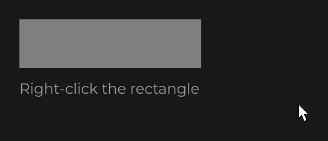
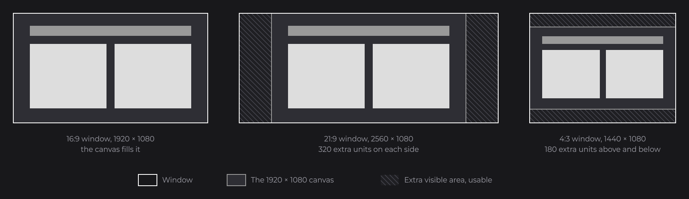
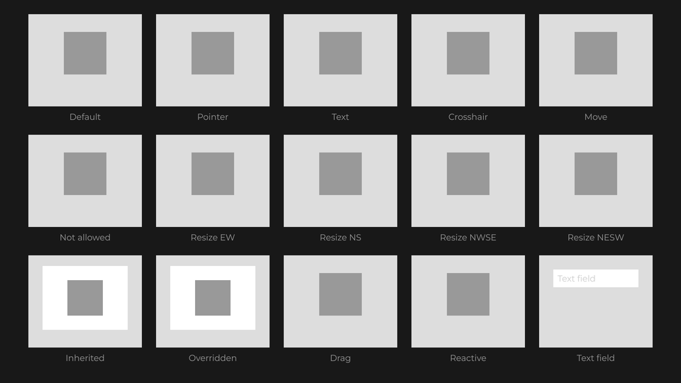
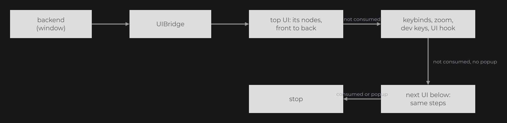

# Mouse and Keyboard

[Input and Callbacks](../concepts/input.md) showed `onClick` with its `ClickType`, `keybind` and `Key.isDown()`; [Callbacks](callbacks.md) listed every callback. This page goes into the details of the mouse and the keyboard: the buttons (`ClickType`), the mouse coordinates and hit testing, the keys (`Key`) and keyboard layouts, the modifier helpers, keybinds, the input hooks of a UI and the exact path of an event from the window to the nodes.

## Reacting to clicks and keys

```java
private final Signal<String> status = Signal.of("Right-click the rectangle");

RectNode
.create(100, 100, 300, 80)
.color(Color.GRAY)
.onClick((node, mouseX, mouseY, clickType) -> {
	if (clickType.isRight()) {
		this.status.set("Context menu at " + (int) mouseX + ", " + (int) mouseY);
	}
})
.attach(this);

TextNode.create(100, 200).text(Text.create(this.status.get(), this.info)).attach(this);

super.keybind(() -> this.status.set("Saved"), Key.LEFT_CONTROL, Key.S);
```



`onClick` fires only for a press over the node; `clickType` tells which button. `keybind` runs its action when a key event reaches the UI while every listed key is down. `info` is a `TextInfo` (see [Text](../essentials/text.md)).

## Mouse buttons with ClickType

`ClickType` (`dev.joid.lib.utils.click`) is the button of a mouse event.

| Constant | Button index | Predicate |
|---|---|---|
| `LEFT` | `0` | `isLeft()` |
| `RIGHT` | `1` | `isRight()` |
| `MIDDLE` | `2` | `isMiddle()` |
| `BACK` | `3` | `isBack()` |
| `FORWARD` | `4` | `isForward()` |
| `OTHER` | `-1` | `isOther()` |

| Method | Description |
|---|---|
| `static from(int button)` | Maps a button index to a constant; any index other than 0 to 4 gives `OTHER`. |
| `getButton()` | The button index of the constant, `-1` for `OTHER`. |

## Mouse callbacks

| Method | Lambda arguments | Fires |
|---|---|---|
| `onClick` | `(node, mouseX, mouseY, clickType)` | A press while the node is hovered, unless a node reached before it consumed the press. |
| `onMousePressed` | `(node, mouseX, mouseY, clickType)` | Every press, wherever the mouse is. |
| `onMouseReleased` | `(node, mouseX, mouseY, clickType)` | Every release, wherever the mouse is. |
| `onMouseDragged` | `(node, mouseX, mouseY, clickType, deltaTime)` | Every mouse move while a button is held; `clickType` is the held button. |
| `onMouseScroll` | `(node, mouseX, mouseY, notchesX, notchesY)` | Every wheel event. |

- `notchesY` of a wheel event is a `double` in wheel notches: `1` for a notch up, `-1` for a notch down, a fraction for a precise touchpad. `notchesX` is the horizontal wheel (a tilted wheel or a touchpad): positive toward the left, negative toward the right, `0` on LWJGL 2. They are never both `0` (the bridge drops still events).
- `deltaTime` of a drag event is the number of milliseconds since the button was pressed, measured by the UI bridge on the clock bridge (`BridgeHandler.CLOCK`).
- `onClick` consumes the press: the nodes behind and the UIs below do not receive it. `onMousePressed`, `onMouseReleased`, `onMouseDragged` and `onMouseScroll` are listeners: they run for every event not consumed yet and leave it to the others; see [Consumed input events](callbacks.md#consumed-input-events).
- Hidden and disabled nodes receive no mouse event: none of these callbacks, nor hover and drags, fire for a node whose `visible(...)` or `enabled(...)` returns `false`, or for the children of a hidden or disabled node.

## Mouse coordinates

Positions are units of the 1920×1080 virtual canvas, fitted to the window without stretching; wider or taller windows show extra canvas around it. The mouse uses the same units as the nodes (see [The Virtual Canvas](../concepts/canvas.md)).



- The `mouseX` and `mouseY` given to callbacks and hooks are canvas units: the window position of the mouse at the last drawn frame, converted through the UI's view. Over the extra area of a wider or taller window, they fall outside `0`..`1920` and `0`..`1080`. `UI.getMouseX()` and `UI.getMouseY()` return the same values.
- For coordinates relative to a node, subtract its absolute position: `mouseX - node.getAbsoluteX()`. To draw at the mouse from `draw(mouseX, mouseY)`, convert it into the space the node draws in, where the node sits at `getX()`, `getY()`: `toDrawX(mouseX)` and `toDrawY(mouseY)`.
- The window position in pixels is `BridgeHandler.WINDOW.get().getMouseX()` and `getMouseY()`; convert between window pixels and canvas units with `ui.getView().toUiX(...)`, `toUiY(...)`, `toScreenX(...)` and `toScreenY(...)` (see also [View and Scaling](../ui/view-and-scaling.md)).

### Hit testing with isHovered

`node.isHovered(mouseX, mouseY)` is the test used for clicks, hover and drags. It returns `true` when all of these hold:

- the node is in a UI, that UI is on top (`UI.isOnTop()`, as reported by its UI bridge), and the node is visible and enabled;
- the mouse is inside the area of the parent that clips the node with an overflow, if any;
- `getAbsoluteX() < mouseX <= getAbsoluteX() + getWidth()` and `getAbsoluteY() < mouseY <= getAbsoluteY() + getHeight()`.

`isHovered(mouseX, mouseY, false)` skips the enabled check. `isHovered()` without arguments returns the hover state of the last drawn frame (see [Hover and Tooltips](hover.md)).

## Mouse cursor

`cursor(Cursor)` sets the mouse cursor shown while the pointer is over a node. `Cursor` (`dev.joid.lib.utils.cursor`) lists the system cursors every backend can show: `DEFAULT`, `POINTER`, `TEXT`, `CROSSHAIR`, `MOVE`, `NOT_ALLOWED`, `RESIZE_EW`, `RESIZE_NS`, `RESIZE_NWSE` and `RESIZE_NESW`.

```java
final BooleanSignal locked = BooleanSignal.of(false);

RectNode
.create(100, 100, 200, 60)
.color(Color.GRAY)
.cursor(Cursor.POINTER)
.onClick((node, mouseX, mouseY, clickType) -> locked.set(!locked.get()))
.attach(this);

RectNode
.create(100, 200, 200, 60)
.color(Color.GRAY)
.cursor(() -> locked.get() ? Cursor.NOT_ALLOWED : Cursor.POINTER)
.attach(this);
```

At each frame, the UI bridge picks the cursor the way a browser does:

- the node under the pointer is the topmost one that passes `isHovered(mouseX, mouseY, false)`: a disabled node keeps its cursor, a hidden node has none;
- a node without a cursor takes the cursor of its parent, up to the root; a tree without any cursor shows `DEFAULT`;
- while a mouse button is held, the cursor of the node pressed stays, wherever the pointer goes, until the button is released;
- only the UIs that receive the mouse count, from the top: an interactive overlay comes before the screen below it, a popup hides the UIs under it, and a passive overlay is ignored;
- outside every node, the cursor is `DEFAULT`.



The bridge calls `IWindowBridge.setCursor(...)` only when that cursor changes, and never while the mouse is grabbed. `cursor(Supplier<Cursor>)` follows a signal or any expression; a supplier that gives `null` lets the node take the cursor of its parent. `getCursor()` returns the cursor set on the node (`null` when it has none), `getResolvedCursor()` the one it shows after inheritance, and `UI.getHoveredNode()` the node that decides.

The text fields (`TextFieldNode`, `IntegerFieldNode`, `MultilineTextFieldNode`) show `TEXT` by default; no other built-in node sets a cursor, so a button shows `POINTER` only when you give it one. A window bridge that cannot change the cursor keeps the default one: see [Backends](../integration/backends.md#mouse-cursors) for each backend.

## Keyboard callbacks with onKeyPressed

`onKeyPressed((node, c, key) -> ...)` fires for every key event the UI receives that is not consumed yet, wherever the mouse is, as long as the node is visible and enabled.

- `c` is the printable character typed with the key, or `(char) 0` for the other keys, including text keys pressed with Ctrl or Alt. `UIBridge.keyTyped` turns every control character (`Character.isISOControl`: `\r`, `\b`, `\t`, Ctrl + C...) into `(char) 0`, so `c` is the same on every backend.
- `key` is a `Key` constant; a key the bridge cannot map is `Key.UNKNOWN`. A letter key is the letter it types on the active keyboard layout (see [Keyboard layouts](#keyboard-layouts)).
- There is no release event for keys. Read the current state of a key with `Key.isDown()`.
- The lambda leaves the event to the other nodes and to the UI keybinds. Override `post` to consume the keys your node handles (see [Callbacks](callbacks.md#consuming-an-event-from-a-listener)).

## Keys with Key

`Key` (`dev.joid.lib.utils.key`) lists the keys JOID knows.

| Group | Constants |
|---|---|
| Letters | `A` to `Z` |
| Digits | `DIGIT_0` to `DIGIT_9` |
| Function keys | `F1` to `F25` |
| Editing | `ESCAPE`, `ENTER`, `TAB`, `BACKSPACE`, `INSERT`, `DELETE` |
| Navigation | `RIGHT`, `LEFT`, `DOWN`, `UP`, `PAGE_UP`, `PAGE_DOWN`, `HOME`, `END` |
| Locks and system | `CAPS_LOCK`, `SCROLL_LOCK`, `NUM_LOCK`, `PRINT_SCREEN`, `PAUSE` |
| Punctuation | `SPACE`, `APOSTROPHE`, `COMMA`, `MINUS`, `PERIOD`, `SLASH`, `SEMICOLON`, `EQUAL`, `LEFT_BRACKET`, `BACKSLASH`, `RIGHT_BRACKET`, `GRAVE_ACCENT` |
| Numpad | `NUMPAD_0` to `NUMPAD_9`, `NUMPAD_DECIMAL`, `NUMPAD_DIVIDE`, `NUMPAD_MULTIPLY`, `NUMPAD_SUBTRACT`, `NUMPAD_ADD`, `NUMPAD_ENTER`, `NUMPAD_EQUAL` |
| Modifiers | `LEFT_SHIFT`, `LEFT_CONTROL`, `LEFT_ALT`, `LEFT_SUPER`, `RIGHT_SHIFT`, `RIGHT_CONTROL`, `RIGHT_ALT`, `RIGHT_SUPER`, `MENU` |
| Other | `UNKNOWN` |

`key.isDown()` returns the current state of the key, asked to the window bridge (`IWindowBridge.isKeyDown`). You can call it anywhere, for example in a click callback:

```java
RectNode
.create(100, 100, 300, 80)
.color(Color.GRAY)
.onClick((node, mouseX, mouseY, clickType) -> {
	if (Key.LEFT_SHIFT.isDown()) {
		System.out.println("Shift-click");
	}
})
.attach(this);
```

### Keyboard layouts

Letter keys follow the active keyboard layout, like the shortcuts of the system applications: `Key.A` is the key that types `a`. On an AZERTY keyboard, Ctrl + A selects the text of a field with the key labelled A, the dev reload is the key labelled R, and `keybind(..., Key.LEFT_CONTROL, Key.Z)` runs with the key labelled Z. Events, `key.isDown()`, keybinds and the shortcuts of JOID all use this layout key.

| Keys | On another layout |
|---|---|
| Letters `A` to `Z` | The key that types the letter. |
| Punctuation (`COMMA`, `PERIOD`, `SEMICOLON`...) | The key that types the character when `Key` has a constant for it, otherwise the key at that place: on AZERTY, the key that types `,` is `COMMA` and the one that types `!` stays `SLASH`. |
| Digits, numpad, function, editing, navigation and modifier keys, `SPACE` | Never move: Ctrl + 1 is the key labelled 1 on every layout, whatever it types without Shift. |

For controls tied to a place on the keyboard, such as moving with W, A, S and D, read the key by its position. `key.isPhysicalDown()` tells whether the key at the place of `key` on a US QWERTY keyboard is held: `Key.W.isPhysicalDown()` is the key above S, labelled Z on AZERTY.

```java
RectNode
.create(100, 100, 300, 80)
.color(Color.GRAY)
.onClick((node, mouseX, mouseY, clickType) -> {
	if (Key.W.isPhysicalDown()) {
		System.out.println("Click while the key above S is held");
	}
})
.attach(this);
```

| Backend | Letter keys | `isPhysicalDown()` |
|---|---|---|
| LWJGL 3 and Vulkan (GLFW) | The layout key, from the name GLFW gives the key (`glfwGetKeyName`), read again on every event so a layout change applies at once. | The key at that place. |
| LWJGL 2 | The layout key on Windows and Linux; on macOS, LWJGL 2 reports the place of the key only. | The same as `isDown()`: LWJGL 2 gives a single code per key. |

## Modifier helpers

The static helpers of `UI` test the left and the right key of a modifier at once.

| Method | Returns `true` when |
|---|---|
| `UI.isCtrlKeyDown()` | `LEFT_CONTROL` or `RIGHT_CONTROL` is down. |
| `UI.isShiftKeyDown()` | `LEFT_SHIFT` or `RIGHT_SHIFT` is down. |
| `UI.isAltKeyDown()` | `LEFT_ALT` or `RIGHT_ALT` is down. |

## Keybinds with UI.keybind

`keybind(Runnable runnable, Object... bindings)` registers a shortcut on a UI. A binding is a `Key`, or any object a registered `IKeyResolver` turns into a key.

```java
@Override
public void init() {
	super.keybind(() -> JOID.close(this), Key.LEFT_CONTROL, Key.W);
	super.keybind(() -> System.out.println("Help"), Key.F1);
}
```

- A keybind is identified by the set of its bindings: their order does not matter, and registering the same set again replaces the previous runnable (`keybind(r, CTRL, S)` then `keybind(r2, S, CTRL)` keeps `r2`).
- On each key event that no node consumed, a keybind runs when the pressed key is one of its keys and all its keys are down (`Key.isDown()`); the event is then consumed. Holding Ctrl and S then pressing A does not run Ctrl + S again.
- Several keybinds can run for the same event; their order is unspecified. `getKeybindMap()` returns them as a `Map<Set<Object>, Runnable>`.
- The UI clears its keybinds every time it initializes (first open and every `UI.reload()`), so register them in `init()`.

> WARNING: Keybinds run only when no node consumed the key. A focused text field consumes every key, so the keybinds of its UI wait until it loses the focus.

### Key bindings of the engine with IKeyResolver

An engine often lets its users choose their keys (the controls menu of a game). Pass its binding objects to `keybind` as they are: `KeyResolver` (`dev.joid.lib.utils.key.resolver`) turns each binding into a `Key` on every key event, so the shortcut follows a change of the user's settings at once. A `Key` resolves to itself; any other binding goes to the latest registered `IKeyResolver` that `supports` it. A binding resolved to `null` (a key left unbound) never runs its keybind. `keybind` throws an `IllegalArgumentException` for a binding that no resolver supports.

```java
public final class ActionKeyResolver implements IKeyResolver {

	@Override
	public boolean supports(final @NonNull Object binding) {
		return binding instanceof Action;
	}

	@Override
	public Key resolve(final @NonNull Object binding) {
		return Controls.getKey((Action) binding);
	}

}
```

```java
KeyResolver.register(new ActionKeyResolver());

super.keybind(() -> JOID.close(this), Action.INVENTORY);
```

The backend of an engine registers the resolver of its own bindings (the key mappings of Minecraft, for example), so an interface only passes them.

| Method | Description |
|---|---|
| `boolean supports(Object binding)` | `IKeyResolver`: whether it resolves this binding. |
| `Key resolve(Object binding)` | `IKeyResolver`: the current key of the binding, or `null` when it has none. |
| `KeyResolver.register(IKeyResolver resolver)` | Adds a resolver, tried first; registering it again moves it first. |
| `KeyResolver.unregister(IKeyResolver resolver)` | Removes it. |
| `KeyResolver.supports(Object binding)` | `true` for a `Key` or a binding a resolver supports. |
| `KeyResolver.resolve(Object binding)` | The key of the binding, `null` when unbound; `IllegalArgumentException` when no resolver supports it. |

## UI input hooks

A `UI` can override the input hooks of `IUI`. They run after all the nodes of the UI, with the same context, so check `context.isCancelled()` to know whether a node handled the event, and cancel it to keep it from the UIs below.

| Hook | Arguments |
|---|---|
| `mousePressed` | `(mouseX, mouseY, clickType, context)` |
| `mouseReleased` | `(mouseX, mouseY, clickType, context)` |
| `mouseDragged` | `(mouseX, mouseY, clickType, deltaTime, context)` |
| `mouseScroll` | `(mouseX, mouseY, notchesX, notchesY, context)` |
| `keyPressed` | `(c, key, context)` |

```java
@Override
public void keyPressed(final char c, final Key key, final InternalContext context) {
	if (!context.isCancelled() && key == Key.TAB) {
		context.cancel();
		System.out.println("Next tab");
	}
}
```

## Event dispatch order



The UI bridge receives the events from the backend through `UIBridge.mousePressed(ClickType)`, `mouseReleased(ClickType)`, `mouseMoved()`, `mouseScroll(double, double)` and `keyTyped(char, Key)` (see [UI Bridge](../integration/ui-bridge.md)). For each event:

1. The UI bridge walks its UIs from the top one down, the [overlays](../ui/managing-uis.md#overlays-with-uidataoverlay) first, skipping the UIs that are not active or not visible (`active` and `visible` of `@UIData`, readable and changeable through `ui.getData()`) and the overlays that take no input or are not drawn. A wheel event with a value of `0` is dropped.
2. Key events only, on `Key.ESCAPE` in a closeable UI (`closeable`, `true` by default) that is not an overlay: the UI first receives the key like any other (steps 3 to 5: a focused text field cancels its edit and consumes it, a keybind on `ESCAPE` consumes it). When nobody consumed it, the UI is asked to close (`close()` may refuse, see [Opening and Closing UIs](../ui/managing-uis.md)). Either way the dispatch stops there: the UIs below never receive that Escape. A UI that is not closeable receives Escape as a normal key.
3. The UI dispatches the event to its nodes, front to back (see [Callbacks](callbacks.md#input-events-across-nodes) for the order inside a node). Events that arrive before the UI finished its first initialization are ignored.
4. Key events only, when no node consumed the event:
   1. the keybinds (see above);
   2. when the UI is zoomable (`zoomable`, `true` by default) and the event is still not consumed: `+` or `NUMPAD_ADD` with Ctrl or Alt zooms in by `0.1`, `-` or `NUMPAD_SUBTRACT` with Ctrl or Alt zooms out by `0.1`; the event is consumed when the zoom changed;
   3. in dev mode, when the event is still not consumed: Left Ctrl + R or F5 reloads the UI (`UI.reload()`: same instance, fields and signals kept); with Left Shift held (Ctrl + Shift + R, Shift + F5) the UI is replaced by a new instance (`UI.renew()`, zoom back to `1`); F3 shows or hides the developer panel (see [Developer Tools](../concepts/dev-tools.md)).
5. The UI hook (`mousePressed`, `keyPressed`...) runs with the context.
6. When the event is consumed, or the UI is a popup (`@UIDataPopup(active = true)`, see [Opening and Closing UIs](../ui/managing-uis.md)), the dispatch stops; otherwise the next UI below receives it. The bridge method returns whether the event was consumed, so the host can skip it; an event consumed by an overlay whose `cancelClick`, `cancelScroll` or `cancelKeyboard` is off still goes to the host.

Wheel events in dev mode: with Left Alt held, the wheel zooms the UI (in larger steps with Left Shift) and the event goes no further.

The entry points of a UI are public: `onMousePressed(ClickType)`, `onMouseReleased(ClickType)`, `onMouseDragged(ClickType, long)`, `onMouseScroll(double, double)` and `onKeyPressed(char, Key)` run steps 3 to 5 and return `true` when the event was consumed. Calling them simulates input on one UI.

## Keyboard focus

JOID has no global focus: every key event reaches every node of the UI until one consumes it. Focus belongs to the nodes that need it:

- A [TextFieldNode](../nodes/input/text-field.md) or [MultilineTextFieldNode](../nodes/input/multiline-text-field.md) takes the focus when clicked and loses it when a press lands elsewhere, on Enter or on Escape; while focused it consumes every key (Tab included: there is no keyboard navigation between fields), so the keybinds and the nodes reached after it do not see the keys.
- For your own focus, keep the state yourself and consume keys only while focused:

```java
final BooleanSignal focused = BooleanSignal.of(false);

RectNode
.create(100, 100, 300, 60)
.color(Color.WHITE)
.onClick((node, mouseX, mouseY, clickType) -> focused.set(true))
.onKeyPressed(new NodeKeyPressedCallback<RectNode>() {

	@Override
	public void apply(final RectNode node, final char c, final Key key) {
		if (key == Key.ENTER) {
			focused.set(false);
			return;
		}

		System.out.println("Typed " + c);
	}

	@Override
	public void post(final RectNode node, final InternalContext context, final char c, final Key key) {
		if (focused.peek()) {
			context.cancel(() -> this.apply(node, c, key));
		}
	}

})
.attach(this);
```

A [custom node](../nodes/custom-nodes.md) can do the same in its `keyPressed` hook.

## Last input of a node

Each node records the last events dispatched to its UI, whether or not they happened over the node:

| Getter | Description |
|---|---|
| `getLastClickType()` | Button of the last press; `null` before the first one. |
| `getLastClickTime()` | Time of the last press, in milliseconds of the clock bridge. |
| `getLastKey()` | Last key; `null` before the first one. |
| `getLastCharacter()` | Character of the last key event. |
| `getLastKeyTime()` | Time of the last key event, in milliseconds of the clock bridge. |

## Pitfalls

- Keybinds and UI hooks run only when no node consumed the event: a focused text field takes every key.
- Node hooks receive every event of their UI, wherever the pointer is: test `isHovered(mouseX, mouseY)` before reacting to a click.
- Only Left Ctrl, Left Shift and Left Alt drive the dev shortcuts and the dev zoom.
- A label drawn over a button as a sibling hides the button from the cursor: attach the label to the button, so that it inherits the cursor of its parent.
- `Key.W.isDown()` is the key labelled W on every layout: on AZERTY it sits where Z is on QWERTY. Use `isPhysicalDown()` for keys chosen for their place.

## See also

- Next: [Hover and Tooltips](hover.md)
- [Input and Callbacks](../concepts/input.md): the basics this page builds on.
- [Callbacks](callbacks.md): consuming an event, the order inside a node.
- [The Virtual Canvas](../concepts/canvas.md): canvas units and window pixels.
- [TextFieldNode](../nodes/input/text-field.md): the focus of a text field.
- [UI Bridge](../integration/ui-bridge.md): forwarding the events of your window.