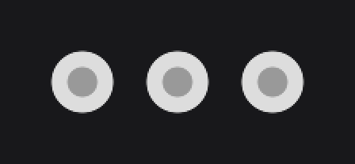
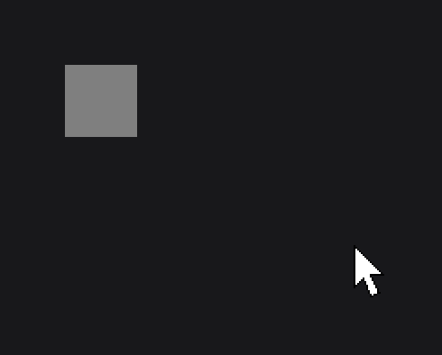
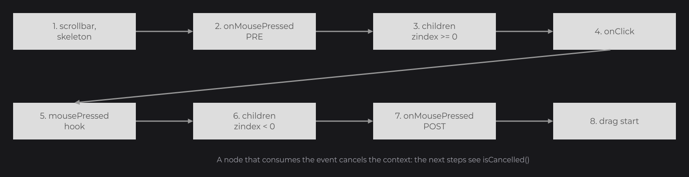

# Custom Nodes

In [Building a UI Kit](../components/ui-kit.md) you gave a look to the controls of JOID by subclassing them. A custom node goes one step further: you extend `Node` itself (or any existing node) and override its hooks, `draw` for the visuals, `init` and `update` for state, the input hooks for interaction. This page covers the constructor and factory contract, reactive setters, the hooks, input handling with `InternalContext`, your own callbacks with `@NodeCallbackMethod`, and signal bindings.

## A minimal node

The smallest custom node has a `protected` constructor, a static `create` factory and a `draw` method:

```java
public class DotNode extends Node {

	protected DotNode(final double x, final double y, final double width, final double height) {
		super(x, y, width, height);
	}

	public static @NonNull DotNode create(final double x, final double y, final double size) {
		return new DotNode(x, y, size, size);
	}

	@Override
	public void draw(final double mouseX, final double mouseY) {
		DrawUtils.SHAPE.drawCircle(super.getX() + super.dw(2D), super.getY() + super.dh(2D), Color.decode("#DDDDDD"), super.dw(2D));
		DrawUtils.SHAPE.drawCircle(super.getX() + super.dw(2D), super.getY() + super.dh(2D), Color.decode("#999999"), super.dw(4D));
	}

}
```

```java
DotNode.create(100, 100, 40).attach(this);
DotNode.create(160, 100, 40).attach(this);
DotNode.create(220, 100, 40).attach(this);
```



The node attaches, nests and positions like any built-in node; `draw` runs every frame and paints at the node's own position with `DrawUtils.SHAPE`, which you met in [Input Controls](../essentials/controls.md). `dw(2D)` is half the width, as in [Layout](../essentials/layout.md). The [Drawing Overview](../drawing/draw-utils.md) covers everything `draw` can paint.

## A complete custom node

A color swatch that the user selects with a click, with its own `onSelect` callback. It adds what the next sections explain one by one: a setter pair that follows signals, an input hook, and a callback of its own. First the callback interface:

```java
import dev.joid.lib.ui.node.callback.NodeCallback;
import dev.joid.lib.ui.node.callback.NodeCallbackMethod;
import dev.joid.lib.ui.node.callback.NodeCallbackMethod.Type;
import dev.joid.lib.utils.context.InternalContext;
import lombok.NonNull;

@FunctionalInterface
public interface NodeSwatchSelectCallback<T extends SwatchNode> extends NodeCallback {

	public void apply(final @NonNull T node, final boolean selected);

	@NodeCallbackMethod(Type.PRE)
	public default void pre(final @NonNull T node, final @NonNull InternalContext context, final boolean selected) {}

	@NodeCallbackMethod(Type.POST)
	public default void post(final @NonNull T node, final @NonNull InternalContext context, final boolean selected) {
		context.cancel(() -> this.apply(node, selected));
	}

}
```

Then the node:

```java
import java.util.function.Supplier;

import dev.joid.lib.color.Color;
import dev.joid.lib.draw.DrawUtils;
import dev.joid.lib.ui.node.Node;
import dev.joid.lib.ui.node.callback.registry.NodeCallbackRegistry;
import dev.joid.lib.utils.click.ClickType;
import dev.joid.lib.utils.context.InternalContext;
import dev.joid.lib.utils.signal.Signal;
import lombok.NonNull;

@SuppressWarnings("unchecked")
public class SwatchNode extends Node {

	private static final int CALLBACK_SELECT = NodeCallbackRegistry.next(NodeSwatchSelectCallback.class);

	private Supplier<Color> color;
	private boolean         selected;

	protected SwatchNode(final double x, final double y, final double width, final double height) {
		super(x, y, width, height);
		this.color = Signal.from(Color.WHITE);
	}

	public static @NonNull SwatchNode create(final double x, final double y, final double size) {
		return new SwatchNode(x, y, size, size);
	}

	@Override
	public void draw(final double mouseX, final double mouseY) {
		if (this.selected) {
			DrawUtils.SHAPE.drawRect(super.getX() - 4D, super.getY() - 4D, super.getWidth() + 8D, super.getHeight() + 8D, Color.WHITE);
		}

		DrawUtils.SHAPE.drawRect(super.getX(), super.getY(), super.getWidth(), super.getHeight(), this.color.get().to(Color.BLACK, super.hoverValue(0.2F)));
	}

	@Override
	public void mousePressed(final double mouseX, final double mouseY, final ClickType clickType, final InternalContext context) {
		if (context.isCancelled() || !clickType.isLeft() || !super.isHovered(mouseX, mouseY)) {
			return;
		}

		context.cancel(() -> super.executeCallback(SwatchNode.CALLBACK_SELECT, InternalContext.create(), () -> this.selected = !this.selected, !this.selected));
	}

	public final <T extends SwatchNode> @NonNull T color(final @NonNull Color color) {
		return this.color(Signal.from(color));
	}

	public final <T extends SwatchNode> @NonNull T color(final @NonNull Supplier<@NonNull Color> color) {
		this.color = color;
		return (T) this;
	}

	public final <T extends SwatchNode> @NonNull T selected(final boolean selected) {
		return this.selected(Signal.from(selected));
	}

	public final <T extends SwatchNode> @NonNull T selected(final @NonNull Supplier<@NonNull Boolean> selected) {
		return super.follow("selected", selected, value -> this.selected = value);
	}

	public final <T extends SwatchNode> @NonNull T onSelect(final @NonNull NodeSwatchSelectCallback<T> callback) {
		return super.registerCallback(SwatchNode.CALLBACK_SELECT, callback);
	}

	public final boolean isSelected() {
		return this.selected;
	}

}
```

And its use in a UI, with a native expression that follows a signal:

```java
private final IntegerSignal level = IntegerSignal.of(0);

SwatchNode
.create(100, 100, 40)
.color(this.level.get() > 2 ? Color.WHITE : Color.GRAY)
.onSelect((swatch, selected) -> System.out.println("[Palette] selected: " + selected))
.attach(this);
```



## Reactive setters

Each property setter of a node comes in pairs, like the built-in ones:

| Overload | Body |
| --- | --- |
| Value: `color(Color color)` | `return this.color(Signal.from(color));` and nothing else, so that the caller's expression is followed. |
| Supplier: `color(Supplier<Color> color)` | Stores the source. |

Two ways to store the source:

- A value read while drawing (a color, an effect setting): keep the `Supplier` in a field and call `get()` in `draw`. A signal returns its cached value; a lambda runs every frame.
- Any other property: `super.follow("name", supplier, consumer)` (`protected final`) applies the value at once, then reads the source at the start of each render of the node and calls `consumer` only when the value changed. A constant (`Signal.from` of a value without signal) is applied once and not stored. `getSourceMap()` lists the followed properties.

A method that only passes its parameter to a setter or to `Signal.from` is traversed by the expression replay: `title(String title) { return this.label(title); }` follows the caller's expression too. A value computed inside your setter (`this.label("> " + title)`) is fixed. See [Reactive Properties](../state/reactive-properties.md).

## Constructor and factory contract

- `Node` has two public constructors: `Node(double x, double y)` (0×0 size) and `Node(double x, double y, double width, double height)`.
- Give your node a `protected` constructor and a `public static` factory returning the concrete type, usually `create(...)`. A `final` class can use a `private` constructor and factories named after their intent, like `FlexNode.vertical(...)`.
- An abstract node meant to be extended (like `ScrollbarNode`) has a `protected` constructor and no factory: its subclasses provide one.
- Keep a constructor `(double, double, double, double)`, `(double, double)` or `()`, whatever its visibility: `copy()` and copy drags build copies through one of them, and throw a `RuntimeException` (`Failed to copy node: <class>`) without it.
- `copy()` copies your non-static, non-final, non-transient fields by reference. Mark a field `transient` to keep it out of copies.
- The constructor runs before the node has a UI: do the UI-dependent work in `init`.

## Hooks you can override

The hooks come from `INode` and do nothing by default, except `drawSkeleton`.

| Hook | Called |
| --- | --- |
| `init(UI ui)` | On every load: when the node joins a UI, when the UI opens or reloads, when the node is attached again after a detach. The children's `init` runs before the parent's. |
| `draw(double mouseX, double mouseY)` | Every frame while the node is visible and mounted, after the children with a negative z-index and before the others. |
| `drawSkeleton(double mouseX, double mouseY)` | Every frame while the node is visible but not mounted, instead of `draw`. `Node` fills the bounds with `Color.LOADING()`. |
| `update()` | On every update tick, after the children's `update`. Also called for hidden nodes. |
| `detach()` | When the node is detached, after its children. |
| `mousePressed(double mouseX, double mouseY, ClickType clickType, InternalContext context)` | Mouse button pressed. |
| `mouseReleased(double mouseX, double mouseY, ClickType clickType, InternalContext context)` | Mouse button released. |
| `mouseDragged(double mouseX, double mouseY, ClickType clickType, long deltaTime, InternalContext context)` | Mouse moved with a button held. `deltaTime` comes from the UI bridge (the bundled windows give the milliseconds since the press). |
| `mouseScroll(double mouseX, double mouseY, int value, InternalContext context)` | Mouse wheel. A positive `value` is a wheel up. |
| `keyPressed(char c, Key key, InternalContext context)` | Key typed. `c` is the typed character, as reported by the UI bridge (the bundled windows send `0` for keys without one). |

### Drawing in draw

Positions are units of the 1920×1080 virtual canvas, fitted to the window without stretching; wider or taller windows show extra canvas around it. The positions, sizes and mouse coordinates of a node are in these units, never in window pixels.


See [The Virtual Canvas](../concepts/canvas.md).

- The render matrix is at the parent's origin: draw at `getX()`, `getY()` with `getWidth()`, `getHeight()`. The [drawing API](../drawing/draw-utils.md) is `DrawUtils`.
- `mouseX` and `mouseY` are canvas coordinates of the UI, already converted from the window: compare them with `getAbsoluteX()`/`getAbsoluteY()`, or use `isHovered(mouseX, mouseY)`.
- `hoverValue(float max)` returns `max` × the hover animation progress: use it to blend colors or sizes on hover (see [Hover and Tooltips](../interactions/hover.md)).
- `draw` is wrapped by the `onDraw` callbacks and by the node's effects. Override `drawSkeleton` to draw your own placeholder, or with an empty body to draw nothing while the node waits for data.

### State in init and update

- `init` runs again on every load (a UI reload, a new attachment): keep it repeatable, for example by recomputing values rather than appending children.
- `update` runs on the update ticks driven by the UI bridge, independently of the frames. The layout nodes lay out their children there and in `draw`.
- Release what the node holds (threads, sockets, resources) in `detach`. It runs when the parent clears its children, when a watch clears them, and when the UI closes or reloads.

## Handling input with InternalContext

### Dispatch order

The UI sends each event to its top-level nodes, from the highest z-index, then to its own hook (`UI.mousePressed`...). The UI bridge stops at the first UI that consumed the event. Inside a node, for a mouse press:




1. the node's scrollbar, then its skeleton while the node is not mounted;
2. the PRE phase of the node's `onMousePressed` callbacks;
3. the children with a z-index of 0 or more, from the highest;
4. the `onClick` callbacks, when the pointer is over the node;
5. the node's `mousePressed` hook;
6. the children with a negative z-index, from the highest;
7. the POST phase of the `onMousePressed` callbacks;
8. the start of a drag, for a draggable node pressed with the left button when nothing consumed the press.

The other events follow the same order without `onClick` and without step 8. A release ends the node's own drag before step 2; a wheel event applies the node's [wheel scrolling](layout/overflow-and-scroll.md#wheel-scrolling) between steps 3 and 5.

The hooks are called on every visible node of the UI, whatever the pointer position; a disabled node passes the event to its children but its own hooks and callbacks do not run. Check `isHovered(mouseX, mouseY)`, which tests visibility, enabled state, the overflow area and the bounds. Key events reach every node too: keep your own focus state.

### Consuming events

One `InternalContext` (`dev.joid.lib.utils.context`) travels through the whole dispatch of an event. A node that handles the event cancels it; the nodes after it see `isCancelled()` and step aside.

| Method | Description |
| --- | --- |
| `isCancelled()` | `true` when a node already consumed the event. |
| `cancel()` | Marks the event as consumed. |
| `cancel(Runnable runnable)` | When not cancelled yet, runs `runnable` then cancels, even when `runnable` is an assignment such as `() -> this.active = false`. Otherwise does nothing. |
| `cancelIf(Supplier<Boolean> supplier)` | When not cancelled yet, cancels if `supplier` returns `true`. |
| `execute(Runnable runnable)` | Runs `runnable` when not cancelled, without cancelling. |
| `reset()` | Clears the cancellation. |
| `InternalContext.create()`, `InternalContext.create(boolean cancelled)` | New contexts, for firing your own callbacks. |

All of them except `isCancelled()` return the context. Release hooks usually reset a state whatever the pointer position, since a release outside the node must still end a press:

```java
@Override
public void mouseReleased(final double mouseX, final double mouseY, final ClickType clickType, final InternalContext context) {
	this.pressed = false;
}
```

## Firing your own callbacks

### 1. The callback interface

A callback type is an interface that extends `NodeCallback` (`dev.joid.lib.ui.node.callback`), with:

- `@FunctionalInterface` and a single abstract method, by convention `apply(...)`, the method lambdas implement;
- a default method annotated `@NodeCallbackMethod(Type.PRE)` and a default method annotated `@NodeCallbackMethod(Type.POST)`, declared in the interface itself;
- for both phases: a `void` return, the node as first parameter (a `Node` type), an `InternalContext` as second parameter, then the event arguments in the order you pass them when firing.

The POST phase usually runs `apply` through `context.cancel(() -> this.apply(...))`, like every built-in callback. A user overrides `pre` to act, or veto, before the action (see [Callbacks](../interactions/callbacks.md)).

### 2. The callback id

`NodeCallbackRegistry.next(Class<? extends NodeCallback> clazz)` (`dev.joid.lib.ui.node.callback.registry`) validates the interface and returns a new id. Store it in a `static final int` of your node. It throws `IllegalArgumentException` when the interface is not annotated `@FunctionalInterface`, when a phase is missing, or when a phase does not return `void`, has fewer than two parameters, or does not start with a node and an `InternalContext`. The same interface can be registered several times, one id per event: `Node` does so for `onDrag`, `onDragStart` and `onDragEnd`.

| Method | Description |
| --- | --- |
| `NodeCallbackRegistry.next(Class)` | Validates and registers a callback type. Returns its new id. |
| `NodeCallbackRegistry.get(int id)` | The interface registered under `id`, or `null`. |
| `NodeCallbackRegistry.getId(Class)` | The first id registered for the interface, or `-1`. |

### 3. The registration method

Expose a fluent `onX` method that stores the callback with `registerCallback(int type, NodeCallback callback)`. It is `protected final`, adds the callback after the existing ones, and returns the node typed by the call site:

```java
public final <T extends SwatchNode> @NonNull T onSelect(final @NonNull NodeSwatchSelectCallback<T> callback) {
	return super.registerCallback(SwatchNode.CALLBACK_SELECT, callback);
}
```

### 4. Firing with executeCallback

`executeCallback(int type, InternalContext context, Runnable runnable, Object... args)` wraps an action with the callbacks:

1. Without registered callbacks, `runnable` runs and nothing else happens.
2. Every PRE phase runs, in registration order, with `(node, context, args...)`.
3. When the context is cancelled after the PRE phases, `runnable` and the POST phases are skipped: the action is vetoed.
4. Otherwise `runnable` runs, then every POST phase. The context is reset before each POST phase, so every callback's `apply` runs; when at least one of them cancels it, the context ends cancelled.

Pass a fresh `InternalContext.create()` for an action of your own, as `SwatchNode` does. The `args` are evaluated before `runnable` runs: in `SwatchNode`, `!this.selected` is the new state.

| Method | Description |
| --- | --- |
| `executeCallback(int type, InternalContext context, Runnable runnable, Object... args)` | PRE phases, action, POST phases. `runnable` can be `null`. |
| `executeCallback(int type, InternalContext context, Object... args)` | Same without action. |
| `executePreCallback(int type, InternalContext context, Object... args)` | PRE phases only. |
| `executePostCallback(int type, InternalContext context, Object... args)` | POST phases only. With an already cancelled context, the POST phases see it cancelled and the default POST does not call `apply`. |
| `hasCallback(int type)` | `true` when callbacks were registered for `type`. |
| `getCallbackList(int type)` | The registered callbacks, wrapped in `NodeCallbackObject`s. Empty when none. |
| `getCallbackMap()` | Every registered callback, by id. |

The input dispatch uses `executePreCallback` and `executePostCallback` to wrap the children between the two phases. `fireDrag(Runnable)`, `fireDragStart(Runnable)` and `fireDragEnd(Runnable)` run an action inside the node's `onDrag`, `onDragStart` and `onDragEnd` callbacks: `ReorderableFlexNode` uses them to report its drags on the dragged child.

> WARNING: An exception thrown by a phase, or arguments that do not match the phase's parameters, do not propagate: JOID prints the failing callback class with the parameter and value types, then the stack trace, and skips that phase.

### Events without arguments with NodeEmptyCallback

For an event that only passes the node, reuse `NodeEmptyCallback<T extends Node>` (`dev.joid.lib.ui.node.callback.impl`), whose `apply(T node)` has the usual PRE and POST phases:

```java
private static final int CALLBACK_OPEN = NodeCallbackRegistry.next(NodeEmptyCallback.class);

public final <T extends DrawerNode> @NonNull T onOpen(final @NonNull NodeEmptyCallback<T> callback) {
	return super.registerCallback(DrawerNode.CALLBACK_OPEN, callback);
}

public final <T extends DrawerNode> @NonNull T open() {
	super.executeCallback(DrawerNode.CALLBACK_OPEN, InternalContext.create(), () -> this.opened = true);
	return (T) this;
}
```

### NodeCallbackMethod and NodeCallbackObject

`@NodeCallbackMethod` (`dev.joid.lib.ui.node.callback`) marks the phases; its `value()` is `NodeCallbackMethod.Type.PRE` or `NodeCallbackMethod.Type.POST`. An implementation that overrides `pre` or `post`, such as an anonymous class, does not need to repeat the annotation: the phase is found on the interface.

`registerCallback` wraps each callback in a `NodeCallbackObject`, which finds the two phase methods and invokes them by reflection, the node and the context first. `getCallback()`, `getPre()` and `getPost()` return the callback and its phase methods. Its constructor throws `IllegalArgumentException` when the callback has no annotated method.

## Generic fluent setters

Declare setters as `public final <T extends YourNode> T name(...)` and end them with `return (T) this;`, with `@SuppressWarnings("unchecked")` on the class. The call site then decides the returned type: a subclass of your node keeps its own type through the chain, and an assignment gets the declared type. Name setters after the property (`color(...)`, not `setColor(...)`), like the rest of the API.

- Type the callbacks with the same parameter, `onSelect(NodeSwatchSelectCallback<T> callback)`, so the lambda receives the node typed like the chain.
- In a chain, a `Node` setter returns `Node`: users call your setters before the `Node` ones (see [Chaining and generic return types](node-fundamentals.md#chaining-and-generic-return-types)).
- A `final` class can return its own type directly, as `FlexNode.margin(...)` does.

## Binding a signal with bind

`bind(Signal<V> signal, Consumer<V> consumer)` is `protected final`: it runs `consumer` at once with the signal's current value (when it is not `null`), then with each value the signal publishes, while the node's UI is open. It returns the subscription it creates, a `SignalSubscriber<V>`. Each call adds an independent subscription, so a node can bind several signals at once:

```java
super.bind(title, value -> this.title = value);
super.bind(count, value -> this.count = value);
```

`unbind(SignalSubscriber<?> subscriber)` unsubscribes the node from the signal of that subscription and forgets it; it does nothing with `null` or with a subscription that is not the node's. `rebind(SignalSubscriber<?> previous, Signal<V> signal, Consumer<V> consumer)` unbinds `previous`, then binds `signal` and returns the new subscription. All three follow the detach of the node: a binding made while the node is detached follows its signal once the node is loaded again, with a single subscription.

The input controls build their `signal(...)` method on `rebind`, so that a second `signal(...)` replaces the first one, and write the signal with `sync(Signal<V> signal, V value)`, also `protected final`, which sets the signal only when it is bound and holds another value. A two-way binding for `SwatchNode` stores the signal and its subscription, follows the signal with `rebind`, and writes it in the click action:

```java
private Signal<Boolean>           signal;
private SignalSubscriber<Boolean> subscription;

public final <T extends SwatchNode> @NonNull T signal(final @NonNull Signal<Boolean> signal) {
	this.signal = signal;
	this.subscription = super.rebind(this.subscription, signal, value -> this.selected = Boolean.TRUE.equals(value));
	return (T) this;
}
```

```java
context.cancel(() -> super.executeCallback(SwatchNode.CALLBACK_SELECT, InternalContext.create(), () -> {
	this.selected = !this.selected;
	super.sync(this.signal, this.selected);
}, !this.selected));
```

- A value published by the node itself comes back to the consumer: make the consumer harmless when the value is already the current one.
- The consumer also receives `null` when the signal is set to `null`.
- `Signal` and `SignalSubscriber` are in `dev.joid.lib.utils.signal`, `Consumer` in `java.util.function`.

## Building on existing nodes

- Extend a concrete node to add behavior: `RectNode` subclasses keep the fill, border and hover colors; `ContainerNode` draws nothing by itself. Every lifecycle and event method of the built-in nodes can be overridden; their fluent setters are `final`.
- Extend the abstract structure nodes and implement their drawing method: `ScrollbarNode.drawScrollbar` (see [Overflow and Scrolling](layout/overflow-and-scroll.md#scrollbarnode)), and the input controls such as `CheckboxNode`, `SwitchNode` or `SliderNode` (see [CheckboxNode](input/checkbox.md)).
- A node that owns child nodes attaches them to itself (`child.attach(this)`) and keeps a field to update them, as `SliderNode` does with its cursor.
- Other overridable `Node` methods: `isVisible()`, `isVisibleProperty()`, `isEnabled()`, `isHovered(double mouseX, double mouseY, boolean checkEnabled)` (for a custom hit area), `getIndex()` (the sorting key, the z-index by default), `shouldApplyEffect(NodeEffect)` and `toJson()`.

## Reference

| Member | Description |
| --- | --- |
| `Node(double x, double y)`, `Node(double x, double y, double width, double height)` | Constructors. |
| `INode` hooks | `init`, `draw`, `drawSkeleton`, `update`, `detach`, `mousePressed`, `mouseReleased`, `mouseDragged`, `mouseScroll`, `keyPressed`. |
| `onMousePressed(double, double, ClickType, InternalContext)`, `onMouseReleased(...)`, `onMouseDragged(double, double, ClickType, long, InternalContext)`, `onMouseScroll(double, double, int, InternalContext)`, `onKeyPressed(char, Key, InternalContext)` | Dispatch entry points, called by the parent or the UI. A node forwards events to its scrollbar and skeleton through them. |
| `registerCallback(int, NodeCallback)` | Protected. Stores a callback. |
| `bind(Signal<V>, Consumer<V>)` | Protected. Runs the consumer with the signal's current value, then with each published value while the UI is open. Returns the subscription; each call adds one. |
| `unbind(SignalSubscriber<?>)` | Protected. Removes a subscription of the node. Does nothing with `null`. |
| `rebind(SignalSubscriber<?>, Signal<V>, Consumer<V>)` | Protected. Removes the previous subscription, then binds the signal. Returns the new subscription. |
| `sync(Signal<V>, V)` | Protected. Sets the signal to the value when the signal is not `null` and holds another value. |
| `writable(Signal<V>)` | Protected. Returns the signal, or throws `IllegalArgumentException` (`<Class>.signal(...) needs a writable signal: a ComputedSignal is read-only, pass it to a setter instead`) for a `ComputedSignal`. `rebind` calls it. |
| `follow(String property, Supplier<V> supplier, Consumer<V> consumer)` | Protected. Applies the value at once, then on each change of the source (read at the start of each render). |
| `executeCallback`, `executePreCallback`, `executePostCallback` | Fire callbacks. |
| `fireDrag(Runnable)`, `fireDragStart(Runnable)`, `fireDragEnd(Runnable)` | Run an action inside the drag callbacks. |
| `hasCallback(int)`, `getCallbackList(int)`, `getCallbackMap()` | Registered callbacks. |
| `NodeCallbackRegistry.next(Class)`, `get(int)`, `getId(Class)` | Callback ids. |

## Pitfalls

- A value setter that computes before calling `Signal.from` (`Signal.from("> " + text)` inside the library code of your node) cannot follow the caller's expression: pass the parameter as is.
- Keep a constructor `(double, double, double, double)`, `(double, double)` or `()`: `copy()` and copy drags need it.
- `NodeCallbackRegistry.next` throws at class loading when the callback interface misses a phase: the class fails to load.
- A two-way `signal(...)` receives back its own writes: make the consumer harmless for an unchanged value.

## See also

- Next: [Drawing Overview](../drawing/draw-utils.md)
- [Reactive Properties](../state/reactive-properties.md)
- [Node Fundamentals](node-fundamentals.md)
- [Callbacks](../interactions/callbacks.md)
- [Mouse and Keyboard](../interactions/mouse-and-keyboard.md)
- [Custom Effects](../styling/custom-effects.md)