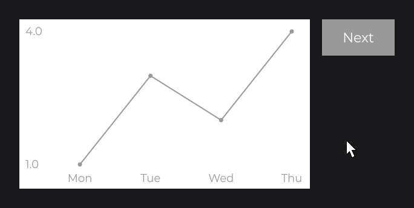

# ChartNode

`ChartNode` is the base of line, bar and area charts: an X axis of labels and named series of values. It stores the data and computes the scale; you subclass it and draw.

```java
public class LineChartNode extends ChartNode {

	private static final Color[] SERIES = {Color.decode("#999999"), Color.decode("#555555")};

	private final TextInfo info;

	protected LineChartNode(final double x, final double y, final double width, final double height, final TextInfo info) {
		super(x, y, width, height);
		this.info = info;
	}

	public static @NonNull LineChartNode create(final double x, final double y, final double width, final double height, final @NonNull TextInfo info) {
		return new LineChartNode(x, y, width, height, info);
	}

	@Override
	public void draw(final double mouseX, final double mouseY) {
		DrawUtils.SHAPE.drawRect(super.getX(), super.getY(), super.getWidth(), super.getHeight(), Color.WHITE);
		if (!super.isLoaded()) {
			return;
		}

		final double min = super.getMin().doubleValue();
		final double max = super.getMax().doubleValue();
		final double left = super.getX() + 100D;
		final double top = super.getY() + 20D;
		final double width = super.getWidth() - 130D;
		final double height = super.getHeight() - 60D;
		final double step = width / Math.max(1, super.getLabels().size() - 1);
		DrawUtils.TEXT.drawText(super.getX() + 10D, top, super.getYAxis().format(max), this.info, Align.START, Align.CENTER);
		DrawUtils.TEXT.drawText(super.getX() + 10D, top + height, super.getYAxis().format(min), this.info, Align.START, Align.CENTER);

		int index = 0;
		for (final String label : super.getLabels()) {
			DrawUtils.TEXT.drawText(left + step * index, top + height + 12D, label, this.info, Align.CENTER, Align.START);
			index++;
		}

		int series = 0;
		for (final ChartData data : super.getDataMap().values()) {
			final Color color = LineChartNode.SERIES[series % LineChartNode.SERIES.length];
			Vector2d last = null;
			double x = left;
			for (final String label : super.getLabels()) {
				final Number value = data.get(label);
				if (value != null) {
					final Vector2d point = new Vector2d(x, top + height * (1D - (value.doubleValue() - min) / (max - min)));
					if (last != null) {
						DrawUtils.SHAPE.drawLine(color, 2F, last, point);
					}
					DrawUtils.SHAPE.drawCircle(point.x, point.y, color, 4D);
					last = point;
				}
				x += step;
			}
			series++;
		}
	}

}
```

Create it with its axes and a series (`this.info` is a `TextInfo` built from a loaded font, see [Text and Fonts](../../concepts/text.md)):

```java
LineChartNode
.create(100, 100, 480, 280, this.info)
.xAxis(ChartAxis.x("day", "Mon", "Tue", "Wed", "Thu", "Fri"))
.yAxis(ChartAxis.y("visits"))
.data("Visits", ChartData.create().add("Mon", 2).add("Tue", 6).add("Wed", 4).add("Thu", 8).add("Fri", 7))
.attach(this);
```

 to getMax().")

A series may skip labels: `get(label)` then returns `null`.

## Several series with data

`data(name, series)` adds or replaces a series. The series keep their order, so `draw` can color each one; the scale covers them all.

```java
LineChartNode
.create(100, 100, 480, 280, this.info)
.xAxis(ChartAxis.x("day", "Mon", "Tue", "Wed", "Thu", "Fri"))
.yAxis(ChartAxis.y("count"))
.data("Visits", ChartData.create().add("Mon", 2).add("Tue", 6).add("Wed", 4).add("Thu", 8).add("Fri", 7))
.data("Orders", ChartData.create().add("Mon", 1).add("Tue", 2).add("Wed", 3).add("Thu", 3).add("Fri", 5))
.attach(this);
```

 to 8 (Visits).")

## Value labels with prefix and suffix

`getYAxis().format(value)` writes the value between the prefix and the suffix of the Y axis, for your `draw`.

```java
LineChartNode
.create(100, 100, 480, 280, this.info)
.xAxis(ChartAxis.x("month", "Jan", "Feb", "Mar", "Apr"))
.yAxis(ChartAxis.y("price").prefix("$").suffix(" k"))
.data("Price", ChartData.create().add("Jan", 10).add("Feb", 12.5D).add("Mar", 11).add("Apr", 15))
.attach(this);
```

 and format(min) drawn by LineChartNode.")

## Updating the data

The chart reads its series on every frame: call `data(...)` again, or edit a `ChartData`, and the next frame shows it.

```java
private int week;

@Override
public void init() {
	final LineChartNode chart = LineChartNode
			.create(100, 100, 480, 280, this.info)
			.xAxis(ChartAxis.x("day", "Mon", "Tue", "Wed", "Thu"))
			.yAxis(ChartAxis.y("value"))
			.data("Week", ChartData.create().add("Mon", 1).add("Tue", 3).add("Wed", 2).add("Thu", 4))
			.attach(this);

	RectNode
	.create(600, 100, 120, 60)
	.color(Color.decode("#999999"))
	.onClick((node, mouseX, mouseY, button) -> {
		this.week++;
		chart.data("Week", ChartData.create().add("Mon", 1 + this.week % 3).add("Tue", 3 - this.week % 3).add("Wed", 2 + this.week % 2).add("Thu", 4 - this.week % 4));
	})
	.body(rect -> {
		TextNode.create(60, 30).text(Text.create("Next", this.info)).anchor(Align.CENTER).attach(rect);
	})
	.attach(this);
}
```



`xAxis(...)` and `yAxis(...)` also take a `Supplier`, such as a `map(...)` of a [signal](../../concepts/state.md) that builds the axis with its series.

## Reference

| Method | Description |
|---|---|
| `xAxis(XChartAxis)`, `xAxis(Supplier)` | Sets the X axis (labels and series), or follows it. |
| `yAxis(YChartAxis)`, `yAxis(Supplier)` | Sets the Y axis, or follows it. |
| `data(String name, ChartData data)` | Adds or replaces a series. |
| `remove(String name)` | Removes a series. |
| `getYAxis()`, `getLabels()`, `getDataMap()` | Y axis, ordered labels, series by name. |
| `getMin()`, `getMax()`, `getAverage()`, and `(String)` overloads | Scale of all series, or of one. `getMax() - getMin()` is never `0`. |
| `isLoaded()` | `true` when mounted, both axes set, at least one series and none empty. |
| `ChartAxis.x(name, labels...)`, `ChartAxis.y(name)` | Creates an axis. |
| `YChartAxis.prefix(String)`, `suffix(String)`, `format(Number)` | Value labels: prefix + value + suffix. |
| `ChartData.create()`, `create(Map)` | Creates a series (the map is kept, not copied). |
| `ChartData.add(label, value)`, `remove(label)`, `get(label)` | Edits and reads a series. |

## Good to know

- Set the X axis before `data(...)` or `remove(...)`: both throw `IllegalStateException` without it. A new X axis drops the series of the previous one.
- The scale starts at the smallest value, not at `0`.

## See also

- Next: [RadarChartNode](radar-chart.md)
- [Custom Nodes](../custom-nodes.md)
- [Drawing](../../drawing/drawing.md)
- [Signals and State](../../concepts/state.md)