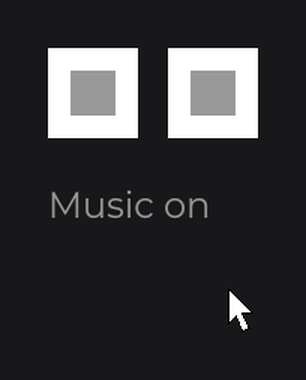

# CheckboxNode

`CheckboxNode` (`dev.joid.lib.ui.node.impl.structure.checkbox`) is a boolean control that flips between checked and unchecked on each click. It is abstract and draws nothing: you subclass it once with your own look, then use it like any node. For a two-state control that carries a value per side, see [ToggleNode](toggle.md).

The subclass below is the `SettingCheckboxNode` of [Input Controls](../../essentials/controls.md#controls-you-draw-yourself), with a free width and height and a dimmed look while disabled:

```java
public class SettingCheckboxNode extends CheckboxNode {

	private static final Color INK = Color.decode("#999999");

	protected SettingCheckboxNode(final double x, final double y, final double width, final double height) {
		super(x, y, width, height);
	}

	public static @NonNull SettingCheckboxNode create(final double x, final double y, final double width, final double height) {
		return new SettingCheckboxNode(x, y, width, height);
	}

	@Override
	public void draw(final double mouseX, final double mouseY) {
		final float alpha = super.isEnabled() ? 1F : 0.4F;
		DrawUtils.SHAPE.drawRect(super.getX(), super.getY(), super.getWidth(), super.getHeight(), Color.WHITE.copyAlpha(alpha));
		if (super.isChecked()) {
			DrawUtils.SHAPE.drawRect(super.getX() + super.dw(4), super.getY() + super.dh(4), super.dw(2), super.dh(2), SettingCheckboxNode.INK.copyAlpha(alpha));
		}
	}

}
```

Then, in `init()` of your UI:

```java
SettingCheckboxNode
.create(100, 100, 60, 60)
.onChange((node, checked) -> System.out.println("Music: " + checked))
.attach(this);
```

 shows the mark while isChecked() is true.")

`draw` reads `isChecked()` on every frame, so the mark follows the state with no extra code. The protected constructor and the static `create` factory follow the [custom node](../custom-nodes.md) contract; a [UI kit](../../components/ui-kit.md) usually holds one such class for the whole project.

## Clicking

- A press of any mouse button on the checkbox flips the state, then runs `onChange`. The press is consumed: the nodes under the checkbox do not receive it.
- Of two overlapping checkboxes, only the one in front flips.
- A disabled (`enabled(false)`) or hidden checkbox ignores presses. Draw the disabled look yourself from `isEnabled()`, as above.
- The checkbox reacts on press, not on release, and has no keyboard control.

## Initial state with checked

A new checkbox is unchecked. `checked(true)` sets the state from code:

```java
SettingCheckboxNode.create(100, 100, 60, 60).attach(this);

SettingCheckboxNode.create(200, 100, 60, 60).checked(true).attach(this);

SettingCheckboxNode.create(300, 100, 60, 60).checked(true).enabled(false).attach(this);
```

, and checked(true) with enabled(false).")

Call `checked(...)` before the setters inherited from `Node` (`enabled`, `x`, `width`...): a `Node` setter in the middle of a chain returns a `Node`, which has no `checked`. When the order cannot change, add a type witness: `.<SettingCheckboxNode>enabled(false).checked(true)`.

## Sharing the state with signal

`signal(Signal<Boolean>)` binds the checkbox to a [signal](../../concepts/signals.md) in both directions: the checkbox takes the value of the signal, and each click writes the new state into it. Every node that reads the signal follows:

```java
private final BooleanSignal music = BooleanSignal.of(true);

@Override
public void init() {
	SettingCheckboxNode.create(100, 100, 60, 60).signal(this.music).attach(this);

	SettingCheckboxNode.create(180, 100, 60, 60).signal(this.music).attach(this);

	TextNode.create(100, 190).text(Text.create(this.music.get() ? "Music on" : "Music off", this.info)).attach(this);
}
```



- The checkbox takes the value of the signal as soon as you bind it (a `null` value is ignored).
- A click writes the new state into the signal before the `onChange` callbacks run; `checked(...)` writes it too.
- A value set on the signal from anywhere else sets the state, and runs `onChange` when it changes, while the UI of the checkbox is open.
- A checkbox follows one signal at a time: calling `signal(...)` again unbinds the previous one.
- A checkbox that is not attached yet follows the signal once attached; a detached checkbox takes the current value of the signal when it is attached again.

`this.info` is a `TextInfo` built from a loaded font (see [Text](../../essentials/text.md)). `BooleanSignal` is in `dev.joid.lib.utils.signal.impl.primitive`.

## Following a value with checked

`checked(...)` also takes an expression that reads signals, a signal, a `map(...)` or a `Supplier<Boolean>`, like every node setter (see [Signals and Reactivity](../../concepts/signals.md)). The checkbox then follows that value in one direction only: a click changes the state, but never writes into the source.

```java
private final IntegerSignal volume = IntegerSignal.of(0);

SettingCheckboxNode.create(100, 100, 60, 60).checked(this.volume.get() > 0).attach(this);
```

Here the checkbox is checked again each time `volume` goes from `0` to a positive value. `checked(this.music)` follows `music` without writing it; `signal(this.music)` shares it both ways.

## Reacting with onChange

`onChange(NodeCheckboxChangeCallback<T>)` runs `(node, checked)` after each real change of the state, whatever its source: a click, `checked(...)`, a followed value or the bound signal. Setting the current state again runs nothing. `node.isChecked()` already returns the new state.


The callback has a `pre(...)` phase that runs before the change: cancel its context to keep the current state. A lambda only fills `apply`; to write `pre`, pass an anonymous class of the callback interface, whose `apply` holds what the lambda would do. A refused click is still consumed.

```java
SettingCheckboxNode
.create(100, 100, 60, 60)
.onChange(new NodeCheckboxChangeCallback<SettingCheckboxNode>() {

	@Override
	public void apply(final @NonNull SettingCheckboxNode node, final boolean checked) {
		System.out.println("Terms accepted");
	}

	@Override
	public void pre(final @NonNull SettingCheckboxNode node, final @NonNull InternalContext context, final boolean checked) {
		if (!checked) {
			context.cancel();
		}
	}

})
.attach(this);
```

Once checked, this checkbox stays checked. Several `onChange` callbacks run in the order you add them. The PRE/POST model is described in [Callbacks](../../interactions/callbacks.md).

## Reference

| Method | Description |
| --- | --- |
| `CheckboxNode(double x, double y, double width, double height)` | Protected constructor for your subclass. |
| `checked(boolean)`, `checked(Supplier<Boolean>)` | Sets the state, or follows a value one way. Default `false`. Runs `onChange` and writes the bound signal when the state changes. |
| `signal(Signal<Boolean>)` | Binds a signal both ways; replaces the previous binding. Throws `IllegalArgumentException` for a `ComputedSignal`. |
| `onChange(NodeCheckboxChangeCallback<T>)` | Adds a callback `(node, checked)` run after each change of the state. |
| `isChecked()` | Current state. |
| `getSignal()` | Bound signal, or `null`. |
| `getSubscription()` | Subscription of the bound signal, or `null`. |
| `mousePressed(double, double, ClickType, InternalContext)` | Flips the state on a press over the checkbox. Override it to change what a press does. |
| `CheckboxNode.CALLBACK_CHANGE` | Callback id of `onChange`. |

`NodeCheckboxChangeCallback<T extends CheckboxNode>` (`dev.joid.lib.ui.node.impl.structure.checkbox.callback`):

| Method | Description |
| --- | --- |
| `apply(T node, boolean checked)` | Runs after the change (the lambda of `onChange`). |
| `pre(T node, InternalContext context, boolean checked)` | Runs before the change; `context.cancel()` keeps the current state. |
| `post(T node, InternalContext context, boolean checked)` | Runs after the change and calls `apply`. |

The setters return the node itself, typed by the generic return of the fluent API. The rest of the API is inherited from `Node` (see [Node Fundamentals](../node-fundamentals.md)).

## Pitfalls

- `signal(...)` needs a writable signal. A `ComputedSignal` (`map(...)`, `Signal.from(...)`) throws `IllegalArgumentException("SettingCheckboxNode.signal(...) needs a writable signal: a ComputedSignal is read-only, pass it to a setter instead")`: pass it to `checked(...)` to follow it.
- A PRE that refuses a value coming from the bound signal keeps the checkbox on its state, but the signal keeps the new value: the two disagree until the next change. Refuse in PRE only what the user can do again.
- `onChange` registered after `checked(true)` in the chain does not run for that first value; registered before, it does.

## See also

- Next: [ToggleNode](toggle.md)
- [SwitchNode](switch.md)
- [Signals](../../state/signals.md)
- [Reactive Properties](../../state/reactive-properties.md)
- [Callbacks](../../interactions/callbacks.md)
- [Building a UI Kit](../../components/ui-kit.md)