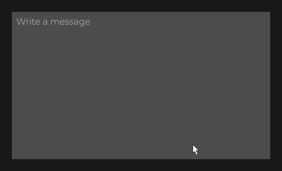

# MultilineTextFieldNode

`MultilineTextFieldNode` is an editable text area: the text wraps to the width of the field, Enter inserts line breaks and the content scrolls vertically. It shares the input model of [TextFieldNode](text-field.md): `accept`, `format`, `onChange`, focus, selection, clipboard and `signal(...)`.

In the examples, `this.info` is a `TextInfo` built from a loaded font (see [Text and Fonts](../../concepts/text.md)).

```java
private final IntegerSignal length = IntegerSignal.of(0);

@Override
public void init() {
	RectNode
	.create(610, 340, 700, 400)
	.color(Color.DARKGRAY)
	.body(rect -> {
		MultilineTextFieldNode
		.create(10, 10, 680, 380)
		.info(this.info)
		.placeholder("Write a message")
		.maxTextLength(500)
		.onChange((field, text, value, valid) -> this.length.set(text.length()))
		.attach(rect);
	})
	.attach(this);
}
```



`create(x, y, width, height)` is the only factory: the field never resizes to its text and draws no background. Subclass it and draw before `super.draw(mouseX, mouseY)` for a background, as shown for [TextFieldNode](text-field.md).

## Differences from TextFieldNode

| | `TextFieldNode` | `MultilineTextFieldNode` |
|---|---|---|
| Long text | Scrolls horizontally | Wraps, then scrolls vertically |
| Enter | Commits, leaves, calls `onEnter` | Inserts a line break |
| Up / Down | Steps a numeric value | Move between lines |
| Mouse wheel | Steps a numeric value | Scrolls one line per notch, then leaves the wheel to its parent |
| Triple click | Selects the whole text | Selects the line between two line breaks |
| Home / End | Start / end of the text | Start / end of the whole text |
| Callbacks | `onChange`, `onFocus`, `onEnter` | `onChange`, `onFocus` |
| Default margins | 2 left / right, 10 top / bottom | 2 on every side |

The text is committed when the field loses the focus: `format(...)` runs then, and `accept(...)` filters every keystroke.

```java
MultilineTextFieldNode
.create(40, 40, 600, 300)
.format(String::trim)
.info(this.info)
.maxTextLength(1000)
.accept(text -> !text.contains("\n\n"))
.attach(this);
```

## Binding a signal

`signal(Signal<String>)` keeps the text and a [signal](../../concepts/state.md) in sync, both ways:

```java
private final StringSignal message = StringSignal.of("Hello");

@Override
public void init() {
	MultilineTextFieldNode.create(40, 40, 600, 300).signal(this.message).info(this.info).attach(this);
}
```

## Markup in a text area

With `markup(true)`, the markups of the `TextInfo` apply: a style opened on a line continues on the next lines, and a line never breaks inside a tag.


## Reference

Every setter has a value overload and a `Supplier` overload, except `accept` and `format`.

| Method | Default | Description |
|---|---|---|
| `create(x, y, width, height)` | | Creates a text area of fixed size. |
| `info(TextInfo)` | none | Required style. |
| `text(String)`, `placeholder(String)` | `""` | Text, and hint shown while empty and unfocused. |
| `accept(Predicate<String>)`, `format(UnaryOperator<String>)` | all, identity | Keystroke filter; transformation at the commit. |
| `maxTextLength(int)` | `-1` | Length cap (`-1`: none). |
| `focused(boolean)`, `markup(boolean)` | `false` | Focus from code; markups of the `TextInfo`. |
| `margin(double)`, `cursorMargin(double)` | `2`, two lines | Inner padding; distance kept from the top while scrolling. |
| `signal(Signal<String>)` | | Two-way binding. |
| `onChange(...)`, `onFocus(...)` | | `(field, text, value, valid)`; `field` on focus changes. |
| `getText()`, `isFocused()`, `getYOffset()` | | Text, focus, vertical scroll offset. |

## Good to know

- Call `format(...)` before the shared field setters (`info`, `onChange`): those return a `FieldNode`.
- A focused field consumes every key: UI keybinds wait until it loses the focus.
- Only `\n` starts a line (`\r\n` is stored as `\n`); characters above U+0233 are dropped.

## See also

- Next: [SliderNode](slider.md)
- [TextFieldNode](text-field.md)
- [Input](../../concepts/input.md)
- [Signals and State](../../concepts/state.md)