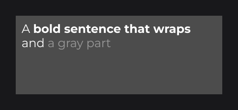

# MultilineTextFieldNode

`MultilineTextFieldNode` (`dev.joid.lib.ui.node.impl.design.textfield`) is an editable text area: the text wraps to the width of the field, Enter inserts line breaks, and the content scrolls vertically. It shares the input model of [`TextFieldNode`](text-field.md) (accept, format, `onChange`, commit, focus, selection, clipboard, `signal(...)`) through their common base, `FieldNode<String>`; this page details what differs.

In the examples, the code runs in `UI.init()` and `font` is an `IFont` you loaded (see [Text](../../essentials/text.md)).

## Creating a text area

The field has a fixed size and draws no background:

```java
RectNode
.create(610, 340, 700, 400)
.color(Color.DARKGRAY)
.body(background -> {
	MultilineTextFieldNode
	.create(10, 10, 680, 380)
	.info(TextInfo.create(font, 24F, Color.WHITE))
	.placeholder("Write a message")
	.maxTextLength(500)
	.onChange((field, text, value, valid) -> System.out.println("[Message] " + text.length() + " / 500"))
	.attach(background);
})
.attach(this);
```

.")

- `MultilineTextFieldNode.create(double x, double y, double width, double height)` is the only factory: the height is required and the field never resizes to its text.
- `info(TextInfo)` is required.
- To draw a background or a focus border, subclass it and draw before `super.draw(mouseX, mouseY)`, as shown for [`TextFieldNode`](text-field.md#styling-the-field).

## Differences from TextFieldNode

| | `TextFieldNode` | `MultilineTextFieldNode` |
| --- | --- | --- |
| Factories | With or without height | With height only |
| Long text | Scrolls horizontally | Wraps, then scrolls vertically |
| Enter / Numpad Enter | Commits, leaves, calls `onEnter` | Inserts a line break |
| Escape | Cancels the edit and leaves | Cancels the edit and leaves |
| Up / Down | Steps a numeric value | Move between lines |
| Mouse wheel | Steps a numeric value | Scrolls while the pointer is over it, then leaves the wheel to its parent at the top or bottom |
| Triple click | Selects the whole text | Selects the logical line (between two line breaks) |
| Alignment | `horizontalAlign`, `verticalAlign` | Always top-left |
| Callbacks | `onChange`, `onFocus`, `onEnter` | `onChange`, `onFocus` |
| Default margins | 2 left / right, 10 top / bottom | 2 on every side |
| `cursorMargin` | 15, kept from both edges | Two line heights, kept from the top edge |
| Line breaks in the text | Dropped | Kept, as `\n` |

The text is committed when the field loses the focus: `format(UnaryOperator<String>)` runs then (for example `format(String::trim)`), and `accept(...)` filters every keystroke as in a text field.

## Wrapping and line breaks

- The text is laid out between the four margins and clipped to them.
- A line wraps at the last space that fits; a word longer than the line is cut between two characters.
- Only `\n` starts a new line; `\r\n` and `\r` are stored as `\n`.
- Lines are one line height apart (the `TextInfo` line height).

## Markup in a text area

With `markup(true)` and a markup registered as shown in [Text](../../essentials/text.md), the text area keeps the styles across lines: a line never breaks inside a tag (a space inside `<c red>` is not a break point, a word too long is cut before the tag), and the style opened on a line continues on the next lines, wrapped or after a real line break. Tags take no width but keep their positions: the arrows cross them one character at a time, a click lands on the visible character, Up / Down keep the visible column. Typing just after an opening tag writes in its style, just before writes outside it; deleting a character of a tag breaks it and it shows as text.



## Keyboard and mouse

The shortcuts of [`TextFieldNode`](text-field.md#keyboard-shortcuts) apply, with these differences:

| Keys | Action |
| --- | --- |
| Enter / Numpad Enter | Inserts a line break. |
| Up / Down | Moves to the previous / next drawn line, at the nearest horizontal position; Shift extends the selection. |
| Home / End | Start / end of the whole text, not of the line. |
| Ctrl + arrows, Ctrl + Backspace / Delete | Words are separated by spaces and line breaks. |

- A press focuses the field and puts the cursor on the line under the pointer; above the first or below the last line picks that line. Double click selects a word, triple click the logical line, dragging extends by characters, words or lines.
- Each wheel notch over the field scrolls by one line height, focused or not, and consumes the wheel; at the top or bottom, or when the text fits, the field leaves the wheel to a [scrollable parent](../layout/overflow-and-scroll.md).
- When the cursor moves, the field scrolls to keep it visible. `getYOffset()` returns the vertical scroll offset.

## Binding a signal with signal

`signal(Signal<String>)` keeps the text and a [signal](../../concepts/signals.md) in sync, both ways, with the rules of [`TextFieldNode.signal(...)`](text-field.md#binding-a-signal-with-signal).

```java
private final Signal<String> notes = Signal.of("");

MultilineTextFieldNode.create(610, 340, 700, 400).info(TextInfo.create(font, 24F, Color.WHITE)).signal(this.notes).attach(this);
```

## Reference

| Method | Default | Description |
| --- | --- | --- |
| `MultilineTextFieldNode.create(double x, double y, double width, double height)` | | A text area of the given size. |
| `format(UnaryOperator<String>)` | identity | Transformation applied at the commit. |
| `text`, `placeholder`, `info`, `focused`, `accept`, `allowEmpty`, `maxTextLength`, `markup`, `cursorPosition`, `signal`, `onChange`, `onFocus` | | As in [`TextFieldNode`](text-field.md#shared-properties-fieldnode). |
| `margin(double)`, `marginTop`, `marginLeft`, `marginRight`, `marginBottom`, `marginVertical`, `marginHorizontal` | `2` | Padding. |
| `cursorMargin(double)` | `-1` (two line heights) | Distance kept between the top margin and the cursor line when scrolling up. |
| `getYOffset()` | | Vertical scroll offset. |

## Pitfalls

- There is no submit key: submit from a button, or read the text in `onFocus` when the field loses the focus.
- `maxTextLength` counts line breaks as characters.
- In a closeable UI, the first Escape leaves the field and the second closes the UI.

## See also

- Next: [SliderNode](slider.md)
- [TextFieldNode](text-field.md)
- [Markup and Text Effects](../../text/markup-and-effects.md)
- [Overflow and Scrolling](../layout/overflow-and-scroll.md)
- [Signals](../../state/signals.md)