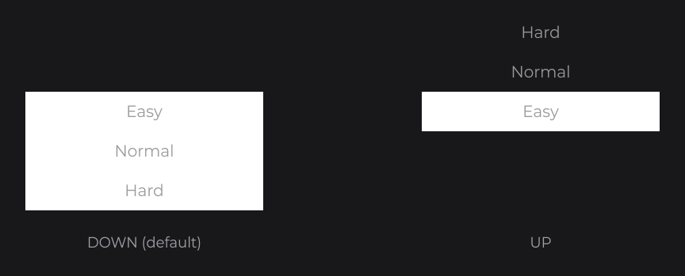

# SelectorNode

`SelectorNode<V>` is a dropdown that picks one value from a list: a click on the selected option opens the list, a click on another option selects it and closes the list. Your subclass builds the node of each option in `option(V)` and draws the background in `drawBackground`.

```java
public class DifficultySelectorNode extends SelectorNode<String> {

	private final TextInfo info;

	protected DifficultySelectorNode(final double x, final double y, final double width, final double height, final TextInfo info) {
		super(x, y, width, height);
		this.info = info;
	}

	public static @NonNull DifficultySelectorNode create(final double x, final double y, final double width, final double height, final @NonNull TextInfo info) {
		return new DifficultySelectorNode(x, y, width, height, info);
	}

	@Override
	protected Node option(final String value) {
		return TextNode.create(0, 0, super.getDefaultWidth(), super.getDefaultHeight()).text(Text.create(value, this.info, Align.CENTER, Align.CENTER));
	}

	@Override
	public void drawBackground(final double mouseX, final double mouseY) {
		DrawUtils.SHAPE.drawRect(super.getX(), super.getY(), super.getWidth(), super.getHeight(), Color.WHITE);
	}

}
```

Then use it (`this.info` is a `TextInfo` built from a loaded font, see [Text and Fonts](../../concepts/text.md)):

```java
DifficultySelectorNode.create(810, 400, 300, 50, this.info).values("Easy", "Easy", "Normal", "Hard").attach(this);
```


The value type is yours: a `String`, an enum, a `Color` whose options are colored rectangles. The width and height of the selector are the size of each option.

## Options with values

`values(V value, V... values)` removes the previous options, calls `option(...)` once per value in order, and selects `value`, which must be one of `values`. `value(V)` selects another option from code. Values are compared with `equals`.

## Opening direction with direction

The list opens below the selector by default (`SelectorDirection.DOWN`), and the selector grows to cover it, so `drawBackground` covers the open list too. With `SelectorDirection.UP` it opens above and keeps its height: give the options their own background. `active(true)` opens the list from code.

```java
DifficultySelectorNode.create(560, 500, 300, 50, this.info).values("Easy", "Easy", "Normal", "Hard").active(true).attach(this);

DifficultySelectorNode.create(1060, 500, 300, 50, this.info).values("Easy", "Easy", "Normal", "Hard").direction(SelectorDirection.UP).active(true).attach(this);
```



An option node can read `isActive()` and `isSelected(node)` of its selector to draw the open list or the selected option differently, as the selector of [Building a UI Kit](../../components/ui-kit.md) does.

## Binding a signal with signal

`signal(Signal<V>)` keeps the selection and a [signal](../../concepts/state.md) in sync both ways. Call it after `values(...)`: a value that is not an option is ignored.

```java
private final StringSignal difficulty = StringSignal.of("Normal");

@Override
public void init() {
	DifficultySelectorNode.create(810, 400, 300, 50, this.info).values("Normal", "Easy", "Normal", "Hard").signal(this.difficulty).attach(this);

	TextNode.create(810, 300).text(Text.create("Difficulty: " + this.difficulty.get(), this.info)).attach(this);
}
```

## Events with onChange

`onChange((selector, value) -> ...)` runs after each change of the selected value: a click on an option, `value(...)`, `values(...)` or the bound signal. Cancel the context in the `pre(...)` phase to keep the previous option and leave the list open, as shown for [CheckboxNode](checkbox.md).

```java
private final IntegerSignal level = IntegerSignal.of(1);

@Override
public void init() {
	DifficultySelectorNode
	.create(810, 400, 300, 50, this.info)
	.values("Normal", "Easy", "Normal", "Hard")
	.onChange((selector, value) -> this.level.set(Arrays.asList("Easy", "Normal", "Hard").indexOf(value)))
	.attach(this);
}
```

## Reference

| Method | Default | Description |
|---|---|---|
| `SelectorNode(x, y, width, height)` | | Protected constructor; the size of each option. |
| `option(V value)` | | Abstract: returns the node of one option. |
| `drawBackground(mouseX, mouseY)` | | Abstract: draws the background. |
| `values(V value, V... values)` | no option | Replaces the options and selects `value`. |
| `value(V)`, `value(Supplier<V>)` | | Selects an option; throws for an unknown value. |
| `direction(SelectorDirection)` | `DOWN` | Side the list opens to. |
| `active(boolean)` | `false` | Opens or closes the list. |
| `signal(Signal<V>)` | none | Two-way binding. |
| `onChange(NodeSelectorChangeCallback<T, V>)` | | `(selector, value)` after each change. |
| `getValue()`, `isActive()`, `isSelected(Node)` | | Selected value (`null` without option), open state, selected option. |

## Good to know

- Let `values(...)` create the options: a child attached by hand is removed and throws `IllegalStateException`.
- An option with its own `onClick` consumes the press, so the selector neither opens nor selects: react in `onChange`.
- Attach the selector after the nodes its open list overlaps, so the list draws above them and receives the press first.

## See also

- Next: [ReorderableFlexNode](../layout/reorderable-flex.md)
- [Building a UI Kit](../../components/ui-kit.md)
- [Input](../../concepts/input.md)
- [Signals and State](../../concepts/state.md)