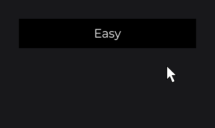

# SelectorNode

`SelectorNode<V>` (`dev.joid.lib.ui.node.impl.structure.selector`) is a dropdown that picks one value of type `V` from a list: it shows the selected option, a click opens the list of the others and a click on one selects it. It is abstract: your subclass builds the node of each option and draws the background; the selector creates, sizes and places the options and keeps the selected value.

## Creating a selector

A subclass implements `option(V value)`, which returns the node that shows one value, and `drawBackground(...)`:

```java
public class DifficultySelectorNode extends SelectorNode<String> {

    private final TextInfo info;

    protected DifficultySelectorNode(final double x, final double y, final double width, final double height, final TextInfo info) {
        super(x, y, width, height);
        this.info = info;
    }

    public static DifficultySelectorNode create(final double x, final double y, final double width, final double height, final TextInfo info) {
        return new DifficultySelectorNode(x, y, width, height, info);
    }

    @Override
    protected Node option(final String value) {
        return TextNode.create(0, 0, super.getDefaultWidth(), super.getDefaultHeight()).text(Text.create(value, this.info, Align.CENTER, Align.CENTER));
    }

    @Override
    public void drawBackground(final double mouseX, final double mouseY) {
        DrawUtils.SHAPE.drawRect(super.getX(), super.getY(), super.getWidth(), super.getHeight(), Color.BLACK);
    }

}
```

Then, in `UI.init()` (`font` is an `IFont` you loaded):

```java
DifficultySelectorNode
.create(810, 400, 300, 50, TextInfo.create(font, 20F, Color.WHITE))
.onChange((selector, difficulty) -> System.out.println("Difficulty: " + difficulty))
.values("Easy", "Easy", "Normal", "Hard")
.attach(this);
```



- `values("Easy", "Easy", "Normal", "Hard")` creates the options "Easy", "Normal" and "Hard" and selects "Easy", its first argument.
- A click on "Easy" opens the list below; a click on "Hard" selects it, calls `onChange` with `"Hard"` and closes the list.

The value type is yours: a `String`, an enum, a `Color` (the demo `UIDemoSelector` uses a `SelectorNode<Color>` whose options are colored rectangles). `option(...)` decides how a value looks.

See [Custom Nodes](../custom-nodes.md) for the constructor and factory contract.

## Options with values

`values(V value, V... values)` replaces the options:

1. it removes every child of the selector;
2. it calls `option(...)` once per value, in order, and appends each returned node as an option;
3. it selects `value`, which must be one of `values`.

| Method | Effect |
| --- | --- |
| `values(V value, V... values)` | Creates one option per value and selects `value`. Calling it again replaces all the options. |
| `value(V value)` | Selects the option of this value. Throws an `IllegalArgumentException` when no option has this value. |
| `getValue()` | `Optional<V>` of the selected value, empty while the selector has no option. |

- Values are compared with `equals`. Give each option a distinct value: `value(...)` selects the first option equal to the value.
- `values(...)` and `value(...)` write the selected value into the signal, without calling `onChange`.
- `values(...)` checks the selected value last: with a value that is not in the list, it creates the options, then throws an `IllegalArgumentException`.

> WARNING: Let `values(...)` create the options. A child that you attach yourself is laid out as an option but has no value: selecting it gives `onChange` a `null` value and leaves `getValue()` empty.

## Binding a signal with signal

`signal(Signal<V>)` keeps the selector and a [signal](../../state/signals.md) in sync, both ways:

- the selector starts on the signal's value, when the signal holds one of the options;
- each value the user picks is written into the signal;
- each value the signal publishes later selects its option, without calling `onChange`. A value that is not an option is ignored.

```java
private final StringSignal difficulty = new StringSignal("Normal");
```

```java
DifficultySelectorNode
.create(810, 400, 300, 50, TextInfo.create(font, 20F, Color.WHITE))
.values(this.difficulty.getOrDefault(), "Easy", "Normal", "Hard")
.signal(this.difficulty)
.attach(this);
```

- Call `signal(...)` after `values(...)`: the signal's value is applied once, when you bind it, and it can only select an existing option.
- The selector follows the signal while its UI is open.
- Any other node can [watch](../../state/watch.md) the same signal to follow the selection.

## Options and layout

On each frame, the selector lays its options out:

- every option gets `x = 0`, the selector's initial width and its initial height (the values given to the constructor);
- the selected option sits at `y = 0`;
- the other options are stacked one initial height apart, below (`SelectorDirection.DOWN`, the default) or above (`SelectorDirection.UP`), in their order;
- their visibility becomes "visible while the list is open, or when selected", replacing any `visible(...)` rule you gave them.

The selector's own height follows: with `DOWN` it grows to cover the open list (so `drawBackground` covers it too) and goes back to the initial height when closed; with `UP` it keeps the initial height and the list opens outside it.

`drawBackground(double mouseX, double mouseY)` is abstract and called on each draw, after the layout. The selector draws nothing and lays nothing out while it has no option. An option node can read `isActive()` and `isSelected(this)` of its selector to draw the open list or the selected option differently, as the selector of the [UI kit](../../components/ui-kit.md#selector) does.

## Clicking

| Event | Effect |
| --- | --- |
| Closed, press on the selected option | Opens the list. The press is consumed. |
| Closed, press elsewhere | Nothing. |
| Open, press on another option | Selects it, writes the signal, calls `onChange`, closes the list. The press is consumed. |
| Open, press on the selected option or outside the options | Closes the list without consuming the press. |

- Any mouse button works. There is no keyboard control.
- The selector ignores presses while it has no option.

> WARNING: The options receive the press before the selector. An option with its own click callback (`onClick`) consumes the press, and the selector then neither opens nor selects. Leave the options without click callbacks and react in `onChange`.

> TIP: The open list is drawn with the selector, so attach the selector after the nodes the list overlaps (or give it a higher z-index): it then draws above them and receives the press first.

## onChange

`onChange(NodeSelectorChangeCallback<T, V>)` takes `(node, value)`, where `value` is the newly selected value; `node.getValue()` already returns it and the signal already holds it. It runs only for a selection made with the mouse. Cancelling the context in the `pre(...)` phase keeps the previous option selected, leaves the list open and does not write the signal (see [Callbacks](../../interactions/callbacks.md)). The callback interface is in `dev.joid.lib.ui.node.impl.structure.selector.callback`.

## Reference

### SelectorNode

| Method | Default | Description |
| --- | --- | --- |
| `SelectorNode(double x, double y, double width, double height)` | | Protected constructor. The width and height are the size of each option. |
| `option(V value)` | | Abstract, protected. Returns the node of one option. |
| `drawBackground(double mouseX, double mouseY)` | | Abstract. Draws the background. |
| `values(V value, V... values)` | no option | Replaces the options and selects `value`. |
| `value(V value)` | | Selects the option of this value. |
| `signal(Signal<V>)` | none | Binds a signal both ways. |
| `direction(SelectorDirection)` | `DOWN` | Side the list opens to. |
| `active(boolean)` | `false` | Opens or closes the list. |
| `onChange(NodeSelectorChangeCallback<T, V>)` | | Adds a callback `(node, value)` run after each selection with the mouse. |
| `getValue()` | | `Optional<V>` of the selected value. |
| `getSelected()` | | Node of the selected option, `null` while there is no option. |
| `isSelected(Node)` | | Whether the node is the selected option. |
| `isActive()` | | Whether the list is open. |
| `getDirection()` | | Opening direction. |
| `getSignal()` | | Bound signal, or `null`. |
| `getOptionMap()` | | Option nodes mapped to their values, in order. Read it only. |
| `SelectorNode.CALLBACK_CHANGE` | | Callback id of `onChange`. |

`draw` and `mousePressed` are final. Every setter returns the node itself, typed by the generic return of the fluent API.

### SelectorDirection

`SelectorNode.SelectorDirection` is a nested enum.

| Constant / method | Description |
| --- | --- |
| `UP` | The list opens above the selector. |
| `DOWN` | The list opens below the selector. |
| `isDown()` | `true` for `DOWN`. |

## See also

- [SwitchNode](switch.md)
- [SliderNode](slider.md)
- [Signals](../../state/signals.md)
- [Callbacks](../../interactions/callbacks.md)
- [Custom Nodes](../custom-nodes.md)
- [Building a UI Kit](../../components/ui-kit.md)