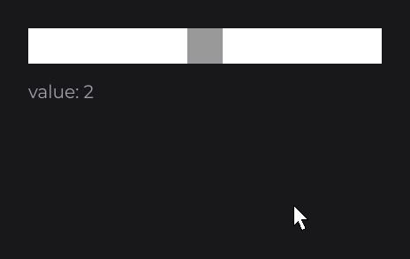

# SliderNode

`SliderNode<O>` picks one value out of an ordered set by dragging a thumb along a track: volume, zoom, quality settings. It owns the values, the drag and the binding, and draws nothing: you subclass `IntegerSliderNode`, `DoubleSliderNode` or `StringSliderNode`, draw the track and install a `SliderThumbNode`.

```java
public class VolumeSliderNode extends IntegerSliderNode {

	protected VolumeSliderNode(final double x, final double y, final double width, final double height) {
		super(x, y, width, height);
		super.thumb(new Thumb(height, height));
	}

	public static @NonNull VolumeSliderNode create(final double x, final double y, final double width, final double height) {
		return new VolumeSliderNode(x, y, width, height);
	}

	@Override
	public void drawSlider(final double mouseX, final double mouseY) {
		DrawUtils.SHAPE.drawRect(super.getX(), super.getY() + super.dh(2D) - 2D, super.getWidth(), 4D, Color.DARKGRAY);
		DrawUtils.SHAPE.drawRect(super.getX(), super.getY() + super.dh(2D) - 2D, super.getWidth() * super.getProgress(), 4D, Color.LIGHTGRAY);
	}

	private static final class Thumb extends SliderThumbNode {

		private Thumb(final double width, final double height) {
			super(width, height);
		}

		@Override
		public void drawThumb(final double mouseX, final double mouseY) {
			DrawUtils.SHAPE.drawRect(super.getX(), super.getY(), super.getWidth(), super.getHeight(), Color.WHITE);
		}

	}

}
```

Then use it:

```java
private final IntegerSignal volume = IntegerSignal.of(50);

@Override
public void init() {
	VolumeSliderNode.create(760, 520, 400, 24).values(0, 100, 50).signal(this.volume).attach(this);
}
```


`getProgress()` is the position of the thumb on its travel, from `0F` to `1F`: draw a filled track with it. The values are evenly spaced along the track.

## Values with values

| Class | Method | Values |
|---|---|---|
| `IntegerSliderNode` | `values(int min, int max, int value)`, `values(int value, Integer... values)` | Every integer from `min` to `max`, or the listed ones. |
| `DoubleSliderNode` | `values(double min, double max, double step, double value)`, `values(double value, Double... values)` | `min`, `min + step`, ... up to `max`, or the listed ones. |
| `StringSliderNode` | `values(String value, String... values)`, `values(Enum<?> value, Enum<?>... values)` | The strings or enum names, in order. |
| `SliderNode<O>` | `valueSet(Set<O> set, O value)` | Any set, in iteration order. |

The first or last argument is the selected value; it must be one of the values, or an `IllegalArgumentException` is thrown. `value(O)` selects another value from code and moves the thumb.

## Dragging and snapping

A press anywhere on the slider moves the thumb under the pointer and starts dragging. On release, the thumb snaps onto the exact position of the value under it.



## Binding a signal with signal

`signal(Signal<O>)` keeps the value and a [signal](../../concepts/state.md) in sync both ways: the slider starts on the signal's value, writes each selected value into it, and moves its thumb when other code sets it. `value(this.level.get())` follows a signal one way only.

## Events with onChange

`onChange((slider, value) -> ...)` runs after each change of the value, at most once per frame while dragging, and when `value(...)` or the bound signal change it.

```java
private final BooleanSignal muted = BooleanSignal.of(false);

@Override
public void init() {
	VolumeSliderNode
	.create(760, 600, 400, 24)
	.values(0, 100, 50)
	.onChange((slider, value) -> this.muted.set(value == 0))
	.attach(this);
}
```

## Reference

| Method | Description |
|---|---|
| `values(...)`, `valueSet(Set<O>, O)` | Sets the values and the selected value (see above). |
| `value(O)`, `value(Supplier<O>)` | Selects a value, or follows one. |
| `signal(Signal<O>)` | Two-way binding. |
| `onChange(NodeSliderChangeCallback<T, O>)` | `(slider, value)` after each change. |
| `thumb(SliderThumbNode)` | Installs the thumb. Required. |
| `drawSlider(mouseX, mouseY)` | Abstract: draws the track. |
| `getValue()`, `getProgress()`, `getThumb()` | Selected value, thumb position from `0F` to `1F`, thumb. |
| `SliderThumbNode(width, height)` | Protected constructor; the slider centers the thumb vertically. |
| `SliderThumbNode.drawThumb(mouseX, mouseY)` | Abstract: draws the thumb. It counts as hovered during the whole drag. |

## Good to know

- An argument count that matches a range overload picks the range: `IntegerSliderNode.values(2, 1, 2)` is the range from 2 to 1. Pass an array for a list: `values(2, new Integer[] { 1, 2 })`.
- Call `values(...)` before `signal(...)`, and both before a `Node` setter in a chain.
- `signal(...)` needs a writable signal: pass a `map(...)` to `value(...)` instead.

## See also

- Next: [CheckboxNode](checkbox.md)
- [Building a UI Kit](../../components/ui-kit.md)
- [Signals and State](../../concepts/state.md)
- [ProgressNode](../visual/progress.md)