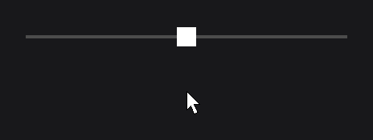

# SliderNode

`SliderNode<O>` (`dev.joid.lib.ui.node.impl.structure.slider`) picks one value from an ordered set of values by dragging a cursor along a track. It is abstract: you draw the track in a subclass and give it a `SliderCursorNode` that draws the cursor. `IntegerSliderNode`, `DoubleSliderNode` and `StringSliderNode` (`dev.joid.lib.ui.node.impl.structure.slider.impl`) add helpers to build the values.

## Creating a slider

A slider class draws the track and installs its cursor:

```java
public class VolumeSliderNode extends IntegerSliderNode {

    protected VolumeSliderNode(final double x, final double y, final double width, final double height) {
        super(x, y, width, height);
        super.cursor(new Thumb(height, height));
    }

    public static VolumeSliderNode create(final double x, final double y, final double width, final double height) {
        return new VolumeSliderNode(x, y, width, height);
    }

    @Override
    public void drawSlider(final double mouseX, final double mouseY) {
        DrawUtils.SHAPE.drawRect(super.getX(), super.getY() + super.getHeight() / 2D - 2D, super.getWidth(), 4D, Color.DARKGRAY);
    }

    private static final class Thumb extends SliderCursorNode {

        private Thumb(final double width, final double height) {
            super(width, height);
        }

        @Override
        public void drawCursor(final double mouseX, final double mouseY) {
            DrawUtils.SHAPE.drawRect(super.getX(), super.getY(), super.getWidth(), super.getHeight(), Color.WHITE);
        }

    }

}
```

Then, in `UI.init()`:

```java
final IntegerSignal volume = new IntegerSignal(50);

VolumeSliderNode
.create(760, 520, 400, 24)
.values(0, 100, 50)
.signal(volume)
.onChange((slider, value) -> System.out.println("Volume: " + value))
.attach(this);
```



- `values(0, 100, 50)` creates the values 0 to 100 and selects 50.
- Dragging the cursor changes the value; `volume` is updated and `onChange` receives each new value.
- `signal(volume)` binds the slider both ways: setting `volume` moves the cursor.
- `getValue()` returns the current value.

See [Custom Nodes](../custom-nodes.md) for the constructor and factory contract.

## Values and steps

The slider holds a `Set<O>` of values. Their iteration order is their order on the track, and they are evenly spaced by index: with `n` values, value `i` sits at `i / (n - 1)` of the cursor travel (the slider width minus the cursor width), whatever the numbers are. A single value sits at the start of the track.

| Class | Method | Values |
| --- | --- | --- |
| `IntegerSliderNode` | `values(int min, int max, int value)` | Every integer from `min` to `max`, both included. |
| `IntegerSliderNode` | `values(int value, Integer... values)` | The given integers, in this order. |
| `DoubleSliderNode` | `values(double min, double max, double step, double value)` | `min`, `min + step`, ... up to `max` included when a step lands on it. Steps are added in decimal (`BigDecimal`), so `values(0D, 1D, 0.1D, 0.5D)` holds exactly `0.0, 0.1, ..., 1.0`. |
| `DoubleSliderNode` | `values(double value, Double... values)` | The given doubles, in this order. |
| `StringSliderNode` | `values(String value, String... values)` | The given strings, in this order. |
| `StringSliderNode` | `values(Enum<?> value, Enum<?>... values)` | The `name()` of each constant; the slider value is the name (a `String`). |
| `SliderNode<O>` | `valueSet(Set<O> valueSet, O value)` | The given set, in its iteration order: use a `LinkedHashSet` (or a sorted set) to control the order. |

- In every method, `value` is the selected value. It must belong to the values, otherwise the method throws an `IllegalArgumentException`.
- Duplicates are kept once, at their first position.

```java
QualitySliderNode
.create(760, 600, 400, 24)
.values(Quality.HIGH, Quality.values())
.onChange((slider, value) -> System.out.println("Quality: " + Quality.valueOf(value)))
.attach(this);
```

Here `QualitySliderNode` extends `StringSliderNode` and `Quality` is an enum.

> WARNING: Java picks the range overload when the argument count matches it. `IntegerSliderNode.values(2, 1, 2)` is the range from 2 to 1 (empty, so it throws), not "2 among 1 and 2"; `DoubleSliderNode.values(0.5D, 0D, 0.5D, 1D)` is the range from 0.5 to 0 with step 0.5. For a list of exactly two integers or three doubles, pass an array: `values(2, new Integer[] { 1, 2 })`, `values(0.5D, new Double[] { 0D, 0.5D, 1D })`.

Set the values before the slider is shown. If you replace them later, call `value(...)` right after so that the cursor moves to the selected value; otherwise the next frame selects the value under the current cursor position.

## The cursor with SliderCursorNode

`SliderCursorNode` (same package) is the draggable part. Subclass it, implement `drawCursor(double mouseX, double mouseY)` and pass an instance to `cursor(SliderCursorNode)`.

- The constructor `SliderCursorNode(double width, double height)` places the cursor at the start of the slider. The slider drives its position: it centers the cursor vertically on each frame (a 16-unit cursor in a 24-unit-high slider sits at `y = 4`) and moves it along the track.
- `cursor(...)` attaches the cursor as a child of the slider and links it to the slider; a second call replaces the previous cursor.
- `draw`, `mousePressed` and `mouseReleased` of the cursor are final: it only lets you draw.
- The cursor counts as hovered during the whole drag, even when the pointer leaves it: `isHovered(...)` returns `true` and `hoverValue(...)` stays at its end value, so a hover effect drawn in `drawCursor` does not flicker while dragging.

## Dragging

| Event | Effect |
| --- | --- |
| Press on the slider (any mouse button) | The cursor jumps so that its center is under the pointer and starts dragging. The press is consumed. |
| Press on the cursor | The cursor starts dragging. |
| Each frame while dragging | The cursor center follows the pointer horizontally, kept on the track (from `0` to the slider width minus the cursor width). |
| Release of any mouse button, anywhere | The cursor stops dragging and stays where it is. |

- The cursor does not snap to the position of its value when released: the value is the one nearest to the cursor, but the cursor keeps the released position. `value(...)` puts it back on the exact position.
- There is no keyboard or mouse wheel control.
- The slider and its cursor ignore a press that another node already consumed, such as a node with an `onClick` drawn over the slider. A node over the slider that does not consume presses (a plain panel, for example) lets them through: hide the slider while something covers it, a hidden slider and its cursor ignore presses. Disabling only the slider is not enough, as the cursor keeps its own enabled state.
- `getCursor().isDragging()` tells whether a drag is running; `getCursor().dragging(boolean)` starts or stops one from code.

## Reading and setting the value

- `getValue()` returns the selected value.
- `getProgress()` returns the position of the cursor on its travel, from `0F` (start of the track) to `1F` (end), `0F` without cursor. Draw a filled track with it: `super.getWidth() * super.getProgress()`.
- `value(O value)` selects a value from code. Once the slider is attached to a UI, it also moves the cursor to the value position; before that, the cursor is placed when the slider loads. It writes the signal, like `valueSet(...)`, and calls `onChange` when the value changes. It throws an `IllegalArgumentException` when the value is not one of the values.

## Binding a signal with signal

`signal(Signal<O>)` keeps the slider and a [signal](../../state/signals.md) in sync, both ways:

- The slider starts on the signal's value, when it is one of the values.
- Each value the user selects is written into the signal, before `onChange` runs.
- Each value the signal publishes later goes through `value(...)`: the cursor moves to it and `onChange` runs when it changes, while the slider's UI is open. A value outside the values is ignored.
- Call `signal(...)` after `values(...)` or `valueSet(...)`: the signal's value is applied once, when you bind it, and only an existing value can be selected.
- The slider follows one signal at a time: calling `signal(...)` again unbinds the previous signal, which no longer moves the cursor nor receives the selected values.

## onChange

`onChange(NodeSliderChangeCallback<T, O>)` takes `(node, value)`. The slider compares, on each of its draws, the value under the cursor with `getValue()`; when they differ it stores the new value, sets the signal, then calls the callbacks. As a result:

- The callback runs during the frame, at most once per frame. A fast drag can jump over values: you receive the value under the cursor at each frame, not every value in between.
- `value(...)`, `valueSet(...)` and the bound signal call it too, outside of `draw`, when they change the value.
- Cancelling the context in the `pre(...)` phase keeps the previous value: the slider stops the drag and puts the cursor back on the position of the current value, so the refused change is proposed once (see [Callbacks](../../interactions/callbacks.md)).

## Reference

### SliderNode

| Method | Description |
| --- | --- |
| `valueSet(Set<O> valueSet, O value)` | Sets the values (in iteration order) and the selected value. |
| `value(O value)` | Selects a value and moves the cursor to it when the slider is shown. |
| `signal(Signal<O> signal)` | Binds a signal to the value, both ways. Default: none. |
| `cursor(SliderCursorNode cursor)` | Attaches the cursor, replacing the previous one. Required. |
| `onChange(NodeSliderChangeCallback<T, O> callback)` | Adds a callback `(node, value)` run after each user change. |
| `drawSlider(double mouseX, double mouseY)` | Abstract. Draws the track. Called from the slider's `draw` (final), only once the slider has a value and a cursor. |
| `init(UI ui)` | Places the cursor on the selected value. If you override it, call `super.init(ui)`. |
| `getValue()` | Selected value, `null` until values are set. |
| `getProgress()` | Position of the cursor on its travel, from `0F` to `1F`. |
| `getValueSet()` | Values. |
| `getSignal()` | Signal, or `null`. |
| `getCursor()` | Cursor, or `null`. |
| `SliderNode.CALLBACK_CHANGE` | Callback id of `onChange`. |

Every setter returns the node itself, typed by the generic return of the fluent API.

### Typed sliders

| Class | Value type | Methods |
| --- | --- | --- |
| `IntegerSliderNode` | `Integer` | `values(int min, int max, int value)`, `values(int value, Integer... values)` |
| `DoubleSliderNode` | `Double` | `values(double min, double max, double step, double value)`, `values(double value, Double... values)` |
| `StringSliderNode` | `String` | `values(String value, String... values)`, `values(Enum<?> value, Enum<?>... values)` |

All three are abstract, with a protected constructor `(double x, double y, double width, double height)`, and leave `drawSlider` to you.

### SliderCursorNode

| Method | Description |
| --- | --- |
| `SliderCursorNode(double width, double height)` | Protected constructor; the slider centers the cursor vertically. |
| `drawCursor(double mouseX, double mouseY)` | Abstract. Draws the cursor. |
| `dragging(boolean)` | Starts or stops following the pointer. |
| `isDragging()` | Whether the cursor follows the pointer. |
| `isHovered(double mouseX, double mouseY, boolean checkEnabled)` | `true` during a drag, otherwise the usual hover test. |
| `slider(SliderNode<?>)` | Links the cursor to its slider; `SliderNode.cursor(...)` calls it for you. |
| `getSlider()` | The slider, or `null` before `cursor(...)`. |

## See also

- [Signals](../../state/signals.md)
- [Callbacks](../../interactions/callbacks.md)
- [Custom Nodes](../custom-nodes.md)
- [ProgressNode](../visual/progress.md)