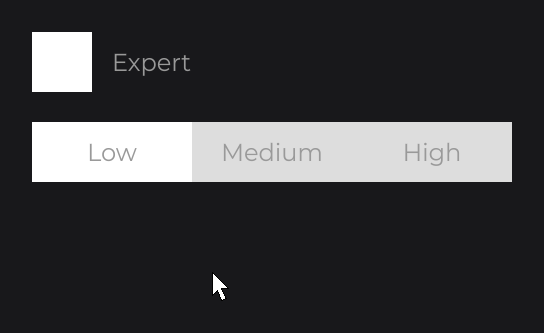
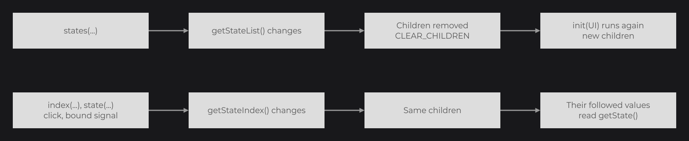
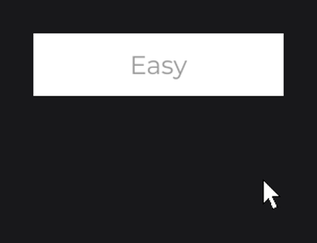

# SwitchNode

`SwitchNode` (`dev.joid.lib.ui.node.impl.structure.sw`) holds an ordered list of named states and the current one. It is abstract and has no input of its own: your subclass builds its children (segments, arrows, labels) in `init(UI)`, and these children select a state when clicked. Use it for segmented controls and "previous / next" pickers.

```java
public class SegmentedSwitchNode extends SwitchNode {

	private static final Color PLACEHOLDER = Color.decode("#DDDDDD");

	private final TextInfo info;

	protected SegmentedSwitchNode(final double x, final double y, final double width, final double height, final TextInfo info) {
		super(x, y, width, height);
		this.info = info;
	}

	public static @NonNull SegmentedSwitchNode create(final double x, final double y, final double width, final double height, final @NonNull TextInfo info) {
		return new SegmentedSwitchNode(x, y, width, height, info);
	}

	@Override
	public void init(final @NonNull UI ui) {
		final double stateWidth = super.getWidth() / super.getStateList().size();
		FlexNode
		.horizontal(0, 0, super.getHeight())
		.body(flex -> {
			for (final String state : super.getStateList().get()) {
				RectNode
				.create(0, 0, stateWidth, super.getHeight())
				.color(Signal.from(() -> super.getState().equals(state) ? Color.WHITE : SegmentedSwitchNode.PLACEHOLDER))
				.body(rect -> {
					TextNode.create(0, 0, stateWidth, super.getHeight()).text(Text.create(state, this.info, Align.CENTER, Align.CENTER)).attach(rect);
				})
				.onClick((node, mouseX, mouseY, clickType) -> super.state(state))
				.attach(flex);
			}
		})
		.attach(this);
	}

}
```

Then, in `init()` of your UI (`this.info` is a `TextInfo` built from a loaded font, see [Text and TextInfo](../../text/text-and-textinfo.md)):

```java
SegmentedSwitchNode
.create(100, 100, 480, 60, this.info)
.states("Low", "Medium", "High")
.onChange((node, state) -> System.out.println("Preset: " + state))
.attach(this);
```

 on the switch; the segment of the current state turns white.")

Each segment selects its state with `super.state(state)` and picks its color from `getState()`. `getState()` reads the signals of the switch, so `Signal.from(() -> ...)` follows it and recolors the segments when the state changes. A native expression (`color(super.getState().equals(state) ? ... : ...)`) would stay fixed here: the loop variable `state` decides the condition (see [Reactive Properties](../../state/reactive-properties.md)).

## Defining the states with states

`states(String...)` sets the list of states; the first one becomes current. The switch keeps its own copy of the names.

- The list cannot be empty: `states()` throws `IllegalArgumentException("The state list is empty")`.
- `onChange` runs when the name of the current state changes (from no state, or from another name).
- A different list rebuilds the children (see [Building the children in init](#building-the-children-in-init)); a list equal to the current one keeps them, and the switch still goes back to its first state.

`states(Supplier<List<String>>)` follows a list that changes, here with a [signal](../../state/signals.md):

```java
private final BooleanSignal expert = BooleanSignal.of(false);

@Override
public void init() {
	SettingCheckboxNode.create(100, 100, 60, 60).signal(this.expert).attach(this);

	SegmentedSwitchNode
	.create(100, 190, 480, 60, this.info)
	.states(this.expert.map(expert -> expert ? Arrays.asList("Low", "Medium", "High", "Ultra") : Arrays.asList("Low", "Medium", "High")))
	.attach(this);
}
```



`SettingCheckboxNode` is the subclass written in [CheckboxNode](checkbox.md).

## Selecting a state with index and state

| Method | Selects |
| --- | --- |
| `index(int)`, `index(Supplier<Integer>)` | The state at that position, from `0`. |
| `state(String)`, `state(Supplier<String>)` | The state of that name. |

```java
SegmentedSwitchNode.create(100, 100, 480, 60, this.info).states("Low", "Medium", "High").index(2).attach(this);

SegmentedSwitchNode.create(100, 100, 480, 60, this.info).states("Low", "Medium", "High").state("Medium").attach(this);
```

- Call `states(...)` first: `index(...)` and `state(...)` select among the current states.
- An index out of the list throws `IllegalArgumentException("The index 3 is out of the state list [Low, Medium, High]")`; an unknown name throws `IllegalArgumentException("The state Ultra is not in the state list [Low, Medium, High]")`.
- Selecting the current state again runs nothing.

Like every node setter, both take an expression that reads signals, a signal or a `Supplier`, and follow it in one direction: `index(this.level.get())` selects the state of `level` each time it changes. When a followed value becomes invalid later, JOID prints `[JOID] The index of SegmentedSwitchNode cannot take its new value: <exception>` with the stack trace, and the switch keeps its state.

## Sharing the state with signal

`signal(Signal<String>)` binds the name of the current state to a signal in both directions:

```java
private final StringSignal preset = StringSignal.of("High");

@Override
public void init() {
	SegmentedSwitchNode.create(100, 100, 480, 60, this.info).states("Low", "Medium", "High").signal(this.preset).attach(this);

	SegmentedSwitchNode.create(100, 180, 480, 60, this.info).states("Low", "Medium", "High").signal(this.preset).attach(this);

	TextNode.create(100, 270).text(Text.create("Preset: " + this.preset.get(), this.info)).attach(this);
}
```

- Call `signal(...)` after `states(...)`: the switch selects the value of the signal as soon as you bind it, and only a name of its states can be selected. A name that is not one of the states is ignored.
- Each change of state writes the new name into the signal before the `onChange` callbacks run.
- A value set on the signal from anywhere else selects that state, and runs `onChange` when it changes, while the UI of the switch is open.
- A switch follows one signal at a time: calling `signal(...)` again unbinds the previous one. A `ComputedSignal` throws `IllegalArgumentException`: pass it to `state(...)` to follow it.

## Reacting with onChange

`onChange(NodeSwitchChangeCallback<T>)` runs `(node, state)` after each change of the current state, whatever its source: a click, a setter, a followed value or the bound signal. `state` is the name of the new state. The change follows the same steps as the other controls:


Cancel the context in the `pre(...)` phase to keep the current state:

```java
SegmentedSwitchNode
.create(100, 100, 480, 60, this.info)
.states("Low", "Medium", "High")
.onChange(new NodeSwitchChangeCallback<SegmentedSwitchNode>() {

	@Override
	public void apply(final @NonNull SegmentedSwitchNode node, final @NonNull String state) {
		System.out.println("Preset: " + state);
	}

	@Override
	public void pre(final @NonNull SegmentedSwitchNode node, final @NonNull InternalContext context, final @NonNull String state) {
		if ("High".equals(state)) {
			context.cancel();
		}
	}

})
.attach(this);
```

A click on "High" changes nothing. Several `onChange` callbacks run in the order you add them (see [Callbacks](../../interactions/callbacks.md)).

## Building the children in init

The switch builds its children through your `init(UI)`, once when it loads. It then [watches](../../state/watch.md) its list of states with `WatchProperty.CLEAR_CHILDREN` and `init(UI)`: each time the list changes, every child is removed and `init(UI)` runs again for the new states. A change of the current state rebuilds nothing.



- Build the children in `init(UI)`, from `getStateList()`.
- Have them follow the current state: `Signal.from(() -> ... super.getState() ...)`, a lambda read on every frame, or a `draw` that reads `getState()`. A value read once in `init(UI)` stays fixed.
- The children stay the same nodes while the state changes: they keep their hover and their animations.
- Children added with `body(...)` on the switch are removed at the first change of the list and do not come back.

A picker that shows only the current state and goes to the next one on each click:

```java
@Override
public void init(final @NonNull UI ui) {
	RectNode
	.create(0, 0, super.getWidth(), super.getHeight())
	.color(Color.WHITE)
	.body(rect -> {
		TextNode.create(0, 0, super.getWidth(), super.getHeight()).text(Signal.from(() -> Text.create(super.getState(), this.info, Align.CENTER, Align.CENTER))).attach(rect);
	})
	.onClick((node, mouseX, mouseY, clickType) -> super.index((super.getStateIndex().peek() + 1) % super.getStateList().size()))
	.attach(this);
}
```

```java
CycleSwitchNode.create(100, 100, 240, 60, this.info).states("Easy", "Normal", "Hard").attach(this);
```



`CycleSwitchNode` is written like `SegmentedSwitchNode`, with this `init(UI)`.

## Reference

| Method | Description |
| --- | --- |
| `SwitchNode(double x, double y, double width, double height)` | Protected constructor for your subclass. Starts with no state. |
| `states(String...)`, `states(Supplier<List<String>>)` | Sets the list of states, or follows it; the first state becomes current. |
| `index(int)`, `index(Supplier<Integer>)` | Selects a state by position, or follows a position. |
| `state(String)`, `state(Supplier<String>)` | Selects a state by name, or follows a name. |
| `signal(Signal<String>)` | Binds a signal to the name of the current state, both ways; replaces the previous binding. |
| `onChange(NodeSwitchChangeCallback<T>)` | Adds a callback `(node, state)` run after each change of the current state. |
| `getState()` | Name of the current state; a followed read. |
| `getStateIndex()` | `IntegerSignal` of the current position. |
| `getStateList()` | `ListSignal<String>` of the names. |
| `getSignal()`, `getSubscription()` | Bound signal and its subscription, or `null`. |
| `SwitchNode.CALLBACK_CHANGE` | Callback id of `onChange`. |

`NodeSwitchChangeCallback<T extends SwitchNode>` (`dev.joid.lib.ui.node.impl.structure.sw.callback`):

| Method | Description |
| --- | --- |
| `apply(T node, String state)` | Runs after the change (the lambda of `onChange`). |
| `pre(T node, InternalContext context, String state)` | Runs before the change; `context.cancel()` keeps the current state. |
| `post(T node, InternalContext context, String state)` | Runs after the change and calls `apply`. |

The setters return the node itself, typed by the generic return of the fluent API. The rest of the API is inherited from `Node` (see [Node Fundamentals](../node-fundamentals.md)).

## Pitfalls

- Read `getStateIndex()` and `getStateList()`, never write them: `getStateIndex().set(2)` changes the index without `onChange` and without writing the bound signal. Select with `index(...)` or `state(...)`.
- A new list of states starts on its first state, even when `index(...)` follows a signal: the followed index is applied again only when its value changes.
- A PRE that refuses a value coming from the bound signal keeps the switch on its state, but the signal keeps the new name.

## See also

- [ToggleNode](toggle.md)
- [SelectorNode](selector.md)
- [CheckboxNode](checkbox.md)
- [Watching Signals](../../state/watch.md)
- [Reactive Properties](../../state/reactive-properties.md)
- [Custom Nodes](../custom-nodes.md)