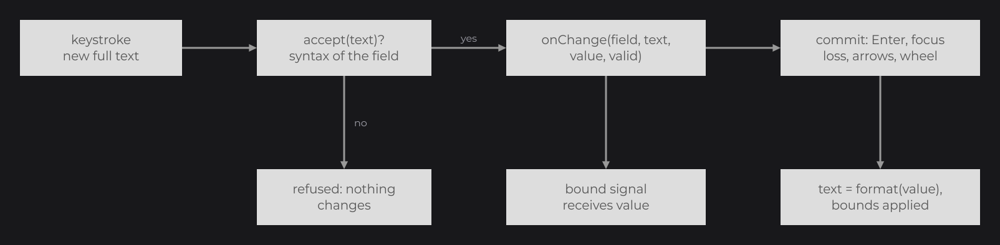
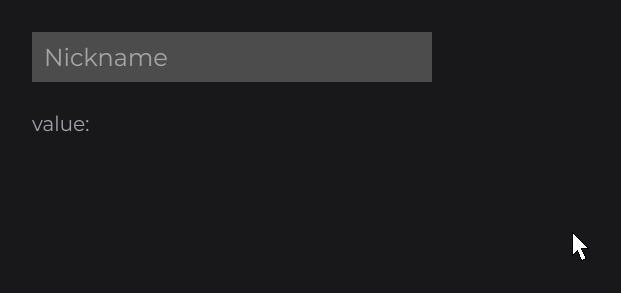
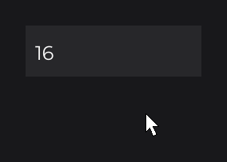
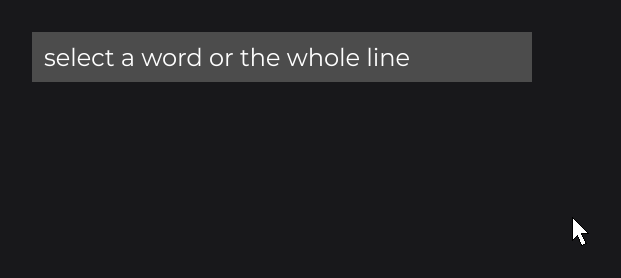
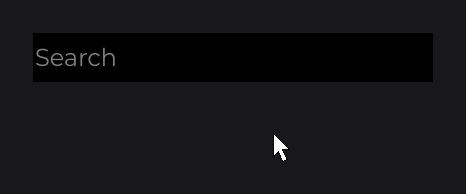

# TextFieldNode

`TextFieldNode` (`dev.joid.lib.ui.node.impl.design.textfield`) is a single-line editable text input: it owns its text, cursor and selection, and handles typing, the keyboard, the clipboard and the mouse. `IntegerFieldNode` (same package, `.impl`) is its sibling for whole numbers. Use them for search boxes, names, chat inputs, quantities; use [`MultilineTextFieldNode`](multiline-text-field.md) for several lines.

In the examples, the code runs in `UI.init()` and `font` is an `IFont` you loaded (see [Adding Your Own Fonts](../../fonts/adding-fonts.md)).

## Creating a text field

The field draws its text, placeholder, cursor and selection only: no background. Put it in a [`RectNode`](../visual/rect.md), or draw a background in a subclass (see [Styling the field](#styling-the-field)).

```java
RectNode
.create(760, 515, 400, 50)
.color(Color.DARKGRAY)
.body(background -> {
	TextFieldNode
	.create(10, 0, 380, 50)
	.info(TextInfo.create(font, 24F, Color.WHITE))
	.placeholder("Search")
	.<TextFieldNode>onChange((field, text, value, valid) -> System.out.println("[Search] " + text))
	.onEnter((field, text) -> System.out.println("[Search] submitted: " + text))
	.attach(background);
})
.attach(this);
```


- `info(TextInfo)` is required: it gives the font, size and color of the text, the placeholder and the cursor.
- A click on the field focuses it and places the cursor under the pointer; typing then edits the text. Enter commits, leaves the field and calls `onEnter`; Escape cancels the edit.
- `getText()` returns the raw text, `getValue()` the value it stands for.

## How input becomes a value



Every field converts between its text and a value of type `V` (`String` for text fields, `Integer` for `IntegerFieldNode`):

1. **Keystroke.** Each typed character, deletion, cut or paste builds the complete new text.
2. **Accept.** The field keeps the new text only if it is acceptable: the syntax of the field (`IntegerFieldNode`: digits, a leading `-` only when `min < 0`, or empty) and your `accept(Predicate<String>)`. A refused keystroke changes nothing, the cursor does not move. Nothing is rewritten while you type.
3. **onChange.** Every change of the text, valid or not, calls `onChange((field, text, value, valid) -> ...)`: `text` is the raw text, `value` the corrected value the commit will apply (brought into the bounds; for an empty, `-` or invalid text, the last committed value, or `null` with `allowEmpty(true)`), `valid` tells whether the text is accepted and within the bounds. The bound signal receives `value` too.
4. **Commit.** Enter, the loss of the focus (a click elsewhere, `focused(false)`, a detach), and immediately the arrow keys, the wheel and a paste: the text is replaced by the corrected value, formatted. `onChange` runs again only if the text changes.

`isValid()` reads the state of the current text at any time.

## Accepting text with accept and format

```java
TextFieldNode
.create(760, 500, 400)
.format(String::trim)
.info(TextInfo.create(font, 24F, Color.WHITE))
.placeholder("Nickname")
.accept(text -> text.length() <= 12 && text.matches("[A-Za-z ]*"))
.onChange((field, text, value, valid) -> System.out.println("[Profile] " + value))
.attach(this);
```



- `accept(Predicate<String>)` tests the complete text a keystroke would produce; it never rewrites it.
- `format(UnaryOperator<String>)` (text fields) runs at the commit: `value` in `onChange` is the text after `format`, and the committed text becomes it.
- `maxTextLength(int)` caps the length (`-1`, the default, means no limit): typing or pasting inserts only what fits.
- The text keeps only the characters from U+0020 to U+0233, except U+007F and `§` (U+00A7): line breaks, tabs, other control characters and characters above U+0233 are dropped, from typing, pasting and `text(...)` alike.

## Numbers with IntegerFieldNode

```java
IntegerFieldNode
.create(40, 125, 440, 50)
.min(0)
.max(100)
.value(42)
.step(5)
.info(TextInfo.create(font, 24F, Color.WHITE))
.onChange((field, text, value, valid) -> System.out.println("[Volume] " + value + (valid ? "" : " (out of range)")))
.attach(this);
```



| Behaviour | Rule |
| --- | --- |
| While typing | Digits, a leading `-` when `min < 0`, or empty are accepted; no bound applies (`425` stays shown with `max(100)`). |
| Commit | Above `max` gives `max`, below `min` gives `min`; empty or `-` gives the last committed value (`0`, brought into the bounds, at the start). |
| `allowEmpty(true)` | An empty field is valid and its value is `null`. |
| Up / Down arrows, wheel over the field | Add or subtract `step` (default `1`), within the bounds, and commit at once. The wheel is consumed, focused or not. |
| `value(int)` | Writes a value and commits it. |

Call the `IntegerFieldNode` setters (`min`, `max`, `step`, `value`) before the shared field setters (`info`, `marginHorizontal`...), which return a `FieldNode`.

## Binding a signal with signal

`signal(Signal<V>)` keeps the value and a [signal](../../state/signals.md) in sync, both ways:

```java
private final IntegerSignal amount = IntegerSignal.of(3);

IntegerFieldNode.create(40, 40, 320, 50).signal(this.amount).info(TextInfo.create(font, 24F, Color.WHITE)).attach(this);

TextNode.create(40, 120).text(Text.create("Doubled: " + this.amount.get() * 2, TextInfo.create(font, 24F, Color.GRAY))).attach(this);
```

- The field starts on the value of the signal.
- Each keystroke writes the corrected value into the signal (never `null`); while focused, the field ignores the echo of its own write and keeps the text you are typing.
- A change of the signal from elsewhere always replaces the text, even during the focus.
- One signal at a time: a second `signal(...)` replaces the first. A `ComputedSignal` is refused with `IllegalArgumentException` (it is read-only): pass it to `text(...)` or `value(...)`, which follow it one way.

## Focus, Enter and Escape

| Event | Effect |
| --- | --- |
| Press on the field | Focuses it and places the cursor on the clicked character (left or right half). The press is consumed. |
| Press anywhere else | Commits and leaves the field, drops the selection. |
| Enter, Numpad Enter | Commits, leaves the field, then calls `onEnter((field, text) -> ...)`. |
| Escape | Restores the text from before the focus (the bound signal follows), leaves the field, no `onEnter`. In a closeable UI, this Escape does not close the UI; the next one does. |
| `focused(true)` / `focused(false)` | Focuses / leaves from code. |
| Tab | Ignored: there is no keyboard navigation between fields. |

`onFocus(field -> ...)` runs when the focus changes, both ways: read `field.isFocused()`. A focused field consumes every key, so the UI keybinds and shortcuts wait until it loses the focus (see [Mouse and Keyboard](../../interactions/mouse-and-keyboard.md)).

When the program rewrites the text of a focused field (a step, the bound signal, `text(...)`, a commit), the cursor and the selection keep their distance to the end of the text: `9` with the cursor at the end, Up gives `10` with the cursor still at the end.

## Selecting with the mouse



| Gesture | Selection |
| --- | --- |
| Click | Cursor at the clicked character. |
| Drag after a click | Character by character. |
| Double click (within 500 ms and 4 units) | The word under the mouse (separated by spaces); between two spaces, the run of spaces. Dragging then extends word by word. |
| Triple click | The whole text. |
| Shift + click | Extends the selection to the clicked position. |

## Keyboard shortcuts

On macOS (`os.name` contains `mac`), the shortcuts use Command and the word moves use Option; elsewhere, both use Control. "Ctrl" stands for that key below.

| Keys | Action |
| --- | --- |
| A character | Inserts it at the cursor, replacing the selection. |
| Left / Right | Moves one character; Ctrl moves by word; Shift extends the selection. |
| Home / End | Start / end of the text; Shift extends the selection. |
| Backspace / Delete | Deletes the selection or one character; Ctrl deletes a word. |
| Up / Down | Steps the value (`IntegerFieldNode`). |
| Ctrl + A / C / X / V | Select all, copy, cut, paste (the clipboard of the window bridge). A paste commits at once. |
| Enter / Escape | Commit and leave / cancel and leave. |

Left, Right, Backspace and Delete repeat while held: 500 ms, then every 100 ms.

## Markup in a field

By default the field shows its text raw: a typed `<b>` stays text. `markup(true)` turns the markups of the `TextInfo` on: tags take no width, the cursor and the selection stay exact around them, a click lands on the visible character, the arrows cross a tag one character at a time without visible movement, and Ctrl + arrows treat a tag as part of its word. Typing just after an opening tag writes in its style; editing inside a tag breaks it and it shows as text.

## Size, margins and alignment

| Factory | Height |
| --- | --- |
| `create(double x, double y, double width)` | The line height of the `TextInfo` plus `marginTop` and `marginBottom`, computed on the first draw. |
| `create(double x, double y, double width, double height)` | The given height. |

| Property | Default | Role |
| --- | --- | --- |
| `marginLeft`, `marginRight` (`marginHorizontal`) | `2` | Inner horizontal padding; the text is clipped between them. |
| `marginTop`, `marginBottom` (`marginVertical`) | `10` | Inner vertical padding. |
| `margin(double)` | | The four margins. |
| `cursorMargin` | `15` | Distance kept between the cursor and the inner edges while the text scrolls. |
| `horizontalAlign(Align)` | `START` | `CENTER` and `END` apply while the text fits; a longer text scrolls like `START`. |
| `verticalAlign(Align)` | `CENTER` | `START` / `END` use `marginTop` / `marginBottom`. |

A text wider than the field scrolls horizontally so that the cursor stays `cursorMargin` away from the edges.

## Styling the field

| Element | Look |
| --- | --- |
| Text | The `TextInfo`. |
| Placeholder | The `TextInfo` color at 50 % alpha, while the text is empty and the field is not focused. |
| Cursor | 2 units wide, the line height, the `TextInfo` color, blinking once per second, while focused. |
| Selection | Translucent blue, `new Color(50, 152, 253, 100)`. |

To draw a background, a focus border or a disabled look, subclass the field and draw before `super.draw`:

```java
public class SearchFieldNode extends TextFieldNode {

	protected SearchFieldNode(final double x, final double y, final double width, final double height) {
		super(x, y, width, height);
	}

	public static @NonNull SearchFieldNode create(final double x, final double y, final double width) {
		return new SearchFieldNode(x, y, width, 0D);
	}

	@Override
	public void draw(final double mouseX, final double mouseY) {
		DrawUtils.SHAPE.drawRect(super.getX(), super.getY(), super.getWidth(), super.getHeight(), Color.WHITE);
		if (super.isFocused()) {
			DrawUtils.SHAPE.drawBorder(super.getX(), super.getY(), super.getX() + super.getWidth(), super.getY() + super.getHeight(), Color.GRAY, 2D);
		}

		super.draw(mouseX, mouseY);
	}

}
```



## Reference

### Factories

| Method | Description |
| --- | --- |
| `TextFieldNode.create(double x, double y, double width)`, `create(x, y, width, height)` | A text field. |
| `IntegerFieldNode.create(double x, double y, double width)`, `create(x, y, width, height)` | An integer field. |

### Shared properties (FieldNode)

Every setter has a value overload and a `Supplier` overload (followed, see [Reactive Properties](../../state/reactive-properties.md)), except `accept`.

| Method | Default | Description |
| --- | --- | --- |
| `text(String)` | `""` | The text; outside the focus it is committed at once. |
| `placeholder(String)` | `""` | Shown while empty and unfocused. |
| `info(TextInfo)` | none | Required style. |
| `focused(boolean)` | `false` | Focus state. |
| `accept(Predicate<String>)` | accepts all | Keystroke filter on the complete text. |
| `allowEmpty(boolean)` | `false` | An empty text is valid, value `null`. |
| `maxTextLength(int)` | `-1` | Maximum length. |
| `markup(boolean)` | `false` | Markup of the `TextInfo`. |
| `margin`, `marginTop`, `marginLeft`, `marginRight`, `marginBottom`, `marginVertical`, `marginHorizontal`, `cursorMargin` | see above | Padding. |
| `cursorPosition(int)` | | Moves the cursor (clamped). |
| `signal(Signal<V>)` | | Two-way binding. |
| `onChange(NodeTextFieldChangeCallback<T, V>)` | | `(field, text, value, valid)` on every change. |
| `onFocus(NodeTextFieldFocusCallback<T>)` | | `(field)` on focus changes. |

### Line fields (TextFieldNode, IntegerFieldNode)

| Method | Description |
| --- | --- |
| `horizontalAlign(Align)`, `verticalAlign(Align)` | Alignments. |
| `onEnter(NodeTextFieldEnterCallback<T>)` | `(field, text)` after Enter. |
| `format(UnaryOperator<String>)` | `TextFieldNode`: transformation applied at the commit. |
| `min(int)`, `max(int)`, `step(int)`, `value(int)` | `IntegerFieldNode`: bounds (`Integer.MIN_VALUE` / `MAX_VALUE`), step (`1`), value. |

### Getters

| Method | Description |
| --- | --- |
| `getText()`, `getValue()`, `isValid()` | Raw text, corrected value (nullable), validity. |
| `isFocused()`, `getPlaceholder()`, `getInfo()`, `isMarkup()`, `getMaxTextLength()`, `isAllowEmpty()` | Settings. |
| `getCursorPos()`, `getSelectionStart()` | Cursor index and selection anchor (`-1` without selection). |
| `getPressCount()`, `getLastPress()`, `isSelecting()` | Mouse selection state. |
| `getSignal()`, `getSubscription()` | The bound signal and its subscription. |

### Writing your own field type

Extend `LineFieldNode<V>` (or `FieldNode<V>`) and implement the converter: `V parse(String text)` (`null` when the text gives no value), `String format(V value)`, and optionally `V correct(V value)` (bounds), `V increment(V value, int count)` (step, `null` for no step) and `boolean accepts(String text)` (syntax). `fallback(V)` sets the starting fallback value and `write(V)` writes a value and commits it. See [Custom Nodes](../custom-nodes.md).

## Pitfalls

- A shared field setter in the middle of a chain returns `FieldNode`: call `horizontalAlign`, `onEnter`, `min`... first, or add a witness (`.<TextFieldNode>onChange(...)`).
- `onChange` fires on invalid texts too: check `valid`, or read `value`, which is always the corrected one.
- An `IntegerFieldNode` never shows an out-of-range value after a commit, but it does while you type.
- A field without `info(...)` cannot draw.

## See also

- [MultilineTextFieldNode](multiline-text-field.md)
- [Signals](../../state/signals.md)
- [Mouse and Keyboard](../../interactions/mouse-and-keyboard.md)
- [Markup and Text Effects](../../text/markup-and-effects.md)
- [Callbacks](../../interactions/callbacks.md)