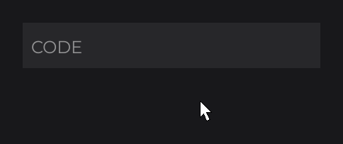

# TextFieldNode

`TextFieldNode` (`dev.joid.lib.ui.node.impl.design.textfield`) is a single-line editable text input: it owns its text, cursor and selection, and handles typing, keyboard navigation, the clipboard and mouse placement of the cursor. Use it for search boxes, names, chat inputs and any short text; use [`MultilineTextFieldNode`](multiline-text-field.md) for several lines and `IntegerFieldNode` (on this page) for whole numbers.

In the examples, the code runs in `UI.init()` and `font` is an `IFont` you loaded (see [Fonts](../../fonts/adding-fonts.md)).

## Creating a text field

The field draws its text, placeholder, cursor and selection only: no background. Put it in a [`RectNode`](../visual/rect.md) (or draw a background in a subclass, see [Styling](#styling-the-field)).

```java
RectNode
.create(760, 515, 400, 50)
.color(Color.DARKGRAY)
.body(background -> {
    TextFieldNode
    .create(10, 0, 380, 50)
    .info(TextInfo.create(font, 24F, Color.WHITE))
    .placeholder("Search")
    .onChange((field, oldText, newText) -> System.out.println("Search: " + newText))
    .onEnter((field, text) -> System.out.println("Submitted: " + text))
    .attach(background);
})
.attach(this);
```


- `info(TextInfo)` is required: it gives the font, size and color of the text, the placeholder and the cursor. A field without `TextInfo` throws a `NullPointerException` on its first draw.
- A click on the field focuses it; typing then edits the text. Enter, Numpad Enter or Escape unfocuses it and calls `onEnter`.
- `getText()` returns the current text at any time.

## Size, margins and alignment

### create with or without a height

| Factory | Height |
| --- | --- |
| `TextFieldNode.create(double x, double y, double width)` | `0` until the first draw, then the line height of the `TextInfo` plus `marginTop` and `marginBottom` (with the default margins: line height + 20). |
| `TextFieldNode.create(double x, double y, double width, double height)` | The given height, kept as is. |

The automatic height is computed once, on the first draw while the height is `0`; changing the `TextInfo` afterwards does not resize the field.

### Margins and cursorMargin

| Property | Default | Role |
| --- | --- | --- |
| `marginLeft`, `marginRight` | `2` | Inner horizontal padding. The text is clipped between the two. |
| `marginTop`, `marginBottom` | `10` | Inner vertical padding, used by the automatic height and by the `START` / `END` vertical alignments. |
| `cursorMargin` | `15` | Minimum distance kept between the cursor and the inner left / right edges while the text scrolls. |

Setters: `margin(double)` (the four margins), `margin(double margin, double cursorMargin)`, `marginHorizontal(double)`, `marginVertical(double)`, `marginLeft`, `marginRight`, `marginTop`, `marginBottom` and `cursorMargin(double)`.

### Alignment with align, horizontalAlign and verticalAlign

`align(Align horizontal, Align vertical)` sets both alignments; `horizontalAlign(Align)` and `verticalAlign(Align)` set one. `Align` is in `dev.joid.lib.utils.align`.

| Vertical | Text top |
| --- | --- |
| `Align.START` | `marginTop` below the top edge. |
| `Align.CENTER` (default) | Centered in the full height (margins ignored). |
| `Align.END` | `marginBottom` above the bottom edge. |

| Horizontal | Placement |
| --- | --- |
| `Align.START` (default) | The text starts at `marginLeft` and scrolls when it is longer than the field. |
| `Align.CENTER` | Centered in the field while it fits inside the margins; once longer, it scrolls like `START`. |
| `Align.END` | Ends `marginRight + 2` units before the right edge (room for the cursor) while it fits; once longer, it scrolls like `START`. |

The placeholder is aligned on its own width.

### Horizontal scrolling

When the text is wider than the space between the margins, the field scrolls horizontally so that the cursor stays at least `cursorMargin` away from the inner edges. Moving the cursor back to the start (Home, or Left up to position 0) scrolls back to the beginning. `getXOffset()` returns the current scroll offset in UI units.

## Styling the field

| Element | Look |
| --- | --- |
| Text | Drawn with the `TextInfo`. |
| Placeholder | Drawn with the `TextInfo` color at `0.5F` alpha while the text is empty and the field is not focused. |
| Cursor | 2 units wide, as tall as the `TextInfo` line height, in the `TextInfo` color; its alpha fades in and out once per second. Drawn only while focused. |
| Selection | A fixed translucent blue, `new Color(50, 152, 253, 100)`. |

There are no setters for the cursor color, cursor width, selection color, or a password mask. To draw a background or a focus border, subclass the field and draw before calling `super.draw`, as the demo UI does:

```java
public class SearchFieldNode extends TextFieldNode {

    protected SearchFieldNode(final double x, final double y, final double width, final double height) {
        super(x, y, width, height);
    }

    public static SearchFieldNode create(final double x, final double y, final double width) {
        return new SearchFieldNode(x, y, width, 0);
    }

    @Override
    public void draw(final double mouseX, final double mouseY) {
        DrawUtils.SHAPE.drawRect(super.getX(), super.getY(), super.getWidth(), super.getHeight(), Color.BLACK);
        if (super.isFocused()) {
            DrawUtils.SHAPE.drawFilledBorder(super.getX(), super.getY(), super.getX() + super.getWidth(), super.getY() + super.getHeight(), Color.WHITE);
        }

        super.draw(mouseX, mouseY);
    }

}
```


See [Custom Nodes](../custom-nodes.md) for the constructor and factory contract.

### Markup

The field draws and measures its text without [markup](../../text/markup-and-effects.md): the markups registered with `TextMarkup.register(...)` and those given to the `TextInfo` with `markups(...)` are ignored, so a typed `<b>` shows as typed and the cursor stays on the right character. `markup(true)` turns the markups of the `TextInfo` back on for the text and the placeholder; `isMarkup()` tells whether they are on.

## Focus

A field receives the keyboard only while it is focused. `isFocused()` tells whether it is.

| Event | Effect |
| --- | --- |
| Mouse press on the field (any button) | Focuses it and places the cursor under the pointer. The press is consumed. |
| Mouse press anywhere else | Unfocuses it and drops the selection. This includes a press on the field that another node already consumed (a node drawn above it). |
| Enter, Numpad Enter, Escape | Unfocuses it, then calls `onEnter`. |
| `focused(true)` / `focused(false)` | Focuses / unfocuses it from code. Calls `onFocus` only when the state changes. |

Losing the focus, whatever the cause, drops the selection.

- A disabled or hidden field is never hovered, so a click cannot focus it. Disabling a focused field does not unfocus it: call `focused(false)` as well.
- A press that a UI opened above the field's UI consumes never reaches the field, which then stays focused.
- JOID has no focus manager and no Tab navigation: each field tracks its own focus. Move the focus yourself, for example on Enter:

```java
final TextInfo info = TextInfo.create(font, 24F, Color.WHITE);

final TextFieldNode lastName = TextFieldNode
.create(760, 580, 400)
.info(info)
.placeholder("Last name")
.attach(this);

TextFieldNode
.create(760, 500, 400)
.info(info)
.placeholder("First name")
.onEnter((field, text) -> lastName.focused(true))
.attach(this);
```

### What a focused field takes from the UI

A focused field consumes every key it receives, even keys it does not use. While a field is focused, the keys do not reach the UI keybinds, the zoom shortcuts or the developer shortcuts, and the `keyPressed` hook of the UI receives them with a cancelled context (see [Mouse and Keyboard](../../interactions/mouse-and-keyboard.md)). An unfocused field lets every key through.

> WARNING: Escape is checked by the UI bridge before the nodes see it. In a closeable UI (`@UIData(closeable = true)`, the default) whose `close()` returns `true`, Escape closes the whole UI and the field never receives it. The field unfocuses on Escape only in a UI that is not closeable or whose `close()` returns `false`.

To let Escape leave the field first and close the UI on the next Escape, veto the close while the field is focused (here `searchField` is a field of your UI class):

```java
@Override
public boolean close() {
    return !this.searchField.isFocused();
}
```

`close()` also gates `JOID.close(ui)`; use `JOID.close(ui, true)` to close regardless (see [Opening and Closing UIs](../../ui/managing-uis.md)).

## Keyboard shortcuts

The shortcut keys follow the platform. On macOS (when the `os.name` system property contains `mac`), Ctrl+A, Ctrl+C, Ctrl+X and Ctrl+V use Command (`Key.LEFT_SUPER` or `Key.RIGHT_SUPER`) and the word moves and deletions use Option (`Key.LEFT_ALT` or `Key.RIGHT_ALT`). Elsewhere, both use either Control key (`Key.LEFT_CONTROL` or `Key.RIGHT_CONTROL`). In the tables, "Ctrl" stands for that key. "Shift" is either Shift key.

| Keys | Action |
| --- | --- |
| A character key | Inserts the character at the cursor, replacing the selection if there is one. |
| Left / Right | Moves the cursor one character and drops the selection. |
| Ctrl+Left | Moves the cursor to the start of the current or previous word. |
| Ctrl+Right | Moves the cursor to the start of the next word. |
| Shift+Left / Shift+Right | Extends the selection by one character (the selection starts at the cursor if there is none). |
| Ctrl+Shift+Left / Ctrl+Shift+Right | Extends the selection by one word. |
| Home / End | Moves the cursor to the start / end of the text and drops the selection. |
| Shift+Home / Shift+End | Extends the selection to the start / end of the text (the selection starts at the cursor if there is none). |
| Backspace | Deletes the selection, or else the character before the cursor. |
| Ctrl+Backspace | Deletes from the start of the current or previous word to the cursor (the spaces just before the cursor included). |
| Delete | Deletes the selection, or else the character after the cursor. |
| Ctrl+Delete | Deletes from the cursor to the start of the next word (the rest of the word and the spaces after it). |
| Ctrl+A | Selects the whole text (the cursor goes to the end). |
| Ctrl+C | Copies the selection to the clipboard. Does nothing without a selection. |
| Ctrl+X | Copies the selection to the clipboard and deletes it. Does nothing without a selection. |
| Ctrl+V | Inserts the clipboard text at the cursor, replacing the selection. Does nothing when the clipboard is empty. |
| Enter / Numpad Enter / Escape | Unfocuses the field and calls `onEnter` (see the Escape warning above). |

- Words are separated by spaces only.
- An empty selection (anchor on the cursor) counts as no selection: Backspace then deletes the character before the cursor.
- Up, Down, Tab, Page Up and Page Down do nothing. There is no undo / redo.

### Held keys repeat

Left, Right, Backspace and Delete repeat while held: the first repeat comes 500 ms after the press, then one every 100 ms, until the key is released or there is nothing left to delete. The word key (Ctrl, Option on macOS) is read again at each repeat, so a held Ctrl+Backspace keeps deleting whole words.

### Accepted characters

The text keeps only the characters from U+0020 (space) to U+0233, except U+007F (delete) and U+00A7 (`§`). Line breaks, tabs, other control characters and every character above U+0233 (for example `€`, Greek, Cyrillic, CJK, emoji) are dropped; a key that leaves nothing to insert changes nothing. The rule applies to every new text: typed, pasted, given to `text(String)`, set through the bound signal, and returned by the filter. Pasting `"x\ny\tz"` inserts `"xyz"`, and `text("a\tb")` stores `"ab"`.

## Mouse, selection and clipboard

- A press on the field puts the cursor on the nearest character boundary: left of a character when the pointer is on its left half, right of it otherwise, and at the end of the text when the pointer is past it.
- Shift+press extends the selection from the current cursor to the pressed position. A press without Shift drops the selection.
- There is no drag selection and no double-click word selection.
- The clipboard is the one of the window bridge (`IWindowBridge.getClipboard()` / `setClipboard(String)`).

The selection is stored as an anchor and the cursor: `getSelectionStart()` is the anchor index (`-1` when there is no selection) and `getCursorPos()` the cursor index, in either order. To read the selected text:

```java
final int anchor = field.getSelectionStart();
if (anchor != -1) {
    final int start = Math.min(anchor, field.getCursorPos());
    final int end = Math.max(anchor, field.getCursorPos());
    System.out.println("Selected: " + field.getText().substring(start, end));
}
```

There is no setter for the selection. `cursorPosition(int)` moves the cursor, clamped to `[0, text length]`.

## Filtering with filter

`filter(BiFunction<String, String, String>)` decides the text to keep each time the text would change: typing, pasting, deleting, cutting, `text(String)` and the bound signal. It receives `(oldText, newText)` and returns the text to store, never `null`. The default returns `newText`. Return `oldText` to refuse a change. The characters the field cannot show (see [Accepted characters](#accepted-characters)) are removed before the filter receives the text and from the text it returns.

```java
TextFieldNode
.create(760, 500, 400)
.info(TextInfo.create(font, 24F, Color.WHITE))
.placeholder("CODE")
.filter((oldText, newText) -> newText.matches("[A-Za-z0-9]*") ? newText.toUpperCase() : oldText)
.attach(this);
```



## Limiting the length with maxTextLength

`maxTextLength(int)` caps the number of characters; `-1` (the default) means no limit.

- Typing or pasting inserts only what fits; the selection being replaced counts as free room. When nothing fits, the key changes nothing.
- Every new text, `text(String)` included, is cut to the maximum after the filter ran.
- Setting a maximum does not cut the current text: the cut applies to the next change.

## Callbacks

| Method | Lambda | Called |
| --- | --- | --- |
| `onChange(NodeTextFieldChangeCallback<T>)` | `(node, oldText, newText)` | After the text changed, by the keyboard, the clipboard, `text(String)` or the bound signal. Only when the stored text differs from the previous one. `newText` is the text after the filter and the length cut, and equals `node.getText()`. When typing, the cursor has not moved yet. |
| `onFocus(NodeTextFieldFocusCallback<T>)` | `(node)` | After the focus changed, in both directions: read `node.isFocused()`. Not called when `focused(...)` receives the current state. |
| `onEnter(NodeTextFieldEnterCallback<T>)` | `(node, text)` | On Enter, Numpad Enter or Escape, after the field was unfocused (so `onFocus` runs first). |

The callback interfaces are in `dev.joid.lib.ui.node.impl.design.textfield.callback`. Each `on...` call adds a callback; several callbacks of the same kind run in the order you added them.

```java
TextFieldNode
.create(760, 500, 400)
.info(TextInfo.create(font, 24F, Color.WHITE))
.placeholder("Message")
.onFocus(field -> System.out.println(field.isFocused() ? "Typing..." : "Idle"))
.onEnter((field, text) -> {
    if (!text.isEmpty()) {
        System.out.println("Send: " + text);
        field.text("");
    }
})
.attach(this);
```

## Binding a signal with signal

`signal(Signal<String>)` keeps the text and a [signal](../../state/signals.md) in sync, both ways:

```java
final Signal<String> name = new Signal<>("Alex");

TextFieldNode
.create(760, 500, 400)
.info(TextInfo.create(font, 24F, Color.WHITE))
.signal(name)
.attach(this);
```

- The field starts on the signal's text, through the filter and the length cut: here it shows `Alex`.
- Each change of the text, from the keyboard, the clipboard or `text(String)`, writes the new text into the signal before `onChange` runs.
- Each value the signal publishes later replaces the text, and calls `onChange` when it changes, while the field's UI is open. A `null` value is ignored.
- When the filter, the length cut or a `pre(...)` veto keeps a text other than the signal's value, the field writes its own text back into the signal.

`Signal` is in `dev.joid.lib.utils.signal`.

## IntegerFieldNode

`IntegerFieldNode` (`dev.joid.lib.ui.node.impl.design.textfield.impl`) is a single-line field like `TextFieldNode`, with `Integer` values: its filter keeps an integer inside a range.

```java
final IntegerFieldNode amount = IntegerFieldNode
.create(760, 500, 200)
.range(1, 64)
.value(16)
.info(TextInfo.create(font, 24F, Color.WHITE))
.attach(this);

final int value = amount.getValue();
```

.")

| Method | Description |
| --- | --- |
| `IntegerFieldNode.create(double x, double y, double width)` | Same sizing as `TextFieldNode.create(x, y, width)`. |
| `IntegerFieldNode.create(double x, double y, double width, double height)` | Fixed height. |
| `min(int)` | Lowest value. Default `Integer.MIN_VALUE`. Clamps the current value. |
| `max(int)` | Highest value. Default `Integer.MAX_VALUE`. Clamps the current value. |
| `range(int min, int max)` | Sets both bounds and clamps the current value. |
| `value(int)` | Writes the value as text, through the filter (so clamped to the range). |
| `signal(Signal<Integer>)` | Binds the value to the signal, both ways. |
| `getValue()` | The `Integer` value of the text, or the middle of the range, `(min + max) / 2` rounded toward zero, while the text is empty or a lone `-`. |

Each new text goes through this filter:

| New text | Stored text |
| --- | --- |
| Digits, with or without a leading `-` | The number, kept as typed (leading zeros included) when inside the range. |
| Other characters mixed in | Removed; the number is negative only if the text starts with `-`. |
| Above `max` / below `min` | `max` / `min`. |
| Too large for an `int` | `max`, or `min` if it starts with `-`. |
| A lone `-` | Kept while `min` is negative, so a negative number can be typed; empty otherwise. |
| Empty, or without any digit | Empty. |

- Deleting every digit leaves the field empty while the user types. When the field loses the focus with an empty text or a lone `-`, it writes the middle of the range. With the default range the middle is `0`.
- The text starts empty: until you call `value(int)` or `text(String)`, `getValue()` returns the middle of the range.
- `min`, `max` and `range` pass the current text through the filter again, so a value outside the new range is clamped and `onChange` runs.
- `filter(...)` replaces the integer filter.

`signal(Signal<Integer>)` binds the value both ways, like `signal(Signal<String>)` binds the text of a `TextFieldNode`: the field starts on the signal's value, each change of the text writes `getValue()` into the signal, and each value the signal publishes is written with `value(int)`, clamped to the range (the clamped value is written back into the signal). A published value equal to `getValue()` leaves the text as it is, so an empty field bound to a signal stays empty while the user types. The signal can be an `IntegerSignal` (`dev.joid.lib.utils.signal.impl.primitive`) or any `Signal<Integer>`.

```java
final IntegerSignal amount = new IntegerSignal(16);

IntegerFieldNode
.create(760, 500, 200)
.range(1, 64)
.signal(amount)
.info(TextInfo.create(font, 24F, Color.WHITE))
.attach(this);
```

The setters shared by every text field return `LineFieldNode<Integer>` when chained, so call the `IntegerFieldNode` methods first, assign the result to an `IntegerFieldNode` variable (as above), or give the type explicitly:

```java
IntegerFieldNode
.create(760, 500, 200)
.range(0, 100)
.value(50)
.info(TextInfo.create(font, 24F, Color.WHITE))
.<IntegerFieldNode>onChange((field, oldText, newText) -> System.out.println("Value: " + field.getValue()))
.attach(this);
```

### Fields of other types

`TextFieldNode` and `IntegerFieldNode` extend `LineFieldNode<V>` (`dev.joid.lib.ui.node.impl.design.textfield`), the single-line field whose value has the type `V`: `LineFieldNode<String>` and `LineFieldNode<Integer>`. With [`MultilineTextFieldNode`](multiline-text-field.md), they share `FieldNode<V, N>`, which holds the text, the editing, the shared setters and `signal(Signal<V>)`. A field of another type extends `LineFieldNode<V>`, sets its `filter(...)` in the constructor and returns the value of its text from `getValue()`; `signal(Signal<V>)` then writes `getValue()` into the signal and writes the published values as text with `String.valueOf(...)`.

## Reference

### Factories

| Method | Description |
| --- | --- |
| `TextFieldNode.create(double x, double y, double width)` | Creates a field whose height is computed on its first draw. |
| `TextFieldNode.create(double x, double y, double width, double height)` | Creates a field of the given size. |

### Properties

| Method | Default | Description |
| --- | --- | --- |
| `text(String)` | `""` | Replaces the text through the filter and the length cut; calls `onChange` if it changed. Does not move the cursor (a cursor past the end is brought back on the next draw). |
| `placeholder(String)` | `""` | Text shown while empty and unfocused. |
| `info(TextInfo)` | none, required | Font, size and color of the text, placeholder and cursor. |
| `align(Align horizontal, Align vertical)` | `START`, `CENTER` | Both alignments. |
| `horizontalAlign(Align)` | `Align.START` | Horizontal alignment. |
| `verticalAlign(Align)` | `Align.CENTER` | Vertical alignment. |
| `focused(boolean)` | `false` | Focuses or unfocuses the field. |
| `filter(BiFunction<String, String, String>)` | `(oldText, newText) -> newText` | Text filter. |
| `maxTextLength(int)` | `-1` | Maximum length, `-1` for none. |
| `markup(boolean)` | `false` | Draws the text with the markups of the `TextInfo`. |
| `signal(Signal<String>)` | none | Binds a signal to the text, both ways. |
| `margin(double)` | | Sets the four margins. |
| `margin(double margin, double cursorMargin)` | | Sets the four margins and `cursorMargin`. |
| `marginHorizontal(double)` | `2` | Left and right margins. |
| `marginVertical(double)` | `10` | Top and bottom margins. |
| `marginLeft(double)`, `marginRight(double)` | `2` | One horizontal margin. |
| `marginTop(double)`, `marginBottom(double)` | `10` | One vertical margin. |
| `cursorMargin(double)` | `15` | Distance kept between the cursor and the inner edges while scrolling. |
| `cursorPosition(int)` | `0` | Cursor index, clamped to `[0, text length]`. |

Every setter returns the node itself, typed by the generic return of the fluent API.

### Callbacks

| Method | Description |
| --- | --- |
| `onChange(NodeTextFieldChangeCallback<T>)` | `(node, oldText, newText)` after each text change. |
| `onFocus(NodeTextFieldFocusCallback<T>)` | `(node)` after each focus change. |
| `onEnter(NodeTextFieldEnterCallback<T>)` | `(node, text)` on Enter, Numpad Enter and Escape. |

### Getters

| Method | Description |
| --- | --- |
| `getText()` | Current text. |
| `getValue()` | The text, like `getText()` (the value of a typed field such as `IntegerFieldNode`). |
| `getPlaceholder()` | Placeholder. |
| `getInfo()` | `TextInfo`, or `null` before `info(...)`. |
| `isFocused()` | Whether the field has the keyboard. |
| `getCursorPos()` | Cursor index in the text. |
| `getSelectionStart()` | Selection anchor index, `-1` without selection. |
| `getMaxTextLength()` | Maximum length, `-1` for none. |
| `getFilter()` | Current filter. |
| `isMarkup()` | Whether the text is drawn with markup. |
| `getSignal()` | Bound signal, or `null`. |
| `getHorizontalAlignment()`, `getVerticalAlignment()` | Alignments. |
| `getMarginTop()`, `getMarginLeft()`, `getMarginRight()`, `getMarginBottom()`, `getCursorMargin()` | Margins. |
| `getXOffset()` | Horizontal scroll offset. |
| `getInputType()`, `getLastInput()`, `isInputting()`, `isFirstInput()` | State of the held-key repeat: repeated key, time of the last repeat, whether a repeat is running, whether the first (500 ms) delay is pending. |

## Vetoing a change in the PRE phase

Each callback interface has a `pre(...)` method run before the change, with an `InternalContext`. Cancelling the context in `pre` vetoes the change (see [Callbacks](../../interactions/callbacks.md)):

| Callback | Effect of `context.cancel()` in `pre` |
| --- | --- |
| `NodeTextFieldChangeCallback` | The text keeps its previous value. |
| `NodeTextFieldFocusCallback` | The focus keeps its previous state (a click does not focus the field). |
| `NodeTextFieldEnterCallback` | `apply` is not called; the field is still unfocused. |

```java
field.onChange(new NodeTextFieldChangeCallback<TextFieldNode>() {

    @Override
    public void apply(final TextFieldNode node, final String oldText, final String newText) {
        System.out.println(oldText + " -> " + newText);
    }

    @Override
    @NodeCallbackMethod(NodeCallbackMethod.Type.PRE)
    public void pre(final TextFieldNode node, final InternalContext context, final String oldText, final String newText) {
        if (locked.getOrDefault()) {
            context.cancel();
        }
    }

});
```

Here `locked` is a `BooleanSignal`: while it is `true`, the text cannot change. `NodeCallbackMethod` is in `dev.joid.lib.ui.node.callback`, `InternalContext` in `dev.joid.lib.utils.context`. For rules that only depend on the text, `filter(...)` is simpler.

## See also

- [MultilineTextFieldNode](multiline-text-field.md)
- [Mouse and Keyboard](../../interactions/mouse-and-keyboard.md)
- [Callbacks](../../interactions/callbacks.md)
- [Text Model](../../text/text-and-textinfo.md)
- [Custom Nodes](../custom-nodes.md)