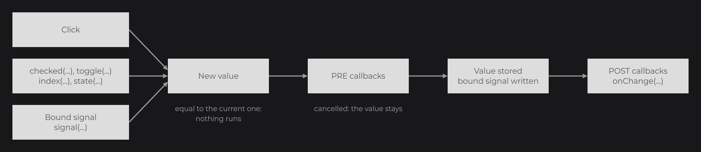

# ToggleNode

`ToggleNode<F, S>` (`dev.joid.lib.ui.node.impl.structure.toggle`) is a two-sided switch: each click flips it between its back side and its toggled side, and each side can carry a value of your choice (`F` when toggled, `S` on the back side). It is abstract and draws nothing: you subclass it once with your own look. For a plain boolean, see [CheckboxNode](checkbox.md); for more than two choices, see [SwitchNode](switch.md).

```java
public class QualityToggleNode extends ToggleNode<String, String> {

	private static final Color INK = Color.decode("#999999");

	protected QualityToggleNode(final double x, final double y, final double width, final double height) {
		super(x, y, width, height);
	}

	public static @NonNull QualityToggleNode create(final double x, final double y, final double width, final double height) {
		return new QualityToggleNode(x, y, width, height);
	}

	@Override
	public void draw(final double mouseX, final double mouseY) {
		final float alpha = super.isEnabled() ? 1F : 0.4F;
		DrawUtils.SHAPE.drawRect(super.getX(), super.getY(), super.getWidth(), super.getHeight(), Color.WHITE.copyAlpha(alpha));
		DrawUtils.SHAPE.drawRect(super.getX() + (super.isToggle() ? super.dw(2) : 0D), super.getY(), super.dw(2), super.getHeight(), QualityToggleNode.INK.copyAlpha(alpha));
	}

}
```

Then, in your UI:

```java
private final StringSignal quality = StringSignal.of("Low");

@Override
public void init() {
	QualityToggleNode
	.create(100, 100, 120, 60)
	.state("High", "Low")
	.onChange((node, toggle) -> this.quality.set(node.getValue()))
	.attach(this);

	TextNode.create(100, 190).text(Text.create("Quality: " + this.quality.get(), this.info)).attach(this);
}
```

 into quality, and the text follows.")

`draw` reads `isToggle()` on every frame, so the knob follows the state. `this.info` is a `TextInfo` built from a loaded font (see [Text](../../essentials/text.md)). The protected constructor and the `create` factory follow the [custom node](../custom-nodes.md) contract.

## Side values with state and getValue

`state(F toggle, S back)` gives a value to each side; `getValue()` returns the value of the current side: `toggle` when `isToggle()` is `true`, `back` otherwise. The two types are free: `ToggleNode<Integer, Integer>` for a frame rate (`state(144, 60)`), `ToggleNode<Locale, Locale>` for a language pair.

`state(...)` only stores the two values: it does not change the side, runs no callback and is not followed. Set it before reading `getValue()`.

## Initial side with toggle

A new toggle is on its back side. `toggle(true)` puts it on the toggled side:

```java
QualityToggleNode.create(100, 100, 120, 60).attach(this);

QualityToggleNode.create(260, 100, 120, 60).toggle(true).attach(this);

QualityToggleNode.create(420, 100, 120, 60).toggle(true).enabled(false).attach(this);
```

, and toggle(true) with enabled(false).")

Call `toggle(...)` and `state(...)` before the setters inherited from `Node` (`enabled`, `x`, `width`...), or add a type witness (`.<QualityToggleNode>enabled(false).toggle(true)`): a `Node` setter in the middle of a chain returns a `Node`.

## Clicking

- A press of any mouse button on the toggle flips it, then runs `onChange`. The press is consumed: the nodes under the toggle do not receive it.
- Of two overlapping toggles, only the one in front flips.
- A disabled or hidden toggle ignores presses. Draw the disabled look yourself from `isEnabled()`.
- The toggle reacts on press, not on release, and has no keyboard control.

## Sharing the side with signal

`signal(Signal<Boolean>)` binds the side to a [signal](../../concepts/signals.md) in both directions (`true` = toggled):

```java
private final BooleanSignal night = BooleanSignal.of(false);

@Override
public void init() {
	QualityToggleNode.create(100, 100, 120, 60).signal(this.night).attach(this);

	QualityToggleNode.create(240, 100, 120, 60).signal(this.night).attach(this);

	TextNode.create(100, 190).text(Text.create(this.night.get() ? "Night mode" : "Day mode", this.info)).attach(this);
}
```

- The toggle takes the value of the signal as soon as you bind it (a `null` value is ignored).
- A click writes the new side into the signal before the `onChange` callbacks run; `toggle(...)` writes it too.
- A value set on the signal from anywhere else flips the toggle, and runs `onChange` when it changes, while the UI of the toggle is open.
- A toggle follows one signal at a time: calling `signal(...)` again unbinds the previous one.
- A toggle that is not attached yet follows the signal once attached; a detached toggle takes the current value of the signal when it is attached again.

## Following a value with toggle

`toggle(...)` also takes an expression that reads signals, a signal, a `map(...)` or a `Supplier<Boolean>` (see [Signals and Reactivity](../../concepts/signals.md)). The toggle follows that value in one direction only: a click flips it, but never writes into the source.

```java
private final IntegerSignal volume = IntegerSignal.of(80);

QualityToggleNode.create(100, 100, 120, 60).toggle(this.volume.get() > 50).attach(this);
```

## Reacting with onChange

`onChange(NodeToggleChangeCallback<T, F, S>)` runs `(node, toggle)` after each real change of the side, whatever its source: a click, `toggle(...)`, a followed value or the bound signal. Flipping to the current side again runs nothing. `node.getValue()` already returns the value of the new side. The change follows the same steps as every control of this family:



Cancel the context in the `pre(...)` phase to keep the current side, in an anonymous class of the callback interface as for [CheckboxNode](checkbox.md#reacting-with-onchange). A refused click is still consumed.

```java
QualityToggleNode
.create(100, 100, 120, 60)
.state("High", "Low")
.onChange(new NodeToggleChangeCallback<QualityToggleNode, String, String>() {

	@Override
	public void apply(final @NonNull QualityToggleNode node, final boolean toggle) {
		System.out.println("Quality locked on " + node.getValue());
	}

	@Override
	public void pre(final @NonNull QualityToggleNode node, final @NonNull DispatchContext context, final boolean toggle) {
		if (!toggle) {
			context.cancel();
		}
	}

})
.attach(this);
```

Once on "High", this toggle stays there. Several `onChange` callbacks run in the order you add them (see [Callbacks](../../interactions/callbacks.md)).

## Reference

| Method | Description |
| --- | --- |
| `ToggleNode(double x, double y, double width, double height)` | Protected constructor for your subclass. |
| `state(F toggle, S back)` | Values of the toggled side and of the back side. Not followed; no callback. |
| `toggle(boolean)`, `toggle(Supplier<Boolean>)` | Sets the side, or follows a value one way. Default `false` (back side). Runs `onChange` and writes the bound signal when the side changes. |
| `signal(Signal<Boolean>)` | Binds a signal both ways; replaces the previous binding. Throws `IllegalArgumentException` for a `ComputedSignal`. |
| `onChange(NodeToggleChangeCallback<T, F, S>)` | Adds a callback `(node, toggle)` run after each change of the side. |
| `isToggle()` | `true` on the toggled side. |
| `getValue()` | Value of the current side, from `state(...)`. |
| `getState()` | The `ToggleState<F, S>` set by `state(...)` (`getToggle()`, `getBack()`), or `null`. |
| `getSignal()`, `getSubscription()` | Bound signal and its subscription, or `null`. |
| `mousePressed(double, double, MouseButton, DispatchContext)` | Flips the toggle on a press over it. Override it to change what a press does. |
| `ToggleNode.CALLBACK_CHANGE` | Callback id of `onChange`. |

`NodeToggleChangeCallback<T extends ToggleNode<F, S>, F, S>` (`dev.joid.lib.ui.node.impl.structure.toggle.callback`):

| Method | Description |
| --- | --- |
| `apply(T node, boolean toggle)` | Runs after the change (the lambda of `onChange`). |
| `pre(T node, DispatchContext context, boolean toggle)` | Runs before the change; `context.cancel()` keeps the current side. |
| `post(T node, DispatchContext context, boolean toggle)` | Runs after the change and calls `apply`. |

The setters return the node itself, typed by the generic return of the fluent API. The rest of the API is inherited from `Node` (see [Node Fundamentals](../node-fundamentals.md)).

## Pitfalls

- `getValue()` without `state(...)` throws a `NullPointerException`.
- `getValue()` is generic (`<T> T getValue()`): the target type picks `T`. Assign it to the type of the side (`final String value = node.getValue();`); a wrong type fails with a `ClassCastException` at run time, not at compile time.
- `signal(...)` needs a writable signal: a `ComputedSignal` throws `IllegalArgumentException`. Pass it to `toggle(...)` to follow it.
- A PRE that refuses a value coming from the bound signal keeps the toggle on its side, but the signal keeps the new value.
- `onChange` registered after `toggle(true)` in the chain does not run for that first value; registered before, it does.

## See also

- Next: [SwitchNode](switch.md)
- [CheckboxNode](checkbox.md)
- [Signals](../../state/signals.md)
- [Reactive Properties](../../state/reactive-properties.md)
- [Callbacks](../../interactions/callbacks.md)
- [Building a UI Kit](../../components/ui-kit.md)