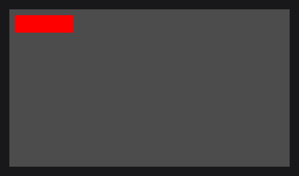
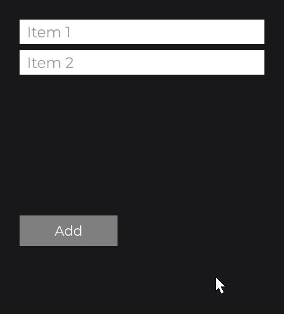

# ContainerNode

`ContainerNode` (`dev.joid.lib.ui.node.impl.structure.container`) is an invisible node that groups children under a common origin. Use it to move, hide, clip, scroll, rebuild or load a section of a UI as one block, without drawing anything for the group itself. It opens the layout nodes of the Components section; [Layout](../../essentials/layout.md) introduced it.

```java
ContainerNode
.create(100, 100, 460, 200)
.body(container -> {
	RectNode.create(0, 0, 220, 200).color(Color.LIGHTGRAY).attach(container);
	RectNode.create(240, 0, 220, 200).color(Color.GRAY).attach(container);
})
.attach(this);
```



The children are placed relative to the container: a child at (240, 0) sits at (340, 100) on the 1920×1080 canvas.

## Moving and hiding a group with x and visible

Every node setter applied to the container applies to the whole group, since children are placed relative to their parent ([Nodes and the Node Tree](../../concepts/nodes.md)): `x(...)` and `y(...)` move it, `visible(...)` hides it, `enabled(...)` disables its children. Like every setter, they accept an expression that reads signals and follow it ([Signals and Reactivity](../../concepts/signals.md)). Here `moved` is a `BooleanSignal` field of the UI and `info` a `TextInfo` built from a loaded font (see [Text](../../essentials/text.md)).

```java
private final BooleanSignal moved = BooleanSignal.of(false);
```

```java
ContainerNode
.create(100, 100, 460, 200)
.x(this.moved.get() ? 600D : 100D)
.body(container -> {
	RectNode.create(0, 0, 220, 200).color(Color.LIGHTGRAY).attach(container);
	RectNode.create(240, 0, 220, 200).color(Color.GRAY).attach(container);
})
.attach(this);

RectNode
.create(100, 340, 160, 50)
.color(Color.GRAY)
.onClick((node, mouseX, mouseY, clickType) -> this.moved.toggle())
.body(button -> {
	TextNode.create(80, 25).text(Text.create("Move", this.info, Align.CENTER, Align.CENTER)).anchor(Align.CENTER).attach(button);
})
.attach(this);
```


## Covering a parent with create(Node parent)

`ContainerNode.create(Node parent)` creates a container at (0, 0) with the current size of `parent` and attaches it to `parent` right away: do not call `attach` on it again. It reads the size once, at creation, and does not follow a later resize of the parent.

```java
RectNode
.create(100, 100, 400, 300)
.color(Color.WHITE)
.body(card -> {
	ContainerNode.create(card).body(content -> {
		RectNode.create(20, 20, 160, 60).color(Color.GRAY).attach(content);
	});
})
.attach(this);
```

## Rebuilding a section with watch

A container is the natural root of a section rebuilt from data. As in [Layout](../../essentials/layout.md#rebuilding-a-list-with-watch), `watch(signal, WatchProperty.CLEAR_CHILDREN, WatchProperty.BODY)` detaches the children and runs the `body` again each time the signal changes (`WatchProperty` is in `dev.joid.lib.ui.node.property.watch`, `ListSignal` in `dev.joid.lib.utils.signal.impl.iterable`). Use `watch` only when the structure changes; a text, color or position that depends on a signal goes through a setter.

```java
private final ListSignal<String> items = new ListSignal<>(Arrays.asList("Item 1", "Item 2"));
```

```java
ContainerNode
.create(100, 100, 400, 300)
.watch(this.items, WatchProperty.CLEAR_CHILDREN, WatchProperty.BODY)
.body(container -> {
	double y = 0D;
	for (final String item : this.items.get()) {
		RectNode
		.create(0, y, 400, 40)
		.color(Color.WHITE)
		.body(row -> {
			TextNode.create(12, 6).text(Text.create(item, this.info)).attach(row);
		})
		.attach(container);
		y += 50D;
	}
})
.attach(this);

RectNode
.create(100, 420, 160, 50)
.color(Color.GRAY)
.onClick((node, mouseX, mouseY, clickType) -> this.items.add("Item " + (this.items.size() + 1)))
.body(button -> {
	TextNode.create(80, 25).text(Text.create("Add", this.info, Align.CENTER, Align.CENTER)).anchor(Align.CENTER).attach(button);
})
.attach(this);
```



To place the rows without computing `y`, build them in a [FlexNode](flex.md) instead.

## Loading a section with wait and skeleton

`wait(...)` holds a node back until a condition holds: a delay (`wait(2L, TimeUnit.SECONDS)`), a signal that holds a value (`wait(signal)`, for data that loads), or a predicate on the node. Until then the node and its children are not mounted: they are attached, but each draws a loading placeholder instead of itself. `skeleton(...)` gives the container one placeholder node of your own, drawn in place of the children while it waits; without one, each child draws its default placeholder, a rectangle pulsing in `Color.LOADING`, while the container itself draws nothing. [Watching Signals](../../state/watch.md) covers `wait` and `onMount` in depth.

```java
ContainerNode
.create(100, 100, 400, 300)
.wait(2L, TimeUnit.SECONDS)
.skeleton(container -> RectNode.create(0, 0, 400, 300).color(Color.LOADING))
.body(container -> {
	RectNode.create(0, 0, 400, 300).color(Color.WHITE).attach(container);
})
.attach(this);
```


## Clipping and scrolling a group

A container has bounds even though it draws nothing: they are used for hover, clipping and scrolling. `overflow(OverflowProperty.HIDDEN)` clips the children to them, `overflow(OverflowProperty.SCROLL)` makes them scroll with the wheel. See [Overflow and Scrolling](overflow-and-scroll.md).

## Extending ContainerNode

`ContainerNode` is not final and its constructor is `protected`: extend it to build a composite node with its own factory, as the kit classes of [Building a UI Kit](../../components/ui-kit.md) do. Its `draw` and `drawSkeleton` draw nothing and can be overridden.

```java
public class CardNode extends ContainerNode {

	protected CardNode(final double x, final double y, final double width, final double height) {
		super(x, y, width, height);
	}

	public static @NonNull CardNode create(final double x, final double y, final double width, final double height) {
		return new CardNode(x, y, width, height);
	}

	@Override
	public void draw(final double mouseX, final double mouseY) {
		DrawUtils.SHAPE.drawRect(super.getX(), super.getY(), super.getWidth(), super.getHeight(), Color.WHITE);
	}

}
```

See [Custom Nodes](../custom-nodes.md) for the full contract.

## Reference

| Method | Description |
| --- | --- |
| `create(double x, double y, double width, double height)` | New container with these bounds, not attached: call `attach(...)`. |
| `create(Node parent)` | New container at (0, 0) with the size `parent` has at that moment, already attached to `parent`. |
| `ContainerNode(double x, double y, double width, double height)` | Protected constructor, for subclasses. |
| `draw(double mouseX, double mouseY)`, `drawSkeleton(double mouseX, double mouseY)` | Draw nothing. Overridable. |

Everything else is inherited from `Node` (see [Node Fundamentals](../node-fundamentals.md)).

## Pitfalls

- `create(Node parent)` attaches the container: a second `attach(...)` moves it to another parent.
- A container waiting with `wait(...)` and no `skeleton(...)` draws no placeholder of its own: only its children draw theirs.
- A container is invisible but not transparent to the mouse: its bounds count for hover, so a `hover(...)` tooltip or an `onClick` on it reacts over its whole area.

## See also

- Next: [FlexNode](flex.md)
- [Layout](../../essentials/layout.md)
- [GridNode](grid.md)
- [Overflow and Scrolling](overflow-and-scroll.md)
- [Watching Signals](../../state/watch.md)
- [Node Fundamentals](../node-fundamentals.md)