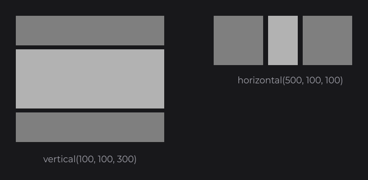
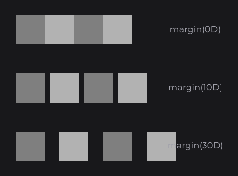
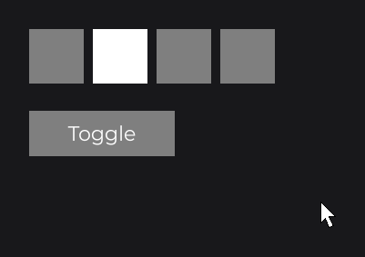
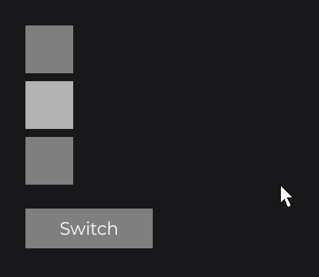

# FlexNode

`FlexNode` (`dev.joid.lib.ui.node.impl.structure.flex`) places its children one after the other in a column or a row, with a gap and an optional alignment across the line, and grows along that line to fit them. Use it for lists, toolbars and menus instead of computing positions by hand.

```java
FlexNode
.vertical(100, 100, 300)
.margin(8D)
.body(flex -> {
	RectNode.create(0, 0, 300, 60).color(Color.GRAY).attach(flex);
	RectNode.create(0, 0, 300, 120).color(Color.LIGHTGRAY).attach(flex);
	RectNode.create(0, 0, 300, 60).color(Color.GRAY).attach(flex);
})
.attach(this);

FlexNode
.horizontal(500, 100, 100)
.margin(10D)
.body(flex -> {
	RectNode.create(0, 0, 100, 100).color(Color.GRAY).attach(flex);
	RectNode.create(0, 0, 60, 100).color(Color.LIGHTGRAY).attach(flex);
	RectNode.create(0, 0, 100, 100).color(Color.GRAY).attach(flex);
})
.attach(this);
```



## Creating a FlexNode with vertical and horizontal

`FlexNode` is `final`; its two factories set the direction and the fixed cross size. The main size starts at 0 and is computed from the children.

| Factory | Direction | Fixed size | Computed size |
| --- | --- | --- | --- |
| `vertical(double x, double y, double width)` | `COLUMN` | `width` | Height, from the children |
| `horizontal(double x, double y, double height)` | `ROW` | `height` | Width, from the children |

## How children are placed

- Children are placed in the order of `getChildren()`: attachment order, sorted by z-index.
- Each child is placed at the end of the previous one plus the margin. The position the child was created at is added to its slot: a child created at `y = 5` in a column sits 5 below its slot.
- The layout runs when the node loads, on every update and on every frame (also while the node waits). Children added, removed, resized, shown or hidden are picked up on the next frame.
- The main size of the `FlexNode` is the sum of the visible children and the gaps between them, or 0 without visible children. The cross size keeps the value given to the factory.
- `FlexNode` never wraps: use [GridNode](grid.md) for several lines.

## Spacing with margin

`margin(double)` sets the gap between two consecutive visible children. Default `0D`. There is no gap before the first child or after the last one.

```java
FlexNode
.horizontal(100, 100, 60)
.margin(10D)
.body(flex -> {
	RectNode.create(0, 0, 60, 60).color(Color.GRAY).attach(flex);
	RectNode.create(0, 0, 60, 60).color(Color.LIGHTGRAY).attach(flex);
	RectNode.create(0, 0, 60, 60).color(Color.GRAY).attach(flex);
	RectNode.create(0, 0, 60, 60).color(Color.LIGHTGRAY).attach(flex);
})
.attach(this);
```



## Aligning across the line with align

`align(Align)` places each child across the main axis, inside the cross size of the `FlexNode` (`Align` is in `dev.joid.lib.utils.align`). Here the `FlexNode` sits in a white `RectNode` of the same width so that the cross size is visible.

```java
RectNode
.create(100, 100, 200, 160)
.color(Color.WHITE)
.body(rect -> {
	FlexNode
	.vertical(0, 0, 200)
	.margin(8D)
	.align(Align.CENTER)
	.body(flex -> {
		RectNode.create(0, 0, 80, 40).color(Color.GRAY).attach(flex);
		RectNode.create(40, 0, 120, 40).color(Color.GRAY).attach(flex);
		RectNode.create(0, 0, 160, 40).color(Color.GRAY).attach(flex);
	})
	.attach(rect);
})
.attach(this);
```


| `Align` | In a column | In a row |
| --- | --- | --- |
| `null` (default) | Each child keeps its own `x`. | Each child keeps its own `y`. |
| `START` | `x = 0` | `y = 0` |
| `CENTER` | Centered in the width | Centered in the height |
| `END` | Right edge on the right edge | Bottom edge on the bottom edge |

## Hiding a child with visible

A child whose own visibility is false takes no room: the next children close the gap, and it gets its slot back as soon as it is visible again. A `BooleanSignal` goes as is to `visible(...)`.

```java
private final BooleanSignal shown = BooleanSignal.of(true);

FlexNode
.horizontal(100, 100, 60)
.margin(10D)
.body(flex -> {
	RectNode.create(0, 0, 60, 60).color(Color.GRAY).attach(flex);
	RectNode.create(0, 0, 60, 60).color(Color.WHITE).visible(this.shown).attach(flex);
	RectNode.create(0, 0, 60, 60).color(Color.GRAY).attach(flex);
	RectNode.create(0, 0, 60, 60).color(Color.GRAY).attach(flex);
})
.attach(this);

RectNode
.create(100, 190, 160, 50)
.color(Color.GRAY)
.onClick((node, mouseX, mouseY, clickType) -> this.shown.toggle())
.body(button -> {
	TextNode.create(80, 25).text(Text.create("Toggle", this.label, Align.CENTER, Align.CENTER)).anchor(Align.CENTER).attach(button);
})
.attach(this);
```



Only the child's own visibility counts (`visible(...)`): a child clipped by an [overflow](overflow-and-scroll.md) area keeps its slot. `label` is a `TextInfo` built from a loaded font (see [Text and TextInfo](../../text/text-and-textinfo.md)), and `info` below is built the same way.

## Switching direction with direction

`direction(FlexDirection)` switches between `FlexDirection.COLUMN` and `FlexDirection.ROW` (`FlexNode.FlexDirection`). Like every setter, it follows a native expression that reads signals. When the direction changes, every child goes back to the position it was created at before the new layout runs; the new main size is computed, the new cross size keeps its current value.

```java
private final BooleanSignal row = BooleanSignal.of(false);

FlexNode
.vertical(100, 100, 60)
.margin(10D)
.direction(this.row.get() ? FlexDirection.ROW : FlexDirection.COLUMN)
.body(flex -> {
	RectNode.create(0, 0, 60, 60).color(Color.GRAY).attach(flex);
	RectNode.create(0, 0, 60, 60).color(Color.LIGHTGRAY).attach(flex);
	RectNode.create(0, 0, 60, 60).color(Color.GRAY).attach(flex);
})
.attach(this);

RectNode
.create(100, 330, 160, 50)
.color(Color.GRAY)
.onClick((node, mouseX, mouseY, clickType) -> this.row.toggle())
.body(button -> {
	TextNode.create(80, 25).text(Text.create("Switch", this.label, Align.CENTER, Align.CENTER)).anchor(Align.CENTER).attach(button);
})
.attach(this);
```



## Growing from the center with anchorX

A `FlexNode` starts with a main size of 0 and grows with its children. Its anchor decides which point stays fixed while it grows: with `anchorX(Align.CENTER)`, a row created at x = 960 stays centered on 960; with `anchorY(Align.END)`, a column grows upward from its `y`.

```java
final FlexNode row = FlexNode.horizontal(960, 100, 60).margin(10D).anchorX(Align.CENTER).attach(this);

RectNode
.create(880, 200, 160, 50)
.color(Color.GRAY)
.onClick((node, mouseX, mouseY, clickType) -> RectNode.create(0, 0, 60, 60).color(Color.LIGHTGRAY).attach(row))
.body(button -> {
	TextNode.create(80, 25).text(Text.create("Add", this.label, Align.CENTER, Align.CENTER)).anchor(Align.CENTER).attach(button);
})
.attach(this);
```


## Lists built from a signal

To rebuild the children from data, `watch` the signal with `WatchProperty.CLEAR_CHILDREN` and `WatchProperty.BODY`: the layout follows the new children (see [ContainerNode](container.md) for a live example and [Watching Signals](../../state/watch.md) for the rules).

```java
private final ListSignal<String> items = new ListSignal<>(Arrays.asList("Sword", "Shield"));

FlexNode
.vertical(100, 100, 400)
.margin(8D)
.watch(this.items, WatchProperty.CLEAR_CHILDREN, WatchProperty.BODY)
.body(flex -> {
	for (final String item : this.items.get()) {
		RectNode
		.create(0, 0, 400, 50)
		.color(Color.WHITE)
		.body(rect -> {
			TextNode.create(12, 10).text(Text.create(item, this.info)).attach(rect);
		})
		.attach(flex);
	}
})
.attach(this);
```

## Nesting and scrolling

A `FlexNode` can contain other `FlexNode`s: a column of rows builds a simple table.

```java
FlexNode
.vertical(100, 100, 280)
.margin(10D)
.body(flex -> {
	FlexNode
	.horizontal(0, 0, 60)
	.margin(10D)
	.body(line -> {
		RectNode.create(0, 0, 80, 60).color(Color.GRAY).attach(line);
		RectNode.create(0, 0, 120, 60).color(Color.GRAY).attach(line);
	})
	.attach(flex);
	FlexNode
	.horizontal(0, 0, 60)
	.margin(10D)
	.body(line -> {
		RectNode.create(0, 0, 200, 60).color(Color.LIGHTGRAY).attach(line);
	})
	.attach(flex);
})
.attach(this);
```

A `FlexNode` grows with its content, so it never overflows itself. To scroll a long list, put it in a fixed-size node with `OverflowProperty.SCROLL`:

```java
RectNode
.create(100, 100, 400, 300)
.color(Color.WHITE)
.overflow(OverflowProperty.SCROLL)
.body(area -> {
	FlexNode
	.vertical(10, 10, 380)
	.margin(10D)
	.body(flex -> {
		for (int i = 0; i < 12; i++) {
			RectNode.create(0, 0, 380, 50).color(Color.GRAY).attach(flex);
		}
	})
	.attach(area);
})
.attach(this);
```

See [Overflow and Scrolling](overflow-and-scroll.md). For a list the user reorders by dragging, use [ReorderableFlexNode](reorderable-flex.md).

## Reference

| Method | Description |
| --- | --- |
| `vertical(double x, double y, double width)` | New column with a fixed width. |
| `horizontal(double x, double y, double height)` | New row with a fixed height. |
| `margin(double)`, `margin(Supplier<Double>)` | Gap between visible children. Default `0D`. |
| `align(Align)`, `align(Supplier<Align>)` | Cross-axis alignment, or `null` to keep the children's own cross position. Default `null`. |
| `direction(FlexDirection)`, `direction(Supplier<FlexDirection>)` | `COLUMN` or `ROW`. A change puts the children back at their creation position before the layout. |
| `getMargin()`, `getAlign()`, `getDirection()` | Current settings. |

| `FlexDirection` | Description |
| --- | --- |
| `COLUMN` | Children stacked from top to bottom. |
| `ROW` | Children lined up from left to right. |

The setters of `FlexNode` return `FlexNode`. A value is fixed, a native expression that reads signals, a signal or a `map(...)` is followed, a lambda is read every frame (see [Reactive Properties](../../state/reactive-properties.md)). Everything else is inherited from [Node](../node-fundamentals.md).

## Pitfalls

- The layout writes the position of the children on the main axis, and on the cross axis with an `align`, on every frame: a `y(...)` given to a child of a column, even followed, is replaced. Move the `FlexNode`, or use the creation position of the child as an offset.
- `overflow(OverflowProperty.SCROLL)` on the `FlexNode` itself does not scroll it: wrap it in a fixed-size scrolling node.
- A literal `null` is ambiguous between the two overloads: write `align((Align) null)`.
- A `Node` setter in the middle of a chain returns a `Node`: call the `FlexNode` setters first (`.margin(8D).align(Align.START).x(200D)`), or add a witness (`.<FlexNode>x(200D).margin(8D)`).

## See also

- [Node Fundamentals](../node-fundamentals.md)
- [GridNode](grid.md)
- [ReorderableFlexNode](reorderable-flex.md)
- [Overflow and Scrolling](overflow-and-scroll.md)
- [Reactive Properties](../../state/reactive-properties.md)
- [Watching Signals](../../state/watch.md)