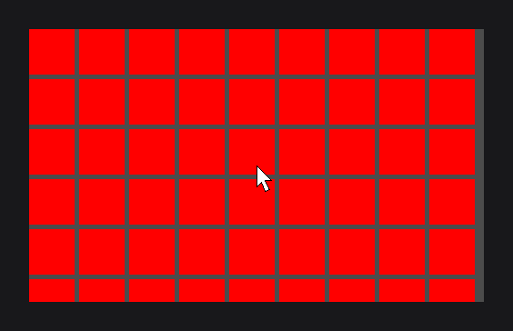

# GridNode

`GridNode` (`dev.joid.lib.ui.node.impl.structure.grid`) places its children from left to right and starts a new row when the next cell would pass its width. Use it for tiles: inventories, galleries, icon pickers. [Layout](../../essentials/layout.md#grids-with-gridnode) introduced it; this page describes how cells wrap and every option.

```java
GridNode
.create(100, 100, 500, 0)
.margin(10D)
.body(grid -> {
	for (int i = 0; i < 18; i++) {
		RectNode.create(0, 0, 80, 80).color(Color.GRAY).attach(grid);
	}
})
.attach(this);
```


The grid ends up 350 high: four rows of 80 and three gaps of 10.

## How cells wrap

- Children are placed in the order of `getChildren()`: attachment order, sorted by z-index.
- Each child is placed after the previous one on the current row, plus the horizontal margin. When its right edge (its creation `x`, its width and the row offset) would pass the width of the grid, it starts a new row instead. The first cell of a row never wraps, even when it is wider than the grid.
- The trailing margin does not count: three cells of 100 fit exactly in a grid of 300.
- A row is as high as its tallest cell; the next row starts below it, plus the vertical margin. Cells of different sizes never overlap.
- The creation position of a child is added to its cell: a child created at (5, 5) sits 5 right and 5 below its cell.
- A child whose own visibility is false takes no cell; the cells after it close the gap.
- The layout runs when the node loads, on every update and on every frame (also while it waits). Changes are picked up on the next frame.

## Margins with horizontalMargin and verticalMargin

`horizontalMargin(double)` sets the gap between two cells of a row, `verticalMargin(double)` the gap between two rows, and `margin(double)` both. Default `0D`.

```java
GridNode
.create(100, 100, 400, 0)
.horizontalMargin(20D)
.verticalMargin(4D)
.body(grid -> {
	RectNode.create(0, 0, 60, 40).color(Color.GRAY).attach(grid);
	RectNode.create(0, 0, 100, 70).color(Color.LIGHTGRAY).attach(grid);
	RectNode.create(0, 0, 40, 40).color(Color.GRAY).attach(grid);
	RectNode.create(0, 0, 120, 40).color(Color.LIGHTGRAY).attach(grid);
	RectNode.create(0, 0, 80, 40).color(Color.GRAY).attach(grid);
	RectNode.create(0, 0, 140, 40).color(Color.LIGHTGRAY).attach(grid);
	RectNode.create(0, 0, 60, 40).color(Color.GRAY).attach(grid);
})
.attach(this);
```

; the second row starts 4 below it.")

Like every setter, the margins follow an expression that reads signals: `margin(this.compact.get() ? 4D : 16D)` changes the spacing of the whole grid when `compact`, a `BooleanSignal` field of the UI, changes.

```java
private final BooleanSignal compact = BooleanSignal.of(false);
```

```java
GridNode.create(100, 100, 500, 0).margin(this.compact.get() ? 4D : 16D).attach(this);
```

## Sizing and overflow

The width never changes. The height depends on the [overflow](overflow-and-scroll.md) of the grid:

| Overflow | Height |
| --- | --- |
| `NONE` (default) | The height of all the rows and the gaps between them, never less than the height given to `create`. It shrinks back when cells are removed or hidden. |
| `HIDDEN`, `SCROLL` | The height given to `create`. The rows below are clipped. |

Pass a height of 0 to `create` to let the grid fit its rows exactly.

## Scrolling a grid

The cells are placed by the layout on every frame, so `SCROLL` on the grid itself does not scroll it. Keep the grid at `NONE`, so that it grows with its rows, and put it in a fixed-size node that scrolls:

```java
RectNode
.create(100, 100, 400, 300)
.color(Color.WHITE)
.overflow(OverflowProperty.SCROLL)
.body(area -> {
	GridNode
	.create(10, 10, 380, 0)
	.margin(10D)
	.body(grid -> {
		for (int i = 0; i < 40; i++) {
			RectNode.create(0, 0, 60, 60).color(i % 2 == 0 ? Color.GRAY : Color.LIGHTGRAY).attach(grid);
		}
	})
	.attach(area);
})
.attach(this);
```



## Reference

| Method | Description |
| --- | --- |
| `create(double x, double y, double width, double height)` | New grid. `height` is the minimum height while the overflow is `NONE`. |
| `horizontalMargin(double)`, `horizontalMargin(Supplier<Double>)` | Gap between two cells of a row. Default `0D`. |
| `verticalMargin(double)`, `verticalMargin(Supplier<Double>)` | Gap between two rows. Default `0D`. |
| `margin(double)`, `margin(Supplier<Double>)` | Sets both margins. |
| `getHorizontalMargin()`, `getVerticalMargin()` | Current margins. |

`GridNode` is `final`; its setters return `GridNode`. Everything else is inherited from `Node` (see [Node Fundamentals](../node-fundamentals.md)).

## Pitfalls

- The layout writes the `x` and `y` of every visible child on every frame: a position given to a child after its creation is replaced.
- A hidden child is not placed at all: it keeps the position of its last layout until it is shown again.
- `SCROLL` or `HIDDEN` on the grid fixes its height: the rows below are cut, not scrollable.

## See also

- Next: [ReorderableFlexNode](reorderable-flex.md)
- [Layout](../../essentials/layout.md)
- [FlexNode](flex.md)
- [Overflow and Scrolling](overflow-and-scroll.md)
- [Node Fundamentals](../node-fundamentals.md)