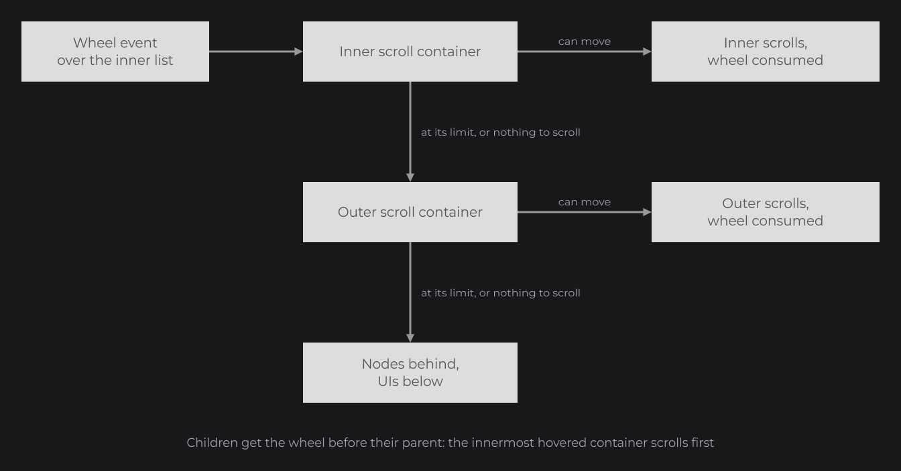
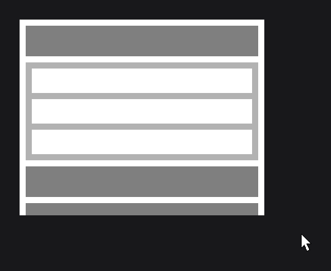

# Overflow and Scrolling

The overflow of a node decides what happens to the children that go beyond its bounds: they spill out, they are clipped, or they scroll with the mouse wheel, from code or with a scrollbar. Every node has it; [Layout](../../essentials/layout.md#clipping-and-scrolling-with-overflow) introduced it, and this page covers `OverflowProperty`, the scroll API every node inherits, nested scroll containers, `ScrollbarNode` and the scroll callbacks.

```java
RectNode
.create(100, 100, 400, 300)
.color(Color.WHITE)
.overflow(OverflowProperty.SCROLL)
.body(area -> {
	FlexNode
	.vertical(10, 10, 380)
	.margin(10D)
	.body(flex -> {
		for (int i = 0; i < 12; i++) {
			RectNode.create(0, 0, 380, 50).color(i % 2 == 0 ? Color.GRAY : Color.LIGHTGRAY).attach(flex);
		}
	})
	.attach(area);
})
.attach(this);
```


The list is 710 high in an area of 300: the wheel scrolls it, and everything outside the area is clipped.

## Clipping with OverflowProperty

`overflow(OverflowProperty)` sets the overflow of a node (`dev.joid.lib.ui.node.property.overflow`).

| Value | Behavior |
| --- | --- |
| `NONE` | Default. The children are drawn wherever they are, also outside the node. |
| `HIDDEN` | The drawing of the node, its children and its layers are clipped to its bounds. |
| `SCROLL` | Clipped like `HIDDEN`, and the content scrolls. |

```java
RectNode
.create(100, 100, 200, 200)
.color(Color.WHITE)
.overflow(OverflowProperty.HIDDEN)
.body(box -> {
	RectNode.create(120, 120, 140, 140).color(Color.GRAY).attach(box);
})
.attach(this);
```


With `HIDDEN` or `SCROLL`, the node becomes the overflow area of its descendants, down to the next descendant that has its own overflow:

- a descendant entirely outside the area is not drawn and `isVisible()` returns `false`;
- a descendant is hovered, and so clickable, only where the mouse is also over the area: the hidden part of a child does not react;
- nested areas combine: a descendant is clipped by every clipping ancestor.

A node detached from a clipping parent (`remove`, `clearChildren`, `append` to another parent) leaves its area: the parent it left does not clip it.

## How scrolling works

A `SCROLL` node scrolls on each axis where its content overflows. The content is measured on every frame from the direct children: their creation position plus their current size. The smallest creation offset is added once more at the end, so the content ends with the gap it starts with.

 at the end.")

- Offsets are negative: `getScrollY()` goes from `0` (start) to `-getMaxScrollY()` (end).
- While the content overflows, the direct children are moved on every frame to their creation position plus the offset, rounded to whole pixels. A position given to a direct child along a scrolling axis is replaced: put one layout child (`FlexNode`, `GridNode` or `ContainerNode`) in the scroll node and arrange the items in it.
- The offset eases toward a target on every frame, at the same speed whatever the frame rate. Every scroll method moves the target; `updateScroll()` jumps to it.
- Setting another overflow on a `SCROLL` node resets its scroll: offsets and maximums go back to `0`, and the children to their creation position.

## Scrolling with the wheel and scrollSpeed

When the mouse is over a visible and enabled `SCROLL` node whose content overflows, each wheel step moves the target by 30 × `scrollSpeed`, twice as much while Left Control is held. Wheel up scrolls toward the start, wheel down toward the end. The wheel scrolls the vertical axis when the content overflows vertically, the horizontal axis otherwise: a horizontal list scrolls with the wheel.

```java
RectNode.create(100, 100, 400, 300).color(Color.WHITE).overflow(OverflowProperty.SCROLL).scrollSpeed(3D).attach(this);
```

A node that overflows on both axes scrolls vertically with the wheel; its horizontal offset moves from code or with a horizontal [scrollbar](#scrollbars-with-scrollbarnode).

## Nested scroll containers

The node consumes a wheel step only when its target can move in that direction. At its limit (top for a wheel up, bottom for a wheel down), or with nothing to scroll, it leaves the step to the next node. Since children receive the wheel before their parent, the innermost hovered container scrolls first and its parent takes over once it reaches its limit, as nested scroll areas chain on the web.



```java
RectNode
.create(100, 100, 400, 320)
.color(Color.WHITE)
.overflow(OverflowProperty.SCROLL)
.body(area -> {
	FlexNode
	.vertical(10, 10, 380)
	.margin(10D)
	.body(flex -> {
		RectNode.create(0, 0, 380, 50).color(Color.GRAY).attach(flex);
		RectNode
		.create(0, 0, 380, 160)
		.color(Color.LIGHTGRAY)
		.overflow(OverflowProperty.SCROLL)
		.body(inner -> {
			FlexNode
			.vertical(10, 10, 360)
			.margin(10D)
			.body(list -> {
				for (int i = 0; i < 6; i++) {
					RectNode.create(0, 0, 360, 40).color(Color.WHITE).attach(list);
				}
			})
			.attach(inner);
		})
		.attach(flex);
		for (int i = 0; i < 5; i++) {
			RectNode.create(0, 0, 380, 50).color(Color.GRAY).attach(flex);
		}
	})
	.attach(area);
})
.attach(this);
```



A [`MultilineTextFieldNode`](../input/multiline-text-field.md) chains the same way: at its limit it leaves the wheel to its parent.

## Scrolling from code with scrollRatioY and scrollOffsetY

| Method | Description |
| --- | --- |
| `scrollRatioX(float)`, `scrollRatioY(float)` | Sets the target to a fraction of the maximum: `0F` is the start, `1F` the end. |
| `scrollOffsetX(double)`, `scrollOffsetY(double)` | Sets the target offset, clamped between `-getMaxScrollX()` / `-getMaxScrollY()` and `0`. |
| `scrollX(double value, double speed)`, `scrollY(double value, double speed)` | Moves the target by `value × speed`: positive toward the start, negative toward the end. |
| `updateScroll()`, `updateScrollX()`, `updateScrollY()` | Sets the offset to the target at once, without easing. |

Two buttons that scroll a list, the white area of the first example kept in a variable (its `body` left out here):

```java
final RectNode list = RectNode.create(100, 100, 400, 300).color(Color.WHITE).overflow(OverflowProperty.SCROLL).attach(this);

RectNode.create(520, 100, 160, 50).color(Color.GRAY).onClick((node, mouseX, mouseY, clickType) -> list.scrollRatioY(1F).updateScroll()).attach(this);
RectNode.create(520, 170, 160, 50).color(Color.GRAY).onClick((node, mouseX, mouseY, clickType) -> list.scrollRatioY(0F)).attach(this);
```

The first button jumps to the end, the second eases back to the top. In the same way, `list.scrollY(-200D, 1D)` eases 200 further down (clamped at the end) and `list.scrollOffsetY(-120D)` eases to an offset of 120 from the start.

The maximum is measured while the node renders: it is `0` before the first frame, and a scroll set before that is clamped to `0`. To open a list at a given position, scroll from `onMount(node -> ...)`: this callback, which every node has, runs on the first frame where the node is drawn, right after the first measure:

```java
RectNode
.create(100, 100, 400, 300)
.color(Color.WHITE)
.overflow(OverflowProperty.SCROLL)
.onMount(area -> area.scrollRatioY(1F).updateScroll())
.body(area -> {
	FlexNode
	.vertical(10, 10, 380)
	.margin(10D)
	.body(flex -> {
		for (int i = 0; i < 30; i++) {
			RectNode.create(0, 0, 380, 50).color(Color.GRAY).attach(flex);
		}
	})
	.attach(area);
})
.attach(this);
```

## Scroll callbacks

| Method | Lambda | Fires |
| --- | --- | --- |
| `onScrollUpdate(NodeScrollUpdateCallback<T>)` | `(node, value)` | On every call that sets a target, on either axis: wheel, `scrollX`/`scrollY`, `scrollOffsetX`/`scrollOffsetY`, `scrollRatioX`/`scrollRatioY`, scrollbar drag, auto-scroll of a [ReorderableFlexNode](reorderable-flex.md). `value` is the requested offset, before clamping. Cancelling the PRE phase leaves the target unchanged. |
| `onScrollEnding(NodeScrollEndingCallback<T>)` | `(node, scrollX, scrollY)` | As soon as the target reaches the end, with the target offsets: the moment to load more content. Once per arrival: again only after the target has left the end. |
| `onScrollEnd(NodeScrollEndCallback<T>)` | `(node, scrollX, scrollY)` | When the eased offset arrives at the end announced by `onScrollEnding`. Not fired when the target leaves the end first, or when the content grows before the offset gets there. |

The interfaces are in `dev.joid.lib.ui.node.callback.impl.scroll`; a lambda runs in the POST phase ([Input and Callbacks](../../concepts/input.md#how-events-travel)), and [Callbacks](../../interactions/callbacks.md) shows how to act in the PRE phase. Here `offset` is an `IntegerSignal` field and `info` a `TextInfo` built from a loaded font (see [Text](../../essentials/text.md)):

```java
private final IntegerSignal offset = IntegerSignal.of(0);
```

```java
RectNode
.create(100, 100, 400, 300)
.color(Color.WHITE)
.overflow(OverflowProperty.SCROLL)
.onScrollUpdate((area, value) -> this.offset.set((int) value))
.onScrollEnd((area, scrollX, scrollY) -> System.out.println("Arrived at " + scrollY))
.attach(this);

TextNode.create(100, 420).text(Text.create("Offset: " + this.offset.get(), this.info)).attach(this);
```

### Loading more with onScrollEnding

`onScrollEnding` fires while the offset still eases toward the end, which leaves time to append items. When the content grows, the end moves away, `onScrollEnd` does not fire and the user keeps scrolling.

```java
private final IntegerSignal items = IntegerSignal.of(6);
```

```java
RectNode
.create(100, 100, 400, 300)
.color(Color.WHITE)
.overflow(OverflowProperty.SCROLL)
.onScrollEnding((area, scrollX, scrollY) -> {
	final FlexNode list = area.getChild(0, FlexNode.class);
	for (int i = 0; i < 4; i++) {
		RectNode.create(0, 0, 380, 50).color(Color.LIGHTGRAY).attach(list);
	}
	this.items.add(4);
})
.body(area -> {
	FlexNode
	.vertical(10, 10, 380)
	.margin(10D)
	.body(flex -> {
		for (int i = 0; i < 6; i++) {
			RectNode.create(0, 0, 380, 50).color(Color.GRAY).attach(flex);
		}
	})
	.attach(area);
})
.attach(this);

TextNode.create(100, 420).text(Text.create("Items: " + this.items.get(), this.info)).attach(this);
```


## Scrollbars with ScrollbarNode

`ScrollbarNode` (`dev.joid.lib.ui.node.impl.structure.scrollbar`) is an abstract node that shows and drives the scroll of a node. The node itself is the thumb; a `BoundingBox` (`dev.joid.lib.utils.box`) is the track it slides along. JOID draws neither: extend it and draw both in `drawScrollbar`, once, in your [UI kit](../../components/ui-kit.md).

```java
public class SimpleScrollbarNode extends ScrollbarNode {

	protected SimpleScrollbarNode(final double x, final double y, final double width, final double height, final @NonNull BoundingBox scroll) {
		super(x, y, width, height, scroll);
	}

	public static @NonNull SimpleScrollbarNode create(final double x, final double y, final double width, final double height, final @NonNull BoundingBox scroll) {
		return new SimpleScrollbarNode(x, y, width, height, scroll);
	}

	@Override
	public void drawScrollbar(final double mouseX, final double mouseY) {
		final BoundingBox scroll = super.getScroll();
		DrawUtils.SHAPE.drawRect(scroll.getMinX(), scroll.getMinY(), scroll.getWidth(), scroll.getHeight(), Color.LIGHTGRAY);
		DrawUtils.SHAPE.drawRect(super.getX(), super.getY(), super.getWidth(), super.getHeight(), Color.GRAY);
	}

}
```

Give it to the scrolling node with `scrollbar(...)`:

```java
RectNode
.create(100, 100, 400, 300)
.color(Color.WHITE)
.overflow(OverflowProperty.SCROLL)
.scrollbar(SimpleScrollbarNode.create(410, 0, 12, 60, BoundingBox.create(410, 0, 12, 300)))
.body(area -> {
	FlexNode
	.vertical(10, 10, 380)
	.margin(10D)
	.body(flex -> {
		for (int i = 0; i < 12; i++) {
			RectNode.create(0, 0, 380, 50).color(i % 2 == 0 ? Color.GRAY : Color.LIGHTGRAY).attach(flex);
		}
	})
	.attach(area);
})
.attach(this);
```


- `scrollbar(ScrollbarNode)` links the scrollbar to the node and loads it when the node already has a UI. Do not `attach` a scrollbar: it is not a child. A new call replaces the previous one.
- The coordinates of the thumb and the track are relative to the scrolling node. The scrollbar is drawn after the content, outside the clip, so it can sit beside the node.
- It drives the axis of its track: horizontal when the track is wider than tall (`isHorizontal()`), vertical otherwise. It is drawn only while the overflow is `SCROLL` and the content overflows on that axis.
- Create the thumb at the start of the track. It travels `getScrollWidth()` (track width minus thumb width) or `getScrollHeight()`.
- Pressing the thumb consumes the press and starts a drag: the center of the thumb follows the mouse inside the track, the scroll target follows the thumb, and the content eases faster than with the wheel. Releasing the button that started the drag ends it.
- The scrollbar receives the mouse and key events of the scrolling node before its children.

## Reference

### Node

| Method | Description |
| --- | --- |
| `overflow(OverflowProperty)`, `overflow(Supplier<OverflowProperty>)` | Overflow. Default `NONE`. |
| `scrollSpeed(double)`, `scrollSpeed(Supplier<Double>)` | Multiplier of the wheel step. Default `1D`. |
| `scrollbar(ScrollbarNode)` | Links a scrollbar. |
| `scrollRatioX(float)`, `scrollRatioY(float)` | Target as a fraction of the maximum. |
| `scrollOffsetX(double)`, `scrollOffsetY(double)` | Target offset, clamped. |
| `scrollX(double value, double speed)`, `scrollY(double value, double speed)` | Moves the target by `value × speed`. |
| `updateScroll()`, `updateScrollX()`, `updateScrollY()` | Jumps to the target. |
| `onScrollUpdate`, `onScrollEnding`, `onScrollEnd` | Callbacks. |
| `getOverflow()`, `getScrollSpeed()`, `getScrollbar()` | Settings (`getScrollbar()` is `null` without one). |
| `getScrollX()`, `getScrollY()` | Current offset, between `-getMaxScrollX()` / `-getMaxScrollY()` and `0`. |
| `getTargetScrollX()`, `getTargetScrollY()` | Target offset. |
| `getMaxScrollX()`, `getMaxScrollY()` | Scroll distance available, measured on the last frame. `0` when the content fits or the overflow is not `SCROLL`. |
| `hasOverflowX()`, `hasOverflowY()` | `true` when the maximum on that axis is above `0`. |
| `isScrollEndX()`, `isScrollEndY()` | `true` from `onScrollEnding` until the offset arrives at the end. |

### ScrollbarNode

| Method | Description |
| --- | --- |
| `ScrollbarNode(double x, double y, double width, double height, BoundingBox scroll)` | Protected constructor: thumb bounds and track. |
| `drawScrollbar(double mouseX, double mouseY)` | Abstract: draws the track and the thumb. |
| `scrollNode(Node)`, `getScrollNode()` | The scrolled node, set by `Node.scrollbar(...)`. Nothing is drawn without one. |
| `getScroll()` | The track. |
| `getScrollWidth()`, `getScrollHeight()` | Travel of the thumb: track size minus thumb size. |
| `isHorizontal()` | `true` when the track is wider than tall. |
| `isDragging()`, `getDragButton()` | Drag state, and the button that started it (or `null`). |

## Pitfalls

- `FlexNode`, `GridNode` and `ReorderableFlexNode` place their children on every frame, so `SCROLL` on them does not scroll: keep them at `NONE`, so that they grow, and wrap them in a fixed-size node with `SCROLL`.
- A direct child of a scrolling node is moved on every frame: arrange the items inside one layout child.
- The maximum is `0` before the first frame: scroll from `onMount`, not in `init()`.
- With overflow on both axes, the wheel only scrolls vertically: give the horizontal axis a scrollbar or scroll it from code.
- `onScrollUpdate` does not tell the axis: on a node that scrolls both ways, read `getTargetScrollX()` and `getTargetScrollY()`.

## See also

- Next: [RectNode](../visual/rect.md)
- [Layout](../../essentials/layout.md)
- [FlexNode](flex.md)
- [ReorderableFlexNode](reorderable-flex.md)
- [Callbacks](../../interactions/callbacks.md)
- [Mouse and Keyboard](../../interactions/mouse-and-keyboard.md)