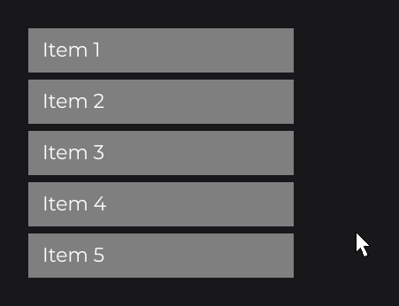
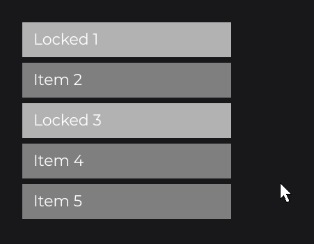
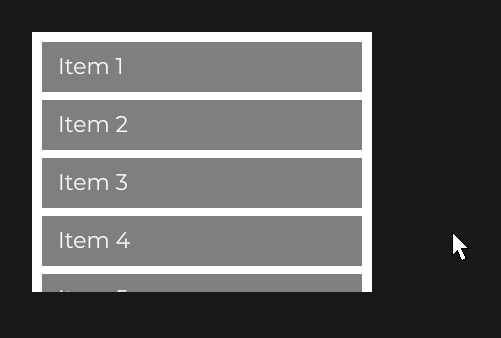

# ReorderableFlexNode

`ReorderableFlexNode` (`dev.joid.lib.ui.node.impl.structure.reorderable`) is a column or row laid out like a [FlexNode](flex.md) whose children the user reorders by dragging them: the other children slide aside, the dropped child glides to its slot, and callbacks report the new order. Use it for playlists, task lists, tab bars and any list sorted by hand.

```java
ReorderableFlexNode
.vertical(100, 100, 300)
.margin(8D)
.onReorderEnd((flex, child, oldIndex, newIndex) -> System.out.println(oldIndex + " -> " + newIndex))
.body(flex -> {
	for (int i = 0; i < 5; i++) {
		final int index = i;
		RectNode
		.create(0, 0, 300, 50)
		.color(Color.GRAY)
		.hoveredColor(Color.DARKGRAY)
		.body(item -> {
			TextNode.create(16, 11).text(Text.create("Item " + (index + 1), this.info)).attach(item);
		})
		.attach(flex);
	}
})
.attach(this);
```



Dropping Item 1 on the fourth slot prints `0 -> 3`. `info` is a `TextInfo` built from a loaded font (see [Text](../../essentials/text.md)).

## Creating a ReorderableFlexNode

`ReorderableFlexNode` is `final` and its constructor is private: create it with its two factories.

| Factory | Direction | Fixed size | Computed size |
| --- | --- | --- | --- |
| `vertical(double x, double y, double width)` | `COLUMN` | `width` | Height, from the children |
| `horizontal(double x, double y, double height)` | `ROW` | `height` | Width, from the children |

The layout follows the rules of [FlexNode](flex.md): children in the order of `getChildren()`, their creation position added to their slot, `margin` between visible children, hidden children taking no room, main size computed from the children. `margin`, `align` and `direction` work the same way.

## Dragging with the mouse

With `autoDrag(true)` (default), a left press over a child starts dragging it, unless the press is already consumed (for example by an `onClick` on the child or one of its descendants), the list is disabled, another child is being dragged, or the child is locked. The press that starts a drag is consumed: the parents' `onClick` callbacks do not run.

While dragging:

- the child follows the mouse along the main axis, keeping the point where it was grabbed, and stays within the list;
- it is drawn above the other children (its z-index is raised to `Integer.MAX_VALUE` until the drop, then restored);
- it changes slot when its leading edge (top or left) passes the middle of a neighbor, and the other children glide to their new place.

Releasing any mouse button drops the child: it glides to its slot, then the new order is written to `getChildren()` and `onReorderEnd` runs. The dragged child also fires its own `onDragStart`, `onDrag` (every frame) and `onDragEnd` callbacks (see [Drag and Drop](../../interactions/drag-drop.md)).

## Locking children with lock

`lock(Node...)` pins children to their slot: a locked child cannot be dragged (neither by a press nor by `startDrag`), and no move of another child shifts it. The other children skip the locked slots: dropping a child on a locked slot places it on the nearest free slot on the side it comes from. `unlock(Node...)` frees them again and `isLocked(Node)` tells whether a child is locked.

```java
final ReorderableFlexNode list = ReorderableFlexNode.vertical(100, 100, 300).margin(8D).attach(this);
for (int i = 1; i <= 5; i++) {
	final boolean locked = i == 1 || i == 3;
	final RectNode item = RectNode
			.create(0, 0, 300, 50)
			.color(locked ? Color.LIGHTGRAY : Color.GRAY)
			.hoveredColor(locked ? Color.LIGHTGRAY : Color.DARKGRAY)
			.attach(list);
	TextNode.create(16, 11).text(Text.create((locked ? "Locked " : "Item ") + i, this.info)).attach(item);
	if (locked) {
		list.lock(item);
	}
}
```



## Drag handles with auto and startDrag

`autoDrag(false)` turns off the drag on press; start drags from your own code with `startDrag(Node child)`, for example from a handle. `startDrag` uses the current mouse position of the UI and does nothing while another child is dragged or when the child is locked.

```java
final ReorderableFlexNode list = ReorderableFlexNode.vertical(100, 100, 300).margin(8D).autoDrag(false).attach(this);
for (int i = 0; i < 5; i++) {
	final RectNode item = RectNode.create(0, 0, 300, 50).color(Color.GRAY).attach(list);
	RectNode
	.create(0, 0, 40, 50)
	.color(Color.DARKGRAY)
	.onClick((handle, mouseX, mouseY, clickType) -> list.startDrag(item))
	.attach(item);
}
```

`endDrag()` drops the dragged child as a mouse release would.

## Auto-scroll in a scrolling parent

Put the list in a fixed-size node with `OverflowProperty.SCROLL` (see [Overflow and Scrolling](overflow-and-scroll.md)). During a drag, once the mouse has moved 5 units, the list looks up its ancestors for the first scrolling node whose content overflows. When the mouse is within 60 units of its edge along the list's axis, that node scrolls toward the edge, faster as the mouse goes deeper (up to 2 units per frame). A column scrolls its ancestor vertically, a row horizontally; an ancestor that only scrolls on the other axis does not move.

```java
RectNode
.create(100, 100, 340, 260)
.color(Color.WHITE)
.overflow(OverflowProperty.SCROLL)
.body(area -> {
	ReorderableFlexNode
	.vertical(10, 10, 320)
	.margin(8D)
	.body(flex -> {
		for (int i = 0; i < 10; i++) {
			final int index = i;
			RectNode
			.create(0, 0, 320, 50)
			.color(Color.GRAY)
			.hoveredColor(Color.DARKGRAY)
			.body(item -> {
				TextNode.create(16, 11).text(Text.create("Item " + (index + 1), this.info)).attach(item);
			})
			.attach(flex);
		}
	})
	.attach(area);
})
.attach(this);
```



## Reorder callbacks

| Method | Lambda | Fires |
| --- | --- | --- |
| `onReorderStart(NodeReorderStartCallback)` | `(flex, child)` | When a drag starts, from a press or from `startDrag`. Cancelling the PRE phase refuses the drag and leaves the press to the other nodes. |
| `onReorder(NodeReorderCallback)` | `(flex, child)` | Each time the dragged child moves to another slot. In the POST phase `flex.getCurrentIndex()` is the new slot. Cancelling the PRE phase keeps the child on its current slot. |
| `onReorderEnd(NodeReorderEndCallback)` | `(flex, child, oldIndex, newIndex)` | Once the dropped child has settled and `getChildren()` holds the new order. `oldIndex` equals `newIndex` for a drop in place. The order is already applied: cancelling the PRE phase only skips the POST phase. |

The callback interfaces are in `dev.joid.lib.ui.node.impl.structure.reorderable.callback`; `flex` is the `ReorderableFlexNode` and `child` the dragged `Node`. Their ids are public: `ReorderableFlexNode.CALLBACK_REORDER_START`, `CALLBACK_REORDER` and `CALLBACK_REORDER_END`.

As [Input and Callbacks](../../concepts/input.md#how-events-travel) shows, a lambda runs in the POST phase, after the behavior of the node. To act before it, implement the callback interface: `apply` is the method a lambda would fill, and `pre` runs first, with an `InternalContext` (`dev.joid.lib.utils.context`) whose `cancel()` refuses the move. A PRE phase that freezes the order while a signal is true:

```java
final BooleanSignal frozen = BooleanSignal.of(true);

ReorderableFlexNode
.vertical(100, 100, 300)
.onReorder(new NodeReorderCallback() {

	@Override
	public void apply(final @NonNull ReorderableFlexNode flex, final @NonNull Node child) {}

	@Override
	public void pre(final @NonNull ReorderableFlexNode flex, final @NonNull InternalContext context, final @NonNull Node child) {
		if (frozen.peek()) {
			context.cancel();
		}
	}

})
.attach(this);
```

`peek()` reads the signal without following it. To keep a child in place for good, `lock` it rather than refusing its moves. Every phase and the exact order are in [Callbacks](../../interactions/callbacks.md).

## Order during a drag

During a drag, the order shown on screen is the logical order (`getLogicalOrder()`); `getChildren()` keeps the committed order, with the dragged child moved to the end so that it draws on top, until the drop completes. Children appended during a drag join the end of the logical order and keep that place; children removed during a drag leave it.

| Method | Description |
| --- | --- |
| `getChildIndex(Node child)` | Index of `child` in `getChildren()`. Throws `IllegalArgumentException` when it is not a child. |
| `getLogicalOrder()` | The live order during a drag, dragged child included. Empty outside a drag. |
| `getCurrentIndex()` | Slot targeted by the dragged child. |
| `getInitialIndex()` | Slot the dragged child started from. |
| `getReorderedNode()` | The dragged child, or `null`. |
| `isDragging(Node child)` | `true` while `child` is dragged, drop animation included. |
| `isReleasing()` | `true` while the dropped child glides to its slot. |

## Detaching during a drag

- When the list is detached during a drag (UI closed or reloaded, `remove`, `clearChildren` of its parent), the child is dropped at once on its current slot: `onDragEnd` and `onReorderEnd` run as for a normal drop.
- When the dragged child itself is removed from the list, the drag ends: its z-index is restored, `onDragEnd` runs and `onReorderEnd` receives `newIndex` = `-1`.

## Reference

| Method | Description |
| --- | --- |
| `vertical(double x, double y, double width)`, `horizontal(double x, double y, double height)` | Factories. |
| `margin(double)`, `margin(Supplier<Double>)` | Gap between visible children. Default `0D`. |
| `align(Align)`, `align(Supplier<Align>)` | Cross-axis alignment, or `null` to keep the children's own cross position. Default `null`. |
| `direction(FlexDirection)`, `direction(Supplier<FlexDirection>)` | `COLUMN` or `ROW`. |
| `autoDrag(boolean)`, `autoDrag(Supplier<Boolean>)` | Whether a press on a child starts a drag. Default `true`. |
| `lock(Node...)`, `unlock(Node...)` | Pin children to their slot, or free them. |
| `isLocked(Node)`, `getLockedNodes()` | Lock state. |
| `startDrag(Node)`, `endDrag()` | Start or drop a drag from code. |
| `onReorderStart`, `onReorder`, `onReorderEnd` | Callbacks. |
| `getMargin()`, `getAlign()`, `getDirection()`, `isAutoDrag()` | Current settings. |
| `getChildIndex(Node)`, `getLogicalOrder()`, `getCurrentIndex()`, `getInitialIndex()`, `getReorderedNode()`, `isDragging(Node)`, `isReleasing()` | Drag state. |

The setters return `ReorderableFlexNode`. Everything else is inherited from `Node` (see [Node Fundamentals](../node-fundamentals.md)).

## Pitfalls

- `overflow(OverflowProperty.SCROLL)` on the list itself does not scroll it: wrap it in a scrolling node, which also gives the auto-scroll.
- An `onClick` that consumes the press on a child (or a descendant) prevents the drag of that child: keep clickable parts small, or drag from a handle with `autoDrag(false)`.
- `getDraggedNode()`, inherited from `Node`, is the copy of a [`COPY` drag](../../interactions/drag-drop.md) and stays `null` here: use `getReorderedNode()`.
- Lock nodes that are children of the list: `lock` accepts any node and only the children's slots are kept.

## See also

- Next: [Overflow and Scrolling](overflow-and-scroll.md)
- [FlexNode](flex.md)
- [Drag and Drop](../../interactions/drag-drop.md)
- [Callbacks](../../interactions/callbacks.md)