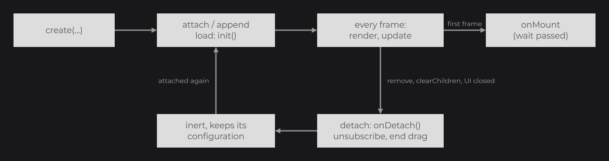

# Node Fundamentals

[Nodes and the Node Tree](../concepts/nodes.md) showed how to create nodes, attach them, build a tree with `body`, chain their setters, hide them and order them. This first guide goes through the whole API that every node inherits from `Node` (`dev.joid.lib.ui.node`): the tree in detail, placement and sizing, visibility, drawing order and layers, the lifecycle, waiting and skeletons, and copies. Every property setter takes the four kinds of values of [Signals and Reactivity](../concepts/signals.md): a plain value, an expression that reads signals, a signal or a lambda.

## A first node tree

```java
import dev.joid.lib.color.Color;
import dev.joid.lib.ui.core.UI;
import dev.joid.lib.ui.node.impl.design.shape.RectNode;

public class ShopUI extends UI {

	@Override
	public void init() {
		RectNode
		.create(560, 240, 800, 600)
		.color(Color.DARKGRAY)
		.body(panel -> {
			RectNode.create(20, 20, panel.aw(-40), 80).color(Color.GRAY).attach(panel);
			RectNode.create(20, 120, panel.dw(2) - 30, panel.ah(-140)).color(Color.LIGHTGRAY).attach(panel);
		})
		.attach(this);
	}

}
```

.")

- `create(...)` builds a node. Each node type has its own static factories.
- `body(...)` runs the lambda right away with the node, so you can build its children inline.
- `attach(panel)` appends a child to `panel`; `attach(this)` adds the panel at the top level of the UI.
- Children are placed relative to their parent: the header is drawn at (580, 260) on the canvas.

## Building the tree

### Factories

Every concrete node exposes static factories: `RectNode.create(x, y, width, height)`, `FlexNode.vertical(x, y, width)`, `ContainerNode.create(parent)`, and so on. Constructors are `protected` or `private`. A freshly created node has no UI and no parent until you attach it.

### attach and append

| Method | Description |
| --- | --- |
| `attach(Node parent)` | Appends this node to `parent` (same as `parent.append(this)`). Returns this node. |
| `attach(UI ui)` | Adds this node at the top level of `ui` (`ui.add(this)`) and loads it immediately. Returns this node. |
| `append(Node... nodes)` | Appends the nodes, in order, as children of this node. Each child gets this node as parent and is loaded immediately when this node already belongs to a UI. Returns this node. |
| `remove(Node... nodes)` | Removes the nodes from the children of this node: each one is detached (`fireDetach()`, see [Lifecycle](#lifecycle)) and loses its parent. Nodes that are not children are ignored. Returns this node. |

Children appended before their tree is attached are loaded together with it, so you can build a whole tree first and attach its root last:

```java
final ContainerNode toolbar = ContainerNode.create(0, 0, 1920, 80);
final RectNode back = RectNode.create(20, 20, 40, 40).color(Color.WHITE);
final RectNode close = RectNode.create(1860, 20, 40, 40).color(Color.LIGHTGRAY);
toolbar.append(back, close).attach(this);
```

Each appended child fires the parent's `onAppend` callbacks; cancelling their PRE phase skips that child (see [Callbacks](../interactions/callbacks.md)).

> NOTE: A node has a single parent. Appending a node that already has another parent moves it: it is first removed from that parent with `remove(...)`, which detaches it, then appended and loaded again. A top-level node of a UI leaves the UI's node list the same way. Appending a node again to the same parent loads it again and moves it to the end of its z-index group.

### body

| Method | Description |
| --- | --- |
| `body(Consumer<T> consumer)` | Runs `consumer` immediately with this node and stores it. Returns this node. |
| `body(Runnable runnable)` | Same without the node parameter. |
| `getBodyConsumer()` | The stored consumer (`null` when `body` was never called). |

`WatchProperty.BODY` runs the stored consumer again when a watched signal changes, which rebuilds the children from fresh data, as in [Layout](../essentials/layout.md#rebuilding-a-list-with-watch) ([Watching Signals](../state/watch.md) has every option):

```java
final IntegerSignal count = IntegerSignal.of(3);

FlexNode
.vertical(100, 100, 300)
.margin(10)
.watch(count, WatchProperty.CLEAR_CHILDREN, WatchProperty.BODY)
.body(flex -> {
	for (int i = 0; i < count.peek(); i++) {
		RectNode.create(0, 0, 300, 50).color(Color.GRAY).attach(flex);
	}
})
.attach(this);
```

### self

| Method | Description |
| --- | --- |
| `self(Consumer<T> consumer)` | Runs `consumer` immediately with this node. Returns this node. The consumer is not stored. |

`self` hands you the node in the middle of a chain, to configure it from its own values, such as an effect that reads its hover progress. Unlike `body(Consumer)`, it keeps the stored body consumer, so `WatchProperty.BODY` does not run it again:

```java
RectNode
.create(100, 100, 300, 200)
.color(Color.WHITE)
.self(node -> node.effect(RoundedNodeEffect.create(() -> 8F + node.hoverValue(16F))))
.attach(this);
```

### Chaining and generic return types

Most setters are declared as `<T extends Node> T method(...)`: the compiler infers `T` from where the result goes.

- Assigned to a variable or passed as an argument, `T` is the expected type: `final RectNode card = RectNode.create(0, 0, 200, 100).anchor(Align.CENTER);`.
- In the middle of a chain, a `Node` setter returns `Node`, so the setters of the concrete type are out of reach after it. Call the type-specific setters first (`color` of `RectNode`, `margin` of `FlexNode`), then the `Node` ones, or give the type explicitly: `RectNode.create(0, 0, 200, 100).<RectNode>anchor(Align.CENTER).color(Color.WHITE)`.
- Lambda parameters follow the same rule: in `RectNode.create(...).body(rect -> ...)`, `rect` is a `Node`. Type the parameter to get the concrete type: `.body((final RectNode rect) -> rect.color(Color.WHITE))`.

### Removing nodes

| Code | Effect |
| --- | --- |
| `node.clearChildren()` | Detaches every child (runs `fireDetach()` on each subtree), empties the children list and clears the parent of each child, as `remove(...)` does. Returns the node. |
| `node.remove(child...)` | Detaches the children (runs `fireDetach()` on each subtree), removes them from the list and clears their parent. Returns the node. |
| `node.getChildren().remove(child)` | Removes one child from the list only. Its detach hooks do not run: prefer `remove(...)`. |
| `ui.getNodeList().remove(node)` | Removes a top-level node from its UI (see [The UI Class](../ui/ui-class.md)). |

Layout nodes close the gap left by a removed child on the next frame.

## Position and size

Positions and sizes are units of the 1920×1080 virtual canvas, fitted to the window without stretching; wider or taller windows show extra canvas around it (see [The Virtual Canvas](../concepts/canvas.md)).


With the default `PositionProperty.RELATIVE`, `x` and `y` are relative to the parent's position; top-level nodes are relative to the UI origin.

| Method | Description |
| --- | --- |
| `x(double x)`, `x(Supplier<Double> x)`, `y(...)` | Sets the position on one axis. |
| `width(double width)`, `width(Supplier<Double> width)`, `height(...)` | Sets the size on one axis. |
| `getX()`, `getY()`, `getWidth()`, `getHeight()` | Current position and size. `w()` and `h()` are short aliases of `getWidth()` and `getHeight()`. |

All setters return the node. One setter sets one property: `RectNode.create(0, 0, 100, 40).x(this.offset.get()).width(this.size.get() * 2D)` follows each signal separately.

### Default bounds

The values given to the factory are kept as the default bounds: `getDefaultX()`, `getDefaultY()`, `getDefaultWidth()`, `getDefaultHeight()`. Setters never change them. Layout nodes and scroll containers place each child from its default position: a child of a vertical `FlexNode` created at `y = 5` sits 5 units below its slot, and the children of a scrolling node are moved to their default position plus the scroll offset on every frame.

### Absolute coordinates with getAbsoluteX

| Method | Description |
| --- | --- |
| `getAbsoluteX()`, `getAbsoluteY()` | Position on the UI canvas: the node's position plus the absolute position of its parent. For an `ABSOLUTE` node, its own `x`/`y`. Compare these with the mouse coordinates given to callbacks. |
| `getAbsoluteDefaultX()`, `getAbsoluteDefaultY()` | The parent's current absolute position plus this node's default position (the default position itself for an `ABSOLUTE` node). |
| `toDrawX(double x)`, `toDrawY(double y)` | A canvas coordinate, such as the mouse, in the space the node draws in (its `getX()`, `getY()` there): `getX() + x - getAbsoluteX()`. A node that follows the mouse in `draw` uses them. |

### Relative helpers dw, dh, mw, mh, aw, ah, ax, ay

The helpers read the node's current values. Use them on the parent inside `body` to place children.

| Helper | Returns | On a 200×100 node at (10, 20) |
| --- | --- | --- |
| `w()` / `h()` | width / height | `w()` = 200 |
| `dw(v)` / `dh(v)` | width ÷ `v` / height ÷ `v` | `dw(4)` = 50 |
| `mw(v)` / `mh(v)` | width × `v` / height × `v` | `mw(0.25)` = 50 |
| `aw(v)` / `ah(v)` | width + `v` / height + `v` | `aw(-10)` = 190 |
| `ax(v)` / `ay(v)` | x + `v` / y + `v` | `ax(5)` = 15 |

```java
RectNode
.create(100, 100, 400, 300)
.color(Color.DARKGRAY)
.body(card -> {
	RectNode.create(card.dw(2) - 50, card.dh(2) - 25, 100, 50).color(Color.WHITE).attach(card);
	RectNode.create(card.aw(-110), card.ah(-60), 100, 50).color(Color.LIGHTGRAY).attach(card);
})
.attach(this);
```

 and dh(2) center the white child; aw and ah place the light gray one 10 units from the corner.")

The first child is centered in the card; the second sits 10 units from its bottom-right corner. `ax` and `ay` add to the node's own position, which is expressed in its parent's space: use them to place siblings.

### PositionProperty

`position(PositionProperty position)` sets how `x`/`y` are interpreted. `PositionProperty` is in `dev.joid.lib.ui.node.property.position`.

| Value | Description |
| --- | --- |
| `RELATIVE` | Default. `x`/`y` are relative to the parent. |
| `ABSOLUTE` | `x`/`y` are relative to the UI origin, whatever the parents. The node still belongs to its parent: it follows the parent's visibility, clipping and drawing order, and its own children are placed relative to it. |

```java
ContainerNode
.create(200, 300, 400, 400)
.body(container -> {
	RectNode.create(30, 40, 20, 20).color(Color.WHITE).position(PositionProperty.ABSOLUTE).attach(container);
})
.attach(this);
```

The white square is drawn at (30, 40) on the canvas. `getPosition()` returns the current value.

### Anchors with anchor, anchorX and anchorY

An anchor decides which point of the node stays in place when its size changes. On every rendered frame where the width or height differs from the previous frame, JOID moves `x`/`y` so that the anchored point keeps its position. `Align` is in `dev.joid.lib.utils.align`.

| Method | Description |
| --- | --- |
| `anchor(Align anchor)` | Sets both anchors to the same value. |
| `anchorX(Align anchorX)`, `anchorY(Align anchorY)` | Sets one anchor (value or `Supplier`). |
| `getAnchorX()`, `getAnchorY()` | Current anchors. Default: `Align.START`. |

| `Align` | Point that stays in place |
| --- | --- |
| `START` | Left or top edge (default). |
| `CENTER` | Center. |
| `END` | Right or bottom edge. |

An anchor is the point that stays fixed when the size changes, not an offset. It does not move a node that already has its final size. It matters for nodes whose size is computed after creation, such as a `TextNode` created without a size or a `FlexNode` that grows with its children: their anchored point ends up at the `x`/`y` you gave.

```java
FlexNode
.horizontal(960, 490, 100)
.margin(10)
.anchorX(Align.CENTER)
.body(flex -> {
	for (int i = 0; i < 3; i++) {
		RectNode.create(0, 0, 100, 100).color(Color.LIGHTGRAY).attach(flex);
	}
})
.attach(this);
```

The row stays centered on x = 960 whatever the number of children.

### Aspect ratio

`aspectRatio(double aspectRatio)` keeps `width / height` equal to the ratio. On every rendered frame, when the width is not 0 the height becomes `width / ratio`; otherwise, when the height is not 0, the width becomes `height × ratio`. A 0×0 node stays empty. The default, `-1`, disables it; `getAspectRatio()` returns the value.

```java
RectNode.create(0, 0, 320, 0).color(Color.GRAY).aspectRatio(16D / 9D).attach(this);
```

> NOTE: When a node's position changes between two frames (scroll, drag, tween, layout or your own code), JOID moves the drawing of the node and its subtree by whole screen pixels so the content does not shimmer; once the node stops moving, it is drawn at its exact position. See [Drawing Overview](../drawing/draw-utils.md) for the pixel grid.

## Visibility and enabled state

| Method | Description |
| --- | --- |
| `visible(boolean visible)`, `visible(Supplier<Boolean> visible)` | A fixed value, a followed expression or signal (`visible(this.open)`), or a lambda. Default: visible. |
| `visible(Predicate<T> visible)` | A predicate on the node, evaluated on each check. |
| `enabled(boolean enabled)`, `enabled(Supplier<Boolean> enabled)`, `enabled(Predicate<T> enabled)` | Same for the enabled state. Default: enabled. |
| `interactive(boolean interactive)`, `interactive(Supplier<Boolean> interactive)`, `interactive(Predicate<T> interactive)` | Same for the mouse: a node that is not interactive is drawn but lets the mouse through to the nodes behind it (see [Letting the mouse through with interactive](../interactions/mouse-and-keyboard.md#letting-the-mouse-through-with-interactive)). Default: interactive. |
| `isVisible()` | `true` when the parent is visible, the node is not entirely outside its [overflow area](layout/overflow-and-scroll.md), and its own predicate passes. |
| `isVisibleProperty()` | The node's own predicate only. Layout nodes use it to give no room to hidden children. |
| `isEnabled()` | `true` when the parent is enabled and the node's own predicate passes. |
| `getVisible()`, `getEnabled()` | The predicates themselves. |

The state is evaluated each time it is checked (several times per frame). A `BooleanSignal` goes as is:

```java
private final BooleanSignal open = BooleanSignal.of(false);

RectNode
.create(660, 340, 600, 400)
.color(Color.DARKGRAY)
.visible(this.open)
.attach(this);
```

| | Hidden (`isVisible()` is `false`) | Disabled (`isEnabled()` is `false`) |
| --- | --- | --- |
| Drawn | No, nor its subtree | Yes |
| Hover state, hover callbacks, `onClick`, wheel scrolling, drag start | No | No |
| Tooltips | No | Yes |
| Update ticks (`update`, `onUpdate`) | Yes | Yes |
| Per-frame work: anchors, animators, scroll easing, drag movement, `onMount` | Paused | Yes |
| Children | Hidden too | Disabled too: `enabled` is inherited like `visible` |

## Drawing order and depth

### zindex

`zindex(int zindex)` sets the node's position in its parent's children list (default `0`); `getZindex()` reads it, and `getIndex()` returns the same value as the sorting key.

- Children stay sorted by ascending z-index. Children with the same z-index keep their attachment order.
- Calling `zindex(...)` sorts the node again and moves it to the end of its z-index group: re-applying the current value brings a node in front of its equals.
- A node draws its children with a negative z-index first, then itself (`draw`), then its other children in ascending order, then its [layers](#layers-with-layer).
- Input events and tooltips go the other way: children with a z-index of 0 or more from the highest, then the node, then the children with a negative z-index. What is drawn on top receives the event first.

For top-level nodes, the z-index also places the node relative to the UI's drawing hooks (see [The UI Class](../ui/ui-class.md)):

| Top-level z-index | Drawn |
| --- | --- |
| Below 0 | Before `preDraw` |
| 0 to 99 | Between `preDraw` and `postDraw` |
| 100 and above | After `postDraw` |

### Layers with layer

A `INodeLayer` (`dev.joid.lib.ui.node.layer`) is a functional interface, `draw(double mouseX, double mouseY)`, drawn after the node's children. Use it for overlays drawn above the children, such as a badge or a selection frame.

| Method | Description |
| --- | --- |
| `layer(INodeLayer layer)` | Adds a layer after the existing ones. |
| `layer(int index, INodeLayer layer)` | Inserts a layer at `index` in the list. |
| `clearLayers()` | Removes every layer. |
| `getLayerList()` | The layers, in drawing order. |

Layers draw in the same space as the node's own `draw`, the parent's origin, so offset them by the node's position:

```java
final RectNode card = RectNode.create(100, 100, 300, 200).color(Color.DARKGRAY);
card.layer((mouseX, mouseY) -> DrawUtils.SHAPE.drawRect(card.getX() + card.aw(-20), card.getY() + 10, 10, 10, Color.WHITE)).attach(this);
```


Layers are drawn inside the node's clip when its overflow is `HIDDEN` or `SCROLL`.

### zlevel

`zlevel(double zlevel)` translates the node and its subtree by `zlevel` along the depth axis of the render matrix (default `0`); `getZlevel()` reads it. It changes neither the drawing order nor the event order (use `zindex` for that); it only matters for rendering that depends on depth.

## Children

| Method | Description |
| --- | --- |
| `getChildren()` | The live children list, an `IndexedConcurrentList<Node>` sorted by z-index. |
| `getChildren(Class<T> clazz)` | A new `IndexedLinkedList<T>` with the children that are instances of `clazz` (subclasses included), in drawing order. |
| `getChild(int index, Class<T> clazz)` | The `index`-th child that is an instance of `clazz`, or `null`. |
| `getParent()` | The parent node, or `null` for a top-level node. |
| `getUi()` | The UI the node belongs to, typed by the expected type (`final ShopUI ui = node.getUi();`). While a UI's `init()` runs, a node without UI returns that UI without keeping it: `hasUi()` stays `false` until the node is loaded. Otherwise `null` until the node is loaded. |
| `hasUi()` | `true` once the node has a UI. |

The children list (`dev.joid.lib.utils.list`, see [Utilities](../reference/utilities.md)) offers:

| Method | Description |
| --- | --- |
| `ordered()` | The children in drawing order, as a `List`. |
| `reversed()` | The children in event order. |
| `get(int)`, `getFirst()`, `getLast()` | Access by position (`getFirst()`/`getLast()` return `null` when empty). |
| `size()`, `isEmpty()`, `contains(Node)` | Queries. |
| `recursive()` | A new list with every descendant, each node followed by its own subtree. |
| `remove(Node)` | Removes a child without detaching it. |
| `add(Node)` | Inserts at the z-index position without setting the parent or loading the child: use `append` instead. |
| `copy()` | A snapshot of the list. |

The list is copy-on-write, so callbacks can append or remove children while the tree is being drawn.

Reading the rectangles of a `panel` node:

```java
final ContainerNode panel = ContainerNode.create(100, 100, 600, 200).attach(this);
final RectNode second = panel.getChild(1, RectNode.class);
for (final RectNode tile : panel.getChildren(RectNode.class)) {
	tile.color(Color.GRAY);
}
```

## Lifecycle



| Stage | Trigger | What runs |
| --- | --- | --- |
| Creation | The factory | The constructor. `body` and `self` consumers run as soon as you call them. |
| Load | `attach` to a UI, `append` to a node that has a UI, the UI opening, a reload | `load(UI)`, wrapped by the `onInit` callbacks: the children are loaded first, then the scrollbar and skeleton, then the effects' `init`, then the node's `init(UI)` hook. A node loaded again after a detach then subscribes again to its signals (see below). |
| Frame | Every frame, while visible | `render(mouseX, mouseY)`: anchors and aspect ratio, hover, animators, scroll, drag, mount check, then drawing (wrapped by `onRender`, with `draw` wrapped by `onDraw`). |
| Update | Each update tick of the UI bridge (once per frame, before drawing, in the bundled demo windows) | `fireUpdate()`: the children first, then the node's `update()` hook, wrapped by the `onUpdate` callbacks. Runs for hidden nodes too. |
| Mount | The first rendered frame in which `isMounted()` is `true` | The `onMount` callbacks. Without [wait conditions](#waiting-and-skeletons), this is the node's first rendered frame. |
| Detach | `clearChildren()` or `remove(...)` on the parent, an `append` that moves the node to another parent, `WatchProperty.CLEAR_CHILDREN`, the UI closing or reloading | `fireDetach()`: the children first, then the scrollbar and the skeleton, then the node unsubscribes from its signals, ends its interactions (see below), runs the `detach` hook of its effects and its own `detach()` hook, all wrapped by the `onDetach` callbacks. When the node leaves its parent, it also forgets the overflow area of its former container (see `getOverflowArea()`). |

- Methods named `onX(callback)` register a callback; the `fireX(...)` methods (`fireUpdate()`, `fireDetach()`, `fireMousePressed(mouseX, mouseY, button, context)`...) are the entry points that run the stage, called by the framework.
- `init` runs on every load, including a new attachment after a detach: keep it repeatable. Override the hooks in your own nodes (see [Custom Nodes](custom-nodes.md)).
- A node follows the signals of its [`watch(...)`](../state/watch.md) calls and of the controls' `signal(...)` only while it is attached: `fireDetach()` unsubscribes the whole subtree, so a signal neither reloads, rebuilds nor updates a detached node. Loading it again (`append`, `attach`, reopening its UI) subscribes each of them again, once, and applies right away a value published while it was detached. `isSubscribed()` tells whether the node follows its signals.
- A detached node is inert: it is not drawn, updated or reached by the input, and nothing global keeps it, so you can drop it. `fireDetach()` also ends what was in progress, so that a node attached again behaves like a new one, without double registration:
  - an ongoing drag ends with its `onDragEnd` callbacks; a `MOVE` node lands at once where the drag aimed, and the copy of a `COPY` drag is dropped;
  - a hovered node fires `onHoverEnd` and its hover progress (`hoverValue`) goes back to `0`;
  - the node is unmounted: `onMount` runs again on its first frame once attached again, after its `wait(...)` conditions pass;
  - the built-in nodes end their own interactions: a text field loses its focus (with its `onFocus` callbacks), a selector closes, a scrollbar, a slider thumb or a model viewer stops following the mouse, a `ReorderableFlexNode` drops the dragged child on its current slot, and a `ResourcePlayerNode` releases its video and starts its resource again from the beginning on its next draw.
- The node keeps its configuration: position, size, scroll offsets, callbacks, effects, layers, wait conditions and the animators given to `animate(...)`, which it stops updating while detached.
- `UI.reload()` and the dev reload shortcut rebuild the whole tree: the current nodes are detached and the UI's `init()` runs again.
- `getUpdateCount()` counts the loads of the node (`0` before the first one), and `getRenderTime()` is the time (ns) of the last `render`, subtree included.

### Waiting and skeletons

A node can wait for its data before it is considered mounted. While it is not mounted, a placeholder is drawn instead of its content.

| Method | Description |
| --- | --- |
| `wait(ISignal<?> signal)` | Not mounted until the signal holds a value (`isPresent()`: a default value does not count). |
| `wait(long time, TimeUnit unit)` | Not mounted until `time` has elapsed since this call (measured with the clock bridge). |
| `wait(Predicate<T> predicate)` | Not mounted until the predicate passes. Evaluated on every check. |
| `skeleton(Function<T, Node> skeleton)` | Calls `skeleton` once, right away, and draws the returned node instead of this node, its children and its layers while this node is not mounted. The skeleton's parent is this node, so its coordinates are relative to this node. Returning `null` sets no skeleton. |
| `isMounted()` | `true` when every wait condition passes and the parent is mounted. |
| `getSkeleton()` | The skeleton node, or `null`. |
| `getWaitingList()` | The wait conditions. |

- Conditions accumulate: the node mounts once all of them pass. The children of a node that is not mounted are not mounted either.
- With a skeleton, the skeleton also receives the input events while the node is not mounted.
- Without a skeleton, `drawSkeleton` replaces `draw` on the node and on each descendant. The default `drawSkeleton` fills the node's bounds with the animated `Color.LOADING()` color; `ContainerNode` draws nothing and layout nodes only lay out their children.
- `onMount` runs on the first frame drawn once mounted: fill the node with the loaded data there.

```java
final Signal<String> title = new Signal<>();

RectNode
.create(100, 100, 400, 80)
.color(Color.DARKGRAY)
.wait(title)
.skeleton(card -> RectNode.create(0, 0, 400, 80).color(Color.LOADING))
.onMount(card -> System.out.println("[Shop] loaded " + title.peek()))
.attach(this);
```

, then the card draws itself.")

The card shows an animated placeholder until `title.set(...)` is called, then draws itself and runs `onMount`.

## Copying nodes with copy

`copy()` returns a new node of the same class, built by reflection through a constructor `(double, double, double, double)`, `(double, double)` or `()`, whatever its visibility; a `ScrollbarNode` is first tried with `(double, double, double, double, BoundingBox)`. A node without one of these constructors throws a `RuntimeException` (`Failed to copy node: <class>`).

| State | Members |
| --- | --- |
| Copied | Current position and size, visibility and enabled predicates, position property, overflow, anchors, draggable property, z-index, z-level, aspect ratio, hover duration and equation, scroll speed, wait conditions, effects, layers, tooltips, callbacks, mounted state, the children (copied recursively), the scrollbar (copied and linked to the copy), and every non-static, non-final, non-transient field declared by subclasses (by reference, so a `RectNode` copy shares the original's color supplier). |
| Shared | The UI, parent and skeleton references, and the animators (the same `TweenAnimator` instances, reported by `onAnimate` on both nodes). The copy is not appended to the parent. |
| Not copied | Body consumer and scroll state. |

Callbacks added to the copy afterwards do not reach the original, and the other way around. `DraggableProperty` copy drags rely on `copy()` (see [Drag and Drop](../interactions/drag-drop.md)).

## Features covered on other pages

| Feature | Node methods | Page |
| --- | --- | --- |
| Callbacks | `onInit`, `onDetach`, `onAppend`, `onMount`, `onUpdate`, `onRender`, `onDraw`, `onClick`, `onMousePressed`, `onMouseReleased`, `onMouseDragged`, `onMouseScroll`, `onKeyPressed`, `onHover`, `onHoverStart`, `onHoverEnd`, `onDrag`, `onDragStart`, `onDragEnd`, `onSnap`, `onWatch`, `onAnimate`, `onScrollUpdate`, `onScrollEnding`, `onScrollEnd` | [Callbacks](../interactions/callbacks.md) |
| Hover and tooltips | `hover(...)`, `hoverLines(...)`, `hoverElements(...)`, `clearHover()`, `clearHoverLines()`, `clearHoverElements()`, `hoverDuration(long)`, `hoverEquation(TweenEquation)`, `hoverValue(float)`, `hovered(boolean)`, `isHovered()`, `isHovered(double, double)`, `isHovered(double, double, boolean)`, `renderHover(double, double)`, `getHoverDuration()`, `getHoverEquation()` | [Hover and Tooltips](../interactions/hover.md) |
| Mouse cursor | `cursor(Cursor)`, `cursor(Supplier<Cursor>)`, `getCursor()`, `getResolvedCursor()`, `getNodeListAt(double, double)` | [Mouse and Keyboard](../interactions/mouse-and-keyboard.md#mouse-cursor) |
| Effects | `effect(NodeEffect)`, `removeEffect(Class)`, `clearEffects()`, `getEffect(Class)`, `hasEffect(Class)`, `getEffectMap()`, `shouldApplyEffect(NodeEffect)` | [Effects](../styling/effects.md) |
| Drag and drop | `draggable(DraggableProperty)`, `startDragging(double, double)`, `stopDragging()`, `dragging(boolean, double, double)`, `isDragging()`, `isDragged()`, `getDraggable()`, `getDraggedNode()` | [Drag and Drop](../interactions/drag-drop.md) |
| Signals | `watch(Signal)`, `watch(Signal, WatchProperty...)`, `watch(Signal, Supplier<Boolean>, WatchProperty...)`; every setter with its `Supplier` overload | [Watching Signals](../state/watch.md), [Reactive Properties](../state/reactive-properties.md) |
| Stores | `useStore(Class<T>)`, the store of the node's UI | [Stores](../state/stores.md) |
| Animation | `animate(TweenAnimator)`: the node updates the animator on every rendered frame and fires `onAnimate` when its value changes | [TweenAnimator](../animation/tween-animator.md) |
| Overflow and scrolling | `overflow(OverflowProperty)`, `scrollX`, `scrollY`, `scrollOffsetX`, `scrollOffsetY`, `scrollRatioX`, `scrollRatioY`, `updateScroll`, `scrollSpeed`, `scrollbar`, `hasOverflowX`, `hasOverflowY` | [Overflow and Scrolling](layout/overflow-and-scroll.md) |
| Writing nodes | Hooks, input dispatch entry points, `registerCallback`, `executeCallback`, `executePreCallback`, `executePostCallback`, `fireDrag`, `fireDragStart`, `fireDragEnd`, `hasCallback`, `getCallbackList`, `getCallbackMap` | [Custom Nodes](custom-nodes.md) |

## Reference

### Tree

| Method | Description |
| --- | --- |
| `append(Node... nodes)` | Appends children, moving them from their previous parent. |
| `remove(Node... nodes)` | Detaches and removes children. |
| `attach(Node parent)`, `attach(UI ui)` | Attaches this node to a parent or to a UI. |
| `body(Consumer<T>)`, `body(Runnable)` | Runs and stores a builder. |
| `self(Consumer<T>)` | Runs a consumer with this node right away, without storing it. |
| `clearChildren()` | Detaches and removes every child, which loses its parent. |
| `getChildren()`, `getChildren(Class<T>)`, `getChild(int, Class<T>)` | Children access. |
| `getParent()`, `getUi()`, `hasUi()` | Tree context. |
| `parent(Node parent)` | Sets the parent reference only; the node is not added to the parent's children. Used by `append`, skeletons and scrollbars. |
| `ui(UI ui)` | Sets the UI reference without loading the node. |

### Geometry

| Method | Description |
| --- | --- |
| `x`, `y`, `width`, `height` (value or `Supplier`) | Setters. |
| `getX()`, `getY()`, `getWidth()`, `getHeight()`, `w()`, `h()` | Current values. |
| `getDefaultX()`, `getDefaultY()`, `getDefaultWidth()`, `getDefaultHeight()` | Factory values. |
| `getAbsoluteX()`, `getAbsoluteY()`, `getAbsoluteDefaultX()`, `getAbsoluteDefaultY()` | Canvas coordinates. |
| `toDrawX(double)`, `toDrawY(double)` | A canvas coordinate in the drawing space of the node. |
| `dw`, `dh`, `mw`, `mh`, `aw`, `ah`, `ax`, `ay` | Relative helpers. |
| `position(PositionProperty)`, `getPosition()` | Relative or absolute placement. Default `RELATIVE`. |
| `anchor(Align)`, `anchorX`, `anchorY`, `getAnchorX()`, `getAnchorY()` | Anchors. Default `START`. |
| `aspectRatio(double)`, `aspectRatio(Supplier<Double>)`, `getAspectRatio()` | Width / height ratio. Default `-1` (off). |

### State and order

| Method | Description |
| --- | --- |
| `visible(boolean)`, `visible(Supplier<Boolean>)`, `visible(Predicate<T>)`, and the same three `enabled(...)` and `interactive(...)` | Visibility, enabled state and mouse. |
| `isVisible()`, `isVisibleProperty()`, `isEnabled()`, `isInteractive()`, `getVisible()`, `getEnabled()`, `getInteractive()` | State. |
| `zindex(int)`, `zindex(Supplier<Integer>)`, `getZindex()`, `getIndex()` | Order among siblings. Default `0`. |
| `zlevel(double)`, `zlevel(Supplier<Double>)`, `getZlevel()` | Depth translation. Default `0`. |
| `layer(INodeLayer)`, `layer(int, INodeLayer)`, `clearLayers()`, `getLayerList()` | Layers. |

### Lifecycle

| Method | Description |
| --- | --- |
| `load(UI ui)` | Loads the node and its subtree in `ui`. Called by `attach`/`append`. |
| `fireDetach()` | Detaches the subtree (runs the detach hooks). |
| `fireUpdate()` | Runs one update tick on the subtree. Called by the UI. |
| `render(double mouseX, double mouseY)` | Draws the node for one frame. Called by the UI or by the parent. |
| `wait(...)`, `skeleton(...)`, `isMounted()`, `getSkeleton()`, `getWaitingList()` | Loading state. |
| `copy()` | Copies the node. |
| `getUpdateCount()`, `getRenderTime()` | Load count, last render duration (ns). |

### Debugging

| Method | Description |
| --- | --- |
| `getHierarchy()` | Class names from the root to this node, e.g. `ContainerNode - RectNode - TextNode`. |
| `getMappedIndex()` | Path of indexes from the UI's node list, e.g. `0.1` for the second child of the first top-level node. `N/A` without UI. |
| `toJson()` | A `JsonObject` with `index`, `mappedIndex`, `name`, `class`, `defaultX`, `defaultY` and `bounding` (`x` and `y` as `relative / absolute`, `width`, `height`). In dev mode it adds `scrollX`/`scrollY` (`target / max [OVERFLOW]`), `visible`, `enabled`, `hovered`, `isChild`, `children` and `hierarchy`. |
| `toString()` | The JSON of `toJson()`, pretty-printed in dev mode. |

### Low-level state getters

These getters expose the node's internal bookkeeping. They are read-only views for debugging tools and custom nodes.

| Method | Description |
| --- | --- |
| `getLastClickButton()`, `getLastClickTime()` | Last mouse press dispatched to the node (wherever the pointer was) and its clock time (ms). |
| `getLastKey()`, `getLastCharacter()`, `getLastKeyTime()` | Last key event dispatched to the node and its clock time (ms). |
| `getLastWidth()`, `getLastHeight()` | Size seen on the previous frame (anchor bookkeeping). |
| `isMoving()`, `getRestX()`, `getRestY()`, `getDrawnX()`, `getDrawnY()` | Pixel-alignment bookkeeping of a moving node. |
| `getOverflowArea()`, `overflowArea(Node)` | The ancestor whose overflow clips this node, set while drawing. `remove(...)`, `clearChildren()` and an `append` that moves the node set it back to `null`, on the node and on the descendants that inherited the same area, so the former container stops clipping or hiding them. |
| `getAnimatorMap()`, `getHoverAnimator()`, `getHoverElementList()`, `getHoverSupplierList()` | Registered animators and hover state. |
| `getDragX()`, `getDragY()`, `getStartDragX()`, `getStartDragY()`, `getTargetDragX()`, `getTargetDragY()` | Drag bookkeeping. |

## Pitfalls

- In the middle of a chain a `Node` setter returns `Node`: call the setters of the concrete type first, or add a witness (`.<RectNode>anchorX(Align.CENTER)`).
- A literal `null` is ambiguous between the value and `Supplier` overloads: cast it (`hoveredColor((Color) null)`).
- `getChildren().remove(child)` skips the detach hooks: use `remove(child)`.
- A layout node (`FlexNode`, `GridNode`, `ReorderableFlexNode`) places its children: their `x`/`y` are offsets from their slot.
- A hidden node keeps its update ticks and its animators: detach it to stop everything.

## See also

- Next: [Callbacks](../interactions/callbacks.md)
- [Nodes and the Node Tree](../concepts/nodes.md): the basics this page builds on.
- [Layout](../essentials/layout.md): the parent helpers, `FlexNode`, `GridNode` and `overflow` in practice.
- [Reactive Properties](../state/reactive-properties.md): what a setter follows.
- [Overflow and Scrolling](layout/overflow-and-scroll.md)
- [Custom Nodes](custom-nodes.md): overriding the hooks of the lifecycle.