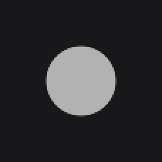

# CircleNode

`CircleNode` (`dev.joid.lib.ui.node.impl.design.shape`) draws a filled circle inscribed in its square bounds, with an optional hover color. Use it for dots, avatar placeholders, status indicators and cursors.

## Creating a CircleNode

```java
CircleNode.create(100, 100, 50).color(Color.LIGHTGRAY).attach(this);
```



`create(x, y, diameter)` places the top-left corner of the bounding square at `x, y` and sets both the width and the height to `diameter`. The circle is centered on the middle of that square.

A status dot that lights up under the mouse:

```java
CircleNode.create(20, 20, 16).color(Color.DARKGRAY).hoveredColor(Color.WHITE).attach(this);
```

.")

## Colors with color and hoveredColor

| Method | Description |
| --- | --- |
| `color(Color color)`, `color(Supplier<Color> color)` | Sets the fill color. |
| `hoveredColor(Color color)`, `hoveredColor(Supplier<Color> color)` | Sets, replaces or removes the hovered color. |

- The default color is `Color.WHITE`, without hovered color.
- With a hovered color, the drawn color blends from the fill color to the hovered color following the node's hover animation (see [Hover and Tooltips](../../interactions/hover.md)).
- Both colors can be gradients built with `Color.toGradient(...)`; the gradient spans the circle's bounding square (see [Colors and Gradients](../../styling/colors.md)).
- Like every setter, they take a plain value, a native expression that reads signals (`color(this.online.get() ? Color.WHITE : Color.GRAY)`), a signal, or a lambda read on every frame (see [Reactive Properties](../../state/reactive-properties.md)). The colors are read while drawing.
- A `null` hovered color, or a hovered supplier that returns `null`, removes the hover blend. Write `hoveredColor((Color) null)`: the cast picks the `Color` overload.

## Size and shape

The circle is centered on the node, at `(x + width / 2, y + height / 2)`, and its radius is half of the smaller side. A node resized to a non-square size (with `width(...)`, `height(...)` or a layout) draws the largest circle that fits in it.

> TIP: For a circle with a border, a blur or children clipped to the circle, use a [`RectNode`](rect.md) with a [`CircleNodeEffect`](../../styling/circle.md) instead.

## Reference

### Factory

| Method | Description |
| --- | --- |
| `CircleNode.create(double x, double y, double diameter)` | Creates a white circle of the given diameter. |

### Properties

| Method | Default | Description |
| --- | --- | --- |
| `color(...)` | `Color.WHITE` | Fill color, value or `Supplier`. |
| `hoveredColor(...)` | none | Color reached when hovered. |

Every setter returns the node itself, typed by the generic return of the fluent API.

### Getters

| Method | Description |
| --- | --- |
| `getColor()` | Current fill color (the supplier is evaluated). |
| `getHoveredColor()` | Current hovered color, or `null` without hovered color or when the supplier returns `null`. |

### Loading skeleton

While the node waits for a condition set with `wait(...)`, it draws a pulsing grey circle (`Color.LOADING()`) instead of the default rectangular placeholder (see [Node Fundamentals](../node-fundamentals.md)).

## Pitfalls

- A bare `null` hovered color does not compile: write `hoveredColor((Color) null)`.
- The circle reacts to the mouse in the corners of its square: hit testing uses the bounds.

## See also

- [RectNode](rect.md)
- [CircleNodeEffect](../../styling/circle.md)
- [Colors and Gradients](../../styling/colors.md)
- [Shapes](../../drawing/shapes.md) for drawing circles without a node