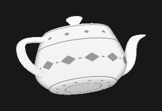
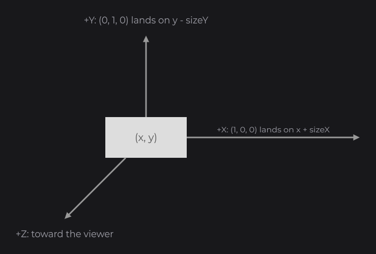
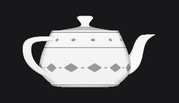
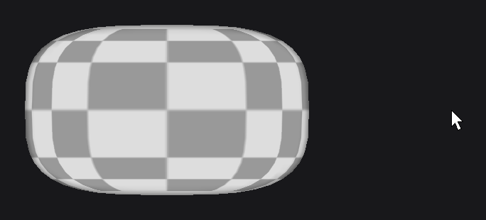

# ModelNode and ModelViewerNode

`ModelNode` (`dev.joid.lib.ui.node.impl.design.model`) draws a 3D model inside its box with a scale and a rotation. `ModelViewerNode` extends it into an interactive viewer: drag to rotate, wheel to zoom, with eased movement and optional limits. Use them for item previews, character viewers and 3D icons.

## Loading a model

Both nodes draw an `IDrawableModel` (`dev.joid.lib.draw.model.utils`). JOID ships `ObjModel` (`dev.joid.lib.obj`), which reads a Wavefront OBJ file with a texture:

```java
final Resource texture = Resource.of(MyUI.class.getResourceAsStream("/models/box.png"));
final ObjModel model = ObjModel.load("box", MyUI.class.getResourceAsStream("/models/box.obj"), texture);
```

The model follows the OBJ convention: +X to the right, +Y up, +Z toward the viewer. With `rotationYaw(0D)` you see its +Z face. Vertex normals (`v//vn`, `v/vt/vn`) give a smooth shading, and the lighting does not depend on the size of the model.

Load a model once and reuse it. `ObjModel`, its data and writing your own `IDrawableModel` are covered in [3D Models](../../drawing/models.md).

## Displaying a model with ModelNode

```java
ModelNode.create(100, 100, 300, 300).model(model).rotationYaw(30D).rotationPitch(15D).attach(this);
```





### Fitting and scale

- The model is centered on the center of the node.
- It is scaled so that its width fills the node's width, multiplied by `size(...)`. The node's height is not used: a model taller than it is wide can extend above and below the node.
- A model dimension of `0` counts as `1`.
- `size(double)` is a scale factor (default `1D`, `0.5D` = half the width). At `0`, nothing is drawn.

### Rotation

`rotationYaw(double)` turns the model around the vertical axis and `rotationPitch(double)` tilts it around the horizontal axis, both in degrees and around the node's center. Both default to `0D`. Like every setter, they take a value, an expression that reads signals or a lambda: a turntable is a lambda driven by a `TweenAnimator`, as in [Animation](../../essentials/animation.md).

```java
final TweenAnimator spin = TweenAnimator.create(0F).sequence(4000F, 1F);
spin.getTimeline().repeat(Tween.INFINITY, 0F);
spin.start();

ModelNode.create(100, 100, 300, 300).model(model).rotationYaw(() -> spin.getValue() * 360D).animate(spin).attach(this);
```



### Depth

Each model is drawn with its own depth: the depth buffer is cleared before and after it, so a model never hides or cuts the nodes drawn after it, and several models in one UI never interfere.

## Interactive viewer with ModelViewerNode

```java
ModelViewerNode
.create(100, 100, 400, 400)
.sizeRange(0.5D, 1.5D)
.rotationPitchRange(-45D, 45D)
.model(model)
.attach(this);
```



> NOTE: In a chain, a setter returns the type that declares it. Call the `ModelViewerNode` setters (`sizeRange`, `rotationYawRange`, `rotationPitchRange`, `zoom`) before `model(...)` and the other `ModelNode` setters, or assign the node to a `ModelViewerNode` variable first.

### Mouse controls

| Input | Effect |
| --- | --- |
| Press the left mouse button over the node | Starts rotating. The press is consumed, so the nodes below do not receive it. The other buttons are left to the nodes below. |
| Move the mouse while pressed | Each UI unit moves the target yaw by 1/5 degree (right increases it) and the target pitch by 1/5 degree (up increases it). Both are clamped to their ranges. |
| Release the left button, anywhere | Stops rotating. |
| Mouse wheel over the node | Changes the target size by `0.04` per notch, clamped to the size range. The wheel event is consumed. |

The displayed size and rotation ease toward their targets on every frame with `UI.lerpByFramerate`, so the speed does not depend on the frame rate. Without a model, the viewer draws nothing and ignores the drag.

### Setting the view from code

| Method | Behavior |
| --- | --- |
| `zoom(double zoom)` | Sets the target size, clamped to the size range. The size eases toward it. |
| `size(double size)` | Sets the size and its target at once (no easing, no clamping). |
| `rotationYaw(double rotationYaw)` | Sets the yaw and its target at once (no easing, no clamping). |
| `rotationPitch(double rotationPitch)` | Sets the pitch and its target at once (no easing, no clamping). |
| `sizeRange(double min, double max)` | Limits of `zoom(...)` and of the wheel. Default `0.1D` to `2D`. |
| `rotationYawRange(double min, double max)` | Limits of the yaw while dragging. Default unbounded. |
| `rotationPitchRange(double min, double max)` | Limits of the pitch while dragging. Default unbounded. |

## Reference

### ModelNode

| Method | Default | Description |
| --- | --- | --- |
| `ModelNode.create(double x, double y, double width, double height)` | | Creates an empty model node. |
| `model(IDrawableModel)`, `model(Supplier<IDrawableModel>)` | `null` | Model to draw. Nothing is drawn without one. |
| `size(double)`, `size(Supplier<Double>)` | `1D` | Scale factor applied on top of the width fitting. |
| `rotationYaw(double)`, `rotationYaw(Supplier<Double>)` | `0D` | Rotation around the vertical axis, in degrees. |
| `rotationPitch(double)`, `rotationPitch(Supplier<Double>)` | `0D` | Rotation around the horizontal axis, in degrees. |

Getters: `getModel()`, `getSize()`, `getRotationYaw()`, `getRotationPitch()`.

### ModelViewerNode

`ModelViewerNode` has every `ModelNode` method, plus:

| Method | Default | Description |
| --- | --- | --- |
| `ModelViewerNode.create(double x, double y, double width, double height)` | | Creates an empty viewer. |
| `zoom(double zoom)` | | Eased, clamped target size. |
| `sizeRange(double min, double max)` | `0.1D`, `2D` | Size limits. Each bound follows its own argument when it reads signals. |
| `rotationYawRange(double min, double max)` | `-Double.MAX_VALUE`, `Double.MAX_VALUE` | Yaw limits while dragging. |
| `rotationPitchRange(double min, double max)` | `-Double.MAX_VALUE`, `Double.MAX_VALUE` | Pitch limits while dragging. |

| Getter | Description |
| --- | --- |
| `getTargetSize()`, `getTargetRotationYaw()`, `getTargetRotationPitch()` | Values the view eases toward. A value set with `size(...)`, `rotationYaw(...)` or `rotationPitch(...)` is its own target. |
| `getMinSize()`, `getMaxSize()` | Size range. |
| `getMinRotationYaw()`, `getMaxRotationYaw()` | Yaw range. |
| `getMinRotationPitch()`, `getMaxRotationPitch()` | Pitch range. |
| `isDragged()` | `true` while the mouse rotates the model. |
| `getLastSize()`, `getLastRotationYaw()`, `getLastRotationPitch()` | Values the viewer drew on the previous frame, which tell a value set from code from the eased one. |
| `getDraggedMouseX()`, `getDraggedMouseY()` | Mouse position of the last drag step. |

All setters are `final` and return the node itself, typed by the generic return of the fluent API: the `ModelNode` setters return a `ModelNode`, the `ModelViewerNode` setters a `ModelViewerNode`.

## Pitfalls

- A model taller than wide extends above and below its node: the fitting uses the width only.
- Two arguments of a range method that read signals and give the same value may be confused when JOID follows them: prefer distinct values.
- The viewer consumes the left press and the wheel over it: a scrolling parent does not scroll under a viewer.

## See also

- Next: [ProgressNode](progress.md)
- [3D Models](../../drawing/models.md)
- [Transformations and Framebuffers](../../drawing/transformations.md)
- [Mouse and Keyboard](../../interactions/mouse-and-keyboard.md)
- [The UI Class](../../ui/ui-class.md) for `lerpByFramerate`
- [Animation](../../essentials/animation.md)