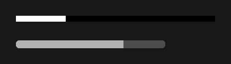
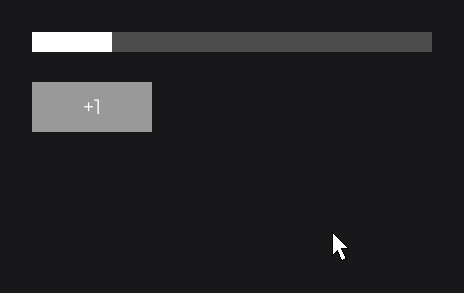

# ProgressNode

`ProgressNode` draws a progress bar: a background filled up to a fraction by a foreground, made of colors or of two images, in one of four directions. Use it for loading bars, health bars, gauges and media timelines.

```java
private final IntegerSignal health = IntegerSignal.of(72);

@Override
public void init() {
	ProgressNode.create(100, 100, 400, 12).progress(0.25F).attach(this);

	ProgressNode
	.create(100, 140, 300, 16)
	.background(Color.DARKGRAY)
	.foreground(Color.LIGHTGRAY)
	.progress(this.health.get() / 100F)
	.effect(RoundedNodeEffect.create(8F))
	.attach(this);
}
```



By default the bar is empty (`0F`), black with a white fill, and fills from left to right.

## Setting the value with progress

`progress(float)` sets the filled fraction: `0F` is empty, `0.5F` half, `1F` full. A value from another range is an expression that reads a [signal](../../concepts/state.md); the bar follows it. Here `this.info` is a `TextInfo` built from a loaded font (see [Text and Fonts](../../concepts/text.md)):

```java
private final IntegerSignal volume = IntegerSignal.of(1);

@Override
public void init() {
	ProgressNode.create(100, 100, 400, 20).background(Color.DARKGRAY).foreground(Color.WHITE).progress(Math.min(1F, this.volume.get() / 5F)).attach(this);

	RectNode
	.create(100, 150, 120, 50)
	.color(Color.GRAY)
	.onClick((node, mouseX, mouseY, button) -> this.volume.increment())
	.body(rect -> {
		TextNode.create(60, 25).text(Text.create("+1", this.info, Align.CENTER, Align.CENTER)).anchor(Align.CENTER).attach(rect);
	})
	.attach(this);
}
```



For an animation, pass a lambda read on every frame: `progress(() -> this.animator.getValue())`.

## Direction with ProgressDirection

`direction(ProgressDirection)` sets the edge the fill grows from: `LEFT_TO_RIGHT` (default), `RIGHT_TO_LEFT`, `TOP_TO_BOTTOM` or `BOTTOM_TO_TOP`.

```java
ProgressNode.create(0, 0, 20, 200).direction(ProgressDirection.BOTTOM_TO_TOP).progress(0.6F).attach(this);
```

.")

## Images with backgroundResource and foregroundResource

With both resources set, the node draws them in place of the colors: the background stretched over the node, then the foreground stretched over the node and revealed up to the filled part.

```java
ProgressNode
.create(0, 0, 400, 40)
.backgroundResource(Resource.of(new File("textures/bar-empty.png")))
.foregroundResource(Resource.of(new File("textures/bar-full.png")))
.progress(0.4F)
.attach(this);
```

## Reference

Every setter has a value overload and a `Supplier` overload.

| Method | Default | Description |
|---|---|---|
| `create(x, y, width, height)` | | An empty bar. |
| `progress(float)` | `0F` | Filled fraction, from `0F` to `1F`. |
| `direction(ProgressDirection)` | `LEFT_TO_RIGHT` | Edge the fill grows from. |
| `background(Color)` | `Color.BLACK` | Background color (gradients allowed). |
| `foreground(Color)` | `Color.WHITE` | Fill color. |
| `backgroundResource(Resource)`, `foregroundResource(Resource)` | none | Background and fill images. |
| `getProgress()`, `getDirection()` | | Current values. |

## Good to know

- The value is not clamped: clamp an expression with `Math.min(1F, ...)`, or the fill draws past the end.
- Both resources are needed to draw images: with only one, the colors are drawn.
- A literal `null` resource is ambiguous: write `backgroundResource((Resource) null)`.

## See also

- Next: [TextFieldNode](../input/text-field.md)
- [SliderNode](../input/slider.md) for a value the user drags
- [ResourcePlayerNode](resource-player.md) for a media timeline
- [Effects](../../styling/effects.md) for rounded bars