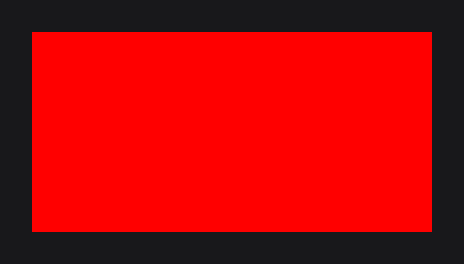
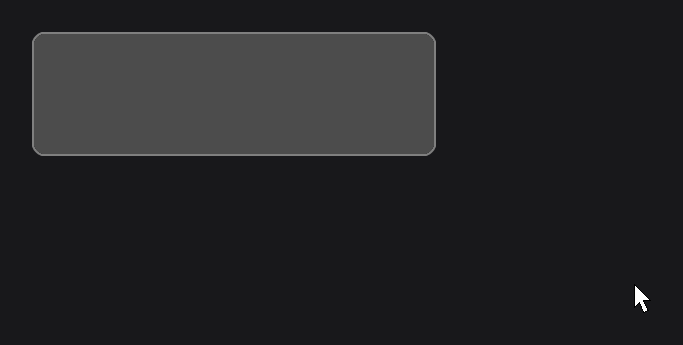
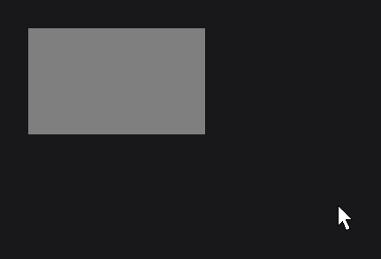
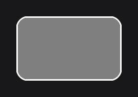

# RectNode

`RectNode` (`dev.joid.lib.ui.node.impl.design.shape`) draws a filled rectangle with an optional border and hover colors. Use it for backgrounds, cards, buttons, separators and invisible click areas, and add effects for rounded corners, circles, shadows or blur.

## Creating a RectNode

```java
RectNode.create(100, 100, 400, 200).color(Color.LIGHTGRAY).attach(this);
```



`create(x, y, width, height)` takes the position and the size in UI units of the 1920 × 1080 canvas. Without `color(...)`, the rectangle is transparent. Positioning, anchors, children, callbacks and the rest of the inherited API are described in [Node Fundamentals](../node-fundamentals.md).

A card that reacts to the mouse, with a border and rounded corners:

```java
RectNode
.create(100, 100, 400, 120)
.color(Color.DARKGRAY)
.hoveredColor(Color.GRAY)
.borderColor(Color.GRAY)
.hoveredBorderColor(Color.WHITE)
.borderStroke(2D)
.effect(RoundedNodeEffect.create(12F))
.onClick((node, mouseX, mouseY, clickType) -> this.clicks.increment())
.attach(this);
```



Call the `RectNode` setters (`color`, `hoveredColor`, `border*`) first, then the setters inherited from `Node` (`effect`, `onClick`, `x`, `width`...): a `Node` setter in the middle of a chain returns a `Node`, which has no `RectNode` setter. When the order cannot change, add a type witness: `.<RectNode>width(300D).color(Color.WHITE)`.

## Fill color with color

`color(...)` sets the fill. The default is `Color.TRANSPARENT`: a transparent `RectNode` still receives the mouse, which makes it a convenient click area or invisible container.

Like every node setter, `color` takes a plain value or a `Supplier<Color>`, and follows the [signals](../../state/signals.md) its value reads:

| You pass | The color |
| --- | --- |
| A plain value: `color(Color.GRAY)` | Stays fixed. |
| An expression that reads signals: `color(this.clicks.get() >= 3 ? Color.WHITE : Color.GRAY)` | Is recomputed each time one of those signals changes. |
| A signal, `map(...)` or `Signal.from(...)`: `color(this.selected.map(selected -> selected ? Color.WHITE : Color.GRAY))` | Follows the signal. |
| A lambda: `color(() -> Color.GRAY.to(Color.WHITE, this.pulse.getValue()))` | Is read on every frame. |

A rectangle that turns white after three clicks:

```java
private final IntegerSignal clicks = IntegerSignal.of(0);

@Override
public void init() {
	RectNode
	.create(100, 100, 200, 120)
	.color(this.clicks.get() >= 3 ? Color.WHITE : Color.GRAY)
	.onClick((node, mouseX, mouseY, clickType) -> this.clicks.increment())
	.attach(this);
}
```



Keep the lambda form for values that change on every frame without a signal, such as an animation driven by a [TweenAnimator](../../animation/tween-animator.md). The rules behind these forms are in [Reactive Properties](../../state/reactive-properties.md).

### Hover blending with hoveredColor

`hoveredColor(...)` sets the color reached under the mouse. The drawn color blends from `color` to `hoveredColor` with the hover animation of the node (`hoverValue`), so the change fades in and out instead of switching. Without a hovered color (the default), the fill stays the same under the mouse. The duration and easing of the hover animation are described in [Hover and Tooltips](../../interactions/hover.md).

`hoveredColor((Color) null)` removes the hovered color. The cast is needed because a bare `null` matches both overloads.

### Gradients

Any color can be a gradient built with `Color.toGradient(...)`. The gradient spans the bounds of the node; the optional `Vector4f` (`javax.vecmath`) gives the start and end points as fractions of the bounds (`startX, startY, endX, endY`). The default direction is left to right.

```java
RectNode.create(100, 100, 400, 200).color(Color.RED.toGradient(Color.BLUE)).attach(this);

RectNode.create(560, 100, 400, 200).color(Color.CYAN.toGradient(Color.MAGENTA, new Vector4f(0F, 0F, 0F, 1F))).attach(this);
```

 runs the second gradient from top to bottom.")

See [Colors and Gradients](../../styling/colors.md) for the color API.

## Borders with borderColor and borderStroke

The border setters draw a stroke outside the rectangle. The first border setter installs a [`BorderNodeEffect`](../../styling/border.md) in `BorderMode.OUT` on the node, so the border follows the shape given by a [`RoundedNodeEffect`](../../styling/rounded.md) or a [`CircleNodeEffect`](../../styling/circle.md). The border is drawn only while its stroke is above `0`.

```java
RectNode
.create(100, 100, 200, 120)
.color(Color.GRAY)
.borderColor(Color.WHITE)
.borderStroke(3D)
.effect(RoundedNodeEffect.create(20F))
.attach(this);
```



| Method | Default | Description |
| --- | --- | --- |
| `borderColor(Color)`, `borderColor(Supplier<Color>)` | `Color.TRANSPARENT` | Color of the border. It can be a gradient. |
| `hoveredBorderColor(Color)`, `hoveredBorderColor(Supplier<Color>)` | none | Border color reached under the mouse, blended with the hover animation like the fill. `null` removes it. |
| `borderStroke(double)`, `borderStroke(Supplier<Double>)` | `0D` | Width of the border in UI units. `0` or less draws no border. |
| `borderFill(boolean)`, `borderFill(Supplier<Boolean>)` | `true` | `true` draws the stroke around the corners too; `false` leaves the four outer corner squares empty, so the stroke only runs along the sides. |

`borderFill(false)` only opens the corners of the border: the rectangle keeps its fill.

```java
RectNode.create(100, 100, 200, 120).color(Color.GRAY).borderColor(Color.WHITE).borderStroke(12D).attach(this);

RectNode.create(400, 100, 200, 120).color(Color.GRAY).borderColor(Color.WHITE).borderStroke(12D).borderFill(false).attach(this);
```

 the stroke goes around the corners, rounded by its width; with borderFill(false) the corner squares stay empty.")

> NOTE: A node holds one effect per class. The border setters install their `BorderNodeEffect` only when the node has none: after `effect(BorderNodeEffect.create(...))`, the border setters no longer change what is drawn, and an `effect(BorderNodeEffect...)` added after them replaces the border of the setters. Use one or the other. For a border drawn inside the rectangle, use `effect(BorderNodeEffect.create(color, width, BorderMode.IN))`.

## Reference

### Factory

| Method | Description |
| --- | --- |
| `RectNode.create(double x, double y, double width, double height)` | Creates a transparent rectangle without border. |

### Setters

Every setter has a value overload and a `Supplier` overload, and returns the node. A value that reads signals is followed (see [Fill color with color](#fill-color-with-color)).

| Method | Default | Description |
| --- | --- | --- |
| `color(Color)`, `color(Supplier<Color>)` | `Color.TRANSPARENT` | Fill color. |
| `hoveredColor(Color)`, `hoveredColor(Supplier<Color>)` | none | Fill color reached under the mouse. `null` removes it. |
| `borderColor(Color)`, `borderColor(Supplier<Color>)` | `Color.TRANSPARENT` | Border color. |
| `hoveredBorderColor(Color)`, `hoveredBorderColor(Supplier<Color>)` | none | Border color reached under the mouse. `null` removes it. |
| `borderStroke(double)`, `borderStroke(Supplier<Double>)` | `0D` | Border width in UI units; no border at `0`. |
| `borderFill(boolean)`, `borderFill(Supplier<Boolean>)` | `true` | Whether the border covers its outer corners. |

The colors and the border are read while the node draws: a `Supplier` passed to them is called on every frame.

### Getters

| Method | Description |
| --- | --- |
| `getColor()` | Current fill color. |
| `getHoveredColor()` | Current hovered color, or `null`. |
| `getBorderColor()` | Current border color. |
| `getHoveredBorderColor()` | Current hovered border color, or `null`. |
| `getBorderStroke()` | Border width in UI units. |
| `isBorderFill()` | Whether the border covers its outer corners. |

## Rendering details

- The rectangle is drawn with `DrawUtils.SHAPE.drawRect` (see [Shapes](../../drawing/shapes.md)). Its edges are snapped to the pixel grid; under a rotation or a skew (a [`TransformNodeEffect`](../../styling/transform.md)), its edges are smoothed instead.
- While the node waits for a condition set with `wait(...)`, it draws the default pulsing gray placeholder (`Color.LOADING`) over its bounds (see [Node Fundamentals](../node-fundamentals.md)).

## Pitfalls

- The border is drawn around the opaque pixels of the node: a transparent `RectNode` with a border draws nothing. Draw the outline in a layer with `DrawUtils.SHAPE.drawBorder` instead.
- `hoveredColor(null)` does not compile: a bare `null` matches both overloads, write `hoveredColor((Color) null)`.
- After a `Node` setter in a chain, the `RectNode` setters are no longer visible: call them first or add a witness.

## See also

- [CircleNode](circle.md)
- [Colors and Gradients](../../styling/colors.md)
- [Effects](../../styling/effects.md)
- [BorderNodeEffect](../../styling/border.md)
- [Hover and Tooltips](../../interactions/hover.md)
- [Reactive Properties](../../state/reactive-properties.md)