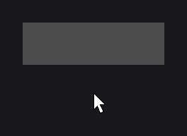

# RectNode

`RectNode` (`dev.joid.lib.ui.node.impl.design.shape`) draws a filled rectangle with an optional outside border and hover colors. Use it for backgrounds, cards, buttons, separators and invisible click areas; combine it with effects for rounded corners, circles or blur.

## Creating a RectNode

```java
RectNode.create(100, 100, 400, 200).color(Color.RED).attach(this);
```


A card that changes color under the mouse, with a border and rounded corners:

```java
RectNode
    .create(100, 100, 400, 120)
    .color(Color.decode("#1F2937"), Color.decode("#374151"))
    .border(Color.decode("#4B5563"), Color.WHITE, 2D, true)
    .effect(RoundedNodeEffect.create(12F))
    .onClick((node, mouseX, mouseY, clickType) -> System.out.println("clicked"))
    .attach(this);
```


`create(x, y, width, height)` takes the position and size in UI units (see [Node Fundamentals](../node-fundamentals.md) for positioning, anchors, children and the rest of the inherited API).

## Fill color with color

| Method | Description |
| --- | --- |
| `color(Color color)` | Sets the fill color. |
| `color(Supplier<Color> color)` | Sets a fill color read on every frame. |
| `color(Color color, Color hoveredColor)` | Sets the fill and hovered colors. `hoveredColor` can be `null`. |
| `color(Supplier<Color> color, Supplier<Color> hoveredColor)` | Same with suppliers read on every frame. `hoveredColor` can be `null`. |
| `hoveredColor(Color color)` / `hoveredColor(Supplier<Color> color)` | Sets or replaces the hovered color only. `null` removes it. |

The default fill is `Color.TRANSPARENT`. A transparent `RectNode` is still a node that receives the mouse, which makes it a convenient click area or invisible container.

To follow a [signal](../../state/signals.md), [watch](../../state/watch.md) it and set the color in `onInit`, which runs again each time the signal publishes:

```java
final BooleanSignal selected = new BooleanSignal(false);

RectNode
    .create(0, 0, 200, 60)
    .<RectNode>onInit(rect -> rect.color(selected.getOrDefault() ? Color.BLUE : Color.DARKGRAY))
    .watch(selected)
    .onClick((node, mouseX, mouseY, clickType) -> selected.toggle())
    .attach(this);
```



A supplier color is called on every frame: keep it for a color that changes on every frame, such as an animation driven by a [TweenAnimator](../../animation/tween-animator.md), and watch a signal instead of reading it in a supplier.

### Hover blending

When a hovered color is set, the drawn color blends from the fill color to the hovered color following the node's hover animation (`hoverValue`), so the change fades in and out instead of switching. When the hovered color is `null` (or its supplier returns `null`), the fill color is drawn as is. The hover animation itself (duration, easing) is described in [Hover and Tooltips](../../interactions/hover.md).

### Gradients

Any color can be a gradient built with `Color.toGradient(...)`. The gradient spans the node's bounds; the optional `Vector4f` (`javax.vecmath`) gives the start and end points as fractions of the bounds (`startX, startY, endX, endY`). The default direction is left to right.

```java
RectNode.create(0, 0, 400, 200).color(Color.RED.toGradient(Color.BLUE)).attach(this);
RectNode.create(0, 0, 400, 200).color(Color.CYAN.toGradient(Color.MAGENTA, new Vector4f(0F, 0F, 0F, 1F))).attach(this);
```

 runs the second gradient from top to bottom.")

See [Colors and Gradients](../../styling/colors.md).

## Borders with border

`border(...)` draws a stroke of `stroke` UI units outside the rectangle. It is implemented as a [`BorderNodeEffect`](../../styling/border.md) in `BorderMode.OUT`, so it follows the shape given by [`RoundedNodeEffect`](../../styling/rounded.md) or [`CircleNodeEffect`](../../styling/circle.md).

```java
RectNode
    .create(0, 0, 200, 120)
    .color(Color.RED.toGradient(Color.BLUE))
    .border(Color.WHITE, 3D)
    .effect(RoundedNodeEffect.create(20F))
    .attach(this);
```


| Method | Description |
| --- | --- |
| `border(Color color, double stroke)` / `border(Supplier<Color> color, double stroke)` | Sets the border color and width, with `fill` = `true`. |
| `border(Color color, double stroke, boolean fill)` / `border(Supplier<Color> color, double stroke, boolean fill)` | Same with an explicit `fill`. |
| `border(Color color, Color hoveredColor, double stroke, boolean fill)` / `border(Supplier<Color> color, Supplier<Color> hoveredColor, double stroke, boolean fill)` | Also sets the hovered border color (can be `null`). |
| `hoveredBorderColor(Color color)` / `hoveredBorderColor(Supplier<Color> color)` | Sets or replaces the hovered border color only. `null` removes it. |

- `fill` = `true` paints the whole stroke, corners included. `false` leaves the four outer corner squares empty, so the stroke only runs along the sides.
- The border color blends to the hovered border color with the hover animation, like the fill.
- The border color can be a gradient.
- A node holds a single border: calling `border(...)` again replaces it, and a `stroke` of `0` or less removes it. `border(...)` also replaces a `BorderNodeEffect` you added yourself with `effect(...)`.
- Supplier colors are read on every frame.

```java
RectNode.create(0, 0, 200, 120).color(Color.DARKGRAY).border(Color.WHITE, 12D, true).attach(this);
RectNode.create(300, 0, 200, 120).color(Color.DARKGRAY).border(Color.WHITE, 12D, false).attach(this);
```

; with fill = false the corner squares stay empty.")

> TIP: For a border drawn inside the rectangle, add `BorderNodeEffect.create(color, width, BorderMode.IN)` with `effect(...)` instead of calling `border(...)`.

## Reference

### Factory

| Method | Description |
| --- | --- |
| `RectNode.create(double x, double y, double width, double height)` | Creates a transparent rectangle without border. |

### Properties

| Method | Default | Description |
| --- | --- | --- |
| `color(...)` | `Color.TRANSPARENT` | Fill color, fixed or supplied, with an optional hovered color. |
| `hoveredColor(...)` | none | Fill color reached when hovered. |
| `border(...)` | no border | Border color, stroke, `fill` flag and optional hovered color. |
| `hoveredBorderColor(...)` | none | Border color reached when hovered. |

Every setter returns the node itself, typed by the generic return of the fluent API.

### Getters

| Method | Description |
| --- | --- |
| `getColor()` | Current fill color (the supplier is evaluated). |
| `getHoveredColor()` | `Optional<Color>`, empty without hovered color or when the supplier returns `null`. |
| `getBorderColor()` | Current border color, `Color.TRANSPARENT` until a border is set. |
| `getHoveredBorderColor()` | `Optional<Color>`, empty without hovered border color. |
| `getBorderStroke()` | Border width in UI units, `0` without border. |
| `isBorderFill()` | The `fill` flag of the border, `false` until a border is set. |

### Loading skeleton

While the node waits for a condition set with `wait(...)`, it draws the default pulsing grey placeholder over its bounds (see [Node Fundamentals](../node-fundamentals.md)).

## See also

- [CircleNode](circle.md)
- [Colors and Gradients](../../styling/colors.md)
- [Effects](../../styling/effects.md)
- [BorderNodeEffect](../../styling/border.md)
- [Hover and Tooltips](../../interactions/hover.md)
- [Shapes](../../drawing/shapes.md) for drawing rectangles without a node