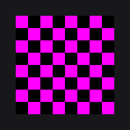

# ResourceNode

`ResourceNode` (`dev.joid.lib.ui.node.impl.design.resource`) displays a [`Resource`](../../resources/resources.md) (`dev.joid.lib.resource`): a raster image, an SVG, an animated image or a video frame. It sizes itself from the resource when you do not give a size, fits the resource with a `StretchType`, tints it, and can swap to another color or resource under the mouse.

## Creating a ResourceNode

```java
ResourceNode.create(10, 10).resource(Resource.of("https://placehold.co/100x100.png")).attach(this);
ResourceNode.create(10, 120, 100, 100).resource(Resource.of(MyUI.class.getResourceAsStream("/textures/logo.png"))).attach(this);
```


`resource(Resource)` takes any resource: a URL, a stream, a file, a cached or custom resource, with its own options. `Resource.of("https://...")` downloads a URL in the background (see [Resources](../../resources/resources.md), [Assets](../../resources/assets.md) and [Supported Formats](../../resources/formats.md)).

A round avatar cropped from a non-square image:

```java
ResourceNode
.create(0, 0, 100, 100)
.resource(Resource.of("https://placehold.co/400x800.png"))
.stretch(StretchType.COVER)
.effect(CircleNodeEffect.create())
.attach(this);
```


## Sizing from the resource

| Size given at creation | Result |
| --- | --- |
| None (`create(x, y)`, 0×0) | The node takes the resource's size in pixels, used as UI units. |
| Width only (height `0`) | The height follows the resource's aspect ratio. |
| Height only (width `0`) | The width follows the resource's aspect ratio. |
| Width and height | The resource is fitted into the box according to the `StretchType`. |

```java
ResourceNode.create(0, 0).resource(Resource.of("https://placehold.co/800x400.png")).height(100).attach(this);
```


The missing dimensions are computed on the first frame where the resource is loaded. That frame only sizes the node; the resource is drawn from the next frame on.

### Loading placeholder

While there is no resource, while it loads, or when it has no size, the node draws a pulsing grey rectangle (`Color.LOADING()`) over its bounds. A node created without size has nothing to draw until the resource gives it one.

## Fitting with StretchType

`stretch(StretchType)` chooses how the resource fills a box whose proportions differ from its own. `StretchType` is the nested enum `ResourceNode.StretchType`.

| Value | Behavior |
| --- | --- |
| `STRETCH` (default) | Fills the box exactly; the resource is distorted when the proportions differ. |
| `CONTAIN` | Scaled to fit entirely inside the box, keeping its proportions, and centered. The rest of the box stays empty. |
| `COVER` | Scaled to cover the whole box, keeping its proportions, and centered. Only the visible region of the resource is drawn, so nothing spills outside the node. |

```java
ResourceNode.create(0, 0, 100, 100).resource(Resource.of("https://placehold.co/400x800.png")).stretch(StretchType.CONTAIN).attach(this);
```

; the darker square is the node.")

`StretchType.draw(double x, double y, double width, double height, Resource resource)` applies the same fitting when you draw a resource yourself in a [custom node](../custom-nodes.md).

## Tinting with color

`color(Color)` tints the resource. The default `Color.WHITE` keeps the original pixels; a lower alpha makes the resource translucent. The color can be a gradient (see [Colors and Gradients](../../styling/colors.md)), which spans the node's bounds.

```java
ResourceNode.create(0, 0, 64, 64).resource(Resource.of("https://placehold.co/64x64.png")).color(new Color(1F, 1F, 1F, 0.5F)).attach(this);
```

.")

## Hover: hoveredColor and hoveredResource

The node reacts to the mouse in two ways, both following the node's hover animation (see [Hover and Tooltips](../../interactions/hover.md)):

- **Hovered color only**: the tint blends from `color` to `hoveredColor`.
- **Hovered resource**: the hovered resource fades in over the main one. The main resource keeps `color`; the hovered resource uses the color channels of `hoveredColor` (or of `color` when there is no hovered color) and an opacity equal to the hover progress, from `0` to `1`.

```java
ResourceNode
.create(0, 0, 48, 48)
.resource(Resource.of("https://placehold.co/48x48/DDDDDD/999999.png"))
.hoveredResource(Resource.of("https://placehold.co/48x48/999999/DDDDDD.png"))
.attach(this);
```

.")

- The hovered resource is loaded from the first frame, so it is ready when the mouse arrives.
- When the hovered resource is the same `Resource` object as the main one, the node draws it once with `color` and shows no hover change.

## Filtering with linear

`linear(boolean)` sets the texture filtering of the resources already set on the node: `true` for linear filtering, `false` for nearest-neighbor (sharp pixel art). It changes the `Resource` objects themselves, so call it after `resource(...)`; another node displaying the same `Resource` object is affected too.

```java
ResourceNode.create(0, 0, 160, 160).resource(Resource.of("https://placehold.co/16x16.png")).linear(false).attach(this);
```


## Reference

### Factories

| Method | Description |
| --- | --- |
| `ResourceNode.create(double x, double y)` | Creates a node sized by its resource. |
| `ResourceNode.create(double x, double y, double width, double height)` | Creates a node with a given box; a `0` dimension follows the resource's aspect ratio. |

### Properties

| Method | Default | Description |
| --- | --- | --- |
| `resource(Resource)`, `resource(Supplier<Resource>)` | `null` | Main resource. |
| `hoveredResource(Resource)`, `hoveredResource(Supplier<Resource>)` | `null` | Hovered resource. `hoveredResource((Resource) null)` removes it. |
| `color(Color)`, `color(Supplier<Color>)` | `Color.WHITE` | Tint of the resource. |
| `hoveredColor(Color)`, `hoveredColor(Supplier<Color>)` | `null` | Tint reached when hovered. `(Color) null` removes it. |
| `stretch(StretchType)`, `stretch(Supplier<StretchType>)` | `StretchType.STRETCH` | How the resource fills the box. |
| `linear(boolean)`, `linear(Supplier<Boolean>)` | | Linear (`true`) or nearest (`false`) filtering of the resources already set. |

Every setter takes a value, a native expression that reads signals (`resource(this.selected.get() ? on : off)`), a signal or a lambda (see [Reactive Properties](../../state/reactive-properties.md)).

### Getters

| Method | Description |
| --- | --- |
| `getResource()` | The main `Resource`, or `null`. |
| `getHoveredResource()` | The hovered `Resource`, or `null`. |
| `getColor()` | The tint. |
| `getHoveredColor()` | The hovered tint, or `null`. |
| `getStretchType()` | The current `StretchType`. |

## Unreadable resources

A resource that cannot be read (missing file, unknown URL, corrupted data, a HEIF or AVIF image) never throws: it is in a failed state, `isFailed()` is `true`, and the node draws nothing in its place. In dev mode the node draws a magenta and black checkerboard instead, and JOID prints once `[JOID] The resource <id> cannot be read and is drawn empty: <reason>, <advice>`. React to it with `onError`:

```java
final Resource photo = Resource.of(new File("photos/missing.png"));
photo.onError((resource, error) -> System.err.println("[Gallery] " + error.getMessage()));

ResourceNode.create(100, 100, 200, 200).resource(photo).attach(this);
```



See [Resources](../../resources/resources.md#resources-in-error).

## Animated resources

Animated images (GIF, APNG, animated WebP) play by themselves on a `ResourceNode`, with the defaults of their decoder. To play, pause, seek, loop or listen to a video or an animation, use [`ResourcePlayerNode`](resource-player.md).

## Pitfalls

- A `Resource` shared by nodes of different sizes is rasterized for each size (SVG): create one resource per size when sizes differ a lot.
- `linear(...)` changes the shared `Resource` objects: every node that displays them is affected.
- A failed resource takes no space when the node is sized by its resource: give the node a size.

## See also

- [ResourcePlayerNode](resource-player.md)
- [Resources](../../resources/resources.md)
- [Supported Formats](../../resources/formats.md)
- [Assets](../../resources/assets.md)
- [Drawing Resources](../../drawing/resources.md) for drawing resources without a node
- [Effects](../../styling/effects.md) for rounded and circular images