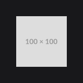
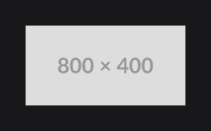
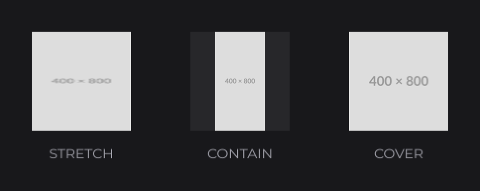
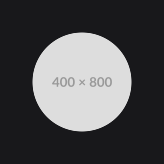
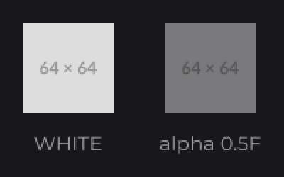
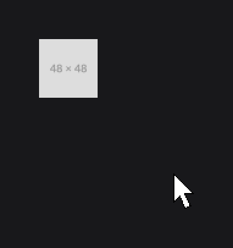
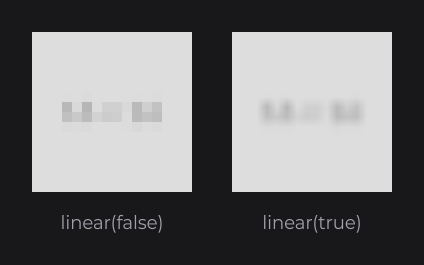

# ResourceNode

`ResourceNode` displays an image, an SVG or an animated image, sized from the resource or fitted into a box.

```java
ResourceNode.create(10, 10).resource(Resource.of("https://placehold.co/100x100.png")).attach(this);

ResourceNode.create(10, 120, 100, 100).resource(Resource.of(new File("textures/logo.png"))).attach(this);
```



`resource(Resource)` takes any resource: a URL downloaded in the background, a file, a stream, a cached or custom resource (see [Images and Media](../../concepts/media.md)). While there is no resource or while it loads, the node draws a pulsing gray placeholder over its bounds. Animated GIF, APNG and WebP images play by themselves; to control playback, use [ResourcePlayerNode](resource-player.md).

## Sizing from the resource

| Size given at creation | Result |
|---|---|
| None (`create(x, y)`) | The node takes the resource's size in pixels, as UI units. |
| Width or height only (the other `0`) | The other dimension follows the resource's aspect ratio. |
| Width and height | The resource is fitted into the box by the `StretchType`. |

```java
ResourceNode.create(0, 0).resource(Resource.of("https://placehold.co/800x400.png")).height(100).attach(this);
```



## Fitting with StretchType

`stretch(StretchType)` fits the resource in a box of other proportions: `STRETCH` (default) distorts it, `CONTAIN` fits it inside, `COVER` covers the box and crops.

```java
ResourceNode.create(0, 0, 100, 100).resource(Resource.of("https://placehold.co/400x800.png")).stretch(StretchType.CONTAIN).attach(this);
```



A round avatar cropped from a non-square image combines `COVER` with a `CircleNodeEffect`:

```java
ResourceNode
.create(0, 0, 100, 100)
.resource(Resource.of("https://placehold.co/400x800.png"))
.stretch(StretchType.COVER)
.effect(CircleNodeEffect.create())
.attach(this);
```



## Tinting with color

`color(Color)` tints the resource. The default `Color.WHITE` keeps the original pixels; a lower alpha makes it translucent. The color can be a gradient.

```java
ResourceNode.create(0, 0, 64, 64).resource(Resource.of("https://placehold.co/64x64.png")).color(new Color(1F, 1F, 1F, 0.5F)).attach(this);
```



## Hover with hoveredColor and hoveredResource

`hoveredColor(...)` blends the tint under the mouse; `hoveredResource(...)` fades a second resource in over the main one.

```java
ResourceNode
.create(0, 0, 48, 48)
.resource(Resource.of("https://placehold.co/48x48/DDDDDD/999999.png"))
.hoveredResource(Resource.of("https://placehold.co/48x48/999999/DDDDDD.png"))
.attach(this);
```



## Pixel art with linear

`linear(false)` switches the resources already set on the node to nearest-neighbor filtering, for sharp pixel art; `linear(true)` smooths them.

```java
ResourceNode.create(0, 0, 160, 160).resource(Resource.of("https://placehold.co/16x16.png")).linear(false).attach(this);
```



## Reference

Every setter has a value overload and a `Supplier` overload.

| Method | Default | Description |
|---|---|---|
| `create(x, y)`, `create(x, y, width, height)` | | Node sized by its resource, or with a box (`0` follows the aspect ratio). |
| `resource(Resource)` | `null` | Main resource. |
| `hoveredResource(Resource)` | `null` | Resource faded in under the mouse. |
| `color(Color)` | `Color.WHITE` | Tint. |
| `hoveredColor(Color)` | `null` | Tint under the mouse. |
| `stretch(StretchType)` | `STRETCH` | `STRETCH`, `CONTAIN` or `COVER`. |
| `linear(boolean)` | | Linear (`true`) or nearest (`false`) filtering of the resources already set. |

## Good to know

- `linear(...)` changes the shared `Resource` objects: call it after `resource(...)`, and every node showing them is affected.
- A resource that cannot be read draws nothing (a checkerboard in dev mode) and takes no space when the node is sized by it: give the node a size, and listen with `Resource.onError(...)`.

## See also

- Next: [ResourcePlayerNode](resource-player.md)
- [Images and Media](../../concepts/media.md)
- [Custom Formats](../../resources/custom-formats.md)
- [Effects](../../styling/effects.md) for rounded and circular images