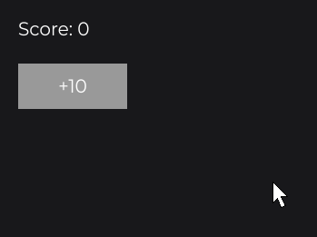
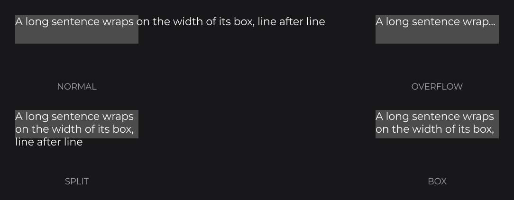

# TextNode

`TextNode` (`dev.joid.lib.ui.node.impl.design.text`) displays a [`Text`](../../text/text-and-textinfo.md) and sizes itself to it. A `TextMode` chooses between a single line, a truncated line, wrapped lines growing the node, or wrapped lines kept inside a fixed box. [Text](../../essentials/text.md) introduced it; this page describes its sizing and modes in detail.

In the examples, `font` is a font loaded once at startup with `MsdfFontLoader`, as in [Text](../../essentials/text.md#loading-a-font-with-msdffontloader).

## Creating a TextNode

```java
TextNode.create(100, 100).text(Text.create("Hello JOID", TextInfo.create(font, 24F, Color.WHITE))).attach(this);
```

.")

- `TextNode.create(x, y)` creates a node of size 0×0: its width and height follow the text.
- `TextNode.create(x, y, width, height)` creates a node with a given box; a dimension given as `0` still follows the text.

A label centered in a button:

```java
RectNode
.create(100, 100, 300, 60)
.color(Color.DARKGRAY)
.body(rect -> {
	TextNode.create(0, 0, rect.getWidth(), rect.getHeight()).text(Text.create("Play", TextInfo.create(font, 24F, Color.WHITE), Align.CENTER, Align.CENTER)).attach(rect);
})
.attach(this);
```


`Text` (`dev.joid.lib.draw.text.builder`), `TextInfo` (`dev.joid.lib.font`), `Align` (`dev.joid.lib.utils.align`), overflow suffixes, modifiers and multi-style texts are introduced in [Text](../../essentials/text.md) and described in full in [Text and TextInfo](../../text/text-and-textinfo.md).

## Dynamic text

Write the text as an expression that reads a signal ([Signals and Reactivity](../../concepts/signals.md)): the text follows it, and the node resizes to the new text.

```java
private final IntegerSignal score = IntegerSignal.of(0);
```

```java
TextNode.create(20, 20).text(Text.create("Score: " + this.score.get(), TextInfo.create(font, 20F, Color.WHITE))).attach(this);
```



| You pass | The text |
| --- | --- |
| `Text.create("Score: " + this.score.get(), info)` | Follows `score`: the `Text` updates its content in place. |
| `Text.create(this.score.map(score -> "Score: " + score), info)` | Follows the computed signal. |
| `Text.create(() -> "Open for " + seconds() + " s", info)` | A lambda read on every measure and draw: for clocks and animations. |
| `text(Text.create(..., this.big.get() ? large : small))` | The whole `Text` is rebuilt when `big` changes (the `TextInfo` is a plain value inside a `Text`). |

See [Reactive Properties](../../state/reactive-properties.md) for the rules.

## Text modes with mode

`mode(TextMode)` (`dev.joid.lib.draw.text.TextMode`) decides how the text is laid out in the node and which dimensions follow the text.

| Mode | Layout | Size of the node |
| --- | --- | --- |
| `NORMAL` (default) | One run, placed in the node's box according to the text's horizontal and vertical alignment. Never wrapped nor clipped. | Width and height follow the text when they were `0`. |
| `OVERFLOW` | One line cut to the node's width. When the text is cut, the text's `TextOverflow` suffix is appended (`ELLIPSIS` `...`, `DOT` `.`, `HYPHEN` `-`, `NONE` nothing). | Height follows the text when it was `0`. Give the width. |
| `SPLIT` | Wrapped to the node's width. Lines break at spaces, `\n`, `\r\n` and `<br>`; a word wider than the node is broken where it overflows. | Height is always the total height of the lines, even when a height was given. Give the width. |
| `BOX` | Wrapped like `SPLIT`, then placed in the node's box according to the text's alignment. Lines that do not fit entirely inside the box are not drawn. | Never changed. Give both dimensions. |



```java
TextNode
.create(0, 0, 300, 0)
.text(Text.create("A very long subtitle that does not fit", TextInfo.create(font, 20F, Color.WHITE)).overflow(TextOverflow.ELLIPSIS))
.mode(TextMode.OVERFLOW)
.attach(this);

TextNode
.create(0, 40, 300, 0)
.text(Text.create("A paragraph wrapped on as many lines as it needs.", TextInfo.create(font, 20F, Color.WHITE)))
.mode(TextMode.SPLIT)
.attach(this);
```


## Automatic sizing

A dimension is automatic when it is `0` the first time the node is initialized, that is when it joins a UI (attached to the UI, or to a parent that is in a UI). Sizes you set before that moment count as given sizes. The node then:

- measures the text each time it is initialized (when it joins a UI, and again when it is attached back after a removal), and again after each draw, so a supplier-driven text resizes the node frame by frame;
- sizes itself on its first draw when the text is given after initialization;
- keeps its size and draws nothing while the text is `null`, has no element, or is an empty string.

`getInitialWidth()` and `getInitialHeight()` return the size recorded at initialization (`0` for an automatic dimension), and `isInitialized()` tells whether it was recorded.

### Freezing a size with reset

`reset()` records the current size as the initial size: every non-zero dimension becomes a given size and stops following the text. Use it after resizing an initialized node yourself, or to freeze an automatic size:

```java
label.width(400D);
label.reset();
```

## Loading skeleton

While the node waits for a condition set with `wait(...)`, it takes the size of its text (when it has one) for the dimensions that are still `0`, and draws the default pulsing gray placeholder over it (see [ContainerNode](../layout/container.md#loading-a-section-with-wait-and-skeleton)).

## Effects on text

Node effects apply to the drawn glyphs. For example, an outline:

```java
TextNode.create(0, 0).text(Text.create("Outlined", TextInfo.create(font, 50F, Color.WHITE))).effect(BorderNodeEffect.create(Color.BLACK, 2F)).attach(this);
```

.")

See [Effects](../../styling/effects.md).

## Reference

### Factories

| Method | Description |
| --- | --- |
| `TextNode.create(double x, double y)` | Creates a node sized by its text. |
| `TextNode.create(double x, double y, double width, double height)` | Creates a node with a given box; a `0` dimension follows the text. |

### Properties

| Method | Default | Description |
| --- | --- | --- |
| `text(Text text)`, `text(Supplier<Text> text)` | `null` | Text to display. `text((Text) null)` clears it. |
| `mode(TextMode mode)`, `mode(Supplier<TextMode> mode)` | `TextMode.NORMAL` | Layout mode, see the table above. |
| `reset()` | | Records the current size as the initial size. |

Every setter returns the node itself, typed by the generic return of the fluent API.

### Getters

| Method | Description |
| --- | --- |
| `getText()` | The displayed `Text`, or `null`. |
| `getMode()` | The current `TextMode`. |
| `isInitialized()` | `true` once the initial size is recorded. |
| `getInitialWidth()` / `getInitialHeight()` | The recorded initial size; `0` means automatic. |

## Pitfalls

- A text and its `TextInfo` that both read signals in one `Text.create(...)` cannot follow the text alone: pass the whole `Text.create(...)` to `text(...)` without signals in the info, or use a lambda.
- `text(null)` does not compile: write `text((Text) null)`.
- A `TextNode` sized by its text changes its width with the text: anchor it (`anchorX(Align.CENTER)`) to keep its center in place.

## See also

- Next: [ResourceNode](resource.md)
- [Text](../../essentials/text.md)
- [Text and TextInfo](../../text/text-and-textinfo.md)
- [Markup and Text Effects](../../text/markup-and-effects.md)
- [TextFieldNode](../input/text-field.md) for editable text