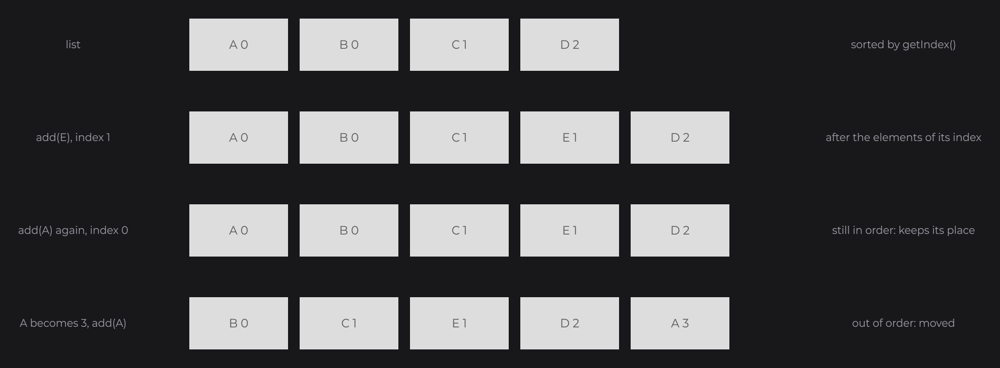

# Utilities

The `dev.joid.lib.utils` packages hold small helper types used across the JOID API: alignments, boxes, Bézier curves, pairs and tuples, number formatting, image helpers, daemon threads, and the index-sorted lists that store UIs, nodes and bridges. This page is their reference. Signals, keys, click types and `InternalContext` also live under `dev.joid.lib.utils`; they are documented in [Signals](../state/signals.md), [Mouse and Keyboard](../interactions/mouse-and-keyboard.md) and [Callbacks](../interactions/callbacks.md).

## Align

`Align` (`dev.joid.lib.utils.align`) is the alignment used by node anchors, text alignment, layouts and UI anchors. `info` is a `TextInfo` built from a loaded font (see [Text and TextInfo](../text/text-and-textinfo.md)).

```java
TextNode.create(960, 540).text(Text.create("Title", this.info, Align.CENTER)).anchor(Align.CENTER).attach(this);
```

| Constant | Meaning |
| --- | --- |
| `START` | Left or top. |
| `CENTER` | Middle. |
| `END` | Right or bottom. |

| Method | Returns `true` when |
| --- | --- |
| `isStart()`, `isLeft()` | The value is `START`. |
| `isCenter()` | The value is `CENTER`. |
| `isEnd()`, `isRight()` | The value is `END`. |
| `is(Align align)` | The value is `align`. |

## BoundingBox

`BoundingBox` (`dev.joid.lib.utils.box`) is a mutable rectangle stored as minimum and maximum corners. A `ScrollbarNode` uses one for the area its handle moves in; see [Overflow and Scrolling](../nodes/layout/overflow-and-scroll.md).

```java
final BoundingBox box = BoundingBox.create(10D, 20D, 30D, 40D);
box.expand(5D);
final double width = box.getWidth();
```

| Member | Description |
| --- | --- |
| `static BoundingBox create(double x, double y, double width, double height)` | A box from `(x, y)` to `(x + width, y + height)`. |
| `getMinX()`, `getMinY()`, `getMaxX()`, `getMaxY()` and their setters | The corners. |
| `double getWidth()`, `double getHeight()` | `maxX - minX`, `maxY - minY`. |
| `BoundingBox expand(double value)` | Grows the box by `value` on every side; returns this box. |
| `BoundingBox contract(double value)` | Shrinks the box by `value` on every side; returns this box. |
| `BoundingBox copy()` | An independent copy. |

## Bezier

`Bezier` (`dev.joid.lib.utils.bezier`) evaluates Bézier curves at a parameter `t` from 0 (start) to 1 (end), with `javax.vecmath.Vector2d` points. `DrawShape` uses it to draw curves; see [Shapes](../drawing/shapes.md).

```java
final Vector2d point = Bezier.cubic(0.5D, new Vector2d(0D, 0D), new Vector2d(0D, 100D), new Vector2d(200D, 100D), new Vector2d(200D, 0D));
```

")

| Method | Description |
| --- | --- |
| `static Vector2d quadratic(double t, Vector2d start, Vector2d end, Vector2d control)` | Point of the quadratic curve with one control point. |
| `static Vector2d cubic(double t, Vector2d start, Vector2d startControl, Vector2d end, Vector2d endControl)` | Point of the cubic curve; `startControl` pulls the curve near `start`, `endControl` near `end`. |

`t` is not clamped. Each call returns a new vector.

## Pair and Tuple

`Tuple<F, S>` (`dev.joid.lib.utils.tuple`) holds two immutable values of any types; `Pair<T>` (`dev.joid.lib.utils.pair`) is a `Tuple<T, T>` whose values have the same type.

```java
final Tuple<String, Integer> entry = new Tuple<>("width", 42);
final Pair<Double> range = new Pair<>(0D, 1D);
final double max = range.getSecond();
```

| Member | Description |
| --- | --- |
| `Tuple(F first, S second)`, `Pair(T first, T second)` | Constructors. |
| `getFirst()`, `getSecond()` | The values. |

They do not override `equals` and `hashCode`: two tuples are equal only when they are the same object.

## FormatUtils

`FormatUtils.formatNumber(long value)` (`dev.joid.lib.utils.format`) shortens a number with a magnitude suffix, keeping at most one decimal, truncated:

| Value | Result |
| --- | --- |
| `999` | `999` |
| `1500` | `1.5k` |
| `1999` | `1.9k` |
| `12345` | `12k` |
| `999999` | `999k` |
| `2500000000` | `2.5B` |
| `-1500` | `-1.5k` |
| `Long.MAX_VALUE` | `9.2E` |

The suffixes are `k` (thousand), `M` (million), `B` (billion), `T` (trillion), `P` (quadrillion) and `E` (quintillion). The decimal is shown only below 10 of a unit.

## ImageUtils

`ImageUtils` (`dev.joid.lib.utils.image`) holds the image helpers JOID uses when it decodes raster images.

```java
final BufferedImage image = ImageUtils.read(stream, ImageIO.getImageReadersByFormatName("png").next().getOriginatingProvider());
final int[] pixels = image.getRGB(0, 0, image.getWidth(), image.getHeight(), null, 0, image.getWidth());
ImageUtils.bleedAlpha(pixels, image.getWidth(), image.getHeight());
```

| Method | Description |
| --- | --- |
| `static BufferedImage read(InputStream stream, ImageReaderSpi spi) throws IOException` | Reads the first image of `stream` with a reader created from `spi`, then disposes the reader. The stream is not closed. Throws `IOException` when the data cannot be read. |
| `static void bleedAlpha(int[] pixels, int width, int height)` | In an ARGB pixel array, gives every fully transparent pixel the RGB color of the nearest visible pixel (searching through horizontal and vertical neighbors), keeping its alpha at 0. Visible pixels are untouched; an image that is fully transparent or fully visible is left as is. This avoids dark fringes around transparent areas when the image is drawn with linear filtering. |

## ThreadUtils

`ThreadUtils` (`dev.joid.lib.utils.thread`) creates daemon threads, which do not keep the JVM alive. JOID names its background threads with it (font loading, resource decoding, hot reload).

```java
final ExecutorService executor = Executors.newFixedThreadPool(4, ThreadUtils.daemonFactory("MyLoader"));
```

| Method | Description |
| --- | --- |
| `static ThreadFactory daemonFactory(String name)` | A factory of daemon threads named `name/1`, `name/2`, and so on; each factory counts on its own. |
| `static Thread daemonThread(Runnable task, String name)` | A daemon thread running `task`, named `name`, not started. |

## Platform

`Platform` (`dev.joid.lib.utils.platform`) tells which operating system JOID runs on: `WINDOWS`, `MACOS` or `LINUX` (any other system). JOID reads it to pick the macOS shortcuts of the text fields, the folder of the font cache and the natives of the LWJGL 2 backend.

```java
final String copy = Platform.current() == Platform.MACOS ? "⌘ C" : "Ctrl+C";
```

| Method | Description |
| --- | --- |
| `static Platform current()` | The platform named by the `os.name` system property, read at each call: `MACOS` for a name containing `mac` or `darwin`, `WINDOWS` for one containing `win`, `LINUX` otherwise. |
| `static boolean is64Bit()` | Whether the `os.arch` system property names a 64-bit architecture. |

## IndexedList family

The lists of `dev.joid.lib.utils.list` keep their elements sorted by an integer index. You meet them as `UI.getNodeList()` and `Node.getChildren()` (sorted by `zindex`), `Node.getChildren(Class)`, `IUIBridge.getUiList()` (sorted by `zlevel`) and the bridge registries (sorted by `getIndex()`).



| Type | Description |
| --- | --- |
| `IndexedElement` | Interface of the elements: `int getIndex()`. |
| `RecursiveIndexedElement` | An `IndexedElement` with children: `IndexedList<? extends RecursiveIndexedElement> getChildren()`. `Node` is one. |
| `IndexedList<E extends IndexedElement>` | The list interface, `Iterable<E>` in index order. |
| `IndexedLinkedList<E>` | Backed by a `LinkedList`. Not thread-safe; `ordered()` returns the `LinkedList` itself. |
| `IndexedConcurrentList<E>` | Backed by a `CopyOnWriteArrayList`: iteration works on a snapshot, so the list can change while you iterate. |

Both implementations have a no-argument constructor and a constructor that copies a `List<E>` as is (without sorting it).

### Sorting with add and sort

- `add(element)` inserts the element after the elements of the same index, before the first element with a greater index, so elements with the same index keep their insertion order. The list never holds an element twice.
- Adding an element that is already in the list keeps its place while it is still in order (its index is not below the one before it nor above the one after it). When its index changed and it is out of order, it is moved after the elements of its new index, like a new element.
- `sort()` sorts the list again after index changes, in a stable way (elements of equal index keep their relative order); it does nothing when the list is already in order.
- The index is read when the element is added. `Node.zindex(...)` adds the node again for you, and the UI bridge calls `sort()` on its UI list at every frame, so a `zlevel` changed with `ui.getData().setZlevel(...)` applies at the next frame.
- `ordered()` and `reversed()` are live views. Changing the list through them bypasses the sorting: use `add` and `remove`.

### IndexedList methods

| Method | Description |
| --- | --- |
| `void add(E element)` | Inserts `element` at its sorted position, after the elements of the same index. Adding an element already in the list keeps its place while it is still in order, and moves it after the elements of its new index otherwise. |
| `void remove(E element)` | Removes `element`. |
| `void sort()` | Sorts the elements by index again, keeping the order of equal indexes; does nothing when the order is right. |
| `void clear()` | Removes every element. |
| `IndexedList<E> copy()` | An independent list with the same elements, of the same type. |
| `int size()`, `boolean isEmpty()`, `boolean contains(E element)` | Size and membership. |
| `E getFirst()`, `E getLast()` | The lowest or highest element; `null` when the list is empty. |
| `E get(int index)` | The element at a position (not an index value). |
| `List<E> ordered()` | Live view in ascending index order. |
| `List<E> reversed()` | Live view in descending order. |
| `IndexedList<E> recursive()` | When the elements are `RecursiveIndexedElement`s, a new flat list of every element and its descendants, depth first (each element followed by its children, in their order). Otherwise this list itself. |

```java
for (final Node node : super.getNodeList().recursive()) {
	System.out.println(node.getHierarchy());
}
```

## Pitfalls

- Changing the value behind `getIndex()` does not move an element by itself: call `add` again or `sort()`.
- `Tuple` and `Pair` compare by identity: do not use them as map keys for their values.
- `Bezier` does not clamp `t`: values outside 0 to 1 extrapolate the curve.

## See also

- Next: [Changelog 8.0.0](../changelog/8.0.0.md)
- [Node Fundamentals](../nodes/node-fundamentals.md)
- [Shapes](../drawing/shapes.md)
- [Bridges](../integration/bridges.md)
- [Signals](../state/signals.md)
- [Mouse and Keyboard](../interactions/mouse-and-keyboard.md)