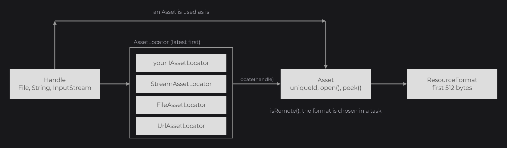

# Assets

An `Asset` (`dev.joid.lib.asset`) is a named source of bytes: it has a unique id and opens a stream on its content, nothing more. It is the step before the decoding of a [resource](resources.md): you need this page to load from a source JOID does not know, or to give a file of your jar a stable id. JOID turns every handle you pass to `Resource.of` (or to the font loader) into an asset, and you teach it new kinds of handles, such as a `Path`, an archive entry or the resource system of a game, by registering an `IAssetLocator`.

```java
final Asset file = Asset.of(new File("images/logo.png"));
final Asset url = Asset.of("https://placehold.co/100x100/DDDDDD/999999.png");
final Asset stream = Asset.of(MyUI.class.getResourceAsStream("/assets/logo.png"));
```



`Asset.of(handle)` asks the registered locators in turn and returns the asset of the first one that supports the handle. `Resource.of` and `ResourceBuilder.of` call it for every input that no [resolver](custom-formats.md#resolvers-for-in-memory-inputs) takes, and the [font loader](../fonts/adding-fonts.md) calls it for every font file. The unique id of the asset is the key of the [resource cache](resources.md#cache-and-unique-ids): two handles with the same id share their decoded data.

## Built-in handles

| Handle | Asset | Unique id | Remote |
|---|---|---|---|
| `String` | `UrlAsset` | the URL | yes |
| `File` | `FileAsset` | the absolute path | no |
| `InputStream` | `StreamAsset` | the stream's `toString()` | no |
| `Asset` | the asset itself | unchanged | as defined |

A handle that no locator supports throws an `IllegalArgumentException` (`No asset locator found for input of type ...`), and `null` throws a `NullPointerException`. Every other problem, such as a missing file or a URL that does not answer, shows up later, when the content is read: the resource [fails](resources.md#resources-in-error) and is drawn empty.

## FileAsset

`FileAsset.create(File file)` reads a file of the disk. `getFile()` returns it, and each `open()` opens a new `FileInputStream`. A video is read in place from its file.

## StreamAsset

`StreamAsset.create(InputStream stream)` wraps a stream that is already open, in a `BufferedInputStream` when it is not one. `open()` returns that same stream every time, so its content can be read only once:

- `peek(length)` marks and resets the stream, so the format detection does not consume it;
- its id is the stream's `toString()`, so two `Resource.of(stream)` calls never share data, even on the same file;
- a video read from a stream is first copied into a temporary file (`joid-video-*.mp4`, deleted when the JVM exits), so it can still seek and loop.

## UrlAsset

`UrlAsset.create(String url)` opens any URL Java can open: `http:`, `https:`, `file:` and `jar:`. `getUrl()` returns the URL.

```java
final Resource local = Resource.of(new File("images/logo.png").toURI().toString());
final Resource packed = Resource.of("jar:file:/C:/app/assets.jar!/images/logo.png");
```

- Each `open()` opens a new connection. An HTTP or HTTPS connection sends a desktop browser `User-Agent`; nothing is cached on the disk.
- When an `https:` request fails, the same URL is tried once with `http:`. Any other URL that fails throws its `IOException` at once, and the resource fails.
- `isRemote()` returns `true` for every URL, `file:` and `jar:` included: the format of an asynchronous resource is detected off the calling thread (see [Remote assets](#remote-assets-and-isremote)).

## Loading files of your jar

`getResourceAsStream` gives a new stream, so a new id, at every call. To load a file of your jar once and share it, write an asset with a stable id:

```java
public class ClasspathAsset extends Asset {

	private final String path;

	protected ClasspathAsset(final @NonNull String path) {
		super("classpath:" + path);
		this.path = path;
	}

	public static @NonNull ClasspathAsset create(final @NonNull String path) {
		return new ClasspathAsset(path);
	}

	@Override
	public @NonNull InputStream open() throws IOException {
		final InputStream stream = ClasspathAsset.class.getResourceAsStream(this.path);
		if (stream == null) {
			throw new FileNotFoundException(this.path);
		}
		return stream;
	}

}
```

```java
ResourceNode.create(100, 100, 32, 32).resource(Resource.of(ClasspathAsset.create("/assets/icons/close.png"))).attach(this);
```

An `Asset` passed as a handle is used as is, so it works everywhere a handle is accepted. Throwing an `IOException` from `open()` makes the resource fail with the dev advice `check that the file or the URL exists and can be read`.

## Writing an IAssetLocator

A locator turns a kind of handle into an asset. This one lets `Resource.of` accept a `java.nio.file.Path`:

```java
public class PathAssetLocator implements IAssetLocator {

	@Override
	public boolean supports(final @NonNull Object handle) {
		return handle instanceof Path;
	}

	@Override
	public @NonNull Asset locate(final @NonNull Object handle) {
		return FileAsset.create(((Path) handle).toFile());
	}

}
```

Register it once at startup, before loading anything with it:

```java
AssetLocator.register(new PathAssetLocator());

final Resource logo = Resource.of(Paths.get("images", "logo.png"));
```

`AssetLocator` (`dev.joid.lib.asset.locator`) asks the latest registered locator first, so yours wins over a built-in one for a handle both support. The built-in locators come last, asked in this order: `StreamAssetLocator` (`InputStream`), `FileAssetLocator` (`File`), `UrlAssetLocator` (`String`).

## Remote assets and isRemote

`isRemote()` tells the resource pipeline that opening the asset may block, on the network for example. For a remote asset that is not cached yet, `ResourceBuilder.of` creates the resource without a decoder and detects the format in a task: on a daemon thread named `ResourceTask/<id>` when the resource is asynchronous, at once when it is blocking. A local asset gets its decoder before `of` returns. Override `isRemote()` in an asset that downloads its content:

```java
@Override
public boolean isRemote() {
	return true;
}
```

## Reference

### Asset

| Method | Description |
|---|---|
| `static of(Object handle)` | The asset of a handle, through the registered locators; `handle` itself when it is an `Asset`. |
| `protected Asset(String uniqueId)` | Constructor of a subclass. |
| `getUniqueId()` | The id of the content, used as the cache key. |
| `open()` | Opens a stream on the content. Abstract; throws `IOException`. |
| `peek(int length)` | The first `length` bytes, fewer when the content is shorter, an empty array when the asset cannot be opened. |
| `read()` | The whole content. Throws `IOException`. |
| `isRemote()` | `false` by default. See [Remote assets](#remote-assets-and-isremote). |
| `toString()` | `ClassName[uniqueId]`, for example `FileAsset[C:\app\images\logo.png]`. |

### Built-in assets

| Class (`dev.joid.lib.asset.impl`) | Factory | Getter |
|---|---|---|
| `FileAsset` | `create(File file)` | `getFile()` |
| `StreamAsset` | `create(InputStream stream)` | none |
| `UrlAsset` | `create(String url)` | `getUrl()` |

### IAssetLocator and AssetLocator

| Method | Description |
|---|---|
| `IAssetLocator.supports(Object handle)` | `true` when this locator handles `handle`. |
| `IAssetLocator.locate(Object handle)` | The asset for a supported handle. |
| `static AssetLocator.register(IAssetLocator locator)` | Adds a locator in front of the others. |
| `static AssetLocator.supports(Object handle)` | `true` when `handle` is an `Asset` or a registered locator supports it. |
| `static AssetLocator.locate(Object handle)` | The asset of the first locator that supports `handle`; throws an `IllegalArgumentException` when none does. |

## Pitfalls

- A `String` handle is a URL: a relative path such as `"images/logo.png"` is not a valid URL and the resource fails. Use `new File(...)`.
- A `StreamAsset` can be read only once. A custom decoder that opens its asset twice (once for the header, once for the content) must use `peek`, which marks and resets the stream.
- Register your locators before the first `Resource.of` that needs them: a handle that no locator supports throws.

## See also

- Next: [Supported Formats](formats.md) — how the first bytes of an asset choose its decoder.
- [Resources](resources.md) — loading, caching and releasing what an asset contains.
- [Custom Formats and Decoders](custom-formats.md) — resolvers, formats and decoders.
- [Adding Your Own Fonts](../fonts/adding-fonts.md) — font files load from the same handles.