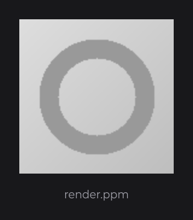
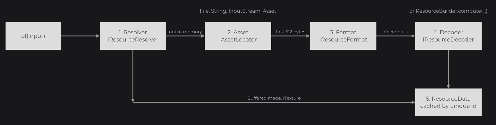
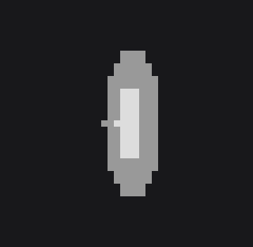

# Custom Formats and Decoders

Every step of the resource pipeline is open: you can add a format JOID does not detect, write a decoder for a new kind of content, build animations from your own frames, or accept a new kind of in-memory input. Use this page when [Supported Formats](formats.md) does not cover your content; it closes the Resources and Media guide.

```java
ResourceFormat.register(new PpmResourceFormat());

ResourceNode.create(100, 100, 256, 256).resource(Resource.of(new File("render.ppm"))).attach(this);
```



## The loading pipeline



| Step | Extension point | Role |
|---|---|---|
| 1. Resolver | `IResourceResolver`, registered in `ResourceResolver` | Turns an input already in memory (`BufferedImage`, `ITexture`) into a resource. When one supports the input, the next steps are skipped. |
| 2. Asset | `IAssetLocator`, registered in `AssetLocator` | Turns the input into an `Asset`, a source of bytes. See [Assets](assets.md). |
| 3. Format | `IResourceFormat`, registered in `ResourceFormat` | Reads the first 512 bytes of the asset and chooses the decoder. |
| 4. Decoder | `IResourceDecoder` | Decodes the bytes into pixels, uploads them into textures and updates them over time. |
| 5. Data | `ResourceData` | Holds the decoder, the textures and the state, cached and shared by every `Resource` of the same unique id. |

## Adding a format with IResourceFormat

A format recognizes its content from a header and returns the decoder. This one sends Ogg files, which JOID does not detect, to the video decoder:

```java
public class OggResourceFormat implements IResourceFormat {

	@Override
	public boolean supports(final @NonNull byte[] header) {
		return header.length >= 4 && header[0] == 'O' && header[1] == 'g' && header[2] == 'g' && header[3] == 'S';
	}

	@Override
	public @NonNull IResourceDecoder decoder(final @NonNull Asset asset, final @NonNull byte[] header) {
		return new VideoResourceDecoder(asset);
	}

}
```

Register it once at startup, before the first resource that needs it:

```java
ResourceFormat.register(new OggResourceFormat());
```

A format registered later is asked first, before every built-in format. `decoder(...)` may throw a `RuntimeException` (an `IllegalArgumentException` that names the problem, for example): the resource then [fails](resources.md#resources-in-error) with that message instead of throwing out of `Resource.of`.

| Method | Description |
|---|---|
| `IResourceFormat.supports(byte[] header)` | `true` when the content is this format. `header` holds the first 512 bytes, fewer for a shorter content, none when the asset cannot be opened. |
| `IResourceFormat.decoder(Asset asset, byte[] header)` | A new decoder for the asset. Called once per decoded `ResourceData`. |
| `static ResourceFormat.register(IResourceFormat format)` | Adds a format in front of the others. |
| `static ResourceFormat.decoder(Asset asset)` | Runs the detection on an asset and returns the decoder, a `RasterResourceDecoder` when no format matches. |

## Writing a decoder with IResourceDecoder

An `IResourceDecoder` (`dev.joid.lib.resource.dto.decoder`) turns an asset into textures. JOID calls its methods in this order:

| Method | When | Thread | What to do |
|---|---|---|---|
| `init(ResourceData)` | When the `ResourceData` gets this decoder. | the thread that creates the data | Nothing heavy: the content may never be drawn. |
| `prepare(ResourceData)` | At the first draw, before `decode`. | render thread | Create the textures with `BridgeHandler.RENDER.get().createTexture()`, which asks the render bridge of the backend for an empty GPU texture (see [Bridges and Backends](../concepts/bridges.md)), and give the data a placeholder, usually a 1×1 transparent texture, with `resource.texture(...)`. |
| `decode(ResourceData)` | Right after `prepare`. | `ResourceAsync/<n>` when the resource is asynchronous, render thread when it is blocking | Read the asset, call `resource.width(...)` and `resource.height(...)`, and store ARGB pixels with `resource.data(new int[][] {pixels})`. Never touch the GPU here. |
| `upload(ResourceData)` | At the first draw after `decode`, when the data holds pixels. | render thread | Allocate the textures at the decoded size and upload the pixels. The data then drops its pixels and turns `isUploaded()` to `true`. |
| `update(ResourceData)` | At every draw, after `prepare` and `upload`. | render thread | Advance an animation, swap the displayed texture with `resource.texture(...)`, upload work done in the background. |
| `request(ResourceData, int width, int height, boolean async)` | At every draw through `DrawUtils.RESOURCE` without texture coordinates, with the size in window pixels. | render thread | Adapt the resolution. Default: nothing. |
| `clear(ResourceData)` | When the resource is cleared, after the data deleted the textures of its array. | the calling thread | Release what the data does not own: files, threads, extra textures. |
| `isSettled()` | When a tool waits for a stable picture, such as the [testkit](../integration/testkit.md). | any | `false` while background work will change the picture although the clock does not move. Default: `true`. |
| `isMipmappable()` | Before mipmaps are generated. | render thread | `false` to never mipmap the textures. Default: `true`. |

Pixels are `int` values in ARGB order (`0xAARRGGBB`), row by row from the top-left corner, as returned by `BufferedImage.getRGB`.

### Reporting a failure with fail

A decoder never throws for unreadable content: it calls `resource.fail(exception)` and returns. The resource is then drawn empty, `isFailed()` turns `true`, `onError` listeners run and dev mode prints its warning. A `RuntimeException` thrown by `prepare` or `decode` is caught and passed to `fail` the same way, so a decoder that throws still never breaks the frame.

This decoder reads binary PPM images (`P6`, 8 bits per channel), a format JOID does not support:

```java
public class PpmResourceDecoder implements IResourceDecoder {

	private final Asset asset;

	private ITexture texture;

	public PpmResourceDecoder(final @NonNull Asset asset) {
		this.asset = asset;
	}

	@Override
	public void init(final @NonNull ResourceData resource) {}

	@Override
	public void prepare(final @NonNull ResourceData resource) {
		this.texture = BridgeHandler.RENDER.get().createTexture().allocate(1, 1).upload(new int[] {0}, 1, 1);
		resource.texture(this.texture);
	}

	@Override
	public void decode(final @NonNull ResourceData resource) {
		try (InputStream stream = new BufferedInputStream(this.asset.open())) {
			PpmResourceDecoder.token(stream);
			final int width = Integer.parseInt(PpmResourceDecoder.token(stream));
			final int height = Integer.parseInt(PpmResourceDecoder.token(stream));
			final int maximum = Integer.parseInt(PpmResourceDecoder.token(stream));
			final int[] pixels = new int[width * height];
			for (int i = 0; i < pixels.length; i++) {
				final int red = stream.read() * 255 / maximum;
				final int green = stream.read() * 255 / maximum;
				final int blue = stream.read() * 255 / maximum;
				pixels[i] = 0xFF000000 | red << 16 | green << 8 | blue;
			}
			resource.width(width).height(height).data(new int[][] {pixels});
		} catch (final IOException | NumberFormatException exception) {
			resource.fail(exception);
		}
	}

	@Override
	public void upload(final @NonNull ResourceData resource) {
		this.texture.allocate(resource.getWidth(), resource.getHeight()).upload(resource.getData()[0], resource.getWidth(), resource.getHeight());
	}

	@Override
	public void update(final @NonNull ResourceData resource) {}

	@Override
	public void clear(final @NonNull ResourceData resource) {}

	private static String token(final InputStream stream) throws IOException {
		int read = stream.read();
		while (read == '#' || Character.isWhitespace(read)) {
			if (read == '#') {
				while (read != '\n' && read != -1) {
					read = stream.read();
				}
			}
			read = stream.read();
		}

		final StringBuilder builder = new StringBuilder();
		while (read != -1 && !Character.isWhitespace(read)) {
			builder.append((char) read);
			read = stream.read();
		}
		return builder.toString();
	}

}
```

Its format checks the `P6` magic number followed by a whitespace:

```java
public class PpmResourceFormat implements IResourceFormat {

	@Override
	public boolean supports(final @NonNull byte[] header) {
		return header.length >= 3 && header[0] == 'P' && header[1] == '6' && Character.isWhitespace(header[2]);
	}

	@Override
	public @NonNull IResourceDecoder decoder(final @NonNull Asset asset, final @NonNull byte[] header) {
		return new PpmResourceDecoder(asset);
	}

}
```

### Using a decoder without a format

`ResourceBuilder.compute` creates a resource around a decoder you build yourself, without format detection. The unique id keys the cache, so pick one that cannot collide with another source. This plays a Matroska file with a video decoder that reads the file in place:

```java
final File file = new File("videos/archive.mkv");
final String uniqueId = "video:" + file.getAbsolutePath();
final Resource video = ResourceBuilder
.create()
.async()
.linear()
.compute(uniqueId, () -> new ResourceData(uniqueId, new VideoResourceDecoder(file)));
```

`new ResourceData(uniqueId, decoder)` calls `init` on the decoder. `Resource.decoder(IResourceDecoder)` replaces the decoder of an existing resource and calls `init` on the new one too.

### Built-in decoders

| Decoder | Constructors | Notes |
|---|---|---|
| `RasterResourceDecoder` | `(Asset asset)`, `(Asset asset, ImageReaderSpi reader)`, `(BufferedImage image)` | Decodes with `ImageIO`, with a given ImageIO reader, or from an image in memory. One texture. |
| `AnimatedResourceDecoder` | `(Asset asset, IResourceAnimationReader reader)` | Reads every frame with `reader`, implements `IResourcePlayback`. |
| `VectorResourceDecoder` | `(Asset asset)` | SVG rendered at the requested size, never mipmapped. |
| `VideoResourceDecoder` | `(Asset asset)`, `(File file)` | FFmpeg video with audio, implements `IResourcePlayback`. |

See [Supported Formats](formats.md) for their behavior and [Playback](playback.md) for the playback API.

## Animations with IResourceAnimationReader

`AnimatedResourceDecoder` plays any animation that an `IResourceAnimationReader` (`dev.joid.lib.resource.dto.animation`) can read. A reader returns the whole animation at once. This one plays a horizontal sprite strip, where every frame has the same width:

```java
public class StripAnimationReader implements IResourceAnimationReader {

	private final int  frameCount;
	private final long frameDuration;

	public StripAnimationReader(final int frameCount, final long frameDuration) {
		this.frameCount = frameCount;
		this.frameDuration = frameDuration;
	}

	@Override
	public @NonNull ResourceAnimation read(final @NonNull InputStream stream) throws IOException {
		final BufferedImage strip = ImageIO.read(stream);
		if (strip == null) {
			throw new IOException("The sprite strip cannot be read");
		}

		final int width = strip.getWidth() / this.frameCount;
		final int height = strip.getHeight();
		final ResourceAnimationCanvas canvas = ResourceAnimationCanvas.create(width, height);
		final List<ResourceAnimationFrame> frames = new ArrayList<>();
		for (int i = 0; i < this.frameCount; i++) {
			final int[] pixels = strip.getRGB(i * width, 0, width, height, null, 0, width);
			frames.add(ResourceAnimationFrame.create(canvas.compose(pixels, 0, 0, width, height, Blend.SOURCE, Disposal.NONE), this.frameDuration));
		}
		return ResourceAnimation.create(width, height, 0, frames);
	}

}
```

```java
final File file = new File("sprites/coin.png");
final String uniqueId = "strip:" + file.getAbsolutePath();
final Resource coin = ResourceBuilder.create().async().nearest().compute(uniqueId, () -> new ResourceData(uniqueId, new AnimatedResourceDecoder(FileAsset.create(file), new StripAnimationReader(8, 80L))));
ResourceNode.create(100, 100, 128, 128).resource(coin).attach(this);
```



| Class | Members |
|---|---|
| `IResourceAnimationReader` | `read(InputStream stream)`: the animation, or an `IOException` (the resource fails). |
| `ResourceAnimation` | `static create(int width, int height, int plays, List<ResourceAnimationFrame> frames)`: `plays` is the number of plays, `0` to loop forever; throws an `IllegalArgumentException` without frames. `getWidth()`, `getHeight()`, `getPlays()`, `getFrames()`, `getDuration()` (milliseconds), `indexAt(long time)` (frame shown at `time` milliseconds). |
| `ResourceAnimationFrame` | `static create(int[] pixels, long duration)`: full-size ARGB pixels and a duration in milliseconds; a frame shorter than 10 ms lasts 100 ms. `getPixels()`, `getDuration()`. |
| `ResourceAnimationCanvas` | `static create(int width, int height)`, then `compose(int[] frame, int x, int y, int frameWidth, int frameHeight, Blend blend, Disposal disposal)`: draws a partial frame at its offset and returns a copy of the whole canvas, transparent pixels bled for a clean linear filtering. |
| `ResourceAnimationCanvas.Blend` | `SOURCE` replaces the canvas pixels, `OVER` blends the frame over them. |
| `ResourceAnimationCanvas.Disposal` | What the canvas becomes before the next frame: `NONE` keeps the frame, `BACKGROUND` clears its area to transparent, `PREVIOUS` restores the canvas as it was before the frame. |

The built-in readers are `GifResourceAnimationReader`, `ApngResourceAnimationReader` and `WebpResourceAnimationReader` (`dev.joid.lib.resource.dto.animation.impl`). Their static helpers tell formats apart from a header: `ApngResourceAnimationReader.isAnimated(byte[])` returns `Boolean.TRUE` or `Boolean.FALSE`, or `null` when the bytes end before the answer; `WebpResourceAnimationReader.isWebp(byte[])` and `isAnimated(byte[])` return booleans. `HeifResourceFormat.isHeif(byte[])` tells whether a header is a HEIF or AVIF image.

## Resolvers for in-memory inputs

An `IResourceResolver` (`dev.joid.lib.resource.dto.resolver`) handles inputs that need no asset, because they are already decoded. Resolvers are asked before asset locators.

| Built-in resolver | Input | Result | Unique id |
|---|---|---|---|
| `TextureResourceResolver` | `ITexture` | Wraps the texture, without decoder. | `texture_` and the identity hash of the texture |
| `BufferedImageResourceResolver` | `BufferedImage` | `RasterResourceDecoder` over the image. | the image's `toString()` |
| `GlTextureResourceResolver` (`dev.joid.base.opengl.resource`), registered by the OpenGL backends | `Integer`, `IntSupplier`, while the render bridge is a `GlRenderBridge` | A `GlBorrowedTexture` of the host, see [Textures of the host](resources.md#textures-of-the-host). | `gl_texture_` and the id, or `gl_texture_supplier_` and the identity hash of the supplier |

This resolver accepts Swing icons:

```java
public class IconResourceResolver implements IResourceResolver {

	@Override
	public boolean supports(final @NonNull Object input) {
		return input instanceof Icon;
	}

	@Override
	public @NonNull Resource resolve(final @NonNull ResourceBuilder builder, final @NonNull Object input, final Consumer<Resource> callback) {
		final Icon icon = (Icon) input;
		final String uniqueId = "icon@" + Integer.toHexString(System.identityHashCode(icon));
		final Resource resource = builder.compute(uniqueId, () -> {
			final BufferedImage image = new BufferedImage(icon.getIconWidth(), icon.getIconHeight(), BufferedImage.TYPE_INT_ARGB);
			final Graphics2D graphics = image.createGraphics();
			icon.paintIcon(null, graphics, 0, 0);
			graphics.dispose();
			return new ResourceData(uniqueId, new RasterResourceDecoder(image));
		});

		if (callback != null) {
			callback.accept(resource);
		}
		return resource;
	}

}
```

```java
ResourceResolver.register(new IconResourceResolver());

final Resource folder = Resource.of(UIManager.getIcon("FileView.directoryIcon"));
```

A resolver creates its resource through `builder.compute`, so the cache and the options of the builder apply, and calls the callback itself when it is not `null`.

| Method | Description |
|---|---|
| `IResourceResolver.supports(Object input)` | `true` when this resolver handles `input`. |
| `IResourceResolver.resolve(ResourceBuilder builder, Object input, Consumer<Resource> callback)` | The resource for `input`. `callback` may be `null`. |
| `static ResourceResolver.register(IResourceResolver resolver)` | Adds a resolver in front of the others: the latest registered is asked first. |
| `static ResourceResolver.supports(Object input)` | `true` when a registered resolver supports `input`. |
| `static ResourceResolver.resolve(ResourceBuilder builder, Object input, Consumer<Resource> callback)` | Resolves with the first resolver that supports `input`; throws an `IllegalArgumentException` when none does. |

## ResourceData reference

`ResourceData` (`dev.joid.lib.resource.dto`) is the state shared by every `Resource` of the same unique id. Decoders fill it; `Resource.getResourceData()` returns it.

| Method | Description |
|---|---|
| `new ResourceData(String uniqueId, IResourceDecoder decoder)` | Creates the data and calls `decoder.init(this)` when `decoder` is not `null`. |
| `uniqueId(String)`, `getUniqueId()` | The id. |
| `decoder(IResourceDecoder)`, `getDecoder()` | The decoder, `null` for a wrapped texture; `decoder(...)` calls `init` on a new decoder. |
| `getDecoder(Class<T> clazz)` | The decoder when it is an instance of `clazz`, `null` otherwise. |
| `texture(ITexture)`, `textures(ITexture[])`, `getTextures()` | The textures drawn; `Resource.getTexture()` returns the first. |
| `data(int[][])`, `getData()` | ARGB pixels waiting for upload, one array per texture. |
| `width(int)`, `height(int)`, `getWidth()`, `getHeight()` | Size of the content in pixels. |
| `generated(boolean)`, `loaded(boolean)`, `uploaded(boolean)`, `isGenerated()`, `isLoaded()`, `isUploaded()` | Lifecycle flags. |
| `fail(Throwable)`, `isFailed()`, `getError()` | Marks the data as failed (once: later calls are ignored), drops its pixels, prints the dev warning and calls the error listeners. |
| `onError(Consumer<Throwable>)` | Adds an error listener, called at once when the data has already failed. |
| `getMissingTexture()` | The 8×8 magenta and black checkerboard drawn in dev mode for a failed resource. |
| `generate(boolean async)` | Calls `prepare`, then `decode` on the `ResourceAsync` pool or at once, and marks the data loaded. Without decoder, takes the size of its first texture and marks it loaded. |
| `upload()` | Calls the decoder's `upload` (without decoder, uploads `getData()[i]` into texture `i`), marks the data uploaded and drops the pixels. Does nothing without pixels. |
| `dispatch(Runnable task, boolean async)`, `await()`, `getTasks()` | Runs a task on a new daemon thread named `ResourceTask/<id>` when `async`, at once otherwise; `await()` waits for the tasks still running. |
| `clear()` | Deletes the textures, drops the pixels and calls the decoder's `clear`. |
| `static releaseCollected()` | Releases, on the calling thread, the data the garbage collector found unreferenced. `UIBridge.draw()` calls it every frame. |

## Pitfalls

- Never touch the GPU in `decode`: it runs on a background thread for an asynchronous resource. Create textures in `prepare`, fill them in `upload` or `update`.
- A registered format is asked before the built-in ones: make `supports` strict, or it steals PNG or MP4 files.
- Pick unique ids that cannot collide (`"strip:" + path`, not `path`): two sources with the same id share one `ResourceData`.

## See also

- Next: [Text and TextInfo](../text/text-and-textinfo.md) — the Text section.
- [Supported Formats](formats.md) — the built-in formats and their detection.
- [Resources](resources.md) — builders, cache and lifecycle.
- [Assets](assets.md) — asset locators, the step before formats.
- [Playback, Video and Audio](playback.md) — `IResourcePlayback`.