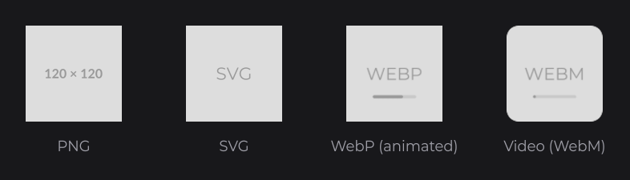
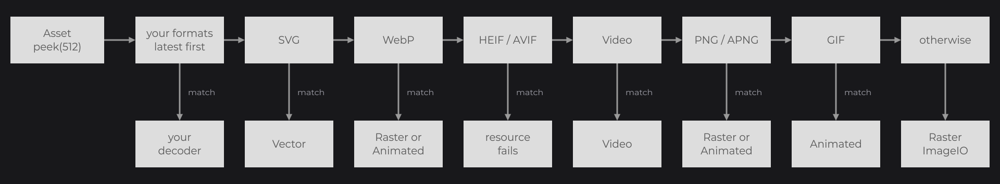

# Supported Formats

JOID decodes still images, SVG, animated GIF, APNG and WebP, and videos with their audio. It recognizes a format from the first bytes of the content, so file names and extensions never matter. Use this page to know what each format supports and how the detection works.

```java
ResourceNode.create(100, 100, 160, 120).resource(Resource.of("https://placehold.co/120x120/DDDDDD/999999.png")).stretch(StretchType.CONTAIN).attach(this);
ResourceNode.create(300, 100, 160, 120).resource(Resource.of(new File("images/placeholder.svg"))).stretch(StretchType.CONTAIN).attach(this);
ResourceNode.create(500, 100, 160, 120).resource(Resource.of(new File("images/placeholder-animated.webp"))).stretch(StretchType.CONTAIN).attach(this);
ResourcePlayerNode.create(700, 100, 160, 120).resource(Resource.of(new File("videos/placeholder.webm"))).stretch(StretchType.CONTAIN).autoplay(false).attach(this);
```



## Formats at a glance

| Format | Recognized by | Decoder | Playback |
|---|---|---|---|
| PNG | the PNG signature, without an `acTL` chunk | `RasterResourceDecoder` | no |
| APNG | the PNG signature with an `acTL` chunk before the image data | `AnimatedResourceDecoder` | yes |
| JPEG, BMP, WBMP and the formats of installed ImageIO plugins | the fallback when no other format matches | `RasterResourceDecoder` | no |
| GIF (87a and 89a) | `GIF87a` or `GIF89a` | `AnimatedResourceDecoder`, even with a single frame | yes |
| WebP, still (lossy, lossless, with alpha) | `RIFF....WEBP` | `RasterResourceDecoder` with the embedded TwelveMonkeys WebP reader | no |
| WebP, animated | `RIFF....WEBP` with a `VP8X` chunk whose animation flag is set | `AnimatedResourceDecoder` | yes |
| SVG | text starting with `<svg`, after an optional BOM, XML declaration, comments and `<!DOCTYPE>` | `VectorResourceDecoder` | no |
| MP4, M4V, MOV, 3GP and other ISO media files | an `ftyp` box at byte 4, except the HEIF and AVIF brands | `VideoResourceDecoder` | yes, with audio |
| Matroska, WebM | the EBML signature `1A 45 DF A3` | `VideoResourceDecoder` | yes, with audio |
| AVI | `RIFF....AVI ` | `VideoResourceDecoder` | yes, with audio |
| HEIF (HEIC) and AVIF | an `ftyp` box whose major brand is `avif`, `avis`, `heic`, `heim`, `heis`, `heix`, `hevc`, `hevm`, `hevs`, `hevx`, `mif1` or `msf1` | none: the resource [fails](resources.md#resources-in-error) | no |

Decoders are in `dev.joid.lib.resource.dto.decoder.impl`, formats in `dev.joid.lib.resource.dto.format.impl`. Formats with playback expose an [`IResourcePlayback`](playback.md).

## How a format is detected

`ResourceFormat.decoder(asset)` (`dev.joid.lib.resource.dto.format`) reads the first 512 bytes of the asset without consuming it and asks each registered `IResourceFormat` in turn. The first one that matches chooses the decoder:



1. the formats you registered, the latest first;
2. SVG (`SvgResourceFormat`);
3. WebP (`WebpResourceFormat`);
4. HEIF and AVIF (`HeifResourceFormat`), refused;
5. video (`VideoResourceFormat`: ISO media, Matroska and WebM, AVI);
6. PNG and APNG (`ApngResourceFormat`): when the first 512 bytes do not reach the `acTL` chunk or the image data, the first 64 KiB are read to decide;
7. GIF (`GifResourceFormat`);
8. otherwise `RasterResourceDecoder`, which reads the content with `javax.imageio.ImageIO`.

Inputs already decoded (`BufferedImage`, `ITexture`) skip the detection: [resolvers](custom-formats.md#resolvers-for-in-memory-inputs) handle them first. To support a format JOID does not recognize, or to send a container to an existing decoder, [register an `IResourceFormat`](custom-formats.md#adding-a-format-with-iresourceformat).

## Still images

`RasterResourceDecoder` decodes the whole image into ARGB pixels and uploads it as one texture.

- PNG files are read with ImageIO.
- The fallback reads every format an ImageIO reader of the JVM knows. On Java 8 that is JPEG, BMP and WBMP (PNG and GIF have their own formats); an ImageIO plugin on your classpath (a TIFF reader, for example) adds its formats.
- Still WebP uses the TwelveMonkeys WebP reader embedded and relocated in the JOID jars, whatever ImageIO plugins your classpath holds.
- A content that no reader understands makes the resource fail with `Failed to decode image, ImageIO returned null for <id>`.

## HEIF and AVIF

No embedded library decodes HEIF or AVIF images: neither ImageIO, nor TwelveMonkeys, nor the embedded FFmpeg (which cannot read tiled HEIF images). JOID recognizes them by their `ftyp` brand and makes the resource fail with `<id> is a HEIF or AVIF image, which JOID cannot decode`. In dev mode the warning adds `convert it to PNG, JPEG or WebP` and the node shows the missing-image checkerboard. Convert these files before shipping them.

## Animated images: GIF, APNG and WebP

`AnimatedResourceDecoder` reads every frame when it decodes and composes them on a canvas of the animation size, following the frame offsets and the blend and disposal operations of the file. Each composed frame stays in memory as a full-size ARGB array (`width × height × 4` bytes per frame) for as long as the resource lives; the GPU holds one texture, updated when the displayed frame changes.

| Aspect | Behavior |
|---|---|
| Frame duration | As stored in the file; a frame shorter than 10 ms lasts 100 ms, as in web browsers. |
| Loop count | GIF: the `NETSCAPE2.0` extension (0 loops forever, `n` plays `n + 1` times), one play without it. APNG: `num_plays` of `acTL` (0 loops forever). WebP: the loop count of `ANIM` (0 loops forever). `loop(boolean)` overrides it. |
| Start | Plays as soon as it is uploaded, unless `autoplay(false)`. |
| Timing | Follows the [clock bridge](../integration/bridges.md): a paused `ManualClockBridge` freezes the animation. |

See [Playback, Video and Audio](playback.md) for the controls.

## SVG

`VectorResourceDecoder` parses the document with JSVG (embedded and relocated in the JOID jars) and renders it with antialiasing.

- The intrinsic size, returned by `getWidth()` and `getHeight()`, is the size of the document rounded up, at least 1×1 pixel.
- The first raster is rendered at the intrinsic size. Each draw then tells the decoder the size the SVG covers in window pixels, and the decoder renders a raster of that size, so the SVG stays sharp at any zoom or interface scale.
- A raster is at most 4096 pixels on its longest side. The decoder keeps the 8 most recently used rasters and shows one again at once when its size comes back.
- An asynchronous resource renders its rasters on a background thread named `ResourceVector/<n>`, one at a time, and keeps drawing the previous raster meanwhile. While the size keeps changing (less than 200 ms since the last change), it keeps the current raster as long as it is at least as large as needed and less than about 1.56 times wider, and otherwise renders a raster 25 % larger than needed, so an animated size needs fewer renders. Once the size rests, it renders the exact size.
- A blocking resource renders the requested size at once.
- SVG textures are never mipmapped, and an SVG drawn with [texture coordinates](resources.md#sprites-with-texturecoords) keeps its intrinsic raster.

## Video

`VideoResourceDecoder` decodes videos with FFmpeg 6.0 through JavaCV 1.5.9. Both, with the FFmpeg natives for Windows x86-64, Linux x86-64, macOS x86-64 and macOS arm64, are embedded in the JOID jars: you declare nothing (see [Installation](../getting-started/installation.md)). Video playback works on those four platforms.

| Aspect | Behavior |
|---|---|
| Containers | MP4 and other ISO media files, Matroska and WebM, AVI. Other containers (MPEG-TS, FLV, Ogg...) are not recognized: send them to `VideoResourceDecoder` with [a format of your own](custom-formats.md#adding-a-format-with-iresourceformat). |
| Codecs | The video codecs of the embedded FFmpeg build, such as H.264, HEVC, VP8 and VP9. |
| Source | A `FileAsset` (`Resource.of(new File(...))`) is read in place. Any other asset is first copied into a temporary file (`joid-video-*.mp4`, deleted when the JVM exits). |
| Size | `getWidth()` and `getHeight()` are the size of the video. |
| Frame rate | Read from the file, 30 frames per second when the file does not tell. |
| Streaming | A decoding thread named `joid-video-decode` keeps up to 5 frames ahead; two textures alternate on the GPU. |
| Timing | A frame shows when the [clock bridge](../integration/bridges.md) reaches its time. |
| Audio | The audio track plays through the audio bridge, mixed down to stereo. See [Audio](playback.md#audio). |
| Errors | A file FFmpeg cannot open makes the resource fail: it is drawn empty, with the dev warning and `onError`. |

### Transparent videos

A WebM file whose VP8 or VP9 track is flagged with an alpha channel (`alpha_mode` set to 1) is decoded with libvpx, which keeps the alpha channel: the transparent parts of the video are transparent on screen.

## Transparency of every format

Decoders give the fully transparent pixels of an image, an animation frame or an SVG raster the color of the nearest pixel that is not fully transparent, keeping them fully transparent. Linear interpolation then never blends a dark halo into the edges of a transparent image.

## Pitfalls

- A file named `.png` that holds a JPEG is decoded as a JPEG: only the content counts.
- HEIF, HEIC and AVIF images (the default photo formats of many phones) never load: convert them to PNG, JPEG or WebP.
- Long animated GIFs keep every frame in memory at full size: prefer a video for long or large animations.

## See also

- [Resources](resources.md) — loading, options and lifecycle.
- [Playback, Video and Audio](playback.md) — controlling animations and videos.
- [Custom Formats and Decoders](custom-formats.md) — adding a format or a decoder.
- [ResourceNode](../nodes/visual/resource.md) and [ResourcePlayerNode](../nodes/visual/resource-player.md) — the nodes that display them.