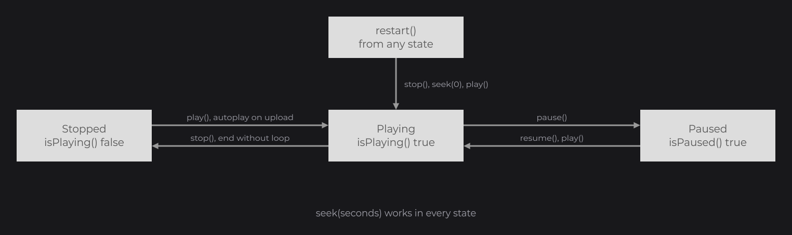

# Playback, Video and Audio

Animated images (GIF, APNG, animated WebP) and videos play over time. Their decoders implement `IResourcePlayback` (`dev.joid.lib.resource.dto.playback`), which plays, pauses, seeks and loops them; videos add a volume and positional audio. Use this page to control playback from code, beyond the `ResourcePlayerNode` controls of [Images and Media](../essentials/media.md); the node itself is detailed on [ResourcePlayerNode](../nodes/visual/resource-player.md).

```java
public class UITrailer extends UI {

	@Override
	public void init() {
		final ResourcePlayerNode video = ResourcePlayerNode
		.create(100, 100, 640, 360)
		.resource(Resource.of(new File("videos/trailer.webm")))
		.loop(true)
		.attach(this);

		ProgressNode.create(100, 470, 640, 6).progress(() -> (float) video.getProgress()).background(Color.DARKGRAY).foreground(Color.WHITE).attach(this);

		this.keybind(() -> {
			if (video.isPlaying()) {
				video.pause();
			} else {
				video.play();
			}
		}, Key.SPACE);
	}

}
```


The progress bar takes a lambda: it is read every frame, which suits a value that moves with time (see [Reactive Properties](../state/reactive-properties.md)). A video or an animation drawn by a plain `ResourceNode` or by `DrawUtils.RESOURCE` plays too: it starts on its own once uploaded, with the settings of its decoder.

## Controlling playback with IResourcePlayback

`Resource.getPlayback()` returns the playback of a resource, `null` for formats that do not play:

```java
final Resource spinner = Resource.of(new File("images/spinner.gif"));
final IResourcePlayback playback = spinner.getPlayback();
if (playback != null) {
	playback.loop(true);
}
```

The decoder of a local file exists as soon as `Resource.of` returns; for a URL, `getPlayback()` stays `null` until the format is detected (use the [load callback](resources.md#load-callbacks)). Settings made before the resource is loaded apply when it starts. Every control method returns the playback, so calls chain: `playback.stop().seek(0D).play()`.



| Method | Animated image | Video |
|---|---|---|
| `play()` | Plays from the beginning when stopped or ended, resumes a paused playback where it was, does nothing while it plays. | Same. Opens the file again after `release()`. |
| `restart()` | `stop()`, `seek(0)`, `play()`: brings a running or paused playback back to the beginning. | Same. |
| `stop()` | Stops on the current frame. | Stops the decoding and the audio; the last frame stays displayed. |
| `pause()` | Freezes the current frame; does nothing when it does not play. | Same, and pauses the audio. |
| `resume()` | Continues a paused playback where it was. | Same, and resumes the audio. |
| `seek(double seconds)` | Moves to `seconds` (a negative value counts as 0, a time past the end as the last frame), while playing, paused or stopped. | Moves to `seconds`, with the same bounds: the frames between the previous key frame and the target are skipped. While paused, the frame it lands on shows right away and the position stays there; `resume()` plays on from it. |
| `loop(boolean)` | Overrides the loop count of the file: `true` loops forever, `false` plays once. | Loops back to the first frame at the end. Default: `false`. |
| `autoplay(boolean)` | Starts on upload. Default: `true`. | Same. |
| `isPlaying()`, `isPaused()` | Running and not paused; paused. | Same. |
| `isLoop()` | `true` when it loops forever, from the file or from `loop(true)`. | The value of `loop`. |
| `isAutoplay()` | The value of `autoplay`. | Same. |
| `getDuration()` | Duration of one loop, in seconds. | Duration of the file, in seconds. |
| `getCurrentTime()` | Position in the current loop, in seconds. | Time of the displayed frame, in seconds. |
| `getProgress()` | `getCurrentTime() / getDuration()`, from 0 to 1. | Displayed frame index divided by the frame count, from 0 to 1. |

Before the resource is decoded, durations, times and progress are `0`.

> NOTE: The playback is the decoder of the shared data. Every `Resource` loaded from the same source (same [unique id](resources.md#cache-and-unique-ids)) shows the same frame and obeys the same controls. To play one file twice independently, load it through a builder without cache, such as `ResourceBuilder.create().async().linear().cache(null)`.

### End of playback

- An animated image plays as many times as its play count, then stops on its last frame: `isPlaying()` turns `false`.
- A video that does not loop stops after its last frame, with its audio: `isPlaying()` turns `false` and `VideoResourceDecoder.isEnded()` turns `true`. The last frame stays displayed; `play()` starts it again from the beginning.

### Timing and drawing

Playback follows the clock bridge (see [The Frame Loop](../concepts/frame-loop.md)), not the wall clock: with a `ManualClockBridge`, animations and videos advance only when you advance the clock, which makes captures deterministic.

The displayed frame is updated each time the resource is drawn. An animated image keeps time while it is not drawn and shows the right frame when it is drawn again. The decoding thread of a video waits while the video is not drawn, so the video catches up frame by frame when it is drawn again; its audio is fed from the same update and plays only while the video is drawn.

## Playback through a ResourcePlayerNode

`ResourcePlayerNode` drives the playback of its resource and adds callbacks (`onPlay`, `onPause`, `onStop`, `onEnd`, `onProgress`); its methods `play()`, `pause()`, `resume()`, `seek(...)`, `restart()` and `stop()` forward to the playback. When the resource starts, the node applies its own settings: `loop` (`false` by default), `autoplay` (`true`), `volume` (`1F`) and the [3D audio](#3d-audio-with-location-and-audiolistener) settings. A looping GIF in a `ResourcePlayerNode` therefore plays once unless you call `loop(true)` on the node; in a `ResourceNode`, it follows the loop count of the file.

Every setter of the node takes a value or a `Supplier`: `volume(this.volume.map(value -> value / 100F))` follows a signal. A detached node releases its video and starts it again from the beginning, with its autoplay, once attached again. See [ResourcePlayerNode](../nodes/visual/resource-player.md) for its callbacks and stretch modes.

## Videos with VideoResourceDecoder

The playback of a video is a `VideoResourceDecoder` (`dev.joid.lib.resource.dto.decoder.impl`), which adds the audio settings. Get it from the resource data or from a player node:

```java
final VideoResourceDecoder decoder = resource.getResourceData().getDecoder(VideoResourceDecoder.class);
if (decoder != null) {
	decoder.volume(0.5F);
}

final VideoResourceDecoder video = player.getVideo();
if (video != null) {
	video.volume(0.5F);
}
```

| Method | Description |
|---|---|
| `new VideoResourceDecoder(Asset asset)` | The decoder chosen by the format detection: a `FileAsset` is read in place, any other asset is first copied into a temporary file. |
| `new VideoResourceDecoder(File file)` | Reads the file in place. |
| `volume(float volume)` | Volume of the audio track, from `0F` to `1F`. Default: `1F`. |
| `audioGroup(Object audioGroup)` | Audio group of the engine the track plays in, `null` for the default group of the engine. See [Audio](#audio). Default: `null`. |
| `location(float x, float y, float z)` | Places the audio in space. See [3D audio](#3d-audio-with-location-and-audiolistener). |
| `referenceDistance(float distance)` | Distance under which the audio plays at full volume. Default: `5F`. |
| `maxDistance(float distance)` | Distance beyond which the audio is silent. Default: `50F`. |
| `release()` | Stops the decoding thread, closes the file and deletes the audio source. The textures stay; the next `play()` opens the file again. |
| `getDuration()`, `getFrameRate()`, `getTotalFrames()` | Duration in seconds, frames per second (30 when the file does not tell), frame count. |
| `getDisplayedFrameIndex()` | Index of the frame on screen. |
| `isEnded()` | `true` once a video that does not loop has delivered its last frame. |
| `getVolume()`, `getAudioGroup()`, `getReferenceDistance()`, `getMaxDistance()` | The audio settings. |
| `getFile()` | The file read by FFmpeg: the file of a `FileAsset`, the temporary copy, or the file given to the constructor. |
| `getCodec()` | The decoder forced for a transparent WebM (`libvpx` or `libvpx-vp9`), `null` otherwise. |
| `getAudioPlayer()` | The `VideoAudioPlayer` of the audio track, `null` when there is none. |

`ResourcePlayerNode` calls `release()` when it is detached or when its resource changes, and [`Resource.clear()`](resources.md#releasing-resources-with-clear) releases the decoder and deletes its textures.

## Audio

The audio track of a video plays through the audio bridge (`BridgeHandler.AUDIO`, see [Bridges and Backends](../concepts/bridges.md)): the LWJGL 2, LWJGL 3 and Vulkan backends register an OpenAL one.

- The audio player is created when the file is opened, if the file has an audio track and the volume is above `0`. A video whose volume is `0` when it opens never decodes its audio.
- Playback starts once 16 blocks of decoded samples are buffered, then streams them to the audio source in blocks of up to 4096 interleaved 16-bit values, each block made of whole frames.
- Tracks with more than two channels (4.0, 5.1, 7.1...) are mixed down to stereo by the OpenAL backends (`AudioDownmix.stereo`, without clipping), so a surround video sounds right on any output.
- `volume` applies at every update; `pause`, `resume`, `stop` and `seek` follow the video.
- `audioGroup` places the track in an audio group of the engine, such as a sound category of a game: the engine applies the volume of that group, live, and `null` (the default) plays in its default group. The group goes to the audio source (`IAudioSource.group`) when it is created and whenever it changes; an engine without groups ignores it.
- Without a registered audio bridge, the video plays silently and the error (`No audio bridge registered, ...`) is printed with its stack trace.

### 3D audio with location and AudioListener

A video with a location fades with the distance between that location and the listener. The listener is global: register an `AudioListener` (`dev.joid.lib.video`) that returns its position, in the same space as the locations. Here `camera` stands for the object of your application that holds the listening position:

```java
VideoAudioPlayer.setAudioListener(() -> new Vector3f((float) this.camera.getX(), (float) this.camera.getY(), (float) this.camera.getZ()));

ResourcePlayerNode
.create(100, 100, 320, 180)
.resource(Resource.of(new File("videos/screen.mp4")))
.location(new Vector3f(12F, 64F, -8F))
.referenceDistance(4F)
.maxDistance(32F)
.loop(true)
.attach(this);
```

At each update, with `d` the distance to the listener:

| Distance | Volume factor |
|---|---|
| `d <= referenceDistance` | `1` |
| between the two distances | `(1 - t)²`, with `t = (d - referenceDistance) / (maxDistance - referenceDistance)` |
| `d >= maxDistance` | `0` |

When the factor is `0.001` or less, the audio source pauses and the buffered samples are dropped; it plays again when the listener comes closer. The attenuation changes the volume only: the sound is not panned. Without a listener, or without a location, the video plays at its own volume.

### VideoAudioPlayer reference

`VideoAudioPlayer` (`dev.joid.lib.video`) streams decoded samples to an `IAudioSource`. The video decoder drives it; its static listener is the part you use.

| Method | Description |
|---|---|
| `static setAudioListener(AudioListener listener)`, `static getAudioListener()` | The listener shared by every player, `null` by default. |
| `new VideoAudioPlayer(int sampleRate, int channels)` | A player for interleaved 16-bit samples. |
| `play()`, `pause()`, `resume()`, `stop()` | Creates the audio source on the first `play()`, then controls it. |
| `pushSamples(Buffer[] samples)` | Queues decoded samples: planar or packed `ShortBuffer`, or planar `FloatBuffer` converted to 16 bits. At most 128 blocks wait; extra blocks are dropped. |
| `update()` | Feeds the audio source and applies the gain: `0.3 × volume × distance factor`. |
| `flush()` | Drops the buffered samples and clears the source. |
| `setVolume(float)`, `setLocation(float, float, float)`, `setReferenceDistance(float)`, `setMaxDistance(float)` | Settings, applied at the next update. |
| `getQueueSize()` | Number of blocks waiting. |
| `cleanup()` | Stops and deletes the audio source. |

## Animated images with AnimatedResourceDecoder

The playback of a GIF, APNG or animated WebP is an `AnimatedResourceDecoder`. Besides `IResourcePlayback`, it exposes:

| Method | Description |
|---|---|
| `new AnimatedResourceDecoder(Asset asset, IResourceAnimationReader reader)` | A decoder that reads the asset with `reader`. See [Custom Formats](custom-formats.md#animations-with-iresourceanimationreader). |
| `getAnimation()` | The decoded `ResourceAnimation`: size, frames with their durations, play count. `null` before decoding. |
| `getPlays()` | The play count forced by `loop(boolean)` (`0` forever, `1` once), `null` while the file decides. |
| `isRunning()` | `true` from `play()` until `stop()` or the end, paused or not. |

## Reference

| Method of `IResourcePlayback` | Description |
|---|---|
| `play()`, `stop()`, `pause()`, `resume()`, `restart()` | Controls; each returns the playback. |
| `seek(double seconds)` | Moves to a time, in seconds. |
| `loop(boolean)`, `autoplay(boolean)` | Settings. |
| `isLoop()`, `isPaused()`, `isPlaying()`, `isAutoplay()` | State. |
| `getDuration()`, `getProgress()`, `getCurrentTime()` | Duration and position, in seconds and as a fraction of 1. |

## Pitfalls

- Two `Resource.of` on the same file share one playback: pausing one pauses the other. Load independent copies through a builder without cache.
- `getPlayback()` of a URL is `null` until the format is detected: configure it in the [load callback](resources.md#load-callbacks), or use a `ResourcePlayerNode`, which applies its settings when the resource starts.
- A video set to volume `0` when it opens has no audio track to raise later: give it a small volume instead of `0` if you raise it afterward.
- The audio of a video plays only while the video is drawn.

## See also

- Next: [Custom Formats and Decoders](custom-formats.md) — formats, decoders and animations of your own.
- [ResourcePlayerNode](../nodes/visual/resource-player.md) — the player node, its callbacks and stretch modes.
- [Supported Formats](formats.md) — containers, codecs and animation formats.
- [Resources](resources.md) — loading and releasing resources.
- [Bridges and Backends](../concepts/bridges.md) — the audio and clock bridges.