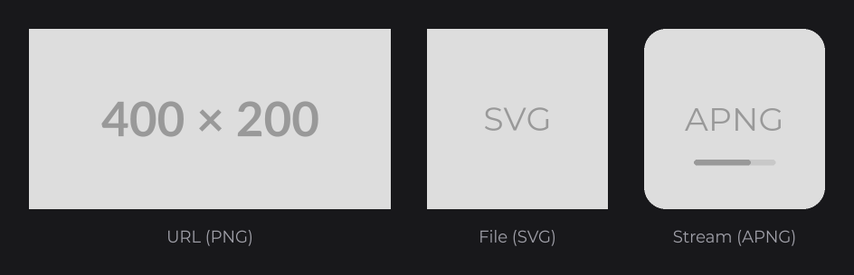
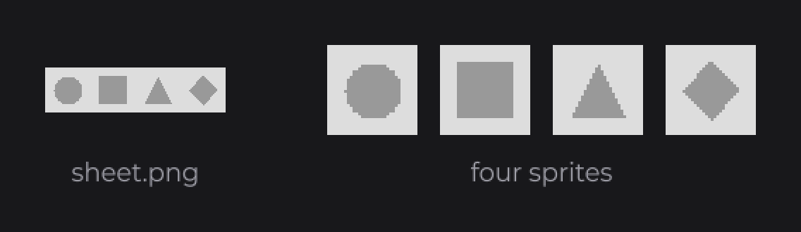
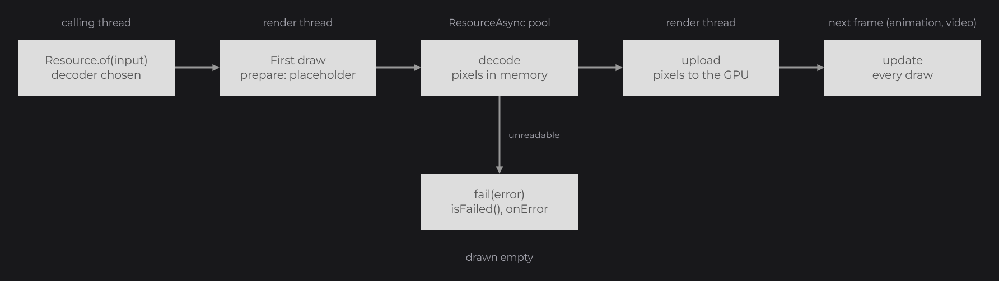
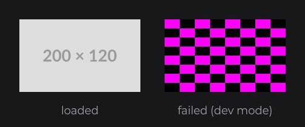

# Resources

A `Resource` (`dev.joid.lib.resource`) is an image, an animation, a vector graphic or a video that JOID decodes into textures and draws. You create one from a URL, a file, a stream or any other source with `Resource.of(...)`: JOID detects the format from the content, decodes it the first time it is drawn, and shares the decoded data between every `Resource` of the same source. This page opens the Resources and Media guide: it goes past what [Images and Media](../essentials/media.md) showed, with every input, option and stage of a resource.

```java
public class UIGallery extends UI {

	@Override
	public void init() {
		ResourceNode.create(100, 100, 400, 200).resource(Resource.of("https://placehold.co/400x200/DDDDDD/999999.png")).attach(this);
		ResourceNode.create(540, 100, 200, 200).resource(Resource.of(new File("images/placeholder.svg"))).attach(this);
		ResourceNode.create(780, 100, 0, 200).resource(Resource.of(UIGallery.class.getResourceAsStream("/assets/placeholder-animated.png"))).attach(this);
	}

}
```



`Resource.of` returns at once: nothing is read until the resource is drawn for the first time, and a `ResourceNode` draws a `Color.LOADING` skeleton until the pixels are ready. A width or a height of `0` on the node is computed from the ratio of the image.

## Inputs of Resource.of

| Input | Handled as | Unique id |
|---|---|---|
| `String` | [`UrlAsset`](assets.md): any URL Java can open (`http:`, `https:`, `file:`, `jar:`) | the URL |
| `File` | [`FileAsset`](assets.md), read from the disk | the absolute path |
| `InputStream` | [`StreamAsset`](assets.md), read once | the stream's `toString()`, so two streams never share data |
| `Asset` | the asset itself | its `getUniqueId()` |
| `BufferedImage` | decoded from memory | the image's `toString()` |
| `ITexture` | wrapped as is, without decoding | `texture_` followed by its identity hash |
| `Integer`, `IntSupplier` (OpenGL backends) | an OpenGL texture of the host, [borrowed](#textures-of-the-host) | `gl_texture_` followed by the id, or `gl_texture_supplier_` followed by the identity hash of the supplier |
| `VulkanImage`, `VulkanImageSupplier` (Vulkan backend) | a Vulkan image of the host, [borrowed](#textures-of-the-host) | `vulkan_image_` followed by the view handle, or `vulkan_image_supplier_` followed by the identity hash of the supplier |
| any other object | a registered [locator](assets.md#writing-an-iassetlocator) or [resolver](custom-formats.md#resolvers-for-in-memory-inputs) | chosen by the locator or the resolver |

The format (PNG, JPEG, WebP, SVG, GIF, APNG, MP4, WebM...) comes from the first bytes of the content, never from the file name: see [Supported Formats](formats.md).

> WARNING: A `String` is always a URL. Load a file from a path with `new File(path)`, and a file of your jar with `getResourceAsStream(path)` or an [asset with a stable id](assets.md#loading-files-of-your-jar).

## Drawing a resource

| Where | How |
|---|---|
| A node of a UI | [`ResourceNode`](../nodes/visual/resource.md): images, SVG and animations, with stretch modes, a tint and a hovered variant. |
| A video or a controllable animation | [`ResourcePlayerNode`](../nodes/visual/resource-player.md): play, pause, seek, volume and callbacks. |
| Your own draw code | `DrawUtils.RESOURCE.drawResource(x, y, width, height, resource)`, see [Drawing Resources](../drawing/resources.md). |

Like every setter of a node, `resource(...)` takes a plain value or a `Supplier`: `resource(this.selected.map(index -> this.photos[index]))` follows a signal and swaps the image when it changes (see [Reactive Properties](../state/reactive-properties.md)).

## Options of a resource

Each `Resource` has its own options. Chain them right after `of`:

```java
final Resource tiles = Resource.of(new File("sprites/tiles.png")).nearest().mipmap(false);
```

| Option | Default with `Resource.of` | Default with `ResourceBuilder.create()` |
|---|---|---|
| Decoding thread: `async()`, `blocking()` | asynchronous | blocking |
| Interpolation: `linear()`, `nearest()`, `interpolation(TextureFilter)` | `TextureFilter.LINEAR` | `TextureFilter.NEAREST` |
| Mipmaps: `mipmap(boolean)` | automatic | automatic |
| Region: `textureCoords(u, v, width, height)` | the whole source | the whole source |
| Cache | `ResourceBuilder.DEFAULT_CACHE` | `ResourceBuilder.DEFAULT_CACHE` |

### Decoding with async and blocking

- `async()` decodes the pixels on a pool of 16 daemon threads named `ResourceAsync/<n>`. The render thread never waits: the resource keeps its transparent placeholder texture until the pixels are uploaded.
- `blocking()` decodes on the thread that draws the resource, so the image appears on its first frame. On a `Resource`, `blocking()` also waits for the tasks its data already started, such as choosing the decoder of a URL.

A blocking resource loaded from a URL downloads on the thread that creates it and on the thread that draws it: keep URLs asynchronous.

### Interpolation with linear and nearest

`linear()` smooths the texture when it is scaled; `nearest()` keeps hard pixel edges, for pixel art. `interpolation(TextureFilter)` takes either value of `TextureFilter` (`dev.joid.lib.bridge.render.texture`).

```java
ResourceNode.create(100, 100, 96, 96).resource(Resource.of(new File("sprites/icon.png")).nearest()).attach(this);
ResourceNode.create(240, 100, 96, 96).resource(Resource.of(new File("sprites/icon.png")).linear()).attach(this);
```

 keeps the pixels, linear() smooths them")

Both resources share their decoded data (same file, same [unique id](#cache-and-unique-ids)) and keep their own interpolation.

### Mipmaps

`mipmap(true)` generates mipmaps, which keep a texture drawn much smaller than its size from shimmering; `mipmap(false)` never generates them. When you set neither, the first draw decides: a resource drawn with linear interpolation at a size smaller than its texture turns mipmaps on and keeps them. Mipmaps change the result only with linear interpolation. SVG resources are rendered again at the drawn size instead and are never mipmapped (`isMipmappable()` returns `false`).

### Sprites with textureCoords

`textureCoords(u, v, width, height)` draws only a region of the source, in source pixels. Create one `Resource` per sprite: the sheet is decoded once, through the cache, and each `Resource` keeps its own region.

```java
final File sheet = new File("sprites/sheet.png");
ResourceNode.create(300, 100, 64, 64).resource(Resource.of(sheet).nearest().textureCoords(0, 0, 32, 32)).attach(this);
ResourceNode.create(380, 100, 64, 64).resource(Resource.of(sheet).nearest().textureCoords(32, 0, 32, 32)).attach(this);
ResourceNode.create(460, 100, 64, 64).resource(Resource.of(sheet).nearest().textureCoords(64, 0, 32, 32)).attach(this);
ResourceNode.create(540, 100, 64, 64).resource(Resource.of(sheet).nearest().textureCoords(96, 0, 32, 32)).attach(this);
```



With a region, the resource neither asks its decoder for a resolution nor turns mipmaps on by itself, and `DrawUtils.RESOURCE.drawResource(x, y, resource)` draws the region at its size. Give a `ResourceNode` an explicit size: its automatic size is the size of the whole source.

## Lifecycle

A resource goes through these steps, all triggered by drawing it:



| Step | When | Thread | Visible through |
|---|---|---|---|
| Creation | `of(...)`: the decoder is chosen at once for a local input, in a task for a remote one | calling thread, or `ResourceTask/<id>` | `getDecoder()` |
| Generation | first draw: the decoder creates its textures, usually a 1×1 transparent placeholder | render thread | `isGenerated()` |
| Decoding | right after generation | `ResourceAsync/<n>` when asynchronous, render thread when blocking | `isLoaded()`, `getWidth()`, `getHeight()`, `getData()` |
| Upload | first draw after decoding: the pixels go to the GPU and leave the memory | render thread | `isUploaded()`; `getData()` returns `null` again |
| Update | every draw | render thread | the current frame of an animation or a video, the current raster of an SVG |
| Failure | any step that cannot read the source | the thread of that step | `isFailed()`, [`onError`](#resources-in-error) |

A resource that wraps an `ITexture` has no decoder: it is loaded at its first draw, with the size of the texture.

## Load callbacks

`of(input, callback)` calls `callback` with the resource once its decoder is chosen:

| Input | When the callback runs |
|---|---|
| Local input (file, stream, local asset, `BufferedImage`, `ITexture`) | At once, on the calling thread, before `of` returns. |
| Remote input (URL, an asset whose `isRemote()` is `true`), not cached | After the format is detected: on the `ResourceTask/<id>` thread when the resource is asynchronous, on the calling thread when it is blocking. |
| Remote input already cached | At once, on the calling thread. |

The callback does not mean that the pixels are loaded: check `isLoaded()` before reading the size or the pixels.

```java
Resource.of("https://placehold.co/800x400/DDDDDD/999999.png", resource -> System.out.println("Decoder: " + resource.getDecoder().getClass().getSimpleName()));
```

## Resources in error

A source that cannot be read never throws: a missing file, a URL that does not answer, a corrupted file, a HEIF or AVIF image, a video FFmpeg cannot open. The resource fails instead: `isFailed()` turns `true`, `isLoaded()` stays `false`, and it is drawn empty (no skeleton, no texture). In [dev mode](../concepts/dev-tools.md), `ResourceNode`, `ResourcePlayerNode` and `DrawUtils.RESOURCE` draw a magenta and black checkerboard over the whole box instead, so a missing image is easy to spot.

```java
ResourceNode.create(100, 100, 200, 120).resource(Resource.of("https://placehold.co/200x120/DDDDDD/999999.png")).attach(this);
ResourceNode.create(340, 100, 200, 120).resource(Resource.of(new File("images/missing.png")).onError((resource, error) -> System.err.println("Cannot load " + resource.getUniqueId()))).attach(this);
```



`onError((resource, error) -> ...)` is called once when the resource fails, or at once when it has already failed. It runs on the thread of the failure: the `ResourceTask/<id>` thread for a URL, a `ResourceAsync` thread for an asynchronous decoding, the render thread for a blocking one.

In dev mode, JOID also prints one warning per resource, with the reason and an advice:

```
[JOID] The resource photo.heic cannot be read and is drawn empty: photo.heic is a HEIF or AVIF image, which JOID cannot decode, convert it to PNG, JPEG or WebP
```

The advice is `check that the file or the URL exists and can be read` when the cause is an `IOException`, `convert it to PNG, JPEG or WebP` otherwise. Only a misuse throws: an input of a type that no locator or resolver supports throws an `IllegalArgumentException` (`No asset locator found for input of type ...`), and `null` throws a `NullPointerException`.

### Reloading a resource with ResourceData.reload

A program that can change its files while it runs, such as a game that reloads its resource packs, gives a resource its new content in place with `ResourceData.reload(IResourceDecoder decoder)`, on the render thread: every `Resource` sharing that data, those already in nodes included, shows the new content at its next draw. `reload` waits for the tasks of the resource, deletes the textures its previous decoder made and calls that decoder's `clear`, forgets the error, the size and the decoded data, then takes `decoder`, which decodes again at the next draw. A failed resource can thus be read again once its file exists. With a `null` decoder, a resource made of a given texture keeps that texture and only checks it again. A decoding still running for the previous decoder is ignored when it ends.

```java
for (final ResourceBuilder builder : ResourceBuilder.getBuilders()) {
	if (builder.getCache() != null) {
		for (final ResourceData data : builder.getCache().asMap().values()) {
			if (data.isFailed() && data.getUniqueId().startsWith("pack:")) {
				data.reload(new PackResourceDecoder(data.getUniqueId()));
			}
		}
	}
}
```

## Custom loaders with ResourceBuilder

A `ResourceBuilder` holds default options and a cache, and creates resources with them. Create one per kind of resource and keep it in a constant:

```java
@NoArgsConstructor(access = AccessLevel.PRIVATE)
public class Textures {

	private static final ResourceBuilder PIXEL_ART = ResourceBuilder.create().async().nearest().mipmap(false);

	public static Resource sprite(final String name) {
		return Textures.PIXEL_ART.of(new File("sprites/" + name + ".png"));
	}

}
```

`copy()` creates a builder with the same cache and a copy of the options, to derive a variant:

```java
private static final ResourceBuilder ICONS          = ResourceBuilder.create().async().linear();
private static final ResourceBuilder BLOCKING_ICONS = Textures.ICONS.copy().blocking();
```

`ResourceBuilder.getBuilders()` returns a copy of the list of the builders still alive, in no particular order. The list holds them by weak reference: a builder your application does not reference is forgotten by the garbage collector.

## Cache and unique ids

A builder keeps the decoded data (`ResourceData`) in a `Cache<String, ResourceData>` of Guava (`com.google.common.cache`, one of the libraries JOID depends on, see [Installation](../getting-started/installation.md)), keyed by the unique id of the input. Two `of` calls with the same id return two `Resource` objects over the same data: the source is decoded and uploaded once, and each `Resource` keeps its own options.

```java
final Resource first = Resource.of(new File("images/logo.png"));
final Resource second = Resource.of(new File("images/logo.png")).nearest();
```

Here `first.getResourceData() == second.getResourceData()`.

| Method | Effect |
|---|---|
| `cache(Cache<String, ResourceData>)` | Uses your own cache. Every builder uses `ResourceBuilder.DEFAULT_CACHE` until you change it, so builders share their data by default. |
| `cache(null)` | Disables caching: every `of` decodes the source again. |
| `reload()` | Drops from the cache the entries this builder loaded or found with `of` or `compute` since its last `reload()`. The next `of` decodes them again; resources created before keep their data. Does nothing without a cache. |
| `compute(uniqueId, supplier)` | Returns a resource over the cached data of `uniqueId`, creating the data with `supplier` when it is missing. |
| `compute(uniqueId, supplier, onCreate)` | Same, and calls `onCreate` with the new resource only when the data was created. |

`ResourceBuilder.DEFAULT_CACHE` drops an entry 5 minutes after its last lookup. A dropped entry stays alive as long as a `Resource` references it; the next `of` with the same id decodes the source again. On a shared cache, the `reload()` of one builder leaves the entries of the other builders in place; an entry loaded by two builders is dropped by the `reload()` of either.

```java
public static final ResourceBuilder THUMBNAILS = ResourceBuilder
.create()
.async()
.linear()
.cache(CacheBuilder.newBuilder().maximumSize(200).expireAfterAccess(1, TimeUnit.MINUTES).<String, ResourceData>build());
```

Resources created from an `InputStream` never share data, since every stream has its own id. To share a file of your jar between several `of` calls, give it a stable id with an [asset of your own](assets.md#loading-files-of-your-jar).

## Options of one resource with ResourceProperties

The options of a resource live in a `ResourceProperties` (`dev.joid.lib.resource.dto`). A new resource gets a copy of the options of its builder, so changing one resource never changes another.

| Method of `Resource` | Effect |
|---|---|
| `getProperties()` | The options of this resource. |
| `properties(ResourceProperties)` | Uses this object as is, without copying it: several resources can share one. |
| `reset()` | Replaces the options with a new copy of the builder's. |
| `copy()` | A new `Resource` over the same data, with a copy of this resource's options. |

## Releasing resources with clear

`clear()` frees a resource at once: it deletes its textures, releases its decoder (a video stops decoding and closes its file and its audio) and removes its data from the cache of its builder. The data is shared, so every `Resource` over the same data is released with it: draw none of them afterward. Call `clear()` on the render thread.

```java
banner.clear();
```

Without `clear()`, the data and its textures live as long as a `Resource` or a cache references them. Data that nothing references is released on its own: once the garbage collector finds it, the next `UIBridge.draw()` deletes its textures and releases its decoder on the render thread. `ResourceData.releaseCollected()` does the same for a host that draws without a UI bridge.

## Textures of the host

An application that embeds JOID in an engine or a game draws the textures the host already has, without copying them: on the OpenGL backends (LWJGL 2, LWJGL 3 and any engine on `joid-base-opengl`), `Resource.of(textureId)` borrows the OpenGL texture of that id.

```java
final Resource minimap = Resource.of(this.minimapTextureId);
final Resource frame = Resource.of((IntSupplier) () -> this.camera.getColorTexture());

ResourceNode.create(20, 20, 256, 256).resource(minimap).attach(this);
ResourceNode.create(300, 20, 480, 270).resource(frame).attach(this);
```

- JOID reads the texture at each draw and never writes or deletes it: it survives `clear()` and the release of the resource, and `allocate` and `upload` on it throw an `UnsupportedOperationException`. The host keeps it alive while JOID draws it.
- The size comes from the texture itself at each draw (`glGetTexLevelParameteri`), as do its mipmaps (levels allocated below `GL_TEXTURE_MAX_LEVEL`): a host texture resized or replaced shows at its new size. An `IntSupplier` is asked for the id at each draw, so the resource follows a texture the host swaps, such as the target of a double-buffered camera.
- An id that is not a texture of the context (`glIsTexture`) fails the resource at its first draw, like a file that cannot be read: drawn empty, with the checkerboard and `[JOID] The resource gl_texture_<id> cannot be read and is drawn empty: The borrowed texture <id> is not a texture of the host` in dev mode.
- The filter and the wrap of the resource are set on the texture while JOID draws it, and the host gets its own parameters back after the frame, through the [host-state journal](../integration/backends.md#giving-the-host-its-state-back).
- Read the size of a borrowed resource on the render thread only: it queries OpenGL.

On the Vulkan backend, `Resource.of(VulkanImage.create(image, view, width, height, levels))` borrows an image of the host, and a `VulkanImageSupplier` follows the image the host gives at each draw (see [Vulkan](../integration/backends.md#images-of-the-host-on-vulkan) for what the image must be).

On every backend, `Resource.of(texture)` also takes a borrowed texture built by hand, such as `GlBorrowedTexture.create(bridge, id)` (`dev.joid.base.opengl.render.texture`). A backend that lends its own kind of texture extends `BorrowedTexture` (see [Writing a Backend](../integration/writing-a-backend.md#borrowed-textures)).

### Regions of a texture

A texture can hold several images, as the atlas of a game holds its sprites. `ResourceData.region(x, y, width, height)` makes a resource of the rectangle of its texture at `(x, y)`, in pixels of the texture, without copying it: the resource measures `width` × `height`, and drawing it, stretching it, fitting it with `CONTAIN` or `COVER` or cropping it with `textureCoords` all happen inside that rectangle. A resolver that lends the sprites of an atlas builds one this way:

```java
final Resource resource = builder.compute(uniqueId, () -> new ResourceData(uniqueId, null).texture(atlas).region(x, y, width, height));
```

A decoder can also set the region at each `update`, when the content moves in its texture. With `LINEAR` interpolation or mipmaps, the pixels next to the rectangle may blend in at its edges: draw atlas regions in `NEAREST`, or keep a margin between the images.

## Binding a resource in your own drawing

These methods let your draw code, a shader or an effect sample a resource. `DrawUtils.RESOURCE` calls them for you; you need them only for the drawing of the Advanced section ([Drawing Resources](../drawing/resources.md), [Custom Shaders](../shaders/custom-shaders.md)).

| Method | Effect |
|---|---|
| `prepareBind()` | Generates the resource on its first call, applies its mipmap choice and uploads the decoded pixels once they are ready. |
| `bind(TextureWrap wrap, Runnable runnable)` | Prepares the resource, updates its decoder, binds its current texture with the resource's interpolation and `wrap`, runs `runnable`, then unbinds the texture, even when `runnable` throws. A failed resource binds the checkerboard in dev mode and no texture otherwise. |
| `bindTextureOnly(TextureWrap wrap)` | Same without running anything or unbinding: call `unbind()` yourself. |
| `unbind()` | Resets the bound texture of the render bridge. |
| `request(int width, int height)` | Tells the decoder the size in window pixels the resource is drawn at. An SVG renders again at that size; other formats ignore it. Ignored when a size is 0 or less. |
| `generate()` | Starts the generation and the decoding without drawing. Call it on the render thread: the decoder creates its textures. |
| `upload()` | Uploads the decoded pixels on the calling thread, which must be the render thread. |
| `dispatch(Runnable task)` | Runs `task` on a new daemon thread named `ResourceTask/<id>` when the resource is asynchronous, at once otherwise. `blocking()` waits for these tasks. |

## Reference

### Resource

| Method | Description |
|---|---|
| `static of(Object input)` | Creates a resource through the default builder (asynchronous, linear, `DEFAULT_CACHE`). |
| `static of(Object input, Consumer<Resource> callback)` | Same, with a [load callback](#load-callbacks). |
| `async()`, `blocking()` | Decodes on the background pool, or on the thread that draws. `blocking()` also waits for the dispatched tasks. Default with `of`: asynchronous. |
| `interpolation(TextureFilter)`, `linear()`, `nearest()` | Texture filtering. Default with `of`: linear. |
| `mipmap(boolean)` | Forces mipmaps on or off. Default: automatic. |
| `textureCoords(double u, double v, double width, double height)` | Draws only this region of the source, in source pixels. Default: the whole source. |
| `onError(BiConsumer<Resource, Throwable>)` | Called once when the resource [fails](#resources-in-error), at once when it has already failed. |
| `properties(ResourceProperties)`, `reset()`, `getProperties()` | Replaces, resets or reads the options. |
| `copy()` | A new resource over the same data, with a copy of this resource's options. |
| `uniqueId(String)` | Renames the shared data. The cache key does not change. |
| `decoder(IResourceDecoder)` | Replaces the decoder of the shared data and calls `init` on it. |
| `clear()` | [Releases](#releasing-resources-with-clear) the data, its textures and its cache entry. |
| `getWidth()`, `getHeight()` | Size of the source in pixels, `0` until loaded. |
| `getData()`, `getData(int index)` | Decoded ARGB pixels between decoding and upload, `null` otherwise. |
| `getTexture()`, `getTexture(int index)` | Current texture, `null` before generation. |
| `getDecoder()` | The decoder, `null` for a wrapped texture, while a URL is being detected, or when the detection failed. |
| `getPlayback()` | The `IResourcePlayback` of an animation or a video, `null` otherwise. See [Playback](playback.md). |
| `isMipmappable()` | `false` when the decoder refuses mipmaps. |
| `getUniqueId()`, `getResourceData()`, `getBuilder()` | The id and the shared [`ResourceData`](custom-formats.md#resourcedata-reference), and the builder that created the resource. |
| `isGenerated()`, `isLoaded()`, `isUploaded()`, `isFailed()` | [Lifecycle](#lifecycle) state. |
| `prepareBind()`, `bind(...)`, `bindTextureOnly(...)`, `unbind()`, `request(...)`, `generate()`, `upload()`, `dispatch(...)` | [Low-level access](#binding-a-resource-in-your-own-drawing). |

### ResourceBuilder

| Method | Description |
|---|---|
| `static create()` | A builder with blocking decoding, nearest interpolation, automatic mipmaps and `DEFAULT_CACHE`. |
| `static getBuilders()` | A copy of the list of the builders still alive, in no particular order. |
| `static DEFAULT_CACHE` | The shared cache: an entry expires 5 minutes after its last lookup. |
| `async()`, `blocking()`, `interpolation(TextureFilter)`, `linear()`, `nearest()`, `mipmap(boolean)`, `textureCoords(...)` | Default options, copied into each new resource. |
| `cache(Cache<String, ResourceData>)` | The cache of the builder, `null` to disable it. |
| `copy()` | A new builder with the same cache and a copy of the options. |
| `of(Object input)`, `of(Object input, Consumer<Resource> callback)` | Creates a resource. |
| `compute(String uniqueId, Supplier<ResourceData> supplier)`, `compute(..., Consumer<Resource> onCreate)` | Creates a resource over cached or new data. |
| `reload()` | Drops from the cache the entries this builder loaded. |
| `getProperties()`, `getCache()` | The default options and the cache. |

### ResourceProperties

| Method | Description |
|---|---|
| `static create()` | Blocking, nearest, automatic mipmaps, no region. |
| `async()`, `blocking()`, `isAsync()` | Decoding thread. |
| `interpolation(TextureFilter)`, `linear()`, `nearest()`, `getInterpolation()` | Texture filtering. |
| `mipmap(boolean)`, `getMipmap()` | `getMipmap()` returns `null` while the choice is automatic. |
| `textureCoords(double u, double v, double width, double height)`, `getTextureCoords()` | Region in source pixels; `getTextureCoords()` returns `{u, v, width, height}` or `null`. |
| `copy()` | A new object with the same values. |
| `copy(ResourceProperties properties)` | Copies the values of `properties` into this object. |

## Pitfalls

- A `String` is a URL, never a path: `Resource.of("images/logo.png")` fails (dev warning, checkerboard). Use `new File(...)`.
- `Resource.of(getResourceAsStream(...))` in a loop decodes the file at every call: a stream has no stable id. Keep the `Resource` in a field, or use an [asset with a stable id](assets.md#loading-files-of-your-jar).
- `clear()` releases the data of every `Resource` of the same source, not only the one you call it on.
- `getWidth()` and `getHeight()` are `0` until the resource is loaded: read them after `isLoaded()`, not right after `of`.
- `onError` runs on a background thread for an asynchronous resource: change your UI from there through a [signal](../state/signals.md) or `UI.schedule(...)`, not by touching nodes directly.

## See also

- Next: [Assets](assets.md) — where the bytes come from.
- [Images and Media](../essentials/media.md) — the first steps with resources.
- [Supported Formats](formats.md) — what JOID decodes and how it detects it.
- [Playback, Video and Audio](playback.md) — controlling animations and videos.
- [ResourceNode](../nodes/visual/resource.md) and [Drawing Resources](../drawing/resources.md) — displaying resources.