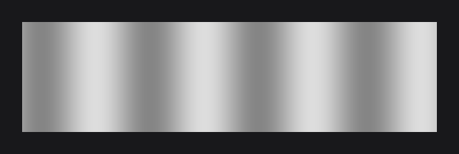
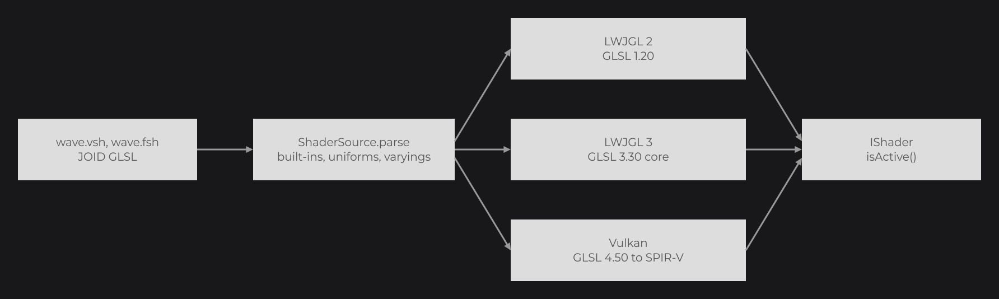
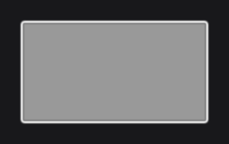
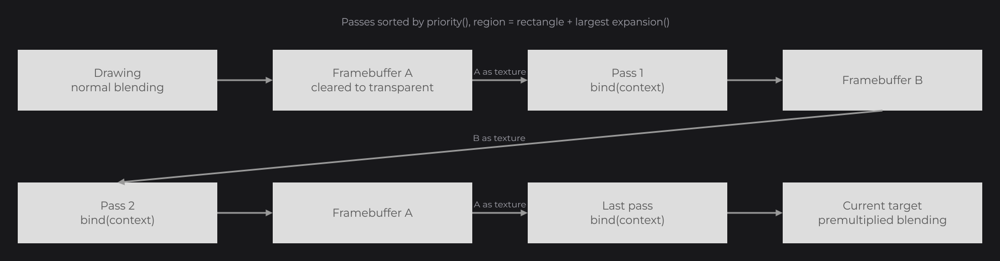
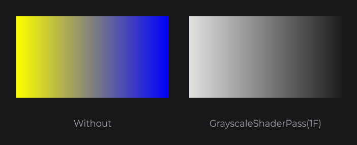

# Shaders

A JOID shader is written once in JOID GLSL and each backend translates it: GLSL on OpenGL, SPIR-V on Vulkan. Bind your own shader around draw calls when the drawing helpers and effects cannot draw what you need, or post-process a drawing through the passes of the `ShaderPipeline`.

## A first shader

A shader is a vertex file and a fragment file. This one paints moving stripes over the vertex color.

`/assets/myui/shaders/wave.vsh`:

```glsl
out vec2 vTexCoord;
out vec4 vColor;

void main() {
	vTexCoord = aTexCoord;
	vColor = aColor;
	gl_Position = uProjectionMatrix * uModelViewMatrix * vec4(aPosition, 1.0);
}
```

`/assets/myui/shaders/wave.fsh`:

```glsl
in vec2 vTexCoord;
in vec4 vColor;

uniform float u_Time;

void main() {
	float wave = 0.5 + 0.5 * sin(vTexCoord.x * 24.0 + u_Time * 3.0);
	fragColor = vec4(vColor.rgb * (0.6 + 0.4 * wave), vColor.a);
}
```

A `ShaderProgram` subclass loads the pair and sets the uniforms:

```java
public class WaveShader extends ShaderProgram {

	private static final WaveShader INSTANCE = new WaveShader();

	private WaveShader() {
		super.load(WaveShader.class.getResourceAsStream("/assets/myui/shaders/wave.vsh"), WaveShader.class.getResourceAsStream("/assets/myui/shaders/wave.fsh"));
	}

	public static @NonNull WaveShader inst() {
		return WaveShader.INSTANCE;
	}

	public void bind(final float time) {
		super.bind();
		super.getShader().uniform("u_Time", time);
	}

}
```

A custom node binds it around its draw calls:

```java
public class WaveNode extends Node {

	protected WaveNode(final double x, final double y, final double width, final double height) {
		super(x, y, width, height);
	}

	public static @NonNull WaveNode create(final double x, final double y, final double width, final double height) {
		return new WaveNode(x, y, width, height);
	}

	@Override
	public void draw(final double mouseX, final double mouseY) {
		final WaveShader shader = WaveShader.inst();
		if (!shader.canDraw()) {
			return;
		}

		final IRenderBridge render = BridgeHandler.RENDER.get();
		final IShader previous = render.getState().getShader();
		shader.bind(BridgeHandler.CLOCK.get().currentTimeMillis() % 60000L / 1000F);
		try {
			final Tessellator tessellator = Tessellator.inst();
			tessellator.start(DrawMode.QUADS);
			tessellator.setColor(221, 221, 221, 255);
			tessellator.addVertexWithUV(super.getX(), super.getY() + super.getHeight(), 0D, 0D, 1D);
			tessellator.addVertexWithUV(super.getX() + super.getWidth(), super.getY() + super.getHeight(), 0D, 1D, 1D);
			tessellator.addVertexWithUV(super.getX() + super.getWidth(), super.getY(), 0D, 1D, 0D);
			tessellator.addVertexWithUV(super.getX(), super.getY(), 0D, 0D, 0D);
			tessellator.draw();
		} finally {
			shader.unbind();
			render.getState().shader(previous);
		}
	}

}
```

```java
WaveNode.create(100, 100, 600, 160).attach(this);
```



## Loading a shader with ShaderProgram

`load(vertex, fragment)` reads both sources from any asset handle (`InputStream`, `File`, URL `String`...). The shader itself is created through the render bridge on the first `getShader()`, `bind()` or `canDraw()`, on the render thread, so a static instance can exist before the backend is registered.

A shader that failed to load must not break the UI. `canDraw()` tells whether the shader can draw, and prints `[JOID] The shader <Class> is unavailable, what it draws is skipped` once in dev mode; `isAvailable()` answers without warning, to pick a fallback.

`bind()` makes the shader current with its blending; `unbind()` returns to the default shader and restores the blending. Save `getState().getShader()` before binding and restore it in `finally`, as `WaveNode` does, so your shader nests inside an effect or another shader.

## Creating a shader with IRenderBridge.createShader

For code built at run time, or another blending, create the shader yourself:

```java
private String vertexCode;
private String fragmentCode;

final IShader shader = BridgeHandler.RENDER.get().createShader(ShaderSource.parse(ShaderStage.VERTEX, vertexCode), ShaderSource.parse(ShaderStage.FRAGMENT, fragmentCode), BlendState.PREMULTIPLIED);
if (!shader.isActive()) {
	System.err.println("[MyUI] The shader did not compile");
}
```

`ShaderSource.read(stage, handle)` reads an asset handle in UTF-8. `BlendState` is `NORMAL`, `PREMULTIPLIED`, `DISABLED` or `create(...)`.

## Setting uniforms

`uniform(name, values...)` sets a uniform by name; the shader knows its type from the declaration. Values stay until you change them, and the calls chain:

```java
private IShader shader;

shader.uniform("u_Tint", 0.6F, 0.6F, 0.6F, 1F).uniform("u_Radius", 4F).uniform("u_Steps", 8);
```

| Call | GLSL type |
|---|---|
| `uniform(name, int)`, `uniform(name, boolean)` | `int`, `bool` |
| `uniform(name, float)` | `float` |
| `uniform(name, float, float)` ... `(name, float, float, float, float)` | `vec2`, `vec3`, `vec4` |
| `uniform(name, float[])` | `mat2`, `mat3`, `mat4` (column by column), or arrays |

An undeclared name or a value that does not fit throws `IllegalArgumentException`.

## Textures and samplers

A sampler you do not assign reads the texture of the draw call (a white texture when none is bound): most shaders declare a single `uniform sampler2D tex;`. To read another texture, assign it:

```java
private IShader shader;
private ITexture texture;

shader.sampler("u_Mask", texture, TextureFilter.LINEAR, TextureWrap.CLAMP_TO_EDGE);
```

## JOID GLSL

JOID GLSL is GLSL without what differs between backends. JOID declares the attributes, matrices and output; each backend generates its own declarations from yours.



- No `#version` line (it is removed).
- The vertex shader reads only the built-in attributes; the fragment shader writes `fragColor`. Declaring another `in` in a vertex shader or an `out` in a fragment shader throws.
- Varyings are `out` in the vertex shader and `in` in the fragment shader, with the same name and type.
- One declaration per line: `[flat] in|out|uniform <type> <name>[[size]];`, without initializer or precision qualifier.
- Sample with `texture(sampler, coordinates)`.

| Built-in | Type | Content |
|---|---|---|
| `aPosition` | `vec3` | Vertex position, in canvas units. |
| `aTexCoord` | `vec2` | Texture coordinates. |
| `aColor` | `vec4` | Vertex color, or the current color. |
| `aNormal` | `vec3` | Vertex normal (3D models). |
| `uProjectionMatrix`, `uModelViewMatrix` | `mat4` | Current matrices. |
| `uNormalMatrix` | `mat3` | Normal matrix of the model-view. |
| `fragColor` | `vec4` | Output color of the fragment shader. |

## Post-processing with ShaderPipeline

`ShaderPipeline.render` draws into an offscreen buffer, runs each pass on the result, and composites the last one on the current target. The shader effects of nodes (`RoundedNodeEffect`, `BlurNodeEffect`...) run through it.

```java
ContainerNode
.create(100, 100, 300, 160)
.self(node -> node.layer((mouseX, mouseY) -> {
	ShaderPipeline.render(node, () -> DrawUtils.SHAPE.drawRect(node.getX(), node.getY(), node.getWidth(), node.getHeight(), Color.decode("#999999")), new BlurShaderPass(3F, true, 0), new BlurShaderPass(3F, false, 0), new BorderShaderPass(4F, Color.WHITE));
}))
.attach(this);
```



Passes run by ascending `priority()`, whatever their order in the call. The region is the rectangle enlarged by the largest `expansion()`: what the drawing draws outside it is cut off.



| Pass | Priority | Expansion |
|---|---|---|
| `RoundedShaderPass(radius, x1, y1, x2, y2)` | `100` | `0` |
| `CircleShaderPass(radius, centerX, centerY)`, `CircleShaderPass(node)` | `100` | `0` |
| `BlurShaderPass(radius, horizontal, iteration)` | `150 + 2 × iteration`, `+1` vertical | `radius` |
| `BorderShaderPass(width, color[, fill[, mode]])` | `200` | `width + 2` |

## Writing an IShaderPass

A pass binds a shader in `bind` and releases it in `unbind`. The pipeline then draws one quad over the region, with the previous result as the current texture (premultiplied alpha) and texture coordinates from `0` to `1`. This pass turns the result gray:

```glsl
in vec2 vTexCoord;

uniform sampler2D tex;
uniform float u_Amount;

void main() {
	vec4 color = texture(tex, vTexCoord);
	float gray = dot(color.rgb, vec3(0.299, 0.587, 0.114));
	fragColor = vec4(mix(color.rgb, vec3(gray), u_Amount), color.a);
}
```

```java
public class GrayscaleShader extends ShaderProgram {

	private static final GrayscaleShader INSTANCE = new GrayscaleShader();

	private GrayscaleShader() {
		super.load(GrayscaleShader.class.getResourceAsStream("/assets/myui/shaders/grayscale.vsh"), GrayscaleShader.class.getResourceAsStream("/assets/myui/shaders/grayscale.fsh"));
	}

	public static @NonNull GrayscaleShader inst() {
		return GrayscaleShader.INSTANCE;
	}

	public void bind(final float amount) {
		super.bind();
		super.getShader().uniform("u_Amount", amount);
	}

}
```

```java
public class GrayscaleShaderPass implements IShaderPass {

	private final float amount;

	public GrayscaleShaderPass(final float amount) {
		this.amount = amount;
	}

	@Override
	public void unbind() {
		GrayscaleShader.inst().unbind();
	}

	@Override
	public void bind(final @NonNull ShaderPassContext context) {
		if (GrayscaleShader.inst().canDraw()) {
			GrayscaleShader.inst().bind(this.amount);
		}
	}

	@Override
	public int priority() {
		return 175;
	}

}
```

`grayscale.fsh` is above; `grayscale.vsh` is `wave.vsh` without `vColor`. Priority `175` runs after the blur and before the border. Wrapped in a shader effect (see [Custom Effects](../styling/custom-effects.md)), the pass turns a node gray:



`ShaderPassContext` gives the region (`getRegionX()`...), the size of one texel (`getTexelWidth()`, `getTexelHeight()`) for neighbor samples, and `getGrid()` to convert canvas units to window pixels.

## Reference

| Method | Description |
|---|---|
| `ShaderProgram.load(Object vertex, Object fragment)` | Reads both sources (protected). |
| `getShader()` | The `IShader`, created on the first call; `null` when it failed. |
| `canDraw()`, `isAvailable()` | Whether the shader can draw, with or without the dev-mode warning. |
| `bind()`, `unbind()` | Make the shader current, return to the default shader. |
| `IRenderBridge.createShader(ShaderSource vertex, ShaderSource fragment, BlendState blend)` | Creates a shader. |
| `ShaderSource.read(ShaderStage stage, Object handle)`, `parse(ShaderStage stage, String code)` | Reads or parses a source. |
| `IShader.uniform(String name, ...)` | Sets a uniform, returns the shader. |
| `IShader.sampler(String name, ITexture texture, TextureFilter filter, TextureWrap wrap)` | Assigns a texture to a sampler. |
| `IShader.isActive()` | Compiled and linked. |
| `ShaderPipeline.render(Node node, Runnable draw, IShaderPass... passes)` | Renders through the passes over the node's rectangle (also with a `List`). |
| `ShaderPipeline.render(x, y, width, height, Runnable draw, IShaderPass... passes)` | Same over a rectangle. |
| `ShaderPipeline.cleanup()` | Deletes the pooled framebuffers, on the render thread. |
| `IShaderPass.priority()`, `expansion()` | Order of the pass; room outside the rectangle in canvas units, `0F` by default. |
| `IShaderPass.bind(ShaderPassContext context)`, `unbind()` | Bind the shader of the pass, release it. |

## Good to know

- Text unbinds the current shader: draw text outside your binding, or bind again after.
- Under a rotation with your shader bound, rectangles and images fade their edges through the vertex alpha: multiply by `aColor`.
- A pass writes a premultiplied color: the result is composited with `BlendState.PREMULTIPLIED`.

## See also

- [Drawing](../drawing/drawing.md)
- [Transformations, Framebuffers and Models](../drawing/transformations.md)
- [Custom Effects](../styling/custom-effects.md)
- [Effects](../styling/effects.md)