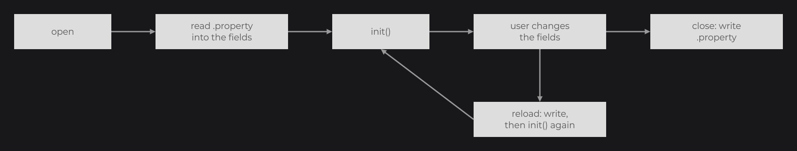

# Persistent UI Properties

[Saving State](../essentials/saving-state.md) introduced `@UIProperty`, which marks a field of a UI to save when the UI closes and to restore when the UI opens again, even after a restart. This page covers the keys, the supported types, the property file and exactly when it is read and written. Use it for small view state the user expects to find again: the selected tab, a sort order, a collapsed panel.

## A first property

```java
public class InventoryUI extends UI {

	@UIProperty
	private int tab;

	@UIProperty("sort")
	private String sortOrder = "name";

	@Override
	public void init() {
		RectNode
		.create(100, 100, 200, 60)
		.color(Color.GRAY)
		.onClick((node, mouseX, mouseY, button) -> this.tab = (this.tab + 1) % 3)
		.attach(this);
	}

}
```



When the UI closes, `tab` and `sortOrder` are written to `<config dir>/property/<package>.InventoryUI.property`, for example `{"tab":1,"sort":"name"}`. When an `InventoryUI` opens again, the saved values replace the field initializers before `init()` runs. `UIProperty` and `UIPropertyHook` are in `dev.joid.lib.ui.core.hook.property`.

## Fields and keys

| Rule | Detail |
| --- | --- |
| Annotation | `@UIProperty` or `@UIProperty("key")`. |
| Key | The annotation value, or the field name when the value is empty (the default). |
| Fields | Every annotated field of the UI class and of its superclasses, whatever its visibility. `final` and `static` fields are ignored. |
| Types | Anything Gson writes and reads back through the declared type of the field, generics included: primitives and wrappers, `String`, enums, arrays, lists, sets, maps, plain objects. |
| `null` | A field holding `null` is removed from the file, so the next open keeps its initializer. |

## The property file

- Path: `<config dir>/property/<fully qualified UI class name>.property`. The config dir is `JOID.inst().getConfigDir()`: the folder of the system property `joid.config` (default `config`) unless you call `setConfigDir(File)`. Folders are created on the first write.
- Content: one JSON object, UTF-8, one entry per key.
- One file per UI class: every instance of the class reads and writes the same file.
- Saving merges into the existing file: the entries of fields you renamed or removed stay in it.

## When properties are read and written

| Moment | What happens |
| --- | --- |
| The UI opens (first `init()` of the instance) | The file is read; each key found is written into its field. Fields without a saved key keep their value. |
| `UI.reload()` (Ctrl+R, hot reload) | The fields are saved, then `init()` runs again with their current values. |
| `UI.renew()` (Ctrl+Shift+R) | The current instance closes (saving), the new instance reads the file. |
| The UI closes | Every annotated field is written. |

## Properties or stores

| Need | Use |
| --- | --- |
| A few fields of one UI class, restored when it opens again | `@UIProperty` |
| State shared between UIs, saved in a format you control, or holding signals | A [store](stores.md) (`GLOBAL` or `PERMANENT`) |

## Reference

| Method | Description |
| --- | --- |
| `UIPropertyHook.load(UI ui)` | Reads the file of the UI's class into its annotated fields. |
| `UIPropertyHook.save(UI ui)` | Writes the annotated fields of the UI to its file. |

## Pitfalls

> WARNING: Nothing is saved when the application exits with the UI still open: call `UIPropertyHook.save(ui)` in your shutdown path when that matters.

| Situation | Behaviour |
| --- | --- |
| The file cannot be parsed | Prints `Failed to load property file: <path>`, deletes the file; every field keeps its value. |
| A saved value does not match the field type | Prints the stack trace; that field keeps its value, the others are restored. |
| The folder or the file cannot be written | Prints `Failed to create property directory: <path>` or `Failed to save property file: <path>`. |

A property field is a plain field: nodes do not follow it. To show it, read it when building the node, or keep the value in a [signal](signals.md) and save it from a store.

## See also

- Next: [Colors and Gradients](../styling/colors.md)
- [Saving State](../essentials/saving-state.md): the basics this page builds on.
- [Stores](stores.md): state shared between UIs.
- [UIs and Their Lifecycle](../concepts/uis.md): opening, reloading and closing a UI.
- [Developer Tools](../concepts/dev-tools.md): the reload shortcuts.