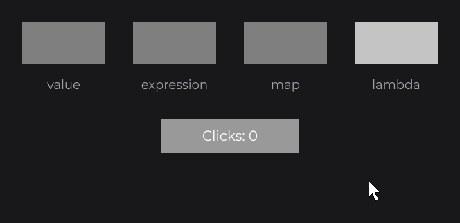
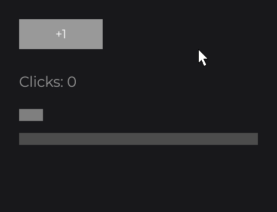
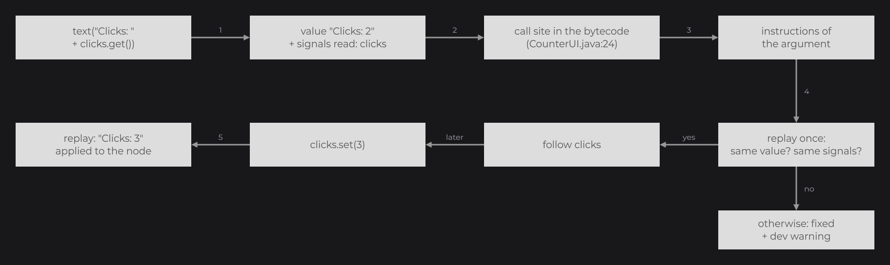

# Reactive Properties

Every property of every node follows signals the same way: you write the value as you would compute it once, and the node keeps it up to date when the signals it reads change. This page explains what each kind of argument does, how native expressions are followed, and the rules that keep it fast and predictable.

## One setter, four kinds of values

```java
private final IntegerSignal clicks = IntegerSignal.of(0);

@Override
public void init() {
	RectNode.create(100, 100, 120, 60).color(Color.GRAY).attach(this);

	RectNode.create(260, 100, 120, 60).color(this.clicks.get() >= 3 ? Color.WHITE : Color.GRAY).attach(this);

	RectNode.create(420, 100, 120, 60).color(this.clicks.map(clicks -> clicks >= 3 ? Color.WHITE : Color.GRAY)).attach(this);

	RectNode.create(580, 100, 120, 60).color(() -> Color.GRAY.to(Color.WHITE, (float) Math.abs(Math.sin(BridgeHandler.CLOCK.get().currentTimeMillis() / 500D)))).attach(this);
}
```



| Argument | Example | Behaviour |
| --- | --- | --- |
| A plain value | `color(Color.GRAY)` | Fixed. Nothing is stored or read again. |
| A native expression that reads signals | `color(this.clicks.get() >= 3 ? Color.WHITE : Color.GRAY)` | Followed: recomputed only when one of the signals it read changes. |
| A signal, `map(...)` or `Signal.from(...)` | `color(this.clicks.map(...))` | Followed: the node reads the signal, which recomputes only on change. |
| A lambda | `color(() -> ...)` | A plain `Supplier`, read every frame. For values that change without a signal: animations, clocks, the mouse. |


Every setter of every node, of the built-in effects and of `Text`/`TextElement` exists as a pair: a value overload and a `Supplier` overload. A `Signal` is a `Supplier`, so a signal, a `map(...)` or a `Signal.from(...)` goes to the `Supplier` overload; a plain value or an expression goes to the value overload, which wraps it with `Signal.from(value)`. Factories (`create(...)`) take plain values.

## Native expressions

A native expression is ordinary Java code passed to a setter. When it reads signals with `get()`, JOID follows them:

```java
TextNode.create(100, 200).text(Text.create("Clicks: " + this.clicks.get(), this.info)).attach(this);

RectNode.create(100, 260, 40, 20).color(Color.GRAY).width(40D + this.clicks.get() * 40D).attach(this);

ProgressNode.create(100, 300, 400, 20).background(Color.DARKGRAY).foreground(Color.WHITE).progress(Math.min(1F, this.clicks.get() / 5F)).attach(this);

RectNode.create(100, 340, 60, 60).color(Color.WHITE).visible(this.clicks.get() % 2 == 1).attach(this);
```



### How an expression is followed



1. The setter receives the computed value and the signals read just before (`get()` calls since the last setter).
2. No signal read: the value is a constant, nothing is stored.
3. Otherwise JOID finds the line that called the setter, reads its bytecode once (cached per class), and isolates the instructions that compute the argument.
4. It replays those instructions once and checks that they give the same value from the same signals. If they do, the property follows those signals; if not, the value stays fixed and a dev warning explains why.
5. When one of the signals changes, the expression is replayed and the property takes the new value.

The bytecode is read with ASM, embedded and relocated in the JOID jars (`dev.joid.shaded.asm`), so it never conflicts with another ASM on the classpath. It works with javac and ecj (Eclipse) output, Java 8 to 21.

### What an expression may contain

| In the expression | Followed |
| --- | --- |
| `signal.get()`, `signal.isPresent()`, reads of collection signals (`size()`, `get(i)`, `contains(...)`) | Yes, each signal read. |
| A field of the UI or of the node (`this.title`) | Re-read when a signal of the expression changes (the field itself is not followed). |
| Constants, method calls, arithmetic, comparisons, `?:`, string concatenation, `new` | Yes, replayed as written. |
| A local variable assigned once, outside a loop | Replayed from its assignment (followed if its assignment reads a signal). |
| A signal held by a local variable (`final IntegerSignal clicks = IntegerSignal.of(0);` in `init()`) | Yes: the signal object read is followed, its creation is never replayed. |
| A loop variable in a text (`name + " has " + clicks.get()`) | Yes: the part it contributes is taken from the received value. |
| A loop variable combined with a signal (`clicks.get() + index`) or deciding a condition | No: the value stays fixed, with a warning. Use `map(...)` or `Signal.from(() -> ...)`. |
| A lambda inside the expression | No (warning). Move it out, or pass `Signal.from(() -> ...)`. |
| Random numbers, the clock, side effects | No: the replay gives another value (warning). Use a lambda. |

Methods that only pass their parameter on are traversed: a setter of your own node that does `return this.label(Signal.from(label));`, or a factory method that forwards its argument to a setter, follows the expression written by its caller. A computation done inside the library (for example a node that prefixes your text) stays fixed.

### Two calls of the same setter on a line

Several calls of the same setter on one line are told apart by the value each received and the signals each read. When two calls give the same value from the same signals with different code, JOID cannot choose: write one call per line.

## Signals, map and Signal.from

Passing a signal is the direct form when the property is the signal itself:

```java
private final BooleanSignal shown = BooleanSignal.of(false);

RectNode.create(100, 120, 80, 80).color(Color.WHITE).visible(this.shown).attach(this);
```

`map` and `Signal.from(() -> ...)` are the explicit forms. Use them where a native expression cannot be followed (a value that depends on a loop variable, code inside a library or a lambda), or when you want a named, reusable derived signal:

```java
for (final String state : this.states) {
	RectNode.create(0, 0, 120, 40).color(Signal.from(() -> this.selected.get().equals(state) ? Color.WHITE : Color.GRAY)).attach(this.row);
}
```

Here `state` is a loop variable that decides a condition: a native expression would stay fixed, the lambda of `Signal.from` is followed.

## Lambdas read every frame

A lambda passed to a setter is not followed: the node calls it again on every frame. Use it for values that change without any signal:

```java
final long opened = BridgeHandler.CLOCK.get().currentTimeMillis();

TextNode.create(100, 100).text(Text.create(() -> "Open for " + (BridgeHandler.CLOCK.get().currentTimeMillis() - opened) / 1000L + " s", this.info)).attach(this);
```

Never update a signal from `draw` or a frame callback just to refresh a `map`: the equality cutoff stops on equal values. A value that moves with time is a lambda.

## When a followed value is applied

| Properties | Read |
| --- | --- |
| Colors of `RectNode` and `CircleNode` (`color`, `hoveredColor`, `borderColor`...), settings of the built-in effects | While drawing, every frame (a followed signal returns its cached value). |
| `visible(...)` and `enabled(...)` | When the node checks them, every frame. |
| Every other property: position, size, text, values of controls, layout settings, resources... | At the start of each render of the node, applied only when the value changed. |

A setter applies its value at once: a getter right after it returns the new value. The node or the framework may change a property between two changes of its signal (a `FlexNode` places its children, a drag moves a node, a `ModelViewerNode` rotates its model); the next change of the signal applies its value again. A layout that places its children (`FlexNode`, `GridNode`, `ReorderableFlexNode`, `SelectorNode`) wins over the `x`/`y` you set on them.

The last setter called for a property replaces the previous source: `x(10D)` after `x(this.offset.get())` stops following `offset`.

## Controls: one-way values and two-way signal(...)

Value setters of controls follow in one direction: the control shows the value, and never writes into the signal it reads.

```java
MuteCheckbox.create(100, 100, 40, 40).checked(this.muted.get()).attach(this);
```

`signal(...)` binds a control in both directions: the control shows the signal and writes the user's changes into it.

```java
private final IntegerSignal volume = IntegerSignal.of(5);

VolumeSlider.create(100, 100, 400, 40).values(0, 10, 5).signal(this.volume).attach(this);

ProgressNode.create(100, 160, 400, 20).background(Color.DARKGRAY).foreground(Color.WHITE).progress(this.volume.get() / 10F).attach(this);
```

`MuteCheckbox` and `VolumeSlider` are a `CheckboxNode` and an `IntegerSliderNode` of your UI kit: controls draw nothing by themselves (see [CheckboxNode](../nodes/input/checkbox.md) and [SliderNode](../nodes/input/slider.md)). A control follows one signal at a time; `signal(...)` with a `ComputedSignal` throws `IllegalArgumentException` (it is read-only): pass it to a value setter instead. `onChange` is called on every real change, whether it comes from the user, a followed value or the bound signal.

## Patterns

1. A value that depends on a signal: a setter with a native expression (`"Volume: " + this.volume.get()`). Inside a loop or a library: `map` or `Signal.from(() -> ...)`.
2. A value that changes with time without a signal (animation, clock, fps): a lambda.
3. `watch` only when the structure changes (a list that grows); when it depends on several signals, watch one `Signal.from(() -> ...)` that combines them (see [Watching Signals](watch.md)).
4. A boolean signal goes as is to `visible(...)` and `enabled(...)`.
5. Never guard a write with `if (signal.peek() != value)`: `set` already ignores an equal value.
6. A value computed once (a store, a config) is written directly in the setter in `init()`.
7. A signal shared by several nodes of a UI is a field of the UI (or a local of `init()`), never recreated inside a body.
8. The starting value of a control bound with `signal(...)` comes from the signal: do not read the signal with `get()` to configure the control.

## Dev warnings

In dev mode (`JOID.inst().isDevMode()`), an expression that reads signals but cannot be followed prints one warning per call site and setter, then keeps the value it received:

```
[JOID] CounterUI.java:24 text(...) reads clicks but cannot follow it: the local variable index is combined with a signal. The value stays "Clicks: 0". Use a field, map(...) or a lambda.
```

The names come from the bytecode (field, local variable or `method()` read before `get()`).

| Reason | Advice |
| --- | --- |
| `the bytecode of <class> cannot be read` | Use `map(...)` or a lambda. |
| `<member> does not exist at runtime` | Configure the `ISignalReplayRemapper` of the bridge (see [Bridges](../integration/bridges.md)) or use `map(...)`. |
| `no call to <setter>(...) is found on this line, the .class file on disk may no longer match the loaded class (recompiled since the launch)` | Restart the application, or use `map(...)` or a lambda. Typical with an IDE that recompiles while the application runs. |
| `several calls to <setter>(...) on this line give the same value from the same signals` | Write one call per line. |
| `the instruction <name> is not supported` | Use `map(...)` or a lambda. |
| `the expression contains a lambda` | Move the lambda out of the expression or use `Signal.from(() -> ...)`. |
| `the local variable <name> is combined with a signal` / `decides a condition` | Use a field, `map(...)` or a lambda. |
| `replaying the expression gives <value> (side effects, random, time)` | Use a lambda. |
| `replaying the expression reads other signals` | Use `map(...)` or a lambda. |
| `the module of <member> refuses the access` | Add `opens <package> to dev.joid` in its `module-info`. |
| `replaying the expression failed (<cause>)` | A later replay failed: the last value is kept. |

No warning is printed for a `get()` that no setter uses, for a lambda that reads signals, or for an expression that reads no signal. Outside dev mode, nothing is printed.

`UI.reload()` (Ctrl+R) and the hot reload clear the bytecode caches, so an expression edited while the application runs is read again.

## Performance

| Operation | Cost (JDK 8, one core) |
| --- | --- |
| Setter with a plain value | about 0.03 µs, nothing stored |
| Frame without change, per followed property | about 0.02 µs |
| Change of a signal followed by 3 nodes, native expressions / `map` | about 0.5 µs / 0.1 µs |
| Opening a UI with 3 native expressions / 3 `map` | about 17 µs / 2 µs |
| First UI opened (ASM and class analysis) | about 150 ms, once |

## Reference

| Method | Description |
| --- | --- |
| `Signal.from(T value)` | Follows the native expression passed as `value`, or returns a constant `ComputedSignal`. What every value setter calls. |
| `Signal.from(Supplier<T> supplier)` | Follows the signals read by the lambda. |
| `signal.map(Function<T, R> function)` | Follows one signal. |
| `ComputedSignal.isConstant()` | `true` when the value follows nothing. |
| `<setter>(T value)`, `<setter>(Supplier<T> value)` | Every property setter of the nodes, effects and texts. |
| `signal(Signal<V> signal)` | Two-way binding of a control (checkbox, toggle, switch, slider, selector, text fields). |

Custom nodes declare their own followed properties with `Node.follow(...)`: see [Custom Nodes](../nodes/custom-nodes.md).

## Pitfalls

- A literal `null` is ambiguous between the two overloads: write `hoveredColor((Color) null)`, `text((Text) null)`.
- A setter of `Node` in the middle of a chain returns `Node`: call the node's own setters first, or add a witness `.<RectNode>width(...)`.
- `Text.create(text, info)` where both the text and the `TextInfo` read signals cannot follow the text alone: put the whole `Text.create(...)` in the setter without reading a signal in the info, or use a lambda.
- Two arguments of one method that give the same value (the ranges of `ModelViewerNode`) may be confused by the replay: prefer distinct values or a `Supplier`.
- A computed value with a side effect or randomness is never followed: use a lambda.

## See also

- [Signals](signals.md)
- [Watching Signals](watch.md)
- [State and Reactivity](../essentials/state.md)
- [Custom Nodes](../nodes/custom-nodes.md)
- [Developer Tools](../getting-started/dev-tools.md)