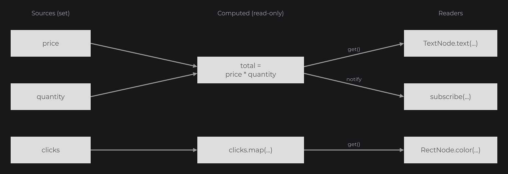
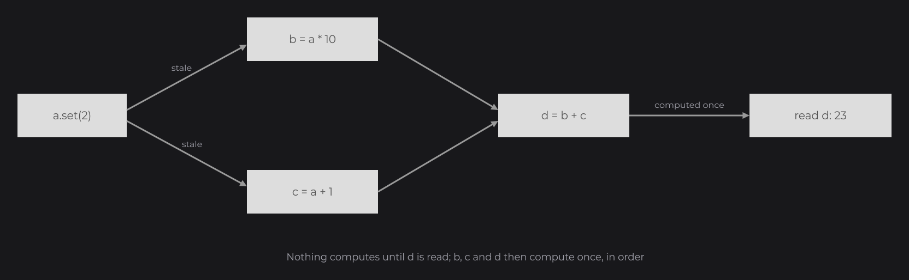

# Signals

[Signals and Reactivity](../concepts/signals.md) showed the typed signals, `get`, `peek`, `set` and `reset`, the setters that follow them, `map`, `Signal.from`, `subscribe` and `Signal.batch`. This page opens the State guides with the signal model itself: every signal type and operation, default values, how a `ComputedSignal` computes, `silent`, futures, threads and memory. [Reactive Properties](reactive-properties.md), next, details how nodes follow signals.

## A first signal

```java
private final IntegerSignal clicks = IntegerSignal.of(0);

@Override
public void init() {
	RectNode
	.create(100, 100, 200, 60)
	.color(Color.GRAY)
	.onClick((node, mouseX, mouseY, clickType) -> this.clicks.increment())
	.attach(this);

	TextNode.create(100, 190).text(Text.create("Clicks: " + this.clicks.get(), this.info)).attach(this);
}
```


`IntegerSignal.of(0)` creates a signal that holds `0`. A click calls `increment()`, and the text, built from an expression that reads `this.clicks.get()`, is recomputed. `info` is a `TextInfo` (see [Text and TextInfo](../text/text-and-textinfo.md)).

`Signal` is in `dev.joid.lib.signal`, the typed signals in `dev.joid.lib.signal.impl.primitive` (`BooleanSignal`, `IntegerSignal`, `LongSignal`, `FloatSignal`, `DoubleSignal`, `StringSignal`) and `dev.joid.lib.signal.impl.iterable` (`ListSignal`, `SetSignal`, `MapSignal`).

## Sources and derived signals



A JOID state is a small graph:

| Kind | Created with | Writable | Role |
| --- | --- | --- | --- |
| Source signal | `Signal.of(value)`, `IntegerSignal.of(0)`, `new ListSignal<>(...)`... | yes | Holds a value you set. |
| Computed signal | `signal.map(...)`, `Signal.from(...)` | no | Derives its value from the signals it reads. Type `ComputedSignal<T>`. |
| Reader | a node setter, `subscribe(...)`, `watch(...)` | — | Follows a signal. |

## Reading a signal with get and peek

| Method | Returns | Followed |
| --- | --- | --- |
| `get()` | The value, or the default value when no value is set. | Yes: a computation or a native expression that calls `get()` depends on the signal. |
| `peek()` | The same value. | No: reads without creating a dependency. |
| `isPresent()` | `true` when a value is set (not `null`). | Yes. |

Use `get()` everywhere a value must follow the signal, and `peek()` to read a value once without following it (inside a click handler, inside a `watch` body that must not depend on the value, in a computation that must ignore one of its inputs).

## Writing a signal

| Method | Effect |
| --- | --- |
| `set(value)` | Sets the value. Nothing happens when the new value `equals` the current one. |
| `reset()` | Sets the default value again. |
| `publish()` | Notifies the readers without changing the value (after mutating an object held by the signal in place). |
| `silent()` | The next write does not notify the direct subscribers of this signal (see [silent](#writing-without-notifying-with-silent)). |

`Signal` and the typed signals take a default value in their constructor and a starting value in `of(...)`:

```java
final IntegerSignal lives = new IntegerSignal(3);
final IntegerSignal score = IntegerSignal.of(10);

lives.decrement();
lives.reset();
score.reset();
```

`lives` starts at its default `3`, goes to `2`, and `reset()` brings it back to `3`. `score` starts at `10` with the default value of `IntegerSignal`, `0`: `reset()` gives `0`.

### Typed signals

| Signal | Default | Operations |
| --- | --- | --- |
| `Signal<T>` | `null` | `set`, `reset`, `publish` |
| `BooleanSignal` | `false` | `toggle()` |
| `IntegerSignal`, `LongSignal` | `0` | `increment()`, `decrement()`, `add(v)`, `subtract(v)`, `multiply(v)`, `divide(v)`, `power(e)` (`IntegerSignal`) |
| `FloatSignal`, `DoubleSignal` | `0` | `increment()`, `decrement()`, `add(v)`, `subtract(v)`, `multiply(v)`, `divide(v)` |
| `StringSignal` | `null` | `append`, `concat`, `replace`, `toLowerCase`, `toUpperCase`, `trim`, `substring`, `intern` |
| `ListSignal<E>` | `null` | `add`, `remove(e)`, `remove(index)`, `set(index, e)`, `clear`; reads `get(index)`, `size`, `isEmpty`, `contains`, `indexOf` |
| `SetSignal<E>` | `null` | `add`, `remove`, `clear`; reads `size`, `isEmpty`, `contains` |
| `MapSignal<K, V>` | `null` | `put`, `remove`, `clear`; reads `get(key)`, `containsKey`, `keySet`, `values`, `entrySet`, `size`, `isEmpty` |

Each operation goes through `set` or publishes only when it changes something: removing a missing element, putting the same value under a key, or clearing an empty collection notifies nobody. The read methods of the collection signals are followed reads, like `get()`.

```java
private final ListSignal<String> items = new ListSignal<>(new ArrayList<>());

this.items.add("First");
this.items.remove("Missing");
```

The `add` notifies, the `remove` of a missing element does not.

## Deriving with map

`map(function)` derives a read-only signal from one signal:

```java
final ComputedSignal<String> label = this.clicks.map(clicks -> "Clicks: " + clicks);
final ComputedSignal<Boolean> enough = this.clicks.map(clicks -> clicks >= 3);
```

`map` chains (`this.clicks.map(...).map(...)`) and its result is a signal like any other: pass it to a setter, `subscribe` to it, or read it in another computation.

## Combining signals with Signal.from

`Signal.from(() -> ...)` derives a signal from a lambda. Every signal read with `get()` inside the lambda is a dependency:

```java
private final IntegerSignal price = IntegerSignal.of(12);
private final IntegerSignal quantity = IntegerSignal.of(3);

final ComputedSignal<Integer> total = Signal.from(() -> this.price.get() * this.quantity.get());
```

`Signal.from(value)` takes a native expression instead of a lambda: when the expression reads signals, JOID follows them and recomputes the expression when they change; when it reads none, the result is a constant (`isConstant()` is `true`).

```java
private final IntegerSignal price = IntegerSignal.of(12);
private final IntegerSignal quantity = IntegerSignal.of(3);

final ComputedSignal<String> summary = Signal.from("Total: " + this.price.get() * this.quantity.get());
```

How a native expression is followed, and its limits, are explained in [Reactive Properties](reactive-properties.md#native-expressions).

## How a ComputedSignal computes



| Rule | Meaning |
| --- | --- |
| Lazy | A computed signal computes nothing before its first read, then returns its cached value. It recomputes only when a dependency changed since: reading it every frame costs a version check when nothing changed. |
| Dynamic dependencies | Only the signals read during the last computation count: `flag.get() ? a.get() : b.get()` follows `flag` and the branch taken. |
| Glitch-free | In a diamond (`a` → `b`, `a` → `c`, `d = b + c`), `d` is computed once per change of `a` and never sees a stale `b` with a fresh `c`. |
| Equality cutoff | When a recomputation gives a value `equals` to the previous one, nothing downstream is recomputed or notified. |
| Read-only | `set(...)` and `reset()` throw `UnsupportedOperationException`: write the signals it reads instead. |
| No self-read | A computation that reads its own signal throws `IllegalStateException`. |
| Errors | An exception in the computation reaches the reader; the computation runs again at the next read. |

## Acting on changes with subscribe

`subscribe(subscriber)` calls a `ISignalSubscriber` each time the value changes. The subscriber returns `true` to stay subscribed, `false` to unsubscribe itself:

```java
private final IntegerSignal score = IntegerSignal.of(0);

this.score.subscribe(score -> {
	System.out.println("[Game] score: " + score);
	return true;
});
```

The subscriber receives the value `get()` would return (the default value when the signal is set to `null`), so it can receive `null` for a signal without default value. It is not called at subscription, only on changes. `unsubscribe(subscriber)` removes it.

A computed signal notifies its subscribers when its value changes, not each time a source changes:

```java
private final IntegerSignal price = IntegerSignal.of(12);
private final IntegerSignal quantity = IntegerSignal.of(3);

Signal.from(() -> "Total: " + this.price.get() * this.quantity.get()).subscribe(text -> {
	System.out.println("[Shop] " + text);
	return true;
});
```

Subscriptions are for actions outside the node tree (saving, logging, sending). To show a value, pass the signal or an expression to a node setter: nodes manage their own subscriptions and drop them when they are detached.

## Grouping writes with Signal.batch

```java
private final IntegerSignal price = IntegerSignal.of(12);
private final IntegerSignal quantity = IntegerSignal.of(3);

Signal.batch(() -> {
	this.price.set(15);
	this.quantity.set(4);
});
```

Inside `batch`, subscribers and computed signals are notified once, at the end, with the final values. Reading a computed signal inside the batch already gives its up-to-date value. Batches nest. When a subscriber throws during a batch, the other notifications still run and the first exception is thrown at the end (the next ones are attached as suppressed).

## Writing without notifying with silent

```java
private final IntegerSignal score = IntegerSignal.of(0);

this.score.silent().set(0);
```

`silent()` mutes the next write for the direct subscribers of the signal (`subscribe`, `watch`, the `signal(...)` binding of a control), even when that write changes nothing. Computed signals that read it stay correct, and nodes that follow the value through a setter still show it.

## Signals from futures

`Signal.of(CompletionStage)` creates a signal without value that takes the result of the future when it completes. Here the future stands for any loading done on another thread, such as a request to a server:

```java
final Signal<String> profile = Signal.of(CompletableFuture.supplyAsync(() -> "Alex"));

TextNode.create(100, 100).text(Text.create("Hello " + profile.get(), this.info)).wait(profile).attach(this);
```

`wait(profile)` keeps the node unmounted until the signal has a value (see [Waiting and skeletons](../nodes/node-fundamentals.md#waiting-and-skeletons)).

## Threads

Dependency tracking is per thread: a computation follows the reads of the thread that runs it. A `set` from another thread (for example the completion of a future) notifies the subscribers on that thread, and computed signals see the new value at their next read. A graph built or subscribed from several threads at once has no guarantee: write from your own threads, read in the UI.

## Memory

A computed signal that nobody subscribes to is referenced by none of its sources: dropping it is enough. Once subscribed (directly or through another subscribed signal), it is held by its sources until it is unsubscribed or its subscriber returns `false`. Nodes subscribe when they are attached and unsubscribe when they are detached.

## Custom signals

Extend `Signal<T>` to add typed operations. Two protected helpers keep the notification rules:

| Method | Use |
| --- | --- |
| `publishIf(boolean changed)` | Publishes when the operation changed the value; otherwise clears a pending `silent()`. |
| `assign(T value)` | Sets a value without notifying the subscribers, keeping a pending `silent()` of the caller. |

```java
public class CounterSignal extends Signal<Integer> {

	public CounterSignal() {
		super(0);
	}

	public void addPositive(final int amount) {
		if (amount > 0) {
			super.set(super.peek() + amount);
		}
	}

}
```

## Reference

### Signal

| Method | Description |
| --- | --- |
| `new Signal<>()`, `new Signal<>(T defaultValue)` | A signal without value, with a default value. |
| `Signal.of(T value)` | A signal holding `value` (no default value). |
| `Signal.of(CompletionStage<T> future)` | A signal that takes the result of the future. |
| `Signal.from(T value)` | A `ComputedSignal` following the native expression passed as `value`, or a constant. |
| `Signal.from(Supplier<T> supplier)` | A `ComputedSignal` computed by the lambda, following the signals it reads. |
| `Signal.batch(Runnable runnable)` | Runs the writes and notifies once at the end. |
| `get()` | Followed read: value, or default value. `Signal` implements `Supplier<T>`. |
| `peek()` | Unfollowed read. |
| `isPresent()` | Followed: `true` when a value is set. |
| `set(T value)` | Sets the value, notifies when it changed. |
| `reset()` | Sets the default value. |
| `publish()` | Notifies without changing the value. |
| `silent()` | Mutes the next write for the direct subscribers. |
| `map(Function<T, R> function)` | A `ComputedSignal<R>` derived from this signal. |
| `subscribe(ISignalSubscriber<T> subscriber)`, `unsubscribe(...)` | Adds or removes a subscriber. |
| `getEventSet()` | The direct subscribers. |

### ComputedSignal

| Method | Description |
| --- | --- |
| `get()`, `peek()`, `isPresent()` | As `Signal`, computing first when a dependency changed. |
| `isConstant()` | `true` for a `Signal.from(value)` that follows nothing. |
| `set(...)`, `reset()` | Throw `UnsupportedOperationException`. |

### ISignalSubscriber

`boolean update(T value)`: called with the new value; return `false` to unsubscribe.

## Pitfalls

> WARNING: Mutating an object held by a plain `Signal` (a list read with `get()` then changed) notifies nobody. Use `ListSignal`, `SetSignal`, `MapSignal`, or call `publish()` after the change.

- A `ComputedSignal` cannot be bound to a control with `signal(...)` (it is read-only): pass it to a setter, or bind the source signal.
- `IntegerSignal.of(5)` has the default `0`: `reset()` gives `0`, not `5`. Use `new IntegerSignal(5)` when `reset()` must return `5`.
- Writing a signal from inside a computation is allowed but recomputes at the next read: keep computations free of side effects.
- A signal is a `Supplier`: a method with both `foo(Supplier<T>)` and `foo(Signal<T>...)` overloads takes the `Supplier` one.

## See also

- Next: [Reactive Properties](reactive-properties.md)
- [Signals and Reactivity](../concepts/signals.md): the basics this page builds on.
- [Watching Signals](watch.md): rebuilding nodes when a signal changes.
- [Stores](stores.md): signals shared between UIs.
- [Custom Nodes](../nodes/custom-nodes.md): nodes that subscribe to signals.