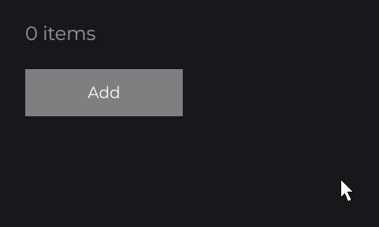
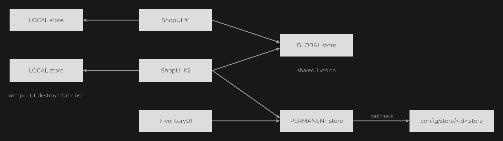

# Stores

[Saving State](../essentials/saving-state.md) showed a store, `@UIStoreData`, the three `StoreContext` values and a `PERMANENT` store with `load` and `save`. This page covers stores in full: how `useStore` finds or creates a store, constructor arguments, the lifecycle of a store, its file, and `UIStoreHook`. Use a store for state that outlives a node tree: a cart, the settings of a menu, a session.

## A first store

```java
@Getter
@UIStoreData(context = StoreContext.GLOBAL)
public class CartStore extends UIStore {

	private final ListSignal<String> items = new ListSignal<>(new ArrayList<>());

}
```

In the `init()` of a shop UI:

```java
final CartStore cart = super.useStore(CartStore.class);

TextNode.create(100, 100).text(Text.create(cart.getItems().size() + " items", this.info)).attach(this);

RectNode
.create(100, 160, 200, 60)
.color(Color.GRAY)
.onClick((node, mouseX, mouseY, clickType) -> cart.getItems().add("Sword"))
.attach(this);
```



Every UI that calls `useStore(CartStore.class)` gets the same instance, so the cart survives when the shop closes and opens again. The text reads the `ListSignal` of the store with `size()`, a followed read: it updates on each `add` (see [Reactive Properties](reactive-properties.md)). `UIStore` is in `dev.joid.lib.ui.core.hook.store`, `UIStoreData` in `dev.joid.lib.ui.core.hook.store.data`, `StoreContext` in `dev.joid.lib.ui.core.hook.store.context`; `info` is a `TextInfo` (see [Text](../essentials/text.md)). `@Getter` is the Lombok annotation that writes `getItems()`.

## Store contexts with StoreContext



| Context | Instances | Lifetime | Saved to disk |
| --- | --- | --- | --- |
| `LOCAL` (default) | One per UI instance. | Destroyed when that UI closes; reopening the UI creates a new one. | No |
| `GLOBAL` | One shared by every UI. | Until `UIStoreHook.destroyStore(store)`. | No |
| `PERMANENT` | One shared by every UI. | Until `UIStoreHook.destroyStore(store)`; restored from its file on the next run. | Yes |

`isLocal()` is `true` for `LOCAL`; `isGlobal()` is `true` for `GLOBAL` and `PERMANENT`.

## Declaring a store with @UIStoreData

Every store class needs `@UIStoreData`; a store without it throws `IllegalStateException` when it is used.

| Attribute | Default | Description |
| --- | --- | --- |
| `id` | `""` | Name of the file of a `PERMANENT` store. Empty: the fully qualified class name of the store. |
| `context` | `StoreContext.LOCAL` | Context of the store. |

Give a `PERMANENT` store an explicit id: renaming or moving the class would otherwise change its file. Two stores with the same id share one file. `getData()` returns the annotation of a store.

## Getting a store with useStore

| Method | Description |
| --- | --- |
| `UI.useStore(Class<T> clazz, Object... args)` | The store of this UI or the shared one, created on first use with `args` as constructor arguments. |
| `Node.useStore(Class<T> clazz)` | The store of the node's UI (`getUi().useStore(clazz)`), without constructor arguments. |
| `UIStoreHook.useStore(Class<T> clazz, Object... args)` | The same lookup outside any UI: the shared `GLOBAL` or `PERMANENT` instance, or a new `LOCAL` store on every call. |

`UI.useStore` looks up the store in this order:

1. A `LOCAL` instance this UI already created.
2. The shared instance of a `GLOBAL` or `PERMANENT` store already created by any UI.
3. A new instance, created with the only public constructor whose parameters accept `args` (compatible types, a primitive parameter accepts its wrapper, `null` fits any object parameter), then restored from its file (`PERMANENT` store with a file) or initialized with `init()`.

The arguments are used only when the store is created.

```java
@Getter
@RequiredArgsConstructor
@UIStoreData
public class SessionStore extends UIStore {

	private final String player;

}
```

`@RequiredArgsConstructor` gives the store a public constructor `SessionStore(String player)`; `useStore` passes it its arguments:

```java
@Override
public void init() {
	final SessionStore session = super.useStore(SessionStore.class, "Alex");

	TextNode.create(100, 100).text(Text.create("Player: " + session.getPlayer(), this.info)).attach(this);
}
```

A store is not a signal: a value computed once from a store is written directly in the setter. Hold [signals](signals.md) in the store when nodes must follow its changes.

| Error | Message |
| --- | --- |
| No constructor accepts the arguments | `IllegalArgumentException: No public constructor of <class> accepts the arguments [...]` |
| Several constructors accept them | `IllegalArgumentException: Several public constructors of <class> accept the arguments [...]: [...]` |
| The constructor throws | `RuntimeException: Failed to create store instance for class <class>`, with the original error as cause |

## Lifecycle of a store

| Method | Called |
| --- | --- |
| `init()` | When the store is created and not restored from a file. |
| `load(JsonObject json)` | When a `PERMANENT` store is created and its file was read; `init()` is not called then. |
| `save(JsonObject json)` | Before a `PERMANENT` store is written: fill `json` with the state to keep. |
| `save()` | Writes a `PERMANENT` store immediately; does nothing for the other contexts. |
| `destroy()` | When the store is destroyed: a `LOCAL` store when its UI closes, any store through `UIStoreHook.destroyStore`. |

When a UI closes, JOID saves every `PERMANENT` store in use, then destroys the `LOCAL` stores of that UI and forgets them: the next open starts with fresh local stores.

## Saving a PERMANENT store

```java
@Getter
@UIStoreData(id = "settings", context = StoreContext.PERMANENT)
public class SettingsStore extends UIStore {

	private final FloatSignal volume = new FloatSignal(1F);

	@Override
	public void load(final JsonObject json) {
		if (json.has("volume")) {
			this.volume.set(json.get("volume").getAsFloat());
		}
	}

	@Override
	public void save(final JsonObject json) {
		json.addProperty("volume", this.volume.peek());
	}

}
```

- The file is `<config dir>/store/<id>.store`. The config dir is `JOID.inst().getConfigDir()`: the folder of the system property `joid.config` (default `config`, in the working directory) unless you call `setConfigDir(File)`. Folders are created on the first write.
- The file holds the `JsonObject` (`com.google.gson.JsonObject`) filled by `save(JsonObject)`, as UTF-8 JSON.
- It is read once, when the store is created. Field initializers have run by then, so `load` only overrides what the file contains.
- An empty or unreadable file is deleted and the store starts from `init()` (`Failed to load store file: <id>` is printed for a parse error).
- The store is written when any UI closes, and when you call `save()`, `UIStoreHook.saveStore(store)` or `UIStoreHook.saveAll()`.

## Reference

### UIStore

| Method | Description |
| --- | --- |
| `init()`, `destroy()` | Hooks at creation and destruction. |
| `load(JsonObject json)`, `save(JsonObject json)` | Hooks of a `PERMANENT` store. |
| `save()` | Writes a `PERMANENT` store. |
| `getData()` | The `@UIStoreData` of the store. |

### UIStoreHook

| Method | Description |
| --- | --- |
| `useStore(Class<T> clazz, Object... args)` | Gets or creates a store. |
| `saveStore(UIStore store)` | Writes a `PERMANENT` store; does nothing for the other contexts. |
| `saveAll()` | Writes every shared `PERMANENT` store. |
| `destroyStore(UIStore store)` | Removes a `GLOBAL` or `PERMANENT` store from the shared instances (the next `useStore` creates a new one), deletes the file of a `PERMANENT` store, then calls `destroy()`. It does not save the store first. |

## Pitfalls

> WARNING: Nothing is saved when the application exits with UIs still open. Call `UIStoreHook.saveAll()` in your shutdown path, or `save()` after each change that must not be lost.

- `destroyStore` deletes the file of a `PERMANENT` store: use it to reset a shared store (logout), not to close it.
- A `LOCAL` store obtained through `UIStoreHook.useStore` outside a UI is a new instance on every call.

## See also

- Next: [Persistent UI Properties](properties.md)
- [Saving State](../essentials/saving-state.md): the basics this page builds on.
- [Signals](signals.md): the signals a store holds.
- [UIs and Their Lifecycle](../concepts/uis.md): when a UI opens and closes.
- [The UI Class](../ui/ui-class.md)