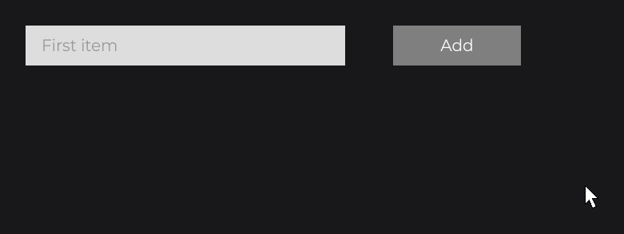
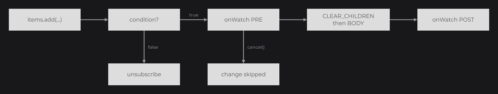

# Watching Signals

`watch` rebuilds part of the node tree when a signal changes, and `wait` delays a node until its data is ready. Use `watch` when the structure changes (a list that grows, a set of tabs); a text, a color, a size or a visibility that depends on a signal is a [reactive property](reactive-properties.md), not a watch.

## Rebuilding a list with watch

```java
private final ListSignal<String> items = new ListSignal<>(new ArrayList<>(Arrays.asList("First item")));

@Override
public void init() {
	FlexNode
	.vertical(100, 100, 400)
	.margin(8D)
	.watch(this.items, WatchProperty.CLEAR_CHILDREN, WatchProperty.BODY)
	.body(flex -> {
		for (final String item : this.items.peek()) {
			RectNode.create(0, 0, 400, 50).color(Color.decode("#DDDDDD")).attach(flex);
		}
	})
	.attach(this);

	RectNode
	.create(560, 100, 160, 50)
	.color(Color.GRAY)
	.onClick((node, mouseX, mouseY, clickType) -> this.items.add("Item " + (this.items.size() + 1)))
	.attach(this);
}
```



On each change of `items`, `CLEAR_CHILDREN` detaches the children of the flex, then `BODY` runs the body again. The body reads the list with `peek()`: the structure is rebuilt by the watch, not followed expression by expression.



## WatchProperty

`WatchProperty` (`dev.joid.lib.ui.node.property.watch`) is an action applied to the node on each change. Properties combine and run in the given order:

| Property | Action |
| --- | --- |
| `WatchProperty.CLEAR_CHILDREN` | Detaches every child of the node. |
| `WatchProperty.BODY` | Runs the body set with `body(...)` again. |
| `WatchProperty.custom((node, signal) -> ...)` | Runs your action with the node and the signal that changed. |

```java
private final IntegerSignal level = IntegerSignal.of(1);

RectNode
.create(100, 100, 60, 60)
.color(Color.GRAY)
.watch(this.level, WatchProperty.custom((node, signal) -> node.effect(RoundedNodeEffect.create(this.level.peek() * 6F))))
.attach(this);
```

## Reacting with onWatch

`watch(signal)` without property only fires the `onWatch` callbacks of the node:

```java
TextNode
.create(100, 100)
.text(Text.create("Saved", this.info))
.watch(this.saves)
.onWatch((node, signal, properties) -> System.out.println("[Editor] saved"))
.attach(this);
```

`onWatch` runs around the properties: its PRE phase may cancel the change (`context.cancel()`), then the properties run, then the POST phase (see [Callbacks](../interactions/callbacks.md)).

## Conditions

`watch(signal, condition, properties...)` applies a change only while `condition` returns `true`. The condition is checked before each change; when it is `false`, the change is ignored and the watch unsubscribes for good (it is not a pause). Without a condition, the watch lasts while the UI of the node is open.

```java
.watch(this.squares, () -> this.live.peek(), WatchProperty.CLEAR_CHILDREN, WatchProperty.BODY)
```

## When a node subscribes

- A node subscribes to its watches when it is attached to a UI. A watch declared before `attach` (or outside `init()`) starts at the attachment.
- At the first attachment, the changes made before are not replayed: the body already reads the current values.
- When the node is detached (`remove`, `clearChildren`, a closed or reloaded UI), it unsubscribes; attached again, it subscribes again.
- A watch that depends on several signals watches one signal that combines them: `watch(Signal.from(() -> ...), ...)`.

## Waiting before mounting with wait

`wait(...)` keeps a node unmounted (not drawn, its children not shown) until every condition is met. A skeleton is drawn in the meantime, and `onMount` runs when the node appears:

```java
private final Signal<String> profile = Signal.of(this.loadProfile());

RectNode
.create(100, 100, 400, 120)
.color(Color.decode("#DDDDDD"))
.wait(this.profile)
.skeleton(rect -> RectNode.create(0, 0, rect.getWidth(), rect.getHeight()).color(Color.LOADING))
.onMount(rect -> System.out.println("[Profile] shown"))
.body(rect -> {
	TextNode.create(20, 40).text(Text.create("Hello " + this.profile.get(), this.info)).attach(rect);
})
.attach(this);
```


| Method | Waits until |
| --- | --- |
| `wait(ISignal<?> signal)` | The signal has a value (`isPresent()`). |
| `wait(long time, TimeUnit unit)` | The time has passed (UI clock). |
| `wait(Predicate<T> predicate)` | The predicate returns `true` (checked every frame). |

Several `wait` calls add up: all must pass. `skeleton(function)` builds the node drawn while waiting (`Color.LOADING` is an animated placeholder color). `onMount(...)` runs once the node is mounted, and again after a detachment and a new attachment.

## Reference

| Method (on `Node`) | Description |
| --- | --- |
| `watch(Signal<?> signal)` | Fires `onWatch` on each change. |
| `watch(Signal<?> signal, WatchProperty... properties)` | Applies the properties on each change, while the UI is open. |
| `watch(Signal<?> signal, Supplier<Boolean> condition, WatchProperty... properties)` | Same, while `condition` is `true`; unsubscribes at the first change where it is `false`. |
| `onWatch(NodeWatchCallback<T> callback)` | `(node, signal, properties) -> ...` on each applied change. |
| `wait(ISignal<?> signal)`, `wait(long time, TimeUnit unit)`, `wait(Predicate<T> predicate)` | Conditions before mounting. |
| `skeleton(Function<T, Node> skeleton)` | Node drawn while waiting. |
| `onMount(NodeMountCallback<T> callback)` | `node -> ...` when the node is mounted. |
| `WatchProperty.CLEAR_CHILDREN`, `WatchProperty.BODY`, `WatchProperty.custom(BiConsumer<Node, Signal<?>> action)` | Watch actions. |

Custom nodes subscribe to signals with `bind`, `unbind` and `rebind`: see [Custom Nodes](../nodes/custom-nodes.md).

## Pitfalls

- A watch only to refresh a value rebuilds nodes for nothing: pass the expression to the setter instead.
- Inside a rebuilt body, read the watched signal with `peek()`: a `get()` in a setter would also follow it, twice.
- `CLEAR_CHILDREN` detaches the children: their drags, hovers and focus end (`onDragEnd`, `onHoverEnd`, `onFocus` run).
- A `false` condition ends the watch for good.

## See also

- [Signals](signals.md)
- [Reactive Properties](reactive-properties.md)
- [Node Fundamentals](../nodes/node-fundamentals.md)
- [Callbacks](../interactions/callbacks.md)
- [Custom Nodes](../nodes/custom-nodes.md)