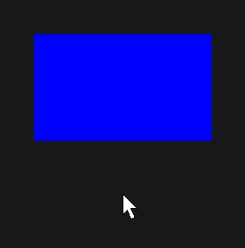
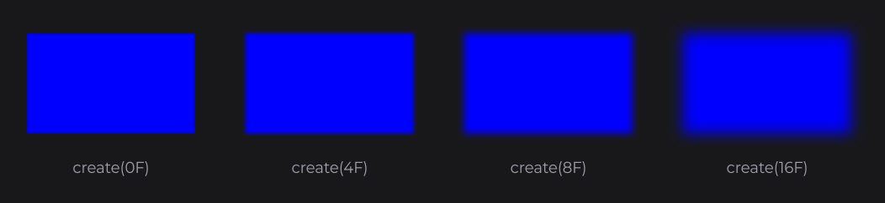
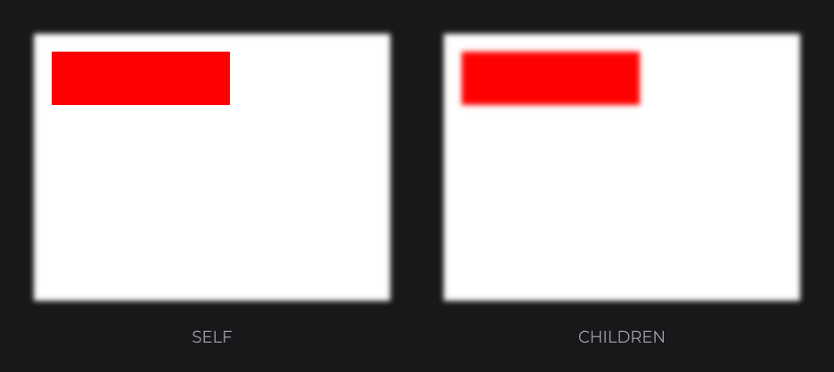

# BlurNodeEffect

`BlurNodeEffect` (`dev.joid.lib.ui.node.effect.impl`) applies a Gaussian blur to what a node draws. Use it for soft shapes, glows, out-of-focus content or a blur-in transition.

```java
@Override
public void init() {
	RectNode.create(100, 100, 200, 120).color(Color.BLUE).effect(BlurNodeEffect.create(8F)).attach(this);
}
```


> NOTE: The effect blurs the node's own rendering (and its children with the `CHILDREN` scope). It does not blur what is behind the node: it is not a backdrop blur.

## Creating with create

| Factory | Description |
| --- | --- |
| `create(float radius)` | Blur of `radius` UI units. |

| Method | Description |
| --- | --- |
| `radius(float radius)` | Replaces the radius. |
| `radius(Supplier<Float> radius)` | Reads the radius every frame. |
| `getRadiusSupplier()` | The radius supplier. |

`self(...)` hands you the node, to read its hover progress (see [Effects](effects.md#applying-effects-with-effect)):

```java
RectNode
.create(100, 100, 200, 120)
.color(Color.BLUE)
.self(node -> node.effect(BlurNodeEffect.create(0F).radius(() -> 2F + node.hoverValue(10F))))
.attach(this);
```



## How the blur is computed

- The blur is separable: a horizontal pass (pass priority 150), then a vertical pass (151).
- The radius is converted to screen pixels with the current scale of the UI, so the blur looks the same at any window size.
- The standard deviation is half the radius, with a minimum of one pixel. Each pass takes 65 samples, spaced by `radius / 32` pixels (at least one pixel).
- A radius of `0F` or less turns the blur off: the node is drawn as is, without framebuffer.
- The node is rendered into an area enlarged by `radius` on each side, so the blur spreads outside the node's rectangle.



A radius supplier that reaches `0F` turns the blur off for those frames. To drop the blur for good, remove the effect:

```java
final RectNode card = RectNode.create(100, 100, 200, 120).color(Color.BLUE).effect(BlurNodeEffect.create(8F));
card.removeEffect(BlurNodeEffect.class);
```

## Blurring a whole subtree

With the default `SELF` scope, only what the node draws itself is blurred; its children stay sharp. With the `CHILDREN` scope, the node and its children are blurred together:

```java
RectNode
.create(100, 100, 400, 300)
.color(Color.WHITE)
.effect(BlurNodeEffect.create(6F).scope(NodeEffectScope.CHILDREN))
.body(panel -> {
	RectNode.create(20, 20, 200, 60).color(Color.RED).attach(panel);
})
.attach(this);
```



`NodeEffectScope` is the nested enum `NodeEffect.NodeEffectScope`.

## Combining with other effects

The blur passes run after the shape passes and before the border pass:

| Combination | Result |
| --- | --- |
| [RoundedNodeEffect](rounded.md) or [CircleNodeEffect](circle.md) + blur | The shape is cut first, then blurred: soft edges. |
| Blur + [BorderNodeEffect](border.md) | The border is computed on the blurred result. |

## Cost

Each blurred node adds two passes of 65 texture samples per pixel over its enlarged area, every frame. Blur small nodes rather than large containers when you can.

## Reference

| Method | Description |
| --- | --- |
| `create(float radius)` | Creates the effect. |
| `radius(float)`, `radius(Supplier<Float>)` | Replaces the radius. |
| `getRadiusSupplier()` | The radius supplier. |
| `priority(int)`, `scope(NodeEffectScope)` | Inherited, see [Effects](effects.md). |

Shader pass priorities: 150 (horizontal) and 151 (vertical). Expansion: `radius`.

## Pitfalls

- A blur costs two framebuffer passes per frame: keep the radius moderate on large nodes.
- A radius of `0` disables the blur pass.
- The blur reads only what the node draws (or its subtree with `CHILDREN`), not what lies behind it.

## See also

- [Effects](effects.md)
- [Shader Pipeline](../shaders/pipeline.md)
- [RoundedNodeEffect](rounded.md)
- [BorderNodeEffect](border.md)