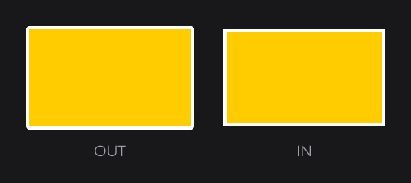
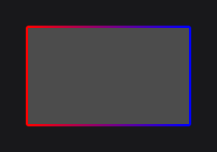
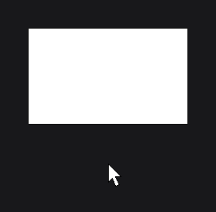
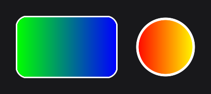

# BorderNodeEffect

`BorderNodeEffect` (`dev.joid.lib.ui.node.effect.impl`) draws an outline along the edge of what a node draws. The edge is found from the transparency of the rendered pixels, so the border follows any shape: a rectangle, rounded corners, a circle, the glyphs of a text, the opaque part of an image.

```java
@Override
public void init() {
    RectNode.create(100, 100, 200, 120).color(Color.ORANGE).effect(BorderNodeEffect.create(Color.WHITE, 4F)).attach(this);
    RectNode.create(340, 100, 200, 120).color(Color.ORANGE).effect(BorderNodeEffect.create(Color.WHITE, 4F, BorderMode.IN)).attach(this);
}
```



`BorderMode` is the nested enum `dev.joid.lib.shader.impl.BorderShader.BorderMode`.

## Creating with create

| Factory | Description |
| --- | --- |
| `create(Color color, float width)` | Outer border (`BorderMode.OUT`), corners filled. |
| `create(Color color, float width, BorderMode mode)` | Border on the chosen side. |

The width is in UI units.

## Inner and outer borders with BorderMode

| Mode | Where the border is drawn |
| --- | --- |
| `BorderMode.OUT` (default) | Outside the drawn shape, as a band of `width` around it. The opaque pixels of the node are unchanged. |
| `BorderMode.IN` | Inside the drawn shape, over its outer `width`. The size of the visible shape does not change. |

An outer border extends the rendering beyond the node's rectangle. The effect reserves room for it: the node is rendered into an area enlarged by `width + 2` on each side.

## Corners with fill

`fill(boolean)` (default `true`) decides whether an outer border covers the four corner areas that lie diagonally outside the node's rectangle. With `fill(false)`, these areas stay empty: on a rectangle, the outer border has a square notch at each corner. It has no visible effect on an inner border.

`RectNode.border(color, stroke, fill)` passes its `fill` argument to this setting.

 on the left, fill(false) on the right, with a 12-unit border.")

## Color and gradients

The color can be any [Color](colors.md), translucent or gradient. The direction of a gradient border is relative to the node's rectangle:

```java
RectNode
.create(100, 100, 200, 120)
.color(Color.DARKGRAY)
.effect(BorderNodeEffect.create(Color.RED.toGradient(Color.BLUE), 3F))
.attach(this);
```



## Changing the border

| Method | Description |
| --- | --- |
| `color(Color color)`, `color(Supplier<Color> color)` | Replaces the color. |
| `width(float width)`, `width(Supplier<Float> width)` | Replaces the width. |
| `mode(BorderMode mode)` | Replaces the mode. |
| `fill(boolean fill)` | Fills the outer corners or not. |

Suppliers are read every frame, which animates the border. Add the effect in `self(...)`, which hands you the node (see [Effects](effects.md#applying-effects-with-effect)):

```java
RectNode
.create(100, 100, 200, 120)
.color(Color.WHITE)
.self(node -> node.effect(BorderNodeEffect.create(Color.BLACK, 1F).width(() -> 1F + node.hoverValue(3F)).fill(false)))
.attach(this);
```



## Borders on any shape

Because the edge comes from the rendered pixels, the border combines with the shape effects, which run before it:

```java
RectNode
.create(100, 100, 200, 120)
.color(Color.GREEN.toGradient(Color.BLUE))
.effect(RoundedNodeEffect.create(20F))
.effect(BorderNodeEffect.create(Color.WHITE, 3F, BorderMode.OUT))
.attach(this);
RectNode
.create(340, 100, 120, 120)
.color(Color.RED.toGradient(Color.YELLOW))
.effect(CircleNodeEffect.create())
.effect(BorderNodeEffect.create(Color.WHITE, 5F, BorderMode.IN))
.attach(this);
```



On a [TextNode](../nodes/visual/text.md), the border outlines each glyph. On a [ResourceNode](../nodes/visual/resource.md), it outlines the opaque part of the image.

With the default `SELF` scope, the border outlines what the node draws itself; children are drawn on top, without a border. With the `CHILDREN` scope, it outlines the node and its children as a whole.

## RectNode borders

`RectNode.border(...)` (see [RectNode](../nodes/visual/rect.md)) is a shortcut that installs a `BorderNodeEffect` on the node, with the hovered border color animated by the hover progress. Since a node holds one effect per class, the two replace each other: a `BorderNodeEffect` added after `border(...)` replaces it, `border(...)` called afterwards replaces yours, and `border(...)` with a stroke of `0` removes any `BorderNodeEffect`.

A node has only one border. For a double border, nest a second node.

## Reference

| Method | Description |
| --- | --- |
| `create(Color, float)`, `create(Color, float, BorderMode)` | Factories. |
| `color(...)`, `width(...)`, `mode(BorderMode)`, `fill(boolean)` | Setters. |
| `getColorSupplier()`, `getWidthSupplier()` | The suppliers of the color and the width. |
| `getMode()` | The mode. |
| `isFill()` | Whether the outer corners are filled. |
| `priority(int)`, `scope(NodeEffectScope)` | Inherited, see [Effects](effects.md). |

| `BorderMode` | Description |
| --- | --- |
| `OUT` | Outside the drawn shape. |
| `IN` | Inside the drawn shape. |

Shader pass priority: 200 (after rounding, circle and blur). Expansion: `width + 2`.

## See also

- [Effects](effects.md)
- [RoundedNodeEffect](rounded.md)
- [CircleNodeEffect](circle.md)
- [Colors and Gradients](colors.md)
- [RectNode](../nodes/visual/rect.md)