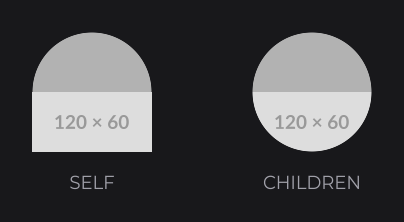
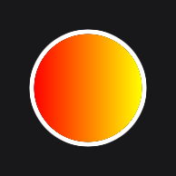

# CircleNodeEffect

`CircleNodeEffect` (`dev.joid.lib.ui.node.effect.impl`) cuts a node into a circle with a shader. Use it for avatars, round buttons and badges, on any node.

```java
@Override
public void init() {
	ResourceNode.create(100, 100, 120, 120).resource(Resource.of("https://placehold.co/400x400.png")).effect(CircleNodeEffect.create()).attach(this);
	RectNode.create(260, 100, 120, 120).color(Color.RED.toGradient(Color.YELLOW)).effect(CircleNodeEffect.create()).attach(this);
}
```


## Creating with create

`CircleNodeEffect.create()` is the only factory; the effect has no setting of its own. Each frame it keeps the largest circle centered in the node:

- center: the center of the node;
- radius: half of the node's smaller side.

On a square node the circle touches the four sides. On a 200 × 120 node the circle has a radius of 60 and the left and right parts are cut. The circle follows the node when it moves or is resized.

The edge is anti-aliased over one unit inside the radius.

## Cutting the children with CHILDREN

With the default `SELF` scope, only what the node draws itself is cut; its children are drawn on top, whole. With the `CHILDREN` scope, the node and its children are cut together:

```java
final RectNode avatar = RectNode.create(100, 100, 120, 120).color(Color.LIGHTGRAY).effect(CircleNodeEffect.create().scope(NodeEffectScope.CHILDREN));
ResourceNode.create(0, 60, 120, 60).resource(Resource.of("https://placehold.co/120x60.png")).attach(avatar);
avatar.attach(this);
```



`NodeEffectScope` is the nested enum `NodeEffect.NodeEffectScope`. See [Scope](effects.md#scope-with-nodeeffectscope).

## Adding a ring with BorderNodeEffect

A [BorderNodeEffect](border.md) on the same node draws a ring that follows the circle, because the circle pass runs before the border pass:

```java
RectNode
.create(100, 100, 120, 120)
.color(Color.RED.toGradient(Color.YELLOW))
.effect(CircleNodeEffect.create())
.effect(BorderNodeEffect.create(Color.WHITE, 5F, BorderMode.OUT))
.attach(this);
```



`BorderMode` is `dev.joid.lib.shader.impl.BorderShader.BorderMode`.

## CircleNodeEffect or CircleNode

| Need | Use |
| --- | --- |
| A plain or gradient disc | [CircleNode](../nodes/visual/circle.md): drawn directly, no framebuffer. |
| A round image, a round card with content, a circle around anything | `CircleNodeEffect`. |

The hover and click area of a node with a `CircleNodeEffect` stays its full rectangle.

## Reference

| Method | Description |
| --- | --- |
| `create()` | Creates the effect. |
| `priority(int)`, `scope(NodeEffectScope)` | Inherited, see [Effects](effects.md). |

Shader pass priority: 100 (before blur and border).

## Pitfalls

- The cut is the largest centered circle: on a non-square node, the sides are cut.
- The node still reacts to the mouse in its corners: hit testing uses the rectangle.

## See also

- Next: [BorderNodeEffect](border.md)
- [Effects](effects.md)
- [RoundedNodeEffect](rounded.md)
- [CircleNode](../nodes/visual/circle.md)
- [ResourceNode](../nodes/visual/resource.md)