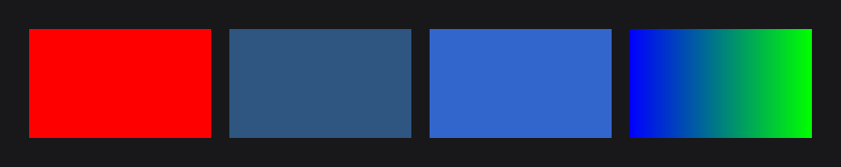
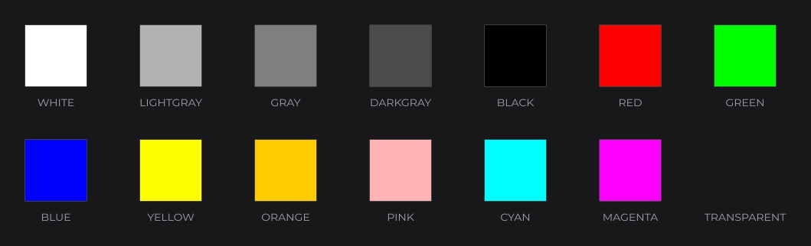
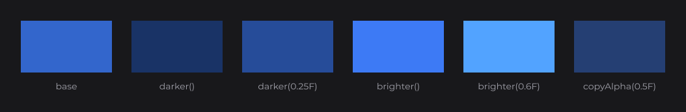
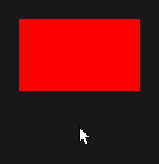
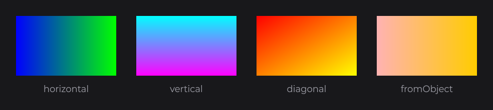
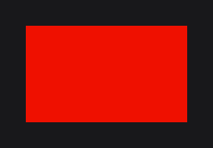
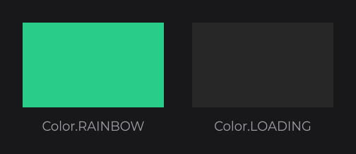

# Colors and Gradients

`Color` (`dev.joid.lib.color`) is the single color type of JOID: an immutable RGBA value with float components from `0F` to `1F`, which can also carry a linear gradient (`ColorGradient`) or an update function that animates it. The same type is used everywhere: node colors, text, borders, resource tints and drawing calls. This page opens the Styling guides: it details every way to build, derive and animate the colors met in [Styling and Effects](../concepts/styling.md).

```java
@Override
public void init() {
	RectNode.create(100, 100, 200, 120).color(Color.RED).attach(this);
	RectNode.create(320, 100, 200, 120).color(new Color(0.2F, 0.4F, 0.6F, 0.8F)).attach(this);
	RectNode.create(540, 100, 200, 120).color(Color.decode("#3366CC")).attach(this);
	RectNode.create(760, 100, 200, 120).color(Color.BLUE.toGradient(Color.GREEN)).attach(this);
}
```



## Creating a Color

| Constructor | Description |
| --- | --- |
| `Color(float r, float g, float b)` | Components from `0F` to `1F`, opaque (`a = 1F`). |
| `Color(float r, float g, float b, float a)` | Components from `0F` to `1F`. Values below `0F` become `0F`, values above `1F` become `1F`. |
| `Color(float r, float g, float b, float a, UnaryOperator<Color> update)` | Same, with an update function (see [Animated colors](#animated-colors-with-update)). |
| `Color(int r, int g, int b)` | Components from `0` to `255`, opaque. Out of range values are clamped the same way. |
| `Color(int r, int g, int b, int a)` | Components from `0` to `255`. |
| `Color(int value)` | Packed `0xAARRGGBB` integer, alpha byte included: `0x336699` is fully transparent, write `0xFF336699` for an opaque color. |
| `Color(Color color)` | Copies the four components only (no gradient, no update function). Use `copy()` for a full copy. |
| `Color(java.awt.Color color)` | Converts an AWT color, alpha included. |
| `Color(FloatBuffer buffer)` | Reads four floats (r, g, b, a) and advances the buffer by 4. |
| `Color(ColorGradient gradient)` | A gradient color. Its own components are those of the gradient's start color. |

| Factory | Description |
| --- | --- |
| `Color.fill(int value)` | Opaque gray with all three components set to `value / 255`. |
| `Color.fill(float value)` | Opaque gray with all three components set to `value`. |
| `Color.decode(String text)` | Parses a string, see [Decoding strings](#decoding-strings-with-decode). |
| `Color.gradient(Color start, Color end, Vector4f direction)` | A gradient color, see [Gradients](#gradients). |

> NOTE: Integer arguments select the `0`–`255` constructors: `new Color(1, 0, 0)` is almost black. Write `new Color(1F, 0F, 0F)` for red.

Components are public `final float` fields: `r`, `g`, `b`, `a`, always between `0F` and `1F`. Two more public final fields hold the optional extras: `gradient` (`ColorGradient`, `null` for a plain color) and `update` (`UnaryOperator<Color>`, `null` when the color is not animated).

A color never changes once created: every method below returns a new color, and the components of every derived color are clamped between `0F` and `1F` like those of the constructors.

## Preset colors

| Constant | r, g, b, a |
| --- | --- |
| `Color.WHITE` | 1, 1, 1, 1 |
| `Color.LIGHTGRAY` | 0.7, 0.7, 0.7, 1 |
| `Color.GRAY` | 0.5, 0.5, 0.5, 1 |
| `Color.DARKGRAY` | 0.3, 0.3, 0.3, 1 |
| `Color.BLACK` | 0, 0, 0, 1 |
| `Color.RED` | 1, 0, 0, 1 |
| `Color.GREEN` | 0, 1, 0, 1 |
| `Color.BLUE` | 0, 0, 1, 1 |
| `Color.YELLOW` | 1, 1, 0, 1 |
| `Color.ORANGE` | 1, 0.8, 0, 1 |
| `Color.PINK` | 1, 0.7, 0.7, 1 |
| `Color.CYAN` | 0, 1, 1, 1 |
| `Color.MAGENTA` | 1, 0, 1, 1 |
| `Color.TRANSPARENT` | 0, 0, 0, 0 |
| `Color.RAINBOW` | Animated hue cycle, see [Animated colors](#animated-colors-with-update). |
| `Color.LOADING` | Animated dark gray pulse, see [Animated colors](#animated-colors-with-update). |



Presets are shared instances, which is safe because no color can be modified.

## Decoding strings with decode

`Color.decode(String)` accepts the following formats:

| Format | Example | Result |
| --- | --- | --- |
| `#RRGGBB` or `RRGGBB` | `#3366CC` | Opaque color. Hex digits in any case. |
| `#RRGGBBAA` or `RRGGBBAA` | `#3366CC80` | Color with alpha (`80` = 128). |
| `rgb(r, g, b)` | `rgb(255, 128, 0)` | Integers from `0` to `255`, opaque. |
| `rgba(r, g, b, a)` | `rgba(255, 128, 0, 0.5)` | `r`, `g`, `b` are integers from `0` to `255`, `a` is a fraction from `0` to `1`, as in CSS. |
| `rainbow` | `#Rainbow` | The animated preset `Color.RAINBOW`. Case-insensitive, `#` ignored. |
| `loading` | `LOADING` | The animated preset `Color.LOADING`. Case-insensitive, `#` ignored. |
| `gradient(start, end)` | `gradient(#FF0000, #0000FF)` | Left-to-right gradient. |
| `gradient(start, end, startX, startY, endX, endY)` | `gradient(#FF0000, #0000FF, 0, 0, 0, 1)` | Gradient with an explicit [direction](#gradients). |

The `rgb(`, `rgba(` and `gradient(` prefixes are case-insensitive (`RGB(255, 128, 0)` works). The two colors of `gradient(...)` accept every format of this table, `rgb(...)`, `rgba(...)` and nested gradients included: `gradient(rgb(255, 0, 0), rgba(0, 0, 255, 0.5), 0, 0, 0, 1)`.

Any other input throws a `NumberFormatException`: the short `#RGB` form, a function with a missing argument or without its closing parenthesis, and a `gradient(...)` with other than two or six arguments. Whitespace around the whole string is ignored: `Color.decode(" #3366CC ")` reads `#3366CC`.

`encode()` does the reverse and always returns `#RRGGBBAA` in uppercase, which `decode` reads back:

```java
final String hex = new Color(1F, 0.5F, 0F, 1F).encode();
final Color same = Color.decode(hex);
```

Here `hex` is `"#FF7F00FF"`: conversions to `0`–`255` truncate (`0.5F * 255` gives `127`).

## Reading components

| Method | Description |
| --- | --- |
| `getRed()`, `getGreen()`, `getBlue()`, `getAlpha()` | Component as an integer from `0` to `255` (truncated). |
| `getRGB()` | Packed `0xAARRGGBB` integer. |
| `encode()` | `#RRGGBBAA` string, uppercase. |
| `RGBtoHSB(float[] hsb)` | `{hue, saturation, brightness}`, each from `0F` to `1F`. Fills and returns `hsb`, or a new array when `hsb` is `null`. |
| `Color.RGBtoHSB(int r, int g, int b, float[] hsb)` | Same conversion from `0`–`255` components. |
| `isGradient()` | `true` when the color carries a `ColorGradient`. |
| `toString()` | Components and hex code, for example `Color(255, 127, 0, 255) [#FF7F00FF]`. |

To build a color from HSB values, go through AWT: `new Color(java.awt.Color.HSBtoRGB(hue, saturation, brightness))`.

`equals` compares the four components exactly and ignores the gradient and the update function; `hashCode` hashes the same four components.

## Deriving colors

These methods return a new color:

| Method | Description |
| --- | --- |
| `copy()` | Full copy: components, update function and gradient (whose ends and direction are copied too). |
| `copyAlpha(float alpha)` | Copy with another alpha, update function kept. On a gradient, both ends are scaled by the same ratio (`alpha / a`), so a fade stays a fade. When the color's own alpha is `0F`, both ends get `alpha`. |
| `copyRed(float red)`, `copyGreen(float green)`, `copyBlue(float blue)` | Copy with one component replaced, update function kept, gradient dropped. |
| `darker()` | `darker(0.5F)`. |
| `darker(float scale)` | Multiplies r, g, b by `1 - scale`. Alpha kept. |
| `brighter()` | `brighter(0.2F)`. |
| `brighter(float scale)` | Multiplies r, g, b by `1 + scale`, clamped at `1F`. Alpha kept. |
| `multiply(Color other)` | Component-wise product, alpha included. |
| `addToCopy(Color other)` | Copy (update function kept) with the four components of `other` added, clamped at `1F`. |
| `scaleCopy(float value)` | Copy (update function kept) with the four components multiplied by `value`, clamped between `0F` and `1F`. |
| `to(Color target, float progress)` | `Color.transition(this, target, progress)`. |
| `toGradient(Color end)` | Left-to-right gradient from this color to `end`. |
| `toGradient(Color end, Vector4f direction)` | Gradient from this color to `end` along `direction`. |

`darker`, `brighter` and `multiply` return plain colors: they drop the update function and the gradient.



## Transitions with to

`Color.transition(Color from, Color to, float progress)` (or `from.to(to, progress)`) interpolates between two colors. `progress` is a fraction: `0F` returns `from` itself and `1F` returns `to` itself (the same instances, not copies).

| From | To | Result |
| --- | --- | --- |
| Plain | Plain | Linear RGBA interpolation. The result keeps the update function of the closest color (`to` above `0.5F`). |
| Gradient | Gradient | Start colors, end colors and directions are interpolated separately. |
| Gradient | Plain | Both ends of the gradient move toward the plain color, the direction is kept. |
| Plain | Gradient | The plain color moves toward both ends of the gradient, the direction is kept. |

```java
final Color quarter = Color.RED.to(Color.BLUE, 0.25F);
final Color paler = Color.RED.toGradient(Color.YELLOW).to(Color.WHITE, 0.5F);
```

 for 0F, 0.25F, 0.5F, 0.75F and 1F.")

Nodes with a hovered color run this transition with their hover progress, as `RectNode` does between `color(...)` and `hoveredColor(...)`. To drive it from your own value, pass a lambda, read every frame:

```java
final RectNode rect = RectNode.create(100, 100, 200, 120);
rect.color(() -> Color.RED.to(Color.BLUE, rect.hoverValue(1F))).attach(this);
```



## Gradients

A gradient color is a `Color` whose `gradient` field holds a `ColorGradient`. Create one with `toGradient`, `Color.gradient` or the `ColorGradient` constructor:

```java
final Color horizontal = Color.BLUE.toGradient(Color.GREEN);
final Color vertical = Color.CYAN.toGradient(Color.MAGENTA, new Vector4f(0F, 0F, 0F, 1F));
final Color diagonal = Color.gradient(Color.RED, Color.YELLOW, new Vector4f(0F, 0F, 1F, 1F));
final Color fromObject = new Color(new ColorGradient(Color.ORANGE, Color.PINK, new Vector4f(1F, 0F, 0F, 0F)));
```



The direction is a `javax.vecmath.Vector4f` of `(startX, startY, endX, endY)`, in fractions of the box being drawn: `(0, 0)` is its top-left corner and `(1, 1)` its bottom-right corner. The default direction of `toGradient(end)` and `gradient(start, end)` strings is `(0, 0, 1, 0)`, left to right.

| Direction | Gradient |
| --- | --- |
| `new Vector4f(0F, 0F, 1F, 0F)` | Left to right. |
| `new Vector4f(1F, 0F, 0F, 0F)` | Right to left. |
| `new Vector4f(0F, 0F, 0F, 1F)` | Top to bottom. |
| `new Vector4f(0F, 0F, 1F, 1F)` | Top-left to bottom-right. |
| `new Vector4f(0.25F, 0F, 0.75F, 0F)` | Start color up to 25 % of the width, end color from 75 %. |

 with each direction of the table, in order.")

Each pixel is projected on the line from the start point to the end point: before the start it gets the start color, after the end the end color, linearly mixed in between. Alpha is interpolated like the other components, so a gradient can fade out (`Color.WHITE.toGradient(Color.TRANSPARENT)`).

The box the direction refers to depends on what is drawn:

| Used in | Box |
| --- | --- |
| `RectNode.color(...)`, `DrawUtils.SHAPE` rectangles and polygons | The bounds of the shape. |
| Rounded rectangles (`drawRoundedRect`) | The rectangle. |
| `CircleNode`, `drawCircle` | The square around the circle. |
| Text color (`TextInfo`) | The box of each drawn line. |
| `ResourceNode.color(...)` | The node's rectangle. The gradient multiplies the image (a tint). |
| `BorderNodeEffect` color | The node's rectangle. |

### ColorGradient

`ColorGradient` (`dev.joid.lib.color`) holds the two ends and the direction in final fields:

| Member | Description |
| --- | --- |
| `new ColorGradient(Color startColor, Color endColor, Vector4f direction)` | Creates the gradient. The colors and the vector are kept by reference. |
| `getStartColor()`, `getEndColor()`, `getDirection()` | The values given at creation. |
| `use(Runnable draw, Vector4f canvas)` | Runs `draw` with the gradient shader bound. `canvas` is the box `(minX, minY, maxX, maxY)` in drawing coordinates. |
| `use(boolean hasTexture, Runnable draw, Vector4f canvas)` | Same; with `hasTexture`, the gradient multiplies the bound texture. |

You only need `use` when you draw geometry yourself; `Color.bind(...)` calls it for gradient colors (see below).

## Animated colors with update

A color can carry an update function (`UnaryOperator<Color>`) that receives the color and returns the color to draw for the current frame. `update()` returns that frame, or the color itself when it has no update function; the color keeps its own components. The renderer calls `update()` every time it binds a plain color and every time it draws text, so the color animates on its own.

```java
final Color pulse = new Color(1F, 1F, 1F, 1F, color -> {
	final float t = (float) ((Math.sin(BridgeHandler.CLOCK.get().currentTimeMillis() / 500D) + 1D) / 2D);
	return new Color(t, 1F - t, 0F, color.a);
});
RectNode.create(100, 100, 200, 120).color(pulse).attach(this);
```



`BridgeHandler` is in `dev.joid.lib.bridge`; its clock is the time source of JOID, in milliseconds (see [The Frame Loop](../concepts/frame-loop.md)).

Two animated colors are built in. Both read the clock bridge:

| Member | Description |
| --- | --- |
| `Color.RAINBOW` | Animated preset: hue cycle with saturation and brightness `0.8F`, one full cycle every 3 seconds, with the alpha of the color (opaque for the preset). |
| `Color.RAINBOW()` | The rainbow color at the current time (a fixed color, not animated). |
| `Color.RAINBOW(long time)` | The rainbow color at `time` milliseconds. |
| `Color.LOADING` | Animated preset: gray pulsing between `0.15F` and `0.19F` with a 2 second period, with the alpha of the color (opaque for the preset). |
| `Color.LOADING()` | The loading color at the current time (a fixed color, not animated). |



`ResourceNode` draws `Color.LOADING()` in place of an image that is still loading.

The update function survives `copy()`, `copyAlpha`, `copyRed`/`copyGreen`/`copyBlue`, `addToCopy` and `scaleCopy`, and receives the copy. The two presets keep the alpha they receive, so `Color.RAINBOW.copyAlpha(0.5F)` is a half-transparent rainbow.

> NOTE: Shapes drawn with a gradient color use the two ends of the gradient and do not call the update function.

## Binding a color in custom drawing

When you draw geometry yourself, in the `draw` of a [custom node](../nodes/custom-nodes.md) or in a layer, you can bind a color by hand. You need this only for low-level drawing, covered in the Advanced section (see [Drawing Overview](../drawing/draw-utils.md)):

| Method | Description |
| --- | --- |
| `bind()` | Sets the renderer's current color to the r, g, b, a of `update()`. |
| `bind(Runnable draw, Vector4f canvas)` | Runs `draw` with this color: a plain color is bound then reset to white afterwards, a gradient binds the gradient shader over `canvas` (`minX, minY, maxX, maxY`) and restores the previous shader. |
| `bind(Runnable draw, Vector4f canvas, boolean hasTexture)` | Same; with `hasTexture`, a gradient multiplies the bound texture. |
| `Color.reset()` | Sets the renderer's current color back to opaque white. |

## Pitfalls

- The presets (`Color.WHITE`...) are immutable: derive a new color with `copyAlpha`, `to`, `brighter`... instead of changing them.
- Alpha components are fractions of 1 (`0.5F` = 50 %), in `rgba(...)` strings too.
- `Color.RAINBOW` and `Color.LOADING` animate through `update()`: call it once per frame when you draw them yourself.

## See also

- Next: [Effects](effects.md)
- [Styling and Effects](../concepts/styling.md)
- [BorderNodeEffect](border.md)
- [RectNode](../nodes/visual/rect.md)
- [Text and TextInfo](../text/text-and-textinfo.md)
- [Shapes](../drawing/shapes.md)