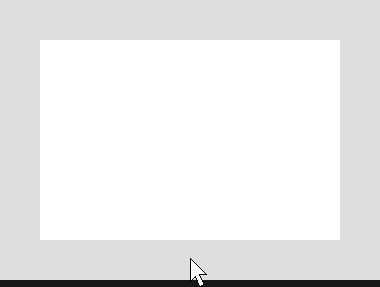

# Custom Effects

Write a custom effect when the [built-in effects](effects.md) do not cover a treatment you want to reuse on any node: a hard shadow, a hover lift, a color filter. A custom effect extends `NodeEffect<T extends Node>` (`dev.joid.lib.ui.node.effect`): `NodeEffect<Node>` goes on any node, `NodeEffect<RectNode>` reads the getters of a `RectNode`.

| Kind | Override | Use it to |
|---|---|---|
| Render state | `pre(...)` and `post(...)` | Draw before or after the node, or change the render state (matrix, stencil) around it. |
| Shader | `isShaderEffect()` and `toShaderPass(...)` | Process the rendered pixels of the node with a shader. |

## Drawing around the node with pre

`pre` runs before the node renders, with the matrix the node draws with: draw at `node.getX()`, `node.getY()`, in canvas units. Effects follow the factory pattern of nodes: a `protected` constructor and a static `create(...)`.

```java
import dev.joid.lib.color.Color;
import dev.joid.lib.draw.DrawUtils;
import dev.joid.lib.ui.node.Node;
import dev.joid.lib.ui.node.effect.NodeEffect;

import lombok.NonNull;

public class HardShadowNodeEffect extends NodeEffect<Node> {

	private final Color color;
	private final double offset;

	protected HardShadowNodeEffect(final Color color, final double offset) {
		this.color = color;
		this.offset = offset;
	}

	public static @NonNull HardShadowNodeEffect create(final @NonNull Color color, final double offset) {
		return new HardShadowNodeEffect(color, offset);
	}

	@Override
	public boolean shouldApply(final @NonNull Node node) {
		return node.hoverValue(1F) > 0F;
	}

	@Override
	public void pre(final @NonNull Node node, final double mouseX, final double mouseY) {
		final Color shadow = this.color.copyAlpha(this.color.a * node.hoverValue(1F));
		DrawUtils.SHAPE.drawRect(node.getX() + this.offset, node.getY() + this.offset, node.getWidth(), node.getHeight(), shadow);
	}

}
```

```java
RectNode.create(100, 100, 300, 200).color(Color.WHITE).effect(HardShadowNodeEffect.create(Color.BLACK.copyAlpha(0.3F), 6D)).attach(this);
```



`shouldApply(node)` runs every frame; returning `false` skips the effect for that frame.

## Changing the render state with pre and post

Whatever `pre` changes, `post` restores. `BridgeHandler.RENDER.get().getModelView()` is the matrix stack: `push()` saves the matrix, `translate(...)` moves what is drawn next, `pop()` restores it. The node calls `post` in a `finally` block, after its children:

```java
import dev.joid.lib.bridge.BridgeHandler;
import dev.joid.lib.bridge.render.IRenderBridge;
import dev.joid.lib.ui.node.Node;
import dev.joid.lib.ui.node.effect.NodeEffect;

import lombok.NonNull;

public class LiftNodeEffect extends NodeEffect<Node> {

	private final float height;

	protected LiftNodeEffect(final float height) {
		this.height = height;
	}

	public static @NonNull LiftNodeEffect create(final float height) {
		return new LiftNodeEffect(height);
	}

	@Override
	public void pre(final @NonNull Node node, final double mouseX, final double mouseY) {
		final IRenderBridge render = BridgeHandler.RENDER.get();
		render.getModelView().push();
		render.getModelView().translate(0D, -node.hoverValue(this.height), 0D);
	}

	@Override
	public void post(final @NonNull Node node, final double mouseX, final double mouseY) {
		BridgeHandler.RENDER.get().getModelView().pop();
	}

}
```

.color(Color.WHITE).effect(LiftNodeEffect.create(8F)): the card lifts by 8 units while hovered.")

## Shader effects with toShaderPass

The node renders into a framebuffer, then each shader pass runs a GLSL program over it. A shader effect needs a shader, a pass and the effect. The shader and its GLSL are detailed in [Shaders](../shaders/shaders.md); here is a grayscale filter:

```java
import dev.joid.lib.shader.impl.ShaderProgram;

import lombok.NonNull;

public class GrayscaleShader extends ShaderProgram {

	private static final GrayscaleShader INSTANCE = new GrayscaleShader();

	private GrayscaleShader() {
		super.load(GrayscaleShader.class.getResourceAsStream("/assets/myui/shaders/grayscale.vsh"), GrayscaleShader.class.getResourceAsStream("/assets/myui/shaders/grayscale.fsh"));
	}

	public static @NonNull GrayscaleShader inst() {
		return GrayscaleShader.INSTANCE;
	}

	public void bind(final float amount) {
		super.bind();
		super.getShader().uniform("u_Amount", amount);
	}

}
```

The pass binds the shader with its values. `priority()` places it among the built-in passes: 100 for the shape cut, 150 and 151 for the blur, 200 for the border. Override `expansion()` when the pass draws outside the node, as a glow does.

```java
import dev.joid.lib.shader.pipeline.IShaderPass;
import dev.joid.lib.shader.pipeline.ShaderPassContext;

import lombok.NonNull;

public class GrayscaleShaderPass implements IShaderPass {

	private final float amount;

	public GrayscaleShaderPass(final float amount) {
		this.amount = amount;
	}

	@Override
	public void unbind() {
		GrayscaleShader.inst().unbind();
	}

	@Override
	public void bind(final @NonNull ShaderPassContext context) {
		if (GrayscaleShader.inst().canDraw()) {
			GrayscaleShader.inst().bind(this.amount);
		}
	}

	@Override
	public int priority() {
		return 175;
	}

}
```

The effect returns a pass with its current values, every frame:

```java
import dev.joid.lib.shader.pipeline.IShaderPass;
import dev.joid.lib.ui.node.Node;
import dev.joid.lib.ui.node.effect.NodeEffect;

import lombok.NonNull;

public class GrayscaleNodeEffect extends NodeEffect<Node> {

	private final float amount;

	protected GrayscaleNodeEffect(final float amount) {
		this.amount = amount;
	}

	public static @NonNull GrayscaleNodeEffect create(final float amount) {
		return new GrayscaleNodeEffect(amount);
	}

	@Override
	public boolean isShaderEffect() {
		return true;
	}

	@Override
	public IShaderPass toShaderPass(final @NonNull Node node) {
		return new GrayscaleShaderPass(this.amount);
	}

}
```

```java
ResourceNode.create(100, 100, 200, 200).resource(Resource.of("https://placehold.co/400x400/orange/white.png")).effect(GrayscaleNodeEffect.create(1F)).attach(this);
```

.")

Return several passes from `toShaderPasses(node)` when the effect needs more than one, as the blur does.

## Extending a built-in effect

The built-in effects are classes you can extend. This border shows only while the node is hovered:

```java
import dev.joid.lib.color.Color;
import dev.joid.lib.shader.impl.BorderShader.BorderMode;
import dev.joid.lib.ui.node.Node;
import dev.joid.lib.ui.node.effect.impl.BorderNodeEffect;

import lombok.NonNull;

public class HoverBorderNodeEffect extends BorderNodeEffect {

	protected HoverBorderNodeEffect(final Color color, final float width) {
		super(color, width, BorderMode.OUT);
	}

	public static @NonNull HoverBorderNodeEffect create(final @NonNull Color color, final float width) {
		return new HoverBorderNodeEffect(color, width);
	}

	@Override
	public boolean shouldApply(final @NonNull Node node) {
		return node.hoverValue(1F) > 0F;
	}

}
```

```java
RectNode.create(100, 100, 300, 200).color(Color.WHITE).effect(HoverBorderNodeEffect.create(Color.BLUE, 2F).fill(false)).attach(this);
```

The class of the effect is your subclass, so `getEffect(HoverBorderNodeEffect.class)` finds it.

## Reference

| Hook | Called | Default |
|---|---|---|
| `init(node, ui)` | When the node is loaded into a UI. | Nothing. |
| `detach(node)` | When the node is detached; release there what `init` acquired. | Nothing. |
| `shouldApply(node)` | Every frame, before the other hooks; `false` skips the effect. | `true` |
| `pre(node, mouseX, mouseY)` | Before the node renders, in priority order. Render-state effects only. | Nothing. |
| `post(node, mouseX, mouseY)` | After the node and its children, in reverse order, in a `finally` block. | Nothing. |
| `isShaderEffect()` | Every frame. | `false` |
| `toShaderPass(node)`, `toShaderPasses(node)` | Every frame, for shader effects. | `null`, then a list of it. |

## Good to know

- When `isShaderEffect()` returns `true`, the node never calls `pre` and `post`: split an effect that needs both into two effects.
- One instance can go on several nodes: keep per-node state out of the effect. For dynamic values, store `Supplier`s and read them in the hooks.
- A shader pass reads and writes premultiplied alpha: keep the output premultiplied.

## See also

- [Effects](effects.md)
- [Shaders](../shaders/shaders.md)
- [Drawing](../drawing/drawing.md)
- [Custom Nodes](../nodes/custom-nodes.md)