# Effects

An effect changes how a node renders without changing the node: rounded corners, a circle cut, a border, a blur, a shadow, a mask or a transform. Add effects with `effect(...)` on any node, built-in or custom; they stack. The built-in effects are in `dev.joid.lib.ui.node.effect.impl`.

```java
RectNode
.create(100, 100, 300, 200)
.color(Color.WHITE)
.effect(RoundedNodeEffect.create(16F))
.effect(BorderNodeEffect.create(Color.BLACK, 2F))
.attach(this);
```

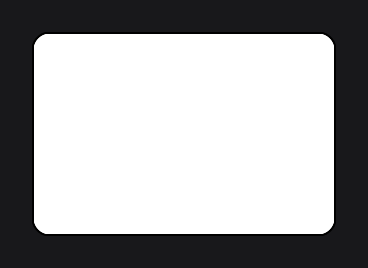

## Applying effects with effect

`effect(...)` adds an effect and returns the node. Effect setters return the effect, so a configured effect goes straight into `effect(...)`. A node holds one effect per class: adding a second `RoundedNodeEffect` replaces the first.

Every setting has a value and a `Supplier` overload, like node setters. When the effect needs the node, for its size or its hover progress, add it in `self(...)`:

```java
RectNode
.create(100, 100, 300, 200)
.color(Color.WHITE)
.self(node -> node.effect(BorderNodeEffect.create(Color.BLACK, 1F).color(() -> Color.BLACK.to(Color.BLUE, node.hoverValue(1F))).width(() -> 1F + node.hoverValue(2F))))
.attach(this);
```

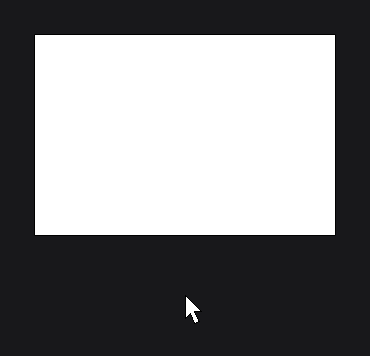

`getEffect(RoundedNodeEffect.class)` returns the effect typed by its class (or `null`), `hasEffect(...)`, `removeEffect(...)` and `clearEffects()` manage them:

```java
final RectNode card = RectNode.create(100, 100, 300, 200).color(Color.WHITE).effect(RoundedNodeEffect.create(16F));

card.getEffect(RoundedNodeEffect.class).radius(8F);
```

## Rounded corners with RoundedNodeEffect

```java
RectNode.create(100, 100, 300, 200).color(Color.WHITE).effect(RoundedNodeEffect.create(16F)).attach(this);
ResourceNode.create(450, 100, 200, 200).resource(Resource.of("https://placehold.co/400x400.png")).effect(RoundedNodeEffect.create(10F)).attach(this);
```

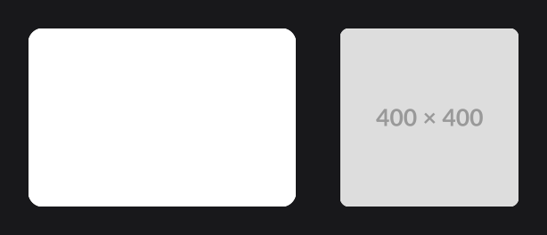

`create(radius, left, top, right, bottom)` rounds only the corners whose two sides are enabled: `create(16F, true, true, true, false)` rounds the top corners.

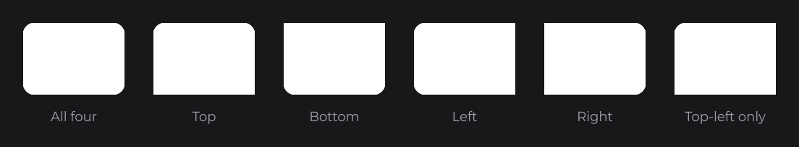

| Method | Description |
|---|---|
| `create(radius)`, `create(radius, left, top, right, bottom)` | Radius in canvas units; value or `Supplier`. |
| `radius(...)` | Replaces the radius. Half the smaller side gives a pill. |
| `left(...)`, `top(...)`, `right(...)`, `bottom(...)` | Enables the corners of a side. |

## Circles with CircleNodeEffect

```java
ResourceNode.create(100, 100, 120, 120).resource(Resource.of("https://placehold.co/400x400.png")).effect(CircleNodeEffect.create()).attach(this);
RectNode.create(260, 100, 120, 120).color(Color.RED.toGradient(Color.YELLOW)).effect(CircleNodeEffect.create()).attach(this);
```

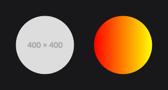

`CircleNodeEffect.create()` has no option: it keeps the largest circle centered in the node, so the sides of a non-square node are cut. For a plain disc, a [CircleNode](../nodes/visual/circle.md) is cheaper.

## Borders with BorderNodeEffect

```java
RectNode.create(100, 100, 200, 120).color(Color.ORANGE).effect(BorderNodeEffect.create(Color.WHITE, 4F)).attach(this);
RectNode.create(340, 100, 200, 120).color(Color.ORANGE).effect(BorderNodeEffect.create(Color.WHITE, 4F, BorderMode.IN)).attach(this);
```


The border follows the drawn pixels, so it outlines rounded corners, circles, text glyphs and the opaque part of images:

```java
RectNode
.create(100, 100, 120, 120)
.color(Color.RED.toGradient(Color.YELLOW))
.effect(CircleNodeEffect.create())
.effect(BorderNodeEffect.create(Color.WHITE, 5F, BorderMode.OUT))
.attach(this);
```


| Method | Description |
|---|---|
| `create(color, width)`, `create(color, width, mode)` | Color (gradients work), width in canvas units, `BorderMode.OUT` by default. |
| `color(...)`, `width(...)` | Replaces the color or the width. |
| `mode(BorderMode)` | `OUT` around the shape, `IN` inside it. |
| `fill(boolean)` | `false` leaves the outer corners of an `OUT` border empty; `true` by default. |

The `borderColor`, `hoveredBorderColor` and `borderStroke` setters of [RectNode](../nodes/visual/rect.md) use this effect too, so they replace each other.

## Blur with BlurNodeEffect

```java
RectNode.create(100, 100, 200, 120).color(Color.BLUE).effect(BlurNodeEffect.create(8F)).attach(this);
```


`create(radius)` and `radius(...)` set the blur in canvas units; `0F` turns it off. The blur spreads outside the node. It blurs what the node draws, not what is behind it, and each blurred node costs two passes per frame.

## Shadows with ShadowNodeEffect

```java
RectNode.create(100, 100, 300, 180).color(Color.WHITE).effect(RoundedNodeEffect.create(16F)).effect(ShadowNodeEffect.create(Color.BLACK.copyAlpha(0.3F), 24F, 0D, 10D)).attach(this);
RectNode.create(500, 130, 120, 120).color(Color.CYAN).effect(CircleNodeEffect.create()).effect(ShadowNodeEffect.create(Color.CYAN, 24F)).attach(this);
```

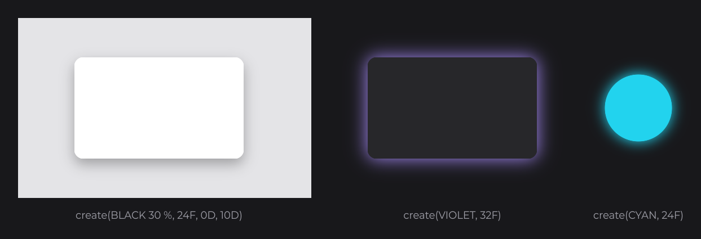

The shadow takes the shape of the node: rounded with a `RoundedNodeEffect`, round with a `CircleNodeEffect` or a `CircleNode`, a rectangle otherwise.

| Method | Description |
|---|---|
| `create(color, blur)`, `create(color, blur, offsetX, offsetY)` | A glow, or a drop shadow moved by the offset (positive goes right and down). |
| `color(...)` | Shadow color; its alpha sets the strength. |
| `blur(...)` | Softness in canvas units; `0F` is sharp. |
| `offsetX(...)`, `offsetY(...)` | Offset in canvas units. |

## Masks with MaskNodeEffect

A mask clips the node and its children to a rectangle, or to the opaque part of an image:

```java
RectNode
.create(100, 100, 300, 200)
.color(Color.ORANGE)
.self(node -> node.effect(MaskNodeEffect.create(() -> node.getWidth() * node.hoverValue(1F), () -> node.getHeight())))
.attach(this);
```

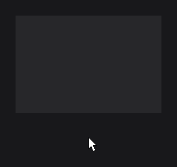

```java
ResourceNode
.create(100, 100, 200, 200)
.resource(Resource.of("https://placehold.co/400x400.png"))
.self(node -> node.effect(MaskNodeEffect.create(Resource.of(new File("assets/star-mask.png")), node)))
.attach(this);
```

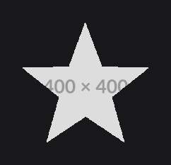

| Method | Description |
|---|---|
| `create(width, height)`, `create(x, y, width, height)` | Rectangle, offset from the node's top-left corner; values or `Supplier<Double>`. |
| `create(node)` | Rectangle sized like `node`. |
| `create(resource, ...)` | Same bounds, cut to the image (alpha above 0.5 stays visible). |
| `x(...)`, `y(...)`, `width(...)`, `height(...)` | Replaces a bound. |
| `resource(Resource)` | Image shape, `null` for a rectangle. |

## Transforms with TransformNodeEffect

A transform moves, scales or rotates the rendering of the node and its children without changing the layout:

```java
RectNode
.create(100, 100, 200, 120)
.color(Color.WHITE)
.self(node -> node.effect(TransformNodeEffect.create(new TranslateTransformOperation(Vector.Y(() -> (double) -node.hoverValue(6F))))))
.attach(this);
```

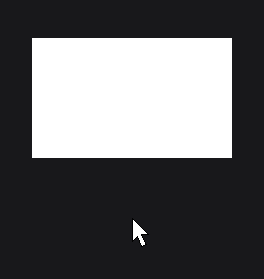

Scale and rotation take a pivot in the coordinates of the node's position. Build it from suppliers to follow the node's center (`ax(v)` is `x + v`, `dw(v)` is `width / v`):

```java
RectNode
.create(100, 100, 64, 64)
.color(Color.WHITE)
.self(node -> node.effect(TransformNodeEffect.create(new RotateTransformOperation(() -> BridgeHandler.CLOCK.get().currentTimeMillis() % 1000L * 0.36D, Rotation.ROLL, Vector.create(() -> node.ax(node.dw(2D)), () -> node.ay(node.dh(2D)))))))
.attach(this);
```

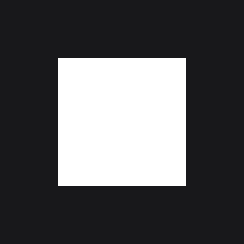

| Operation | Description |
|---|---|
| `new TranslateTransformOperation(vector)` | Moves by `vector`. |
| `new ScaleTransformOperation(scale, pivot)` | Scales by `Scale.create(x, y, 1D)` around `pivot`. |
| `new RotateTransformOperation(angle, axis, pivot)` | Rotates by `angle` degrees (value or `Supplier<Double>`); `Rotation.ROLL` is the 2D rotation, `YAW` and `PITCH` flip in 3D. |
| `Transformation.create().translate(...).rotate(...).scale(...)` | Several operations in order, passed to `create(transformation)`. |

`Vector.create(x, y)`, `Vector.X(...)` and `Vector.Y(...)` take values or suppliers; operations are in `dev.joid.lib.render.transform.operation`.

## Order, priority and scope

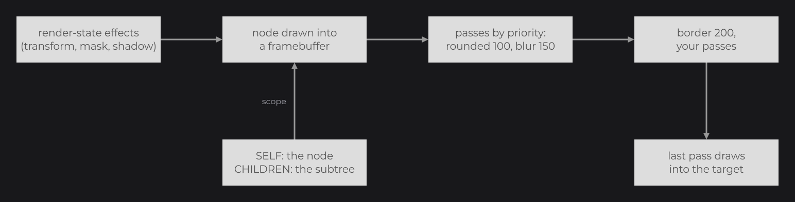

The shape effects run first, then the blur, then the border, whatever order you add them in: a border always follows rounded corners. Shadow, mask and transform wrap the whole render and run by `priority(int)` (default `0`, lower first). A transform before a mask turns the mask with the node; give the mask `priority(1)` for that:

```java
final MaskNodeEffect mask = MaskNodeEffect.create(300D, 100D).priority(1);

RectNode
.create(100, 100, 300, 200)
.color(Color.WHITE)
.effect(mask)
.effect(TransformNodeEffect.create(new RotateTransformOperation(10D, Rotation.ROLL, Vector.create(250D, 200D))))
.attach(this);
```

; right, priority -1 (before it).")

By default the shape, blur and border effects apply to the node only (`NodeEffectScope.SELF`); its children draw on top, whole. `scope(NodeEffectScope.CHILDREN)` applies them to the node and its children together, to round a card with its image header:

```java
RectNode
.create(100, 100, 300, 200)
.color(Color.WHITE)
.effect(RoundedNodeEffect.create(16F).scope(NodeEffectScope.CHILDREN))
.body(card -> {
	ResourceNode.create(0, 0, card.getWidth(), 120).resource(Resource.of("https://placehold.co/300x120.png")).attach(card);
})
.attach(this);
```

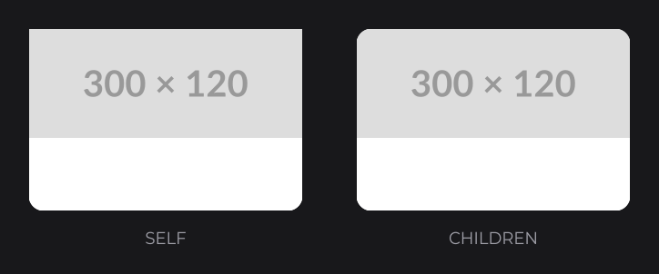

## Reference

| Method | Description |
|---|---|
| `effect(NodeEffect)` | Adds the effect, or replaces the one of the same class. |
| `getEffect(Class)`, `hasEffect(Class)` | The effect of that class (`null` when absent); whether it is present. |
| `removeEffect(Class)`, `clearEffects()` | Removes one effect or all. |
| `priority(int)` | Order of shadow, mask and transform; `0` by default. |
| `scope(NodeEffectScope)` | `SELF` (default) or `CHILDREN`, for shape, blur and border. |

## Good to know

- Effects change pixels only: hover, clicks and layout use the node's rectangle, so a circle still reacts in its corners and a translated node is clicked at its original place.
- `scope(...)` and `priority(...)` return a `NodeEffect`: call them last in the chain, or add a witness such as `.<RoundedNodeEffect>scope(...)`.
- A border outlines the drawn pixels: a node that draws nothing, such as a `ContainerNode`, gets no border.

## See also

- [Styling](../concepts/styling.md)
- [Custom Effects](custom-effects.md)
- [Animation](../concepts/animation.md)
- [Shaders](../shaders/shaders.md)
- [Transformations, Framebuffers and Models](../drawing/transformations.md)