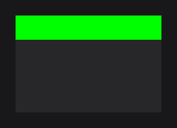

# MaskNodeEffect

`MaskNodeEffect` (`dev.joid.lib.ui.node.effect.impl`) clips the rendering of a node and its children to a rectangle, or to the shape of an image. Use it to reveal part of a node, crop content to an area that is not the node's own rectangle, or cut a node with a custom shape.

```java
@Override
public void init() {
	RectNode
	.create(100, 100, 300, 200)
	.color(Color.GREEN)
	.effect(MaskNodeEffect.create(300D, 50D))
	.attach(this);
}
```



Only the top 50 units of the node are drawn.

## Mask bounds

The mask is a rectangle `(x, y, width, height)`:

- `x` and `y` are offsets from the node's top-left corner (default `0`);
- `width` and `height` are in UI units.

Every bound is a `Supplier<Double>` read every frame, so the mask can follow the node or an animation.

## Creating with create

| Factory | Mask |
| --- | --- |
| `create(double width, double height)` | Rectangle at the node's corner. |
| `create(double x, double y, double width, double height)` | Rectangle at an offset. |
| `create(Supplier<Double> width, Supplier<Double> height)` | Dynamic size at the node's corner. |
| `create(Supplier<Double> x, Supplier<Double> y, Supplier<Double> width, Supplier<Double> height)` | Dynamic rectangle. |
| `create(Node node)` | Rectangle at the masked node's corner, sized like `node` (read every frame). |
| `create(Resource resource, double width, double height)` | Image shape at the node's corner. |
| `create(Resource resource, double x, double y, double width, double height)` | Image shape at an offset. |
| `create(Resource resource, Node node)` | Image shape at the masked node's corner, sized like `node`. |

Pass the masked node itself to `create(Node)` in `self(...)`, which hands you the node, so the mask always matches its size. `Resource` is in `dev.joid.lib.resource`, `File` in `java.io`:

```java
ResourceNode
.create(100, 100, 200, 200)
.resource(Resource.of("https://placehold.co/400x400.png"))
.self(node -> node.effect(MaskNodeEffect.create(Resource.of(new File("assets/star-mask.png")), node)))
.attach(this);
```


## Masking with an image

With a resource, the mask is the shape of the image stretched over the mask bounds: pixels where the image's alpha is above `0.5` are visible, the others are clipped. The edge is hard (no anti-aliasing). Use a PNG (or any format with transparency) whose opaque part is the shape you want. See [Resources](../resources/resources.md) to load it.

`resource(Resource)` sets or replaces the image; `resource((Resource) null)` turns the mask back into a rectangle.

## Changing the bounds

| Method | Description |
| --- | --- |
| `x(double)`, `x(Supplier<Double>)` | Horizontal offset from the node's left side. |
| `y(double)`, `y(Supplier<Double>)` | Vertical offset from the node's top side. |
| `width(double)`, `width(Supplier<Double>)` | Mask width. |
| `height(double)`, `height(Supplier<Double>)` | Mask height. |
| `resource(Resource resource)` | Image shape, or `null` for a rectangle. |

Suppliers make reveal animations straightforward, here a node that uncovers from left to right while hovered:

```java
RectNode
.create(100, 100, 300, 200)
.color(Color.ORANGE)
.self(node -> node.effect(MaskNodeEffect.create(() -> node.getWidth() * node.hoverValue(1F), () -> node.getHeight())))
.attach(this);
```

.")

Write suppliers that return a `double` (`0D`, not `0`): an `int` lambda does not match `Supplier<Double>`.

## What the mask clips

- The mask wraps the whole render of the node: its own drawing, its children, its layers and its shader effects. The scope setting has no influence on it. The node's scrollbar is drawn after the mask and is not clipped.
- Masks nest: inside another mask or inside a parent that clips its overflow, the visible area is the intersection of all of them.
- The mask only clips pixels. A clipped area still receives hover and clicks.
- Its position in the effect order matters with a [TransformNodeEffect](transform.md): see [Effect order and priority](effects.md#effect-order-and-priority).

To clip the children of a node to its own rectangle, an overflow setting is simpler (see [Overflow and Scrolling](../nodes/layout/overflow-and-scroll.md)). To clip your own drawing code, use `UI.mask(...)` or `UI.startMask(...)`/`UI.stopMask()` (see [The UI Class](../ui/ui-class.md)), which this effect calls.

## Reference

| Method | Description |
| --- | --- |
| `create(...)` | Factories, see above. |
| `x`, `y`, `width`, `height`, `resource` | Setters, value or `Supplier`. |
| `getX()`, `getY()`, `getWidth()`, `getHeight()` | Current bounds (the suppliers are read). |
| `getXSupplier()`, `getYSupplier()`, `getWidthSupplier()`, `getHeightSupplier()` | The suppliers. |
| `getResource()` | The image, or `null`. |
| `priority(int)` | Inherited, see [Effects](effects.md). |

`MaskNodeEffect` is a render-state effect: it uses the stencil buffer in `pre` and releases it in `post`.

## Pitfalls

- A mask image has hard edges (alpha above `0.5` is visible): use `RoundedNodeEffect` or `CircleNodeEffect` for smooth shapes.
- The mask and a `TransformNodeEffect` apply in priority order: masking before or after the rotation gives a different result.

## See also

- [Effects](effects.md)
- [Overflow and Scrolling](../nodes/layout/overflow-and-scroll.md)
- [The UI Class](../ui/ui-class.md)
- [TransformNodeEffect](transform.md)
- [Resources](../resources/resources.md)